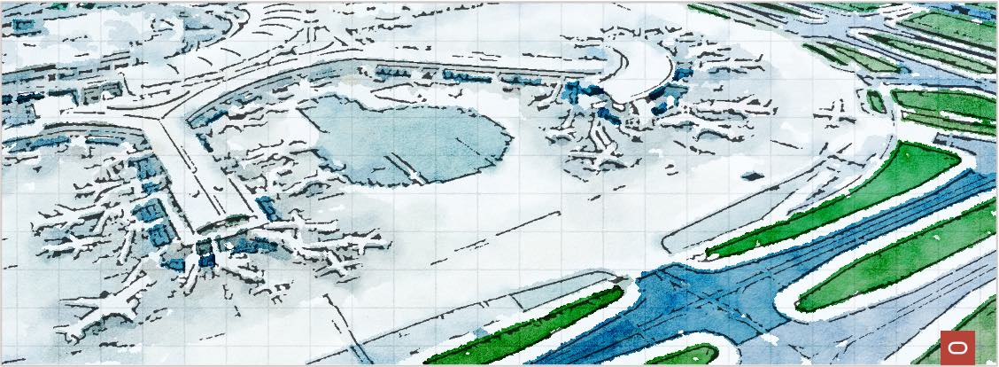

# **The OCI Operating Entities Landing Zone** 

### Simplifying the [Onboarding](#) and [Running](#) of OCI

&nbsp; 

&nbsp; 

Welcome to the **OCI [Op](#)erating [En](#)tities Landing Zone**, also known as **OCI [Open](#) LZ**, a set of open assets and best practices to simplify the onboarding and running of OCI for organizations and their functional divisions &ndash; identified as  [**Op**](#)**erating** [**En**](#)**tities** **(OEs)**. 

The OCI Open LZ provides complete OCI blueprints, including designs and declarative IaC, reducing design and implementation timelines, associated costs, and efforts - while enabling a future-proof OCI with complete security and scalability.

&nbsp; 

## Repository Structure

This repository is the source of truth for the OCI Open LZ and includes three types of assets (blueprints, add-ons, and workload extensions) and three blueprint sizes (M, L, and XL):

| # | Directory | Description |
|:----------------------: | ------------ | ------------- |
| **1** | **[`blueprints/`](blueprints/)** | **Select** the most suitable OCI landing zone blueprint to onboard and run OCI. |
|  |...[`one-oe/`](blueprints/one-oe/) |  Onboards **[One](/blueprints/one-oe/readme.md) OE** with its environments, platforms, and projects in **one tenancy**. |
|   |...[`multi-oe/`](blueprints/multi-oe/) |  Onboards **[Multiple](/blueprints/multi-oe/readme.md) OEs** with shared services and OE-dedicated resources, sharing **one tenancy**. |
|   |...[`multi-tenancy/`](blueprints/multi-tenancy/) | Uses One-OE and Multi-OE to onboard all your organizations or customers into **several tenancies**.
**2** |**[`addons/`](addons/)** | **Complement** your landing zone with add-ons to run OCI with best practices. (e.g., [Network Hubs](/addons/oci-hub-models/readme.md))|
| **3** |**[`workload-extensions/`](workload-extensions/)** | **Extend** your landing zone with pluggable workload extensions (e.g., [EBS](/workload-extensions/ebs/readme.md), [OCVS](/workload-extensions/oci-lz-ext-ocvs/README.md), [...](/workload-extensions/readme.md)).|

&nbsp; 

As general guidance, it's recommended to start with the order of the table above. The first step is choosing the right **blueprint** shape and size (M, L, or XL). Complementary, review the network **add-ons** to update the design. After the Landing Zone is set, extend it with **workload extensions**. You can also use the [OCI-tailored Landing Zone approach](https://github.com/oracle-devrel/technology-engineering/tree/main/landing-zones/tailored_landing_zones) for further guidance on the creation of your landing zone.

&nbsp; 

## Related Repositories

The OCI Open LZ uses a [declarative Infrastructure-as-Code (IaC)](https://github.com/oracle-devrel/technology-engineering/blob/main/landing-zones/commons/oci_landingzones_iac.md) approach that is distributed into several repositories.

| Name        | Description / Scope
| ------------ | -------------
| [OCI Landing Zones Orchestrator][oci-lz-orchestrator] | Relates several OCI resource into one consolidated operation (i.e., one plan/apply).
| [OCI Landing Zones IAM][oci-lz-iam] | Covers OCI Compartments, Groups, Policies, Dynamic Groups, etc.
| [OCI Landing Zones Network][oci-lz-network]| Covers all OCI Core Network Resources for any network topology.
| [OCI Landing Zones Security][oci-lz-security] |Covers OCI Security Resources (e.g., Cloud Guard, VSS, Security Zones, Vaults, etc.).
| [OCI Landing Zones Observability][oci-lz-observability] | Covers OCI Monitoring resources (e.g., Logging, Events, Alarms, Notifications, etc.).
| [OCI Landing Zones Governance][oci-lz-governance] | Covers OCI Tagging.

&nbsp; 

&nbsp; 

# License

Copyright (c) 2024 Oracle and/or its affiliates.

Licensed under the Universal Permissive License (UPL), Version 1.0.

See [LICENSE](/LICENSE)for more details.

[oci-lz-orchestrator]: https://github.com/oracle-quickstart/terraform-oci-landing-zones-orchestrator
[oci-lz-iam]: https://github.com/oracle-quickstart/terraform-oci-cis-landing-zone-iam
[oci-lz-network]: https://github.com/oracle-quickstart/terraform-oci-cis-landing-zone-networking
[oci-lz-security]: https://github.com/oracle-quickstart/terraform-oci-cis-landing-zone-security
[oci-lz-observability]: https://github.com/oracle-quickstart/terraform-oci-cis-landing-zone-observability
[oci-lz-governance]: https://github.com/oracle-quickstart/terraform-oci-cis-landing-zone-governance
