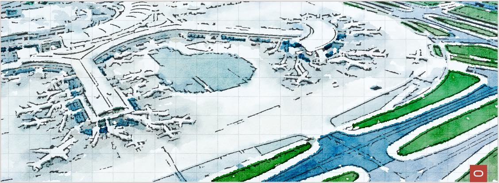

# **The OCI Open LZ**

&nbsp; 

Welcome to the **OCI Open LZ**, a set of open assets and best practices to simplify the onboarding and running of OCI. 

The objective of the **OCI Open LZ** is to provide:
1. **[A Blueprint](/design/readme.md):** A complete SecNetOps landing zone design, ready to onboard an enterprise organization and its functional divisions &ndash; identified as operating entities (OE) with their teams, departments, and projects.
2. **[An Operating Model](/examples/oci-open-lz/readme.md):** a complete cloud-native / gitops runtime to simplify and scale day two operations, focusing on IaC configurations and not on code.
3. **[Enablement](/examples/oci-learn-lz/readme.md):** to our customers, partners, independent software vendors (ISV), and the general IT community to create, configure, and run OCI landing zones with lower efforts and reduced timeframes.
4. **[A Catalogue](/examples/readme.md)**: as the entry point to find more landing zones, related designs, and runtime configurations.
   

&nbsp; 

## How to Start

This repository is the source of truth for the OCI Open LZ, where you can find all the materials to **design**, **configure**, and **run**  OCI landing zones. The following activities are proposed as guidance to create your OCI-tailored landing zone.

&nbsp; 

| # | ACTIVITY | ASSETS| DESCRIPTION   | 
|---|---|---|---|
| **1**| **PREPARE** | [5 Steps in 5'](https://www.youtube.com/watch?v=JWKRHfO4LnY&ab_channel=OracleLearning), [A Blueprint to Onboard and Run OCI ](https://www.youtube.com/watch?v=xbKIxSERIxY) | These recorded sessions discusses the differences between [standard](https://github.com/oracle-devrel/technology-engineering/blob/main/landing-zones/standard_landing_zones/standard_landing_zones.md) and [tailored landing zones](https://github.com/oracle-devrel/technology-engineering/blob/main/landing-zones/tailored_landing_zones/tailored_landing_zones.md), presenting the OCI Open LZ Blueprint tailored views, and running a demo  with Terraform configurable modules. |
| **2** | **ENABLE** | [OCI Learn LZ](/examples/oci-learn-lz/readme.md)| Use the OCI Learn LZ exercises to understand how to **design** and **configure** OCI Landing Zones. |
| **3** | **DESIGN** | [OCI Open LZ PDF](/design/OCI_Open_LZ.pdf), [ OCI Open LZ Draw.io ](/design/OCI_Open_LZ.drawio)   | Use the OCI Open LZ **blueprint** to design your functional, security, network, and operations view, with all the diagrams in a reusable format. Other **landing zone models** are also [available](/design/models/readme.md). |   
| **4** | **CONFIGURE** | [OCI Open LZ Runtime View](/examples/oci-open-lz/readme.md) | Use the  OCI Open LZ runtime  **configurations** as your IaC templates. These configurations are easily adjustable to any other landing zone model and are run with [OCI Open LZ Terraform Orchestrator Module ](orchestrator/readme.md) on top of the [CIS  Landing Zone Enhanced Modules](https://www.ateam-oracle.com/post/cis-landing-zone-enhanced-modules). |                
| **5** | **RUN** | [OCI Open LZ Terraform Orchestrator ](/orchestrator/readme.md) | Use the OCI Open LZ **orchestrator** to run an operation on several resource types into one consolidated execution. It supports **any OCI landing zone configuration**, including - but not limited to &ndash; the OCI Open LZ.  Use the **orchestrator** with your configurations or with the provided [operations examples](/examples/oci-open-lz/readme.md) using **Terraform CLI** or **Oracle Resource Manager (ORM)**.|

&nbsp; 

## Approach Considerations
A landing zone can be set up in different ways and can take different amounts of time to implement. There are mainly two types of approaches:
1.	[**Standard and prescribed approaches**](https://github.com/oracle-devrel/technology-engineering/blob/main/landing-zones/standard_landing_zones/standard_landing_zones.md) are the recommended starting point and can take hours to days to set up. This option enables quick start cloud adoption with a set of recommended best practices with a prescriptive design. For more details on this type of approach, also known as standard landing zones, please refer to the [CIS Landing Zone](https://github.com/oracle-quickstart/oci-cis-landingzone-quickstart) or [OELZ](https://github.com/oracle-quickstart/oci-landing-zones).
2.	[**Tailored approaches**](https://github.com/oracle-devrel/technology-engineering/blob/main/landing-zones/tailored_landing_zones/tailored_landing_zones.md) focuses on creating a landing that fits your requirements completely. They usually cover security, network, and operational topics, and can onboard a complete enterprise organization with one cloud operating model. This option is recommended when the standard approach is not enough (e.g., large organizations with fine-tuned security or network requirements, large and heterogeneous workloads landscape with multi-cloud scenarios, etc.) and experience tells us it can take from days to weeks to set up &ndash; depending on requirements and team expertise.
      
The **OCI Open LZ** is an example of the outcome of the latter approach, a **tailored landing zone**, and one of its purposes is to help reduce the design time, associated cost, and effort. 

For more details on other approaches and assets please refer to **[Oracle Landing Zones](https://github.com/oracle-devrel/technology-engineering/blob/main/landing-zones/README.md)**.

&nbsp; 

# License

Copyright (c) 2023 Oracle and/or its affiliates.

Licensed under the Universal Permissive License (UPL), Version 1.0.

See [LICENSE](LICENSE) for more details.
