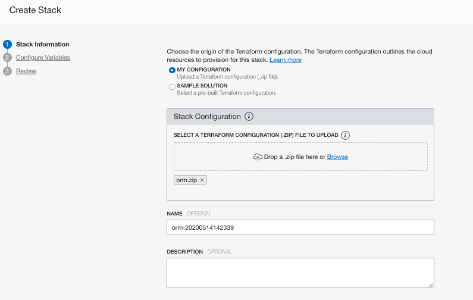

# oci-quickstart-template

The [Oracle Cloud Infrastructure (OCI) Quick Start](https://github.com/oracle-quickstart?q=oci-quickstart) is a collection of examples that allow Oracle Cloud Infrastructure users to get a quick start deploying advanced infrastructure on OCI.

The oci-quickstart-template repository contains the template that can be used for accelerating the construction of quickstarts that runs from local Terraform CLI, [OCI Resource Manager](https://docs.cloud.oracle.com/en-us/iaas/Content/ResourceManager/Concepts/resourcemanager.htm) and [OCI Cloud Shell](https://docs.cloud.oracle.com/en-us/iaas/Content/API/Concepts/cloudshellintro.htm).

Simple is a sample quickstart terraform template that deploys a virtual machine on a Virtual Cloud Network.
Simple can be customized to subscribe and launch Marketplace images, Platform images or Custom images.

This repo is under active development.  Building open source software is a community effort.  We're excited to engage with the community building this.

## Resource Manager Deployment

This Quick Start uses [OCI Resource Manager](https://docs.cloud.oracle.com/iaas/Content/ResourceManager/Concepts/resourcemanager.htm) to make deployment easy, sign up for an [OCI account](https://cloud.oracle.com/en_US/tryit) if you don't have one, and just click the button below:

[](https://cloud.oracle.com/resourcemanager/stacks/create?region=home&zipUrl=https://github.com/oracle-quickstart/oci-quickstart-template/archive/master.zip)

After logging into the console you'll be taken through the same steps described
in the [Deploy](#deploy) section below.


Note, if you use this template to create another repo you'll need to change the link for the button to point at your repo.

## Local Development

First off we'll need to do some pre deploy setup.  That's all detailed [here](https://github.com/oracle/oci-quickstart-prerequisites).

Note, the instructions below build a `.zip` file from you local copy for use in ORM.
If you want to not use ORM and deploy with the terraform CLI you need to rename
`provider.tf.cli -> provider.tf`. This is because authentication works slightly
differently in ORM vs the CLI. This file is ignored by the build process below.

Make sure you have terraform v0.14+ cli installed and accessible from your terminal.

### Build

Simply `build` your package and follow the [Resource Manager instructions](https://docs.cloud.oracle.com/en-us/iaas/Content/ResourceManager/Tasks/managingstacksandjobs.htm#console) for how to create a stack.  Prior to building the Stack, you may want to modify some parts of the deployment detailed below.

In order to `build` the zip file with the latest changes you made to this code, you can simply go to [build-orm](./build-orm) folder and use terraform to generate a new zip file:

At first time, you are required to initialize the terraform modules used by the template with  `terraform init` command:

```bash
$ terraform init

Initializing the backend...

Initializing provider plugins...
- Finding latest version of hashicorp/archive...
- Installing hashicorp/archive v2.1.0...
- Installed hashicorp/archive v2.1.0 (signed by HashiCorp)

Terraform has created a lock file .terraform.lock.hcl to record the provider
selections it made above. Include this file in your version control repository
so that Terraform can guarantee to make the same selections by default when
you run "terraform init" in the future.

Terraform has been successfully initialized!

You may now begin working with Terraform. Try running "terraform plan" to see
any changes that are required for your infrastructure. All Terraform commands
should now work.

If you ever set or change modules or backend configuration for Terraform,
rerun this command to reinitialize your working directory. If you forget, other
commands will detect it and remind you to do so if necessary.
```

Once terraform is initialized, just run `terraform apply` to generate ORM zip file.

```bash
$ terraform apply

data.archive_file.generate_zip: Refreshing state...

Apply complete! Resources: 0 added, 0 changed, 0 destroyed.
```

This command will package the content of `simple` folder into a zip and will store it in the `build-orm\dist` folder. You can check the content of the file by running `unzip -l dist/orm.zip`:

```bash
$ unzip -l dist/orm.zip
Archive:  dist/orm.zip
  Length      Date    Time    Name
---------  ---------- -----   ----
     1140  01-01-2049 00:00   compute.tf
      680  01-01-2049 00:00   data_sources.tf
     1632  01-01-2049 00:00   image_subscription.tf
     1359  01-01-2049 00:00   locals.tf
    13548  01-01-2049 00:00   schema.yaml
     2001  01-01-2049 00:00   network.tf
     2478  01-01-2049 00:00   nsg.tf
      830  01-01-2049 00:00   oci_images.tf
     1092  01-01-2049 00:00   outputs.tf
       44  01-01-2049 00:00   scripts/example.sh
     4848  01-01-2049 00:00   variables.tf
      311  01-01-2049 00:00   versions.tf
---------                     -------
    29963                     12 files
```

### Deploy

1. [Login](https://console.us-ashburn-1.oraclecloud.com/resourcemanager/stacks/create) to Oracle Cloud Infrastructure to import the stack
    > `Home > Solutions & Platform > Resource Manager > Stacks > Create Stack`

2. Upload the `orm.zip` and provide a name and description for the stack


3. Configure the Stack. The UI will present the variables to the user dynamically, based on their selections. These are the configuration options:

> Compute Configuration

|          VARIABLE          |           DESCRIPTION                                                 |
|----------------------------|-----------------------------------------------------------------------|
|COMPUTE COMPARTMENT         | Compartment for Compute resources, including Marketplace subscription |
|INSTANCE NAME               | Compute instance name|
|DNS HOSTNAME LABEL          | DNS Hostname|
|COMPUTE SHAPE               | Compatible Compute shape|
|FLEX SHAPE OCPUS            | Number of OCPUs, only available for VM.Standard.E3.Flex compute shape|
|AVAILABILITY DOMAIN         | Availability Domain|
|PUBLIC SSH KEY STRING       | RSA PUBLIC SSH key string used for sign in to the OS|

> Virtual Cloud Network

|          VARIABLE          |           DESCRIPTION                                                 |
|----------------------------|-----------------------------------------------------------------------|
|NETWORK COMPARTMENT         | Compartment for all Virtual Cloud Network resources|
|NETWORK STRATEGY            | `Create New VCN and Subnet`: Create new network resources during apply. <br> `Use Existing VCN and Subnet`: Let user select pre-existent network resources.|
|CONFIGURATION STRATEGY      | `Use Recommended Configuration`: Use default configuration defined by the Terraform template. <br> `Customize Network Configuration`: Allow user to customize network configuration such as name, dns label, cidr block for VCN and Subnet.|

> Virtual Cloud Network - Customize Network Configuration

|          VARIABLE          |           DESCRIPTION                                                 |
|----------------------------|-----------------------------------------------------------------------|
|NAME                        | VCN Display Name|
|DNS LABEL                   | VCN DNS LABEL|
|CIDR BLOCK                  | The CIDR of the new Virtual Cloud Network (VCN). If you plan to peer this VCN with another VCN, the VCNs must not have overlapping CIDRs.|

> Simple Subnet (visible only when `Customize Network Configuration` is selected)

|          VARIABLE          |           DESCRIPTION                                                 |
|----------------------------|-----------------------------------------------------------------------|
|SUBNET TYPE                 | `Public Subnet` or `Private Subnet`|
|NAME                        | Subnet Display Name|
|DNS LABEL                   | Subnet DNS LABEL|
|CIDR BLOCK                  | The CIDR of the Subnet. Should not overlap with any other subnet CIDRs|
|NETWORK SECURITY GROUP CONFIGURATION| `Use Recommended Configuration`: Use default configuration defined by the Terraform template. <br> `Customize Network Security Group`: Allow user to customize some basic network security group settings.|

> Network Security Group (visible only when `Customize Network Security Group` is selected)

|          VARIABLE          |           DESCRIPTION                                                 |
|----------------------------|-----------------------------------------------------------------------|
|NAME                        | NSG Display Name|
|ALLOWED INGRESS TRAFFIC (CIDR BLOCK)| WHITELISTED CIDR BLOCK for ingress traffic|
|SSH PORT NUMBER             | Default SSH PORT for ingress traffic|
|HTTP PORT NUMBER            | Default HTTP PORT for ingress traffic|
|HTTPS PORT NUMBER           | Default HTTPS PORT for ingress traffic|

> Additional Configuration Options

|          VARIABLE          |           DESCRIPTION                                                 |
|----------------------------|-----------------------------------------------------------------------|
|TAG KEY NAME                | Free-form tag key name|
|TAG VALUE                   | Free-form tag value|

4. Click Next and Review the configuration.
5. Click Create button to confirm and create your ORM Stack.
6. On Stack Details page, you can now run `Terraform` commands to manage your infrastructure. You typically start with a plan then run apply to create and make changes to the infrastructure. More details below:

|      TERRAFORM ACTIONS     |           DESCRIPTION                                                 |
|----------------------------|-----------------------------------------------------------------------|
|Plan                        | `terraform plan` is used to create an execution plan. This command is a convenient way to check the execution plan prior to make any changes to the infrastructure resources.|
|Apply                       | `terraform apply` is used to apply the changes required to reach the desired state of the configuration described by the template.|
|Destroy                     | `terraform destroy` is used to destroy the Terraform-managed infrastructure.|

## Customize for Marketplace

In case you wanted to make changes to this template to use a Marketplace image rather than a platform image or custom image, you need to make the following changes.

1. Configure Marketplace listing variables on [`variables.tf`](./variables.tf).

|      VARIABLES             |           DESCRIPTION                                                 |
|----------------------------|-----------------------------------------------------------------------|
|mp_subscription_enabled     | Enable subscription to Marketplace.|
|mp_listing_id               | Marketplace App Catalog Listing OCID.|
|mp_listing_resource_id      | Marketplace Listing Image OCID.|
|mp_listing_resource_version | Marketplace Listing Package/Resource Version (Reference value)|

2. Modify [`compute.tf`](./compute.tf) set `source_details` to refer to `local.compute_image_id` rather than `platform_image_id`. The `local.compute_image_id` holds the logic to either refer to the marketplace image or a custom image, based on the `mp_subscription_enabled` flag.

```hcl
resource "oci_core_instance" "simple-vm" {
  availability_domain = local.availability_domain
  compartment_id      = var.compute_compartment_ocid
  display_name        = var.vm_display_name
  shape               = var.vm_compute_shape

  dynamic "shape_config" {
    for_each = local.is_flex_shape
      content {
        ocpus = shape_config.value
      }
  }


  create_vnic_details {
    subnet_id              = local.use_existing_network ? var.subnet_id : oci_core_subnet.simple_subnet[0].id
    display_name           = var.subnet_display_name
    assign_public_ip       = local.is_public_subnet
    hostname_label         = var.hostname_label
    skip_source_dest_check = false
    nsg_ids                = [oci_core_network_security_group.simple_nsg.id]
  }

  source_details {
    source_type = "image"
    #use a marketplace image or custom image:
    source_id   = local.compute_image_id
  }

```
2. Modify [`oci_images.tf`](./oci_images.tf) set `marketplace_source_images` map variable to refer to the marketplace images your Stack will launch.

```hcl

variable "marketplace_source_images" {
  type = map(object({
    ocid = string
    is_pricing_associated = bool
    compatible_shapes = list(string)
  }))
  default = {
    main_mktpl_image = {
      ocid = "ocid1.image.oc1..<unique_id>"
      is_pricing_associated = true
      compatible_shapes = []
    }
    #Remove comment and add as many marketplace images that your stack references be replicated to other realms
    #supporting_image = {
    #  ocid = "ocid1.image.oc1..<unique_id>"
    #  is_pricing_associated = false
    #  compatible_shapes = ["VM.Standard2.2", "VM.Standard.E2.1.Micro"]
    #}
  }
}

```

2. Run your tests using the Terraform CLI or build a new package and deploy on ORM.
