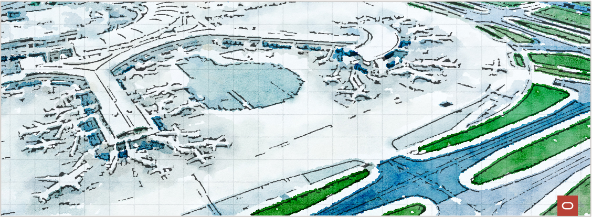
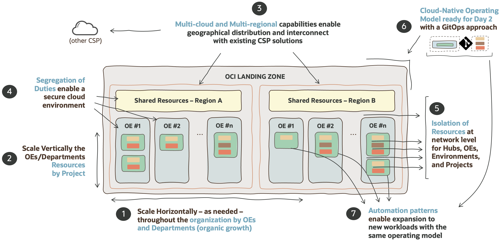

# **OCI Open LZ [Blueprint](#)**

&nbsp; 

Welcome to the **OCI Open LZ**, the **Op**erating **En**tities **L**anding **Z**one, a **runnable [blueprint](#)**, to simplify the onboarding of organizations, business units, and subsidiaries into OCI. 

The purpose of the **OCI Open LZ** is to:
1. Provide an end-to-end **landing zone design**, ready to **onboard an enterprise organization** and its functional divisions &ndash; identified as **operating entities (OE)** with their teams, departments, and projects.
2. Provide a **cloud-native operating model** to simplify and scale **day two operations**.
3. Demonstrate the operating model and **run OCI** with a **configurable [Terraform](orchestrator/Readme.md) approach**.
4. **Enable customers, partners**, and the general **IT community** to **create tailored landing zones** with **lower efforts** through a **comprehensive OCI reference architecture**.  
5. Provide **tailoring guidelines** to help adjust the model. This asset can be used directly, tailored, or used as inspiration to create a new one &ndash; as it is not a prescribed solution.
   

&nbsp; 

Before starting, find below the **seven characteristics** of the OCI Open LZ. For more details on the design, see the table in the next section.

&nbsp; 

&nbsp; 

If **cloud landing zones** are analogous to **airports**, the OCI Open LZ is a highly scalable airport with the possibility of having different terminals (OEs), that can be &ndash; but don't have to be &ndash; operated independently by different companies/subsidiaries. Each terminal can have a different security posture (domestic, international, etc.), teams, and resources, and communication between those terminals, inside or outside the airport, is possible, automated, and secured. 

&nbsp; 

## How to Start

This repository is the source of truth for this blueprint, where you can find all the materials to **design**, **configure**, and **run** your landing zone. 

&nbsp; 

| ACTIVITY | ASSETS| DESCRIPTION   | 
|---|---|---|
| **ENABLEMENT** | [5 Steps in 5 Minutes](https://www.youtube.com/watch?v=JWKRHfO4LnY&ab_channel=OracleLearning), [A Blueprint to Onboard and Run OCI ](https://www.youtube.com/watch?v=xbKIxSERIxY) | These recorded sessions discusses the differences between [standard](https://github.com/oracle-devrel/technology-engineering/blob/main/landing-zones/standard_landing_zones/standard_landing_zones.md) and [tailored landing zones](https://github.com/oracle-devrel/technology-engineering/blob/main/landing-zones/tailored_landing_zones/tailored_landing_zones.md), presenting the OCI Open LZ Blueprint tailored views, and running a demo  with Terraform configurable modules. |
| **DESIGN** | [OCI Open LZ PDF](/design/OCI_Open_LZ.pdf), [ OCI Open LZ Draw.io ](/design/OCI_Open_LZ.drawio)   | Present the OCI Open LZ **blueprint design** with the functional, security, network, and operations view, with all the diagrams in a reusable format. Other **landing zone models** are also [available](/design/models/readme.md). |
| **CONFIGURE** | [OCI Open LZ Runtime View](/examples/oci-open-lz/readme.md) | Operations  **configurations** for running the OCI Open LZ. These configurations are run with [OCI Open LZ Terraform Orchestrator Module ](orchestrator/readme.md) on top of the [CIS LZ v3 Modules](https://www.ateam-oracle.com/post/cis-landing-zone-enhanced-modules) |                
| **RUN** | [OCI Open LZ Terraform Orchestrator ](/orchestrator/readme.md) | The OCI Open LZ blueprint **automation interface**, a Terraform module that orchestrates the [OCI CIS LZ IAM ](https://github.com/oracle-quickstart/terraform-oci-cis-landing-zone-iam) and the [OCI CIS LZ Network](https://github.com/oracle-quickstart/terraform-oci-cis-landing-zone-networking) Modules into one consolidated automation, with several resource types in the same run. It supports **any OCI landing zone configuration**, including - but not limited to &ndash; the OCI Open LZ.  Run the Orchestrator and the [examples](/examples/oci-open-lz/readme.md)  with **Terraform CLI** or **Oracle Resource Manager** (ORM).|

&nbsp; 

## Approach Considerations
A landing zone can be set up in different ways and can take different amounts of time to implement. There are mainly two types of approaches:
1.	[**Standard and prescribed approaches**](https://github.com/oracle-devrel/technology-engineering/blob/main/landing-zones/standard_landing_zones/standard_landing_zones.md) are the recommended starting point and can take hours to days to set up. This option enables quick start cloud adoption with a set of recommended best practices with a prescriptive design. For more details on this type of approach, also known as standard landing zones, please refer to the [CIS Landing Zone](https://github.com/oracle-quickstart/oci-cis-landingzone-quickstart) or [OELZ](https://github.com/oracle-quickstart/oci-landing-zones).
2.	[**Tailored approaches**](https://github.com/oracle-devrel/technology-engineering/blob/main/landing-zones/tailored_landing_zones/tailored_landing_zones.md) focuses on creating a landing that fits your requirements completely. They usually cover security, network, and operational topics, and can onboard a complete enterprise organization with one cloud operating model. This option is recommended when the standard approach is not enough (e.g., large organizations with fine-tuned security or network requirements, large and heterogeneous workloads landscape with multi-cloud scenarios, etc.) and experience tells us it can take from days to weeks to set up &ndash; depending on requirements and team expertise.
      
The **OCI Open LZ** is an example of the outcome of the latter approach, a **tailored landing zone**, and one of its purposes is to help reduce the design time, associated cost, and effort. 

For more details on other approaches and assets please refer to **[Oracle Landing Zones](https://github.com/oracle-devrel/technology-engineering/blob/main/landing-zones/README.md)**.

&nbsp; 

# License

Copyright (c) 2023 Oracle and/or its affiliates.

Licensed under the Universal Permissive License (UPL), Version 1.0.

See [LICENSE](LICENSE) for more details.
