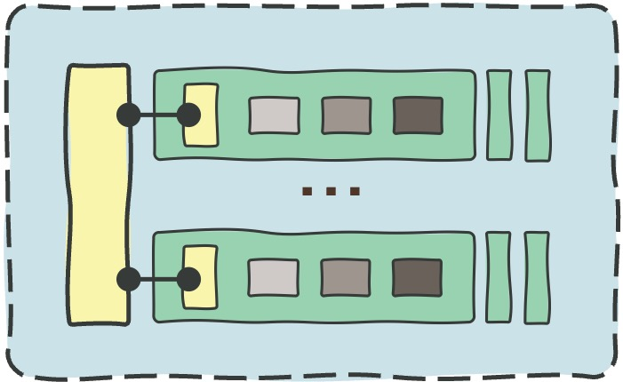
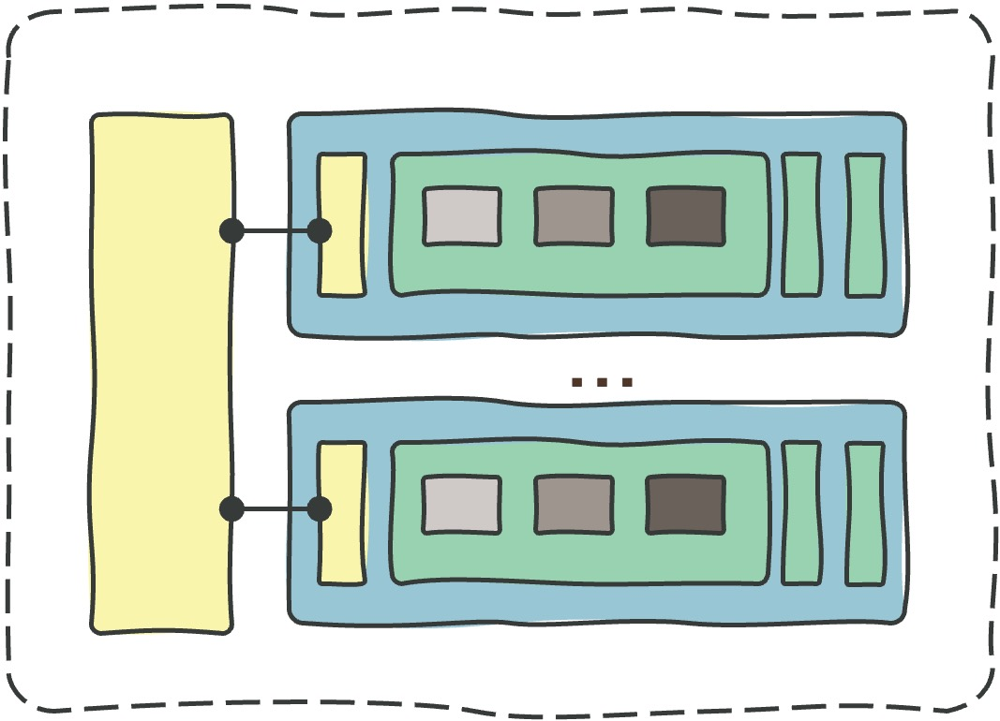

# **The OCI Operating Entities Landing Zone** 

### Simplifying the [Onboarding](#) and [Running](#) of OCI

&nbsp; 

&nbsp; 

Welcome to the **OCI [Op](#)erating [En](#)tities Landing Zone**, also known as **OCI [Open](#) LZ**, a set of open assets and best practices to simplify the onboarding and running of OCI. 

The objective of the **OCI Open LZ** is to **increase OCI security and scalability** while **reducing the design and implementation timelines, associated costs, and efforts** - with the following artifacts:
1. **[Blueprints](#the-blueprints-menu)**: Complete landing zone **designs** with **100% declarative IaC runtime models**, ready to onboard organizations and their functional divisions &ndash; identified as **Op**erating **En**tities **(OEs)**. 
2. **[Workloads Extensions](/workload-extensions/readme.md)**: for reducing your time-to-production with ready-made designs and pre-built IaC configurations on common workloads.
3. **[Enablement Activities](#enablement-activities):** for our customers, partners, independent software vendors (ISV), and the general IT community to create, configure, and run OCI landing zones with best practices and lower efforts.

&nbsp; 

## Select Your Blueprint

There are three blueprints available to onboard OCI. Choose the most suitable according to your objectives, review the design, and run the model. 

| BLUEPRINT | DIAGRAM | SIZE | OBJECTIVE   | ORGANIZATIONAL SCOPE | 
|:--:|---|:-:|---|---|
| [**One-OE**](/one-oe/readme.md)  *-- new --*| | **M** | A new model to onboard **one Operating Entity** with its environments, platforms, and projects in **one tenancy**.   | One OU, LoB, OpCo, or Department. 
| [**Multi-OE**](/multi-oe/readme.md) | | **L** | Onboards **several Operating Entities** with a shared services model, with OE-dedicated environments, platforms, and projects, sharing **one tenancy.** | Several OUs, LoBs, OpCos, or Departments. 
| **Multi-Tenancy*** | | **X-XXL** | Uses the **One-OE** and **Multi-OE** to onboard all your organizations or customers into **several tenancies**, while **providing your** centralized services, shared services, managed services, cloud services, PaaS, or SaaS. | All Your Organizations, OUs, Partners, or Customers.

(*) The multi-tenancy landing zone is available on demand. 

&nbsp; 

Note these blueprints can be used directly as OCI [**Standard Landing Zones**](https://github.com/oracle-devrel/technology-engineering/blob/main/landing-zones/standard_landing_zones/readme.md) or as a guide or starting point for a [**Tailored Design**](https://github.com/oracle-devrel/technology-engineering/blob/main/landing-zones/tailored_landing_zones/readme.md). You can also extend your Landing Zone with ready-made pluggable [**Workload Extensions**](/workload-extensions/readme.md) to reduce your time-to-production with OCI best practices. 

&nbsp; 

## Enablement Activities

The following activities are proposed as guidance to understand the overall **OCI landing zone strategy** and **create your OCI-tailored landing zone**.

&nbsp; 

| # | ACTIVITY | ASSETS| DESCRIPTION   | 
|---|---|---|---|
| **1**| **PREPARE** | [EMEA OCI Landing Zones Vdeo](https://www.linkedin.com/feed/update/urn:li:activity:7206600588216659968/)| Understand OCI Landing Zones, approach, and strategy in 13 minutes.
| **2**| **PREPARE** | [EMEA OCI Landing Zones Git](https://github.com/oracle-devrel/technology-engineering/tree/main/landing-zones)| Review standard landing zones, tailored landing zones, and workload extensions concepts.
| **3** | **ENABLE** | [OCI Learn LZ](/addons/oci-learn-lz/readme.md)| Use the OCI Learn LZ exercises to understand how to **design** and **configure** OCI Landing Zones. |
| **4** | **SELECT** | [OCI Open LZ Blueprints](/README.md#the-blueprints-menu)| Select you prefered blueprint from the options above. |
| **4** | **DESIGN** | [One-OE](/one-oe/readme.md)   [Multi-OE](/multi-oe/readme.md)| Use the selected OCI Open LZ **blueprint** to design - in drawio - your functional, security, network, and operations view, with all the diagrams in a reusable format. |   
| **5** | **CONFIGURE** |[Declarative IaC](https://github.com/oracle-devrel/technology-engineering/blob/main/landing-zones/commons/oci_landingzones_iac.md) | Learn about the OCI IaC declarative approach and use the OCI Open LZ runtime **configurations** as your IaC templates. These configurations are easily adjustable to any other landing zone model. |                
| **6** | **RUN** |[One-OE](/one-oe/readme.md)   [Multi-OE](/multi-oe/readme.md) | Run your configurations using **Terraform CLI** or **Oracle Resource Manager (ORM)** as described in the blueprint runtimes documentation. |
| **7** | **EXTEND** | [Workload Extensions](/workload-extensions/readme.md) | Extend your Landing Zone wit ready-made pluggable workload extensions to reduce your time-to-production with OCI best practices. |

&nbsp; 

# License

Copyright (c) 2024 Oracle and/or its affiliates.

Licensed under the Universal Permissive License (UPL), Version 1.0.

See [LICENSE](LICENSE) for more details.
