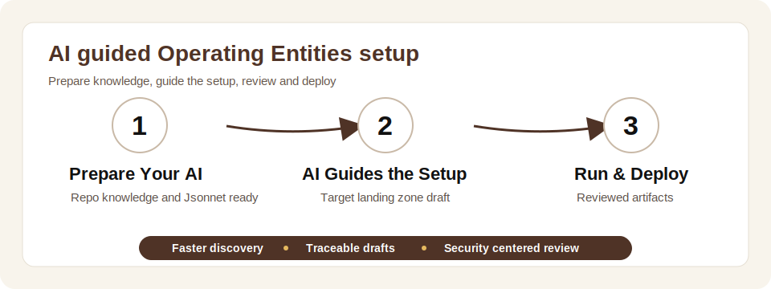

# **[Landing Zone AI Guidance](#)**
## **An OCI Landing Zone Operating Entities [Addon](#) for AI assisted landing zone design**

&nbsp;

**Table of Contents**

[1. Overview](#1-overview)<br>
[2. Prerequisites](#2-prerequisites)<br>
[3. When to Use This Addon](#3-when-to-use-this-addon)<br>
[4. Benefits](#4-benefits)<br>
[5. Engagement Model](#5-engagement-model)<br>
[6. Capabilities](#6-capabilities)<br>
[7. Security Guardrails](#7-security-guardrails)<br>
[8. Example Kickoff Prompts](#8-example-kickoff-prompts)<br>
[9. Review and Deployment Rules](#9-review-and-deployment-rules)<br>

&nbsp;

## 1. Overview

The **Landing Zone AI Guidance** addon helps to use AI coding agents with the OCI Landing Zone Operating Entities repository. It accelerates landing zone design conversations, produces reviewed configuration drafts and surfaces security and governance considerations earlier in the design lifecycle.

<p align="center">
  
</p>

> [!IMPORTANT]
> AI assisted landing zone generation, modification or deployment guidance is provided at your own risk. Review all outputs for correctness, security and regulatory or internal compliance before deploying them.

AI assistance supports discovery, design drafting, option comparison, artifact review and handover preparation. Architecture ownership, security sign off, CIDR validation, approval and deployment authorization remain required before deployment.

&nbsp;

## 2. Prerequisites

Before using this addon:

- Select an AI coding agent that fits organizational security and operational requirements.
- Follow normal software installation and usage policies for Codex, Claude Code or any other AI coding agent.
- Install and configure the selected AI coding agent with official vendor documentation, such as the [Codex CLI documentation](https://developers.openai.com/codex/cli) or [Claude Code setup](https://code.claude.com/docs/en/setup).
- Work from a private, authorized clone of the OCI Landing Zone Operating Entities repository.
- Keep source files and deployment ready artifacts in approved private locations.
- Install `jsonnet` and make sure it is available on `PATH`.

Install `jsonnet` with the package manager approved for the workstation:

| Platform | Command |
| - | - |
| macOS with Homebrew | `brew install jsonnet` |
| macOS with MacPorts | `sudo port install jsonnet` |
| Debian or Ubuntu | `sudo apt-get update` then `sudo apt-get install jsonnet` |

Verify the install:

```bash
jsonnet --version
```

For official Jsonnet installation guidance and interpreter sources, see:

- [Jsonnet getting started](https://jsonnet.org/learning/getting_started.html)
- [Google Jsonnet interpreter repository](https://github.com/google/jsonnet)
- [Google go-jsonnet interpreter repository](https://github.com/google/go-jsonnet)

For other platforms, use the operating system's trusted package source.

&nbsp;

## 3. When to Use This Addon

Use this addon when an OCI Landing Zone Operating Entities engagement needs faster iteration while preserving design discipline, security review and approval. Common scenarios include:

| Scenario | AI assisted outcome |
| - | - |
| Landing zone discovery | Structured questions for tenancy model, operating entities, environments, network boundaries, IAM, security and governance. |
| Initial design draft | A configuration draft aligned with stated business, network, security and workload requirements. |
| Design refinement | Clear options for environment separation, hub model, workload extensions, CIDR choices and deployment boundaries. |
| Review preparation | Blockers, warnings, open questions and deployment readiness checks. |
| Handover | A concise summary of assumptions, decisions, artifacts, risks and remaining review items. |

For large enterprise rollouts, regulated workloads or designs with unsupported Landing Zone framework requirements, use AI assistance only as part of a formally reviewed architecture and implementation process.

&nbsp;

## 4. Benefits

This addon provides practical benefits during landing zone design:

- **Faster requirement capture**: The agent structures discovery questions around tenancy, environments, networking, IAM, security, observability and governance.
- **Earlier draft creation**: The agent produces initial landing zone drafts from stated requirements for review before deployment decisions.
- **More consistent design reviews**: The agent organizes review output as blockers, warnings, assumptions and open questions.
- **Traceable design iterations**: Jsonnet backed inputs make design changes easier to review and compare across iterations.
- **Reduced free form output risk**: The agent works through the repository model instead of creating arbitrary landing zone artifacts from memory.
- **Better handover material**: The agent summarizes assumptions, decisions, risks, artifacts and remaining review items for design review meetings.

&nbsp;

## 5. Engagement Model

Start by describing the landing zone outcome, business context, technical constraints and approval boundaries. The AI coding agent works from the relevant repository guidance, source of truth, Jsonnet backed guardrails and workload extension contracts before recommending or changing anything.

Recommended inputs:

- Target scope and business purpose.
- Tenancy and operating entity model.
- Environment model, such as dev, test, prod, shared services or platform environments.
- Hub model and connectivity requirements.
- CIDR constraints and known network overlaps.
- Workload extensions, such as OKE or ExaCS.
- Security, observability, governance and compliance requirements.
- Deployment ownership and approved private deployment source.

&nbsp;

## 6. Capabilities

With the repository available locally, an AI coding agent helps to:

- Prepare structured discovery questions for design workshops.
- Translate requirements into a draft landing zone configuration.
- Keep the draft aligned with Jsonnet backed repository guardrails.
- Compare design options for hubs, environments, workload extensions and CIDR plans.
- Identify missing inputs before the design is considered deployment ready.
- Review artifacts for security, network, IAM, observability and governance concerns.
- Prepare summaries for design review and handover.

&nbsp;

## 7. Security Guardrails

AI assistance remains anchored in the OCI Landing Zone Operating Entities repository model. The AI agent creates or updates structured inputs and review artifacts. It does not invent landing zone files from memory or produce one off deployment artifacts outside the repository model.

Jsonnet supports these security and governance guardrails:

- **Constrained design surface**: Landing zone intent is captured in a structured configuration format instead of free form generated infrastructure files.
- **Repository backed behavior**: Outputs are derived from the OCI Landing Zone Operating Entities repository logic, reducing the risk that the AI agent invents unsupported resources, policies or network patterns.
- **Repeatable generation**: The same Jsonnet input is reviewed, versioned, regenerated and compared across design iterations.
- **Reviewable changes**: Design updates are inspected as configuration diffs before any deployment artifacts are considered.
- **Security baseline preservation**: IAM, network, security, observability and governance artifacts stay aligned with the repository's landing zone patterns.
- **Reduced hallucination risk**: The AI agent is kept inside a controlled configuration workflow rather than producing arbitrary Terraform, IAM policy text or network definitions from memory.
- **Clear ownership boundary**: The AI agent assists with drafting and review, while architecture, security, compliance and deployment approval remain human owned.

This prevents the AI agent from bypassing the landing zone model, silently changing deployment boundaries, guessing unsupported resources or producing artifacts that cannot be traced back to reviewed Jsonnet input.

&nbsp;

## 8. Example Kickoff Prompts

### 8.1 Non-Production Landing Zone

```text
Help me draft a non production OCI Landing Zone Operating Entities design with one hub, one dev environment, private networking, baseline IAM, security and observability.
Ask only for missing inputs needed to prepare a reviewed draft.
```

### 8.2 Landing Zone With OKE

```text
Add OKE to this OCI Landing Zone Operating Entities design for dev and prod.
Validate platform placement, CIDRs and security assumptions before drafting changes.
```

### 8.3 Review Before Deployment

```text
Review this OCI Landing Zone Operating Entities draft before deployment.
Return blockers, warnings and open questions for network, IAM, security, governance and deployment source assumptions.
```

### 8.4 Handover Summary

```text
Prepare a handover summary for this OCI Landing Zone Operating Entities design.
Include scope, assumptions, decisions, risks, review items and deployment guardrails.
```

&nbsp;

## 9. Review and Deployment Rules

Before deployment:

- Review all artifacts for correctness, security and compliance.
- Confirm the CIDR plan does not overlap with connected on premises, OCI or other cloud networks.
- Confirm unsupported resources are not hidden inside generated artifacts.
- Confirm deployment sources are private and controlled by the organization.
- Prefer Terraform CLI locally or from CI/CD controlled by the organization.
- If using OCI Resource Manager, stage files in a private Object Storage bucket or approved private GitHub source controlled by the organization.

#### License

Copyright (c) 2026 Oracle and/or its affiliates.

Licensed under the Universal Permissive License (UPL), Version 1.0.

See [LICENSE](../../LICENSE.txt) for more details.
