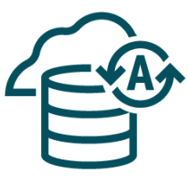

# **[OCI Database Observability](#)**
## **An OCI Open LZ Addon for Database Observability at Scale**

&nbsp; 

### 1. Overview

Welcome to the **OCI Landing Zone Database Observability add-on**. 

This guide provides the configuration steps required to enable OCI Observability native services, including **Database Management**, **Operations Insights**, and **Logging Analytics**, as add-on capabilities to the Operating Entities blueprints. The One-OE model is used as the default reference architecture throughout this guide.

* **Database Management service** (DBM) offers a comprehensive set of database performance monitoring and management features. Diagnostics & Management enables you to monitor and manage Oracle databases, HeatWave and External MySQL DB systems, and infrastructure components such as DB system components and Exadata storage servers in multi-cloud and hybrid deployments.

* **Ops Insights** (OPSI) provides comprehensive information about the resource use and capacity of databases and hosts. Use this service to analyze CPU and storage resources, forecast capacity issues, and proactively identify SQL performance issues across a database fleet.

* **Logging Analytics** is a machine learning-based cloud service that monitors, aggregates, indexes, and analyzes all log data from on-premises and multicloud environments. Enabling users to search, explore, and correlate this data to troubleshoot and resolve problems faster and derive insights to make better operational decisions.
&nbsp; 

### 2. Benefits of this asset

Following the guidelines explained here reduces the overall management complexity and will help you with:

* Reduce time and effort needed to enable native monitoring services.
* Extend your LZ with dedicated Observability compartments.
* Add the proper Observability groups.
* Add the required policies per each service.
* Add a dedicated vault to securely store secrets for the monitoring group.
&nbsp; 
 
## 3. Design Decisions

To configure this add-on, you will need to make some key design decisions:

| Decision | Question to answer | Recommended option | Alternative option | Design impact |
|---|---|---|---|---|
| [Private endpoints configuration](#31-private-endpoints) | Should Database Management and Operations Insights use shared global private endpoints, or dedicated private endpoints per environment? | Use shared global private endpoints in the hub monitoring subnet. | Use local private endpoints when there is a single environment, no hub, or an explicit requirement for environment-dedicated endpoints. | Determines where DBM/OPSI private endpoints are deployed, which subnets and NSGs are required, and how database connectivity is routed. Dedicated private endpoints can also consume PE service limits quickly in customers with many business lines, environments, or projects. |
| [Logging Analytics agent placement](#32-logging-analytics-agent-placement) | Where should the Logging Analytics Management Agent run for the selected database scenario? | Follow the selected scenario guidance. For DBCS and ExaDB-D, install the Management Agent on the database hosts. | For scenarios that require a shared agent host, deploy a centralized monitoring instance in the hub monitoring subnet. | Determines whether a VM is required, where the agent runs, and which network and IAM prerequisites apply. |
| [Monitoring groups structure](#33-groups) | Should one observability team manage all environments, or should there be dedicated monitoring teams per environment? | Use a global observability team for centralized operations across environments. | Use environment-specific observability teams when operating responsibilities are separated by environment. | Determines IAM group structure, policies, vault access, and operational ownership. |

## 3.1 Private Endpoints  

For enhanced security, Observability Services should be configured with private access. Some of the key benefits of OCI Private Endpoints include:
* **Security**: By avoiding the public internet, Private Endpoints significantly reduce the risk of data breaches and unauthorized access.
* **Compliance**: Helps meet regulatory requirements by ensuring data remains within designated boundaries.
* **Performance**: Provides low-latency connections ideal for performance-sensitive applications.
* **Cost Savings**: Reduces the need for additional networking resources like VPNs or dedicated connections.

For Database Management and Operations Insights, we will use Private Endpoints.

There are limits on the number of Private Endpoints [PE](https://docs.oracle.com/en-us/iaas/Content/Network/Concepts/privateaccess.htm#private-endpoints) that can be created per region. It depends on the database type configured.
Based on this, we can adopt two different approaches:

| Option |  Description  | 
|:--:|:--:|
| **Global Approach** (Highly Recommended) | As a general approach, the Landing Zone uses a hub VCN, which is designed to centralize services such as load balancers, firewalls, DNS, and more. The global approach involves deploying a "Global" Private Endpoint (PE) that can be used across all databases in different projects, environments, or entities. We recommend deploying the PEs in the Monitoring Subnet, as this configuration will include the necessary routing and communication requirements through Network Security Groups (NSGs).| 
| **Local Approach** | In specific cases where the customer has a single environment or no Hub, a local approach can be adopted using environment-dedicated Private Endpoints. In this case, dedicated DBM/OPSI PEs can be deployed in the database subnet used by the monitored database. The NSGs included in each scenario allow communication between the DBM/OPSI PEs and the monitored database endpoint for that scenario, such as a DBCS database listener, an Autonomous Database private endpoint, or an ExaDB-D SCAN listener.|

&nbsp; 

## 3.2 Logging Analytics Agent Placement

If Logging Analytics is required, a Management Agent must run where it can collect or receive the target database logs. The placement is scenario-specific.

For DBCS and ExaDB-D, the add-on does not deploy an additional monitoring VM. Install the Management Agent on the database hosts and make sure the database VCN has the Service Gateway required for Logging Analytics ingestion.

For scenarios that require a shared agent host, use the scenario README to decide whether a centralized monitoring instance in the hub monitoring subnet is deployed.

## 3.3 Groups

In this asset, we provide two example Observability groups (roles):

* **Global Observability Team**: A general team responsible for managing all Operations and Maintenance (O&M) services, as well as DBM/OPSI private endpoints across the organization.

* **Production Observability Team**: A specialized team focused on managing all O&M services and DBM/OPSI private endpoints within the production environment.
  
Note: The design includes several options, and the customer can decide whether to use them based on what best fits their operating and business model.

## 4. Scenarios.

| # |  Scenario  | Description | Status |
|:--:|:--:|---|---|
| 1 | | Autonomous database| [Available](./scenario-autonomous-databases/readme.md) |
| 2 | | DBCS | [Available](./scenario-dbcs-databases/readme.md) |
| 3 |  | ExaDB-D | [Available](./scenario-exacs-databases/readme.md) |
| 4 |  | ODA@ | In progress |
| 5 | | EXACC| In progress |
| 6 |  | External Databases | In progress |

# License

Copyright (c) 2026 Oracle and/or its affiliates.

Licensed under the Universal Permissive License (UPL), Version 1.0.

See [LICENSE](/LICENSE.txt) for more details.
