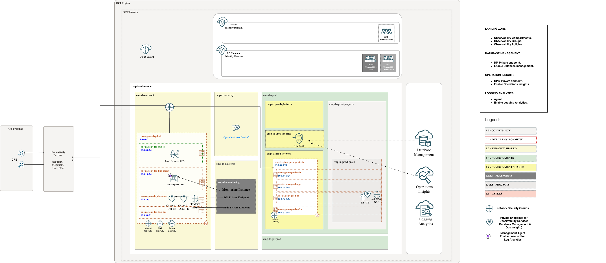
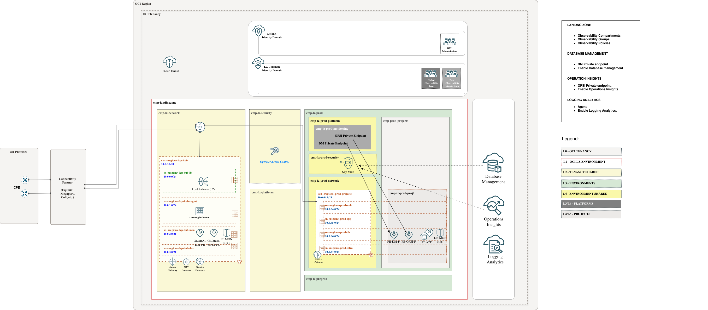

# **[Autonomous Databases ](#)**
## **An OCI Open LZ add-on to help you enable native Observability services on Autonomous Databases**

## OCI Native Services Configuration Prerequisites

This scenario documents the Autonomous Database implementation details for the OCI Database Observability add-on. Before continuing, review and finalize the design decisions listed in the general [OCI Database Observability README](../readme.md#3-design-decisions), including the Global PE vs Local PE decision.

### Services covered

This add-on prepares the Landing Zone to enable:

* Database Management
* Ops Insights
* Logging Analytics

### Private endpoint connectivity

Database Management and Ops Insights require service Private Endpoints with network access to the Autonomous Database Private Endpoint. The add-on includes the Network Security Groups (NSGs) required to allow that connectivity.

Use these links to review the relevant OCI documentation:

* [DBM Private Endpoint](https://docs.oracle.com/en-us/iaas/Content/Network/Concepts/privateaccess.htm#private-endpoints)
* [OPSI Private Endpoint](https://docs.oracle.com/en-us/iaas/Content/Network/Concepts/privateaccess.htm#private-endpoints)

> [!WARNING]
> This scenario supports placing the Database Management or Ops Insights Private Endpoint in the same VCN as the Autonomous Database Private Endpoint, or in a different VCN.
>
> Keep the service limit in mind: only one Private Endpoint can be created per VCN.

### Credentials and Vault

Enabling Database Management or Ops Insights for an Autonomous Database requires a database user and password. These credentials must be stored as secrets in the dedicated Observability Vault provisioned by the selected implementation option. The required policies to access the secret are included in the add-on.

### Management Agent for Logging Analytics

Logging Analytics requires a Management Agent with access to the monitored database endpoint and the required ingestion policies. This add-on provides the IAM and network prerequisites for that flow.

&nbsp;

## Implementation

Our add-on template includes the required components to enable Database Management, Ops Insights, and Logging Analytics, such as compartments, groups, a dedicated monitoring Vault, policies, NSGs, and a monitoring instance.
&nbsp;

Follow these steps to extend your One-OE Landing Zone:

**Step 0**. ( prerequisit )

Deploy the One-OE Landing Zone. You can follow these [steps](https://github.com/oci-landing-zones/oci-landing-zone-operating-entities/tree/master/blueprints/one-oe/runtime/one-stack). To work with multiple stacks, you need to use the orchestrator's outputs and dependencies features within [ORM](https://github.com/oci-landing-zones/oci-landing-zone-operating-entities/blob/master/commons/content/orm_bp.md).

**Step 1**.

Deploy the add-on with OCI Resource Manager (ORM):

| GLOBAL | LOCAL |
|---|---|
| Use this deployment when DBM/OPSI private endpoints are shared global endpoints deployed in the hub monitoring subnet. | Use this deployment when DBM/OPSI private endpoints are environment-dedicated and deployed in the same database subnet as the Autonomous Database private endpoint. |
| Resources created:  Compartments: `cmp-lz-monitoring`.  Groups and policies: `grp-lz-global-mon-admins`, `grp-lz-prod-mon-admins`, `grp-lz-preprod-mon-admins`, `pcy-mon-services`, `pcy-global-mon-admin`.  Dynamic group: `dg-lz-mon-dynamic-group`.  NSGs: `nsg-fra-lz-hub-global-mon-pe`, `nsg-fra-lz-prod-proj1-mon-pe-db1`, `nsg-fra-lz-preprod-proj1-mon-pe-db1`.  Vault and key: `vlt-lz-shared-mon-security`, `key-lz-mon-bkt`.  Monitoring instance: `vm-fra-lz-shared-mon-agent`. | Resources created:  Compartments: `cmp-lz-monitoring`, `cmp-lz-prod-monitoring`, `cmp-lz-preprod-monitoring`.  Groups and policies: `grp-lz-global-mon-admins`, `grp-lz-prod-mon-admins`, `grp-lz-preprod-mon-admins`, `pcy-mon-services`, `pcy-global-mon-admin`, `pcy-prod-mon-admin`, `pcy-preprod-mon-admin`.  Dynamic group: `dg-lz-mon-dynamic-group`.  NSGs: `nsg-fra-lz-prod-proj1-mon-pe-db1`, `nsg-fra-lz-preprod-proj1-mon-pe-db1`.  Vault and key: `vlt-lz-shared-mon-security`, `key-lz-mon-bkt`.  Monitoring instance: `vm-fra-lz-shared-mon-agent`. |
|  |  |
| <a href='https://cloud.oracle.com/resourcemanager/stacks/create?zipUrl=https://github.com/oci-landing-zones/terraform-oci-modules-orchestrator/archive/refs/tags/v2.1.1.zip&zipUrlVariables={"input_config_files_urls":"https://raw.githubusercontent.com/oci-landing-zones/oci-landing-zone-operating-entities/obs/addons/oci-db-observability%2520/scenario-autonomous-databases/addon_obs_iam_atp_global.json,https://raw.githubusercontent.com/oci-landing-zones/oci-landing-zone-operating-entities/obs/addons/oci-db-observability%2520/scenario-autonomous-databases/addon_obs_network_atp_global.json,https://raw.githubusercontent.com/oci-landing-zones/oci-landing-zone-operating-entities/obs/addons/oci-db-observability%2520/scenario-autonomous-databases/addon_obs_security_atp.json,https://raw.githubusercontent.com/oci-landing-zones/oci-landing-zone-operating-entities/obs/addons/oci-db-observability%2520/scenario-autonomous-databases/addon_obs_instance_atp.json"}'></a> | <a href='https://cloud.oracle.com/resourcemanager/stacks/create?zipUrl=https://github.com/oci-landing-zones/terraform-oci-modules-orchestrator/archive/refs/tags/v2.1.1.zip&zipUrlVariables={"input_config_files_urls":"https://raw.githubusercontent.com/oci-landing-zones/oci-landing-zone-operating-entities/obs/addons/oci-db-observability%2520/scenario-autonomous-databases/addon_obs_iam_atp_local.json,https://raw.githubusercontent.com/oci-landing-zones/oci-landing-zone-operating-entities/obs/addons/oci-db-observability%2520/scenario-autonomous-databases/addon_obs_network_atp_local.json,https://raw.githubusercontent.com/oci-landing-zones/oci-landing-zone-operating-entities/obs/addons/oci-db-observability%2520/scenario-autonomous-databases/addon_obs_security_atp.json,https://raw.githubusercontent.com/oci-landing-zones/oci-landing-zone-operating-entities/obs/addons/oci-db-observability%2520/scenario-autonomous-databases/addon_obs_instance_atp.json"}'></a> |
| Files loaded: [addon_obs_iam_atp_global.json](addon_obs_iam_atp_global.json) [addon_obs_network_atp_global.json](addon_obs_network_atp_global.json) [addon_obs_security_atp.json](addon_obs_security_atp.json) [addon_obs_instance_atp.json](addon_obs_instance_atp.json) | Files loaded: [addon_obs_iam_atp_local.json](addon_obs_iam_atp_local.json) [addon_obs_network_atp_local.json](addon_obs_network_atp_local.json) [addon_obs_security_atp.json](addon_obs_security_atp.json) [addon_obs_instance_atp.json](addon_obs_instance_atp.json) |

For step-by-step instructions, see [Implementation add-on steps](./Implementation_addon_steps.md).

**Step 2**.

Follow the service-specific [steps to enable Database Management, Ops Insights, and Logging Analytics](steps_to_enable_observability.md). The DBM and OPSI private endpoint configuration is covered there for both Global and Local options.

&nbsp;

# License

Copyright (c) 2026 Oracle and/or its affiliates.

Licensed under the Universal Permissive License (UPL), Version 1.0.

See [LICENSE](/LICENSE.txt) for more details.
