# OCI Observability for Autonomous Databases

This guide describes how to enable OCI observability capabilities for Autonomous Databases. It covers Database Management, Operations Insights, and Logging Analytics.

## Prerequisites Already Created by the Landing Zone Add-on

The Observability Landing Zone add-on deployment already creates the OCI-side prerequisites for Database Management, Operations Insights, and Logging Analytics:

- Monitoring compartments and monitoring groups.
- IAM policies for Database Management, Operations Insights, Logging Analytics, dashboards, alerts, Management Agent, secrets, and network access.
- Network Security Groups for the selected DBM/OPSI private endpoint connectivity model.
- The Observability Vault and Key, `vlt-lz-shared-mon-security` and `key-lz-mon-bkt`.
- The monitoring agent VM `vm-fra-lz-shared-mon-agent`.

Do not recreate these IAM policies, groups, NSGs, vaults, keys, or the monitoring agent VM manually as part of Step 2: Enable OCI Observability.

## Manual Prerequisites

The detailed sections below include screenshot-based steps. At a high level, Step 2: Enable OCI Observability covers these manual service-onboarding actions:

1. Confirm that the Autonomous Database uses private endpoint access and the NSG model deployed by the Landing Zone add-on.
2. Create the Database Management private endpoint using either the Global or Local model selected for the Landing Zone add-on.
3. Prepare the database monitoring user and store the password in the Observability Vault.
4. Enable Database Management and select the Database Management private endpoint.
5. Create the Operations Insights private endpoint using either the Global or Local model selected for the Landing Zone add-on.
6. Enable Operations Insights and select the Operations Insights private endpoint.
7. Use the monitoring agent VM created by the Landing Zone add-on to complete Logging Analytics onboarding.

## **Database Management Enabling Steps**


<table>
<tbody>
<tr>
<th align="left">Steps</th>
<th align="left">Description</th>
<th align="left">Notes</th>
</tr>
<tr>

<td align="left" >1</td>
<td align="left">
The database should be created in the appropriate project compartment at the database layer. Ensure that the 'Network Access' option is set to 'Private Endpoint Access Only.' Then, assign the database subnet and select the NSGs provisioned in the database compartment.

Example for Prod database: 

* **Compartment**-> cmp-landingzone:cmp-lz-prod:cmp-lz-prod-projects:cmp-lz-prod-proj1
* **Network**-> vcn:vcn-fra-lz-prod-projects; subnet:sn-fra-lz-prod-db
* **NSG**-> nsg-fra-lz-prod-proj1-mon-pe-db1
  

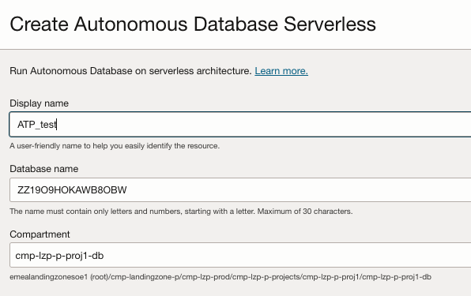  

&nbsp; 

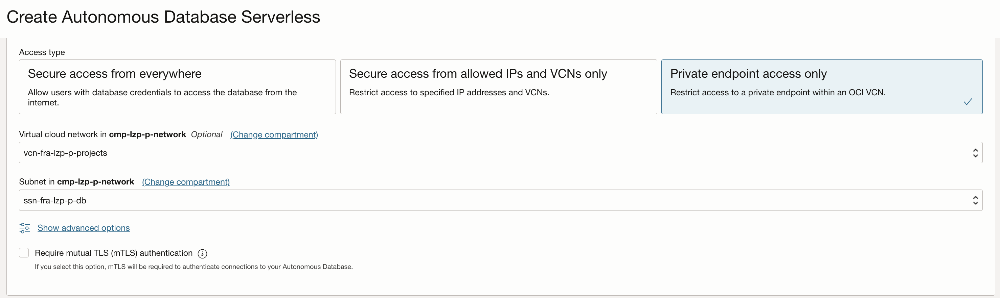

&nbsp; 

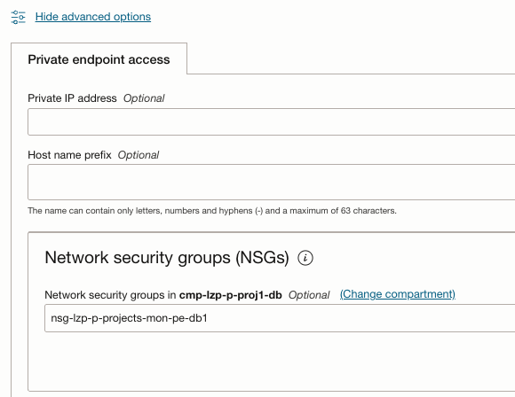

&nbsp; 

</td>
<td align="left"> 

If the database was created previously, ensure it is placed in the correct cmp, assigned to the proper subnet, and configured with the appropriate NSG.

The Landing Zone add-on already provisions the required compartments, subnets, and Network Security Groups (NSGs).
</td>
</tr>

<tr>
<td align="left" rowspan="2" >2</td>


<td align="left">
Create the DBM private endpoint. 

* In a **global approach**, DBM PEs will be placed in the monitoring subnet (sn-fra-lz-hub-mon) in the hub VCN and should be assigned to the global PE NSGs (nsg-fra-lz-hub-global-mon-pe). Example: pe_lz_global_dbm.

&nbsp; 
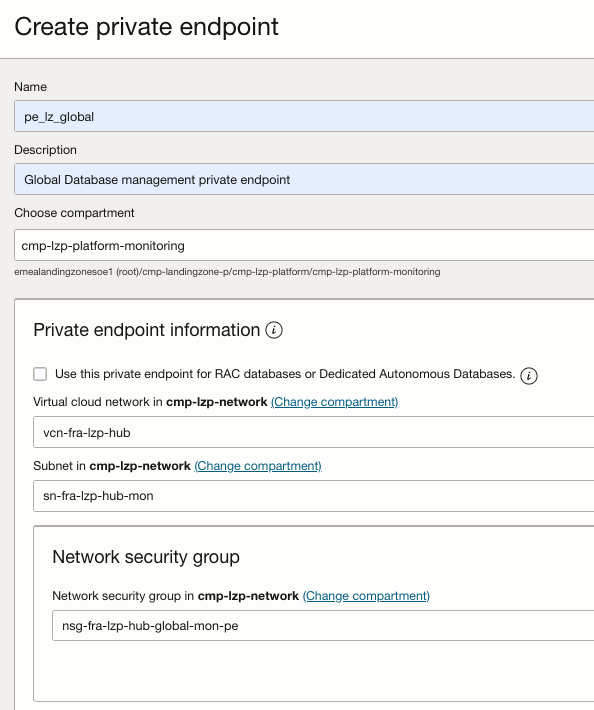
</td>


<td align="left" rowspan="2">      
The Landing Zone add-on already provisions the required subnets, route tables, gateways, security lists, and Network Security Groups (NSGs).

This operation can be easily automated with [Terraform](https://registry.terraform.io/providers/oracle/oci/latest/docs/resources/database_management_db_management_private_endpoint).
</td>
</tr>

<tr>

<td align="left">

* In a **local approach**, DBM PEs and the ATP PE will reside in the same database subnet (sn-fra-lz-prod-db), and the nsg-fra-lz-prod-proj1-mon-pe-db1 NSGs will allow communication between them. Example: pe_lz_p_dbm.

&nbsp; 
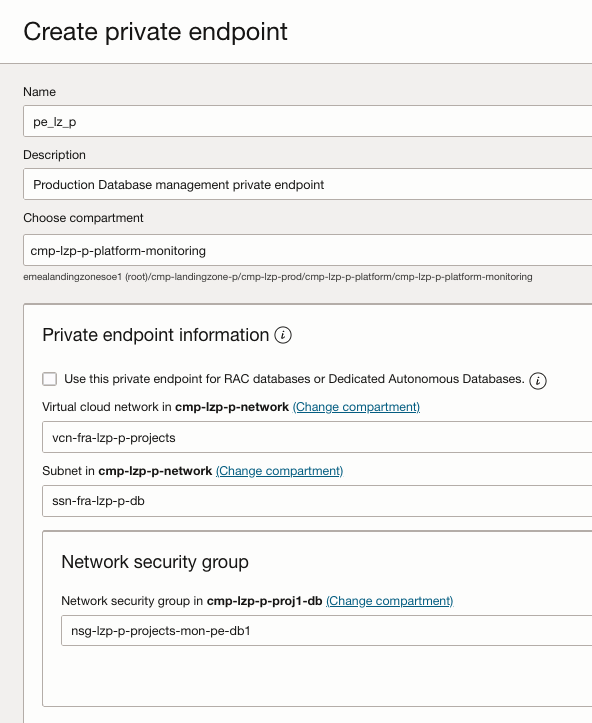
</td>      
</tr>


<tr>
<td align="left">3</td>
<td align="left">
Unlock and change the password for adbsnmp.

**Note**: `ADBSNMP` is a common option for basic monitoring. For advanced diagnostics, use `ADMIN` or a database user with equivalent privileges if required by the selected Performance Hub or diagnostics features.

```
ALTER USER adbsnmp ACCOUNT UNLOCK;
ALTER USER adbsnmp IDENTIFIED BY adbsnmp_password; 
grant SELECT ANY DICTIONARY to adbsnmp;
grant SELECT_CATALOG_ROLE to adbsnmp;
grant read on awr_pdb_snapshot to adbsnmp;
grant execute on dbms_workload_repository to adbsnmp;
```

</td>
<td align="left">

To connect to a database placed in a private subnet you can follow this [blog](https://blogs.oracle.com/datawarehousing/post/4-ways-to-connect-to-autonomous-database-on-a-private-network).
</td>
</tr>

<tr>
<td align="left">4</td>
<td align="left">

Create a secret in the vlt-lz-shared-mon-security vault located within the cmp-landingzone:cmp-lz-security compartment.

If mTLS is required, download the Autonomous Database wallet, extract `cwallet.sso`, and store it in OCI Vault as a separate secret. Tag the wallet secret so Database Management can discover it:

```text
DBM_Wallet_Type: "DATABASE"
```

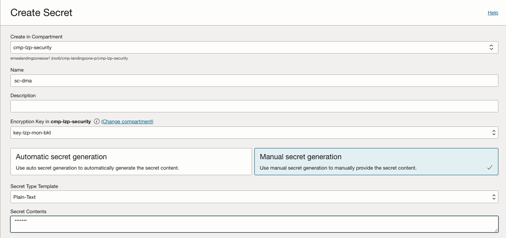

</td>
<td align="left">
The Landing Zone add-on already provisions the dedicated Vault and required policies.
</td>
</tr> 


<tr>
<td align="left" rowspan="2" >5</td>
<td align="left">

Enable [Database Management](https://docs.oracle.com/en-us/iaas/database-management/doc/enable-database-management-autonomous-databases.html).

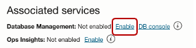</img>
&nbsp; 
</td>

<td align="left" rowspan="2">      
Remember to select the private DBM endpoint created earlier in the Enable OCI Observability flow.

</td>
</tr>

<tr>
<td align="left">

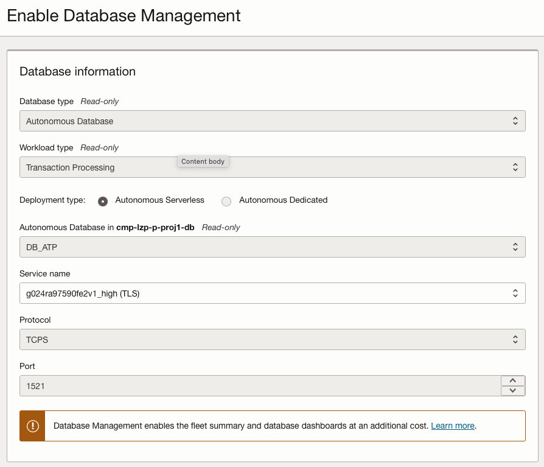</img> 
&nbsp; 

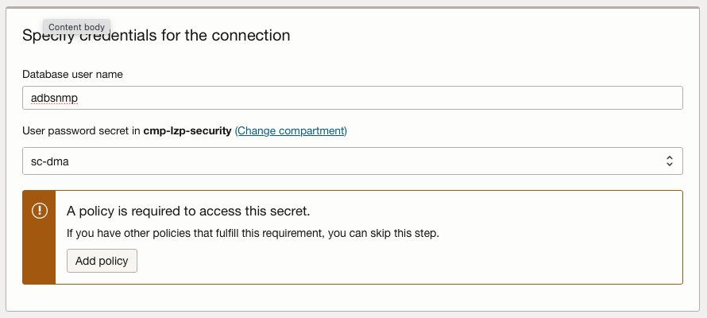</img>
&nbsp; 

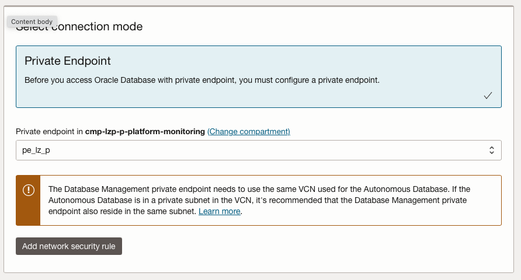</img>
&nbsp; 
</td>      
</tr>


<tr>
<td align="left">6</td>
<td align="left">

Click the 'Enable Database Management' button. Then, go to the work request and check the progress.

&nbsp; 
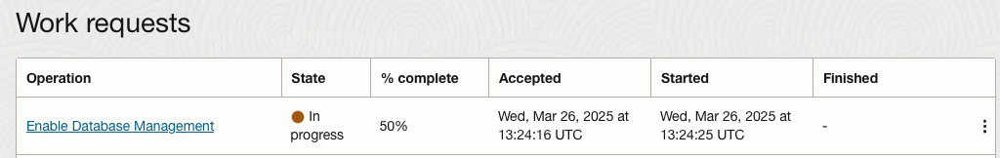</img>
&nbsp; 
&nbsp; 
&nbsp; 

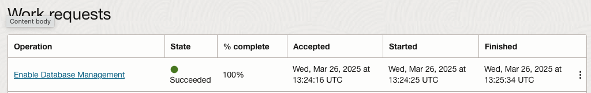</img>
&nbsp; 
&nbsp; 
&nbsp; 

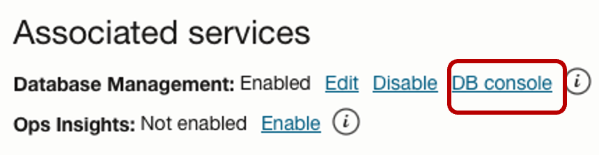 </img>
&nbsp; 
&nbsp; 
&nbsp; 

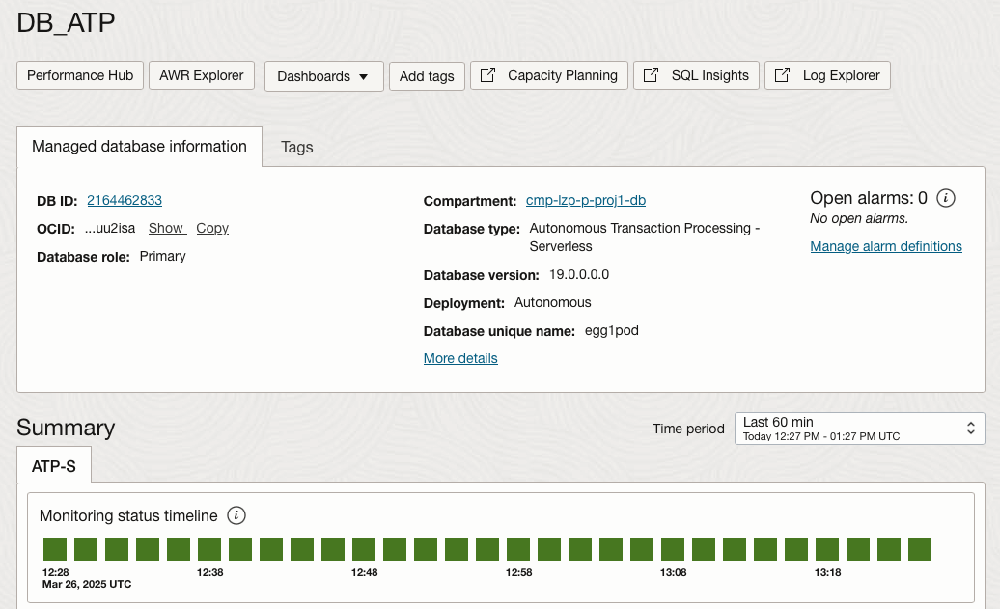 </img> 
&nbsp; 
&nbsp; 

</td>
<td align="left">
</td>
</tr> 
 
</tbody>
</table>


## **Ops Insights Enabling Steps**


<table>
<tbody>
<tr>
<th align="left">Steps</th>
<th align="left">Description</th>
<th align="left">Notes</th>
</tr>
<tr>

<td align="left">1</td>
<td align="left">
The database should be created in the appropriate project compartment at the DB layer, using the DB subnet and assign the NSGs to the database. 

Example for Prod database: 

* **Compartment**-> cmp-landingzone:cmp-lz-prod:cmp-lz-prod-projects:cmp-lz-prod-proj1
* **Network**-> vcn:vcn-fra-lz-prod-projects; subnet:sn-fra-lz-prod-db
* **NSG**-> nsg-fra-lz-prod-proj1-mon-pe-db1
</td>
<td align="left"> 

If the database was created previously, ensure it is placed in the correct CMP, assigned to the proper subnet, and configured with the appropriate NSG.

The Landing Zone add-on already provisions the required compartments, subnets, and Network Security Groups (NSGs).
</td>
</tr>

<tr>
<td align="left" rowspan="2" >2</td>

<td align="left">
Create the OPSI private endpoint. 

* In a **global approach**, OPSI PEs will be placed in the monitoring subnet (sn-fra-lz-hub-mon) in the hub and should be assigned to the PE NSGs (nsg-fra-lz-hub-global-mon-pe). Example: pe_lz_global_opsi.

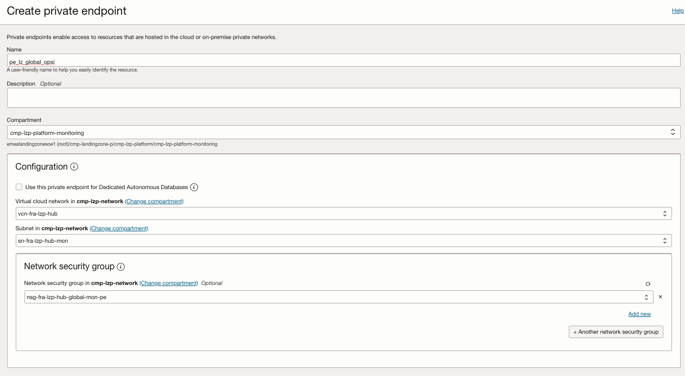 </img>


</td>
<td align="left" rowspan="2">      
The Landing Zone add-on already provisions the required subnets, route tables, gateways, security lists, and Network Security Groups (NSGs).

This operation can be easily automated with [Terraform](https://registry.terraform.io/providers/oracle/oci/latest/docs/data-sources/opsi_operations_insights_private_endpoints).
</td>
</tr>


<tr>
<td align="left">

* In a **local approach**, OPSI PEs and the ATP PE will reside in the same database subnet (sn-fra-lz-prod-db), and the nsg-fra-lz-prod-proj1-mon-pe-db1 NSGs will allow communication between them. Example: pe_lz_p_opsi.

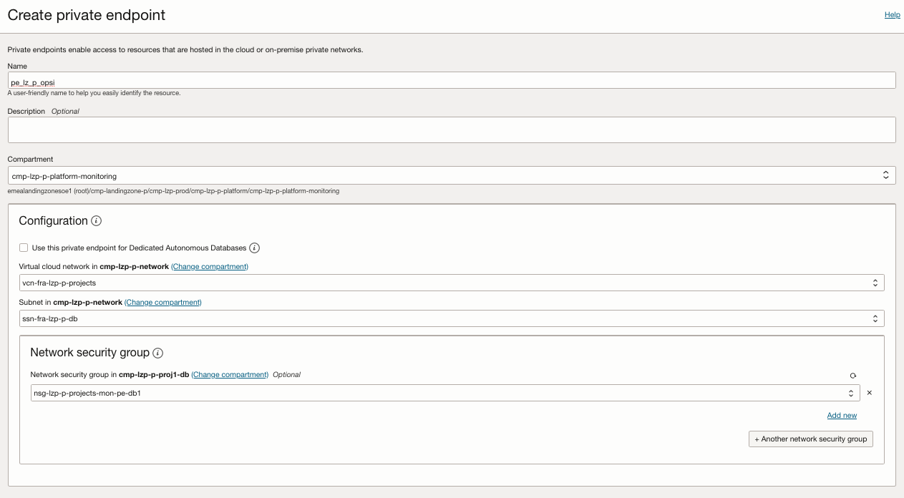 </img>

</td>      
</tr>

<tr>
<td align="left">3</td>
<td align="left">
Unlock and change the password for adbsnmp.

**Note**: If you have already completed this step to enable Database Management, you can skip this step.

```
ALTER USER adbsnmp ACCOUNT UNLOCK;
ALTER USER adbsnmp IDENTIFIED BY adbsnmp_password; 
grant SELECT ANY DICTIONARY to adbsnmp;
grant SELECT_CATALOG_ROLE to adbsnmp;
grant read on awr_pdb_snapshot to adbsnmp;
grant execute on dbms_workload_repository to adbsnmp;
```

</td>
<td align="left">

To connect to a database placed in a private subnet you can follow this [blog](https://blogs.oracle.com/datawarehousing/post/4-ways-to-connect-to-autonomous-database-on-a-private-network)

</td>
</tr>

<tr>
<td align="left">4</td>
<td align="left">
Create a secret in the vlt-lz-shared-mon-security vault located in the cmp-landingzone:cmp-lz-security compartment.

**Note**: If you have already completed this step to enable Database Management, you can skip this step.

</td>
<td align="left">
The Landing Zone add-on already provisions the dedicated Vault and required policies.
</td>
</tr> 


<tr>
<td align="left" rowspan="2" >5</td>
<td align="left">

Enable [Ops Insights](https://docs.oracle.com/en-us/iaas/autonomous-database/doc/enable-operations-insights-dedicated-autonomous-database.html).

Choose the feature set based on the capabilities required:

* **Basic**: use it for capacity planning when the full feature prerequisites are not ready.
* **Full feature set**: use it when SQL Explorer, ADDM Spotlight, and richer database analytics are required.

For the full feature set, configure the required credential, database user, Vault password secret, service name or connection string, and the private OPSI endpoint created earlier in the Enable OCI Observability flow when the database uses private endpoint access or access control lists.

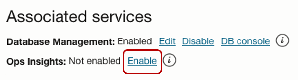</img>
&nbsp; 
</td>

<td align="left" rowspan="2">     

Remember to select the private OPSI endpoint created earlier in the Enable OCI Observability flow. Choose the appropriate PE based on whether you're using a Global or Local approach.

</td>
</tr>

<tr>
<td align="left">
&nbsp; 
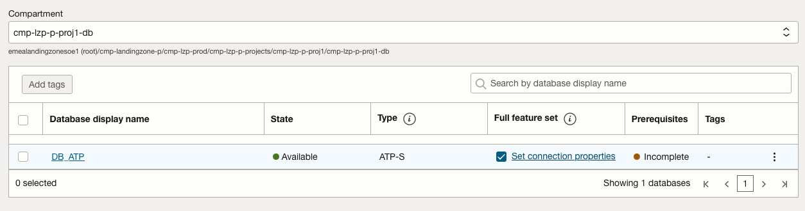</img> 
&nbsp; 
&nbsp; 
&nbsp; 

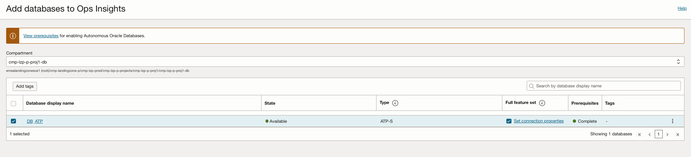</img>
&nbsp; 
&nbsp; 
&nbsp; 

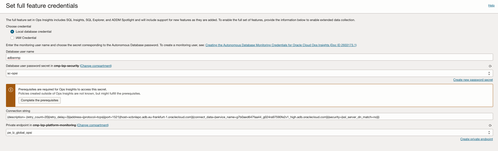</img>
&nbsp; 
&nbsp; 
&nbsp; 


</td>      
</tr>


<tr>
<td align="left">6</td>
<td align="left">

Click the 'Add database' button. Then, go to the work request and check the progress.


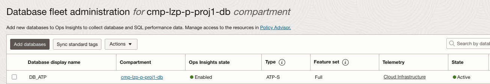</img>

</td>
<td align="left">
</td>
</tr> 
 
 
</tbody>
</table>


## **Logging Analytics Enabling Steps**

For Autonomous Database, Logging Analytics collects database records by connecting to the database over JDBC and running SQL against approved tables or views. It does not collect database server host files, because the database hosts are managed by Oracle.

The Landing Zone add-on creates the IAM prerequisites, dynamic group, network access, and the monitoring agent VM `vm-fra-lz-shared-mon-agent`. Use that VM as the Management Agent host unless your implementation requires another approved host with JDBC connectivity to the Autonomous Database.

### 1. Decide What To Collect

Start with a narrow, approved source. Good first candidates are:

- Autonomous Database alert-log records exposed through a DBA-owned view.
- Application log tables written by applications running on Autonomous Database.
- Approved audit or security views.
- Load, integration, batch, or job history tables.

Avoid broad application tables, sensitive payload columns, mutable procedures, or queries that can full-scan busy production tables. For each source, document:

- owner team and purpose
- source table or view
- data sensitivity and retention
- timestamp column
- unique increasing sequence column
- expected row volume

### 2. Prepare A Read-Only Database User

Use a least-privilege account for collection. If the same `adbsnmp` user already prepared for Database Management or Ops Insights is approved for this purpose, it can be reused. Otherwise, create a dedicated read-only user.

This example assumes a DBA-owned view named `DBA_OWNER.ADB_ALERT_LOG_V` exposes only the alert-log fields that operators need.

```sql
CREATE USER logan_reader IDENTIFIED BY "<strong_password>";
GRANT CREATE SESSION TO logan_reader;
GRANT SELECT ON dba_owner.adb_alert_log_v TO logan_reader;
```

If you need to create the source view, keep it small and operationally focused:

```sql
CREATE OR REPLACE VIEW dba_owner.adb_alert_log_v AS
SELECT
  alert_id,
  originating_timestamp,
  message_level,
  component_id,
  message_text
FROM dba_owner.approved_alert_log_source;

GRANT SELECT ON dba_owner.adb_alert_log_v TO logan_reader;
```

Recommended fields:

- `alert_id`: unique increasing sequence value, indexed when possible.
- `originating_timestamp`: event time.
- `message_level`: alert severity or level.
- `component_id`: database component, service, module, or source.
- `message_text`: concise event message.

### 3. Prepare The Management Agent And Wallet

1. Connect to the monitoring agent VM created by the Landing Zone add-on: `vm-fra-lz-shared-mon-agent`.
2. Confirm the Management Agent is `Active`.
3. Confirm the Log Analytics service plugin is `Running`.
4. If the Log Analytics plugin is not enabled, enable or deploy it using the approved Management Agent process. The plugin configuration uses:

```text
Service.plugin.logan.download=true
```

5. Open the Autonomous Database **DB Connection** page.
6. Download the wallet zip file.
7. Unzip it into a protected directory on the Management Agent host.
8. Grant the Management Agent OS user read access to wallet files only.
9. Record the service name from `tnsnames.ora`, such as `<db_name>_low`.

Use a low or medium service for collection unless your DBA standard requires a different service.

### 4. Create The Autonomous Database Entity

1. Open **Observability & Management** > **Log Analytics** > **Administration**.
2. Select **Entities**.
3. Create an entity.
4. Select the entity type:
   - **Autonomous Transaction Processing**
   - **Autonomous Data Warehouse**
5. Select the Management Agent compartment and the agent that has JDBC access.
6. Optionally enter the Autonomous Database OCID as the cloud resource ID.
7. Set the `service_name` property using the value from `tnsnames.ora`.
8. Save the exact entity name. It is required for credential registration.

### 5. Register Credentials And Wallet Details

Create a JSON credential file on the Management Agent host. The credential name must follow this pattern:

```text
LCAgentDBCreds.<Database_Entity_Name>
```

Example:

```json
{
  "source": "lacollector.la_database_sql",
  "name": "LCAgentDBCreds.<Database_Entity_Name>",
  "type": "DBTCPSCreds",
  "usage": "LOGANALYTICS",
  "disabled": "false",
  "properties": [
    {"name": "DBUserName", "value": "logan_reader"},
    {"name": "DBPassword", "value": "<database_password>"},
    {"name": "ssl_trustStoreType", "value": "JKS"},
    {"name": "ssl_trustStoreLocation", "value": "/opt/adb-wallet/truststore.jks"},
    {"name": "ssl_trustStorePassword", "value": "<wallet_password>"},
    {"name": "ssl_keyStoreType", "value": "JKS"},
    {"name": "ssl_keyStoreLocation", "value": "/opt/adb-wallet/keystore.jks"},
    {"name": "ssl_keyStorePassword", "value": "<wallet_password>"},
    {"name": "ssl_server_cert_dn", "value": "yes"}
  ]
}
```

Register the credentials:

```sh
cat /secure/path/adb-logan-creds.json | sh /opt/oracle/mgmt_agent/agent_inst/bin/credential_mgmt.sh -o upsertCredentials -s logan
```

For Management Agents installed through Oracle Cloud Agent, the script path is usually under:

```text
/var/lib/oracle-cloud-agent/plugins/oci-managementagent/polaris/agent_inst/bin
```

After registration, remove the plaintext JSON file or move it into an approved secrets process.

### 6. Create And Associate The Database Source

1. Open **Log Analytics** > **Administration** > **Sources**.
2. Select **Create Source**.
3. Set **Source Type** to **Database**.
4. Set **Entity Type** to the Autonomous Database entity type selected earlier.
5. Add a SQL query against the approved table or view.

Example alert-log query:

```sql
SELECT
  alert_id,
  originating_timestamp,
  message_level,
  component_id,
  message_text
FROM dba_owner.adb_alert_log_v
```

6. Test the query outside Log Analytics using the same database user.
7. Map SQL columns to Log Analytics fields.
8. Select the sequence column, such as `ALERT_ID`.
9. Map the timestamp column, such as `ORIGINATING_TIMESTAMP`, to `Time`.
10. Enable the query and save the source.
11. Open the source details page.
12. Select **Unassociated Entities**.
13. Add the Autonomous Database entity association.
14. Select the target log group compartment and log group.
15. Submit and review **Agent Collection Warnings**.

SQL rules:

- Use read-only SQL only.
- Use a database user with only the required privileges.
- Include a sequence or timestamp column that identifies new records.
- Index the sequence or timestamp column when possible.
- Do not add `ORDER BY` on the sequence or timestamp field.
- Do not add `WHERE` filters on the sequence or timestamp field; Log Analytics applies its own incremental filter.

If a timestamp field is mapped to `Time`, first historical collection uses that field as the reference for previous records. If no timestamp is mapped, the first collection can ingest a much larger historical set, so test with care.

### 7. Validate In Log Explorer

1. Open **Observability & Management** > **Log Analytics** > **Log Explorer**.
2. Select the correct compartment, log group, and time range.
3. Filter by source or entity name.
4. Confirm the histogram shows records.
5. Open sample records and verify:
   - timestamp is correct
   - severity or level is parsed as expected
   - source and entity names are correct
   - message content is useful
   - sensitive values are not present
6. Generate or identify a known alert-log record, if allowed.
7. Wait for the next collection interval and confirm the record appears.

### 8. Troubleshooting

If the Logging Analytics source collects no records:

- Confirm the Management Agent can reach the Autonomous Database over JDBC.
- Confirm the Management Agent is `Active`.
- Confirm the Log Analytics plugin is `Running`.
- Confirm the Management Agent dynamic group can upload to the log group.
- Confirm wallet paths and permissions on the agent host.
- Confirm credentials were registered with the exact entity name.
- Confirm the database user has read access to queried tables or views.
- Test the SQL query outside Logging Analytics.
- Check **Agent Collection Warnings**.

If Logging Analytics reports credential or wallet errors:

- Confirm the credential name exactly matches `LCAgentDBCreds.<entity_name>`.
- Confirm wallet paths are absolute and include file names.
- Confirm the Management Agent OS user can read the wallet files.
- Confirm the wallet password matches `keystore.jks` and `truststore.jks`.
- Confirm the database password has not expired or rotated.

If Logging Analytics reports query errors:

- Run the query manually as the Log Analytics database user.
- Confirm the user has `SELECT` on the table or view.
- Remove `ORDER BY` on sequence or timestamp columns.
- Avoid `WHERE` filters on the incremental sequence or timestamp column.
- Verify the selected sequence column is unique and increasing.

# License

Copyright (c) 2026 Oracle and/or its affiliates.

Licensed under the Universal Permissive License (UPL), Version 1.0.

See [LICENSE](/LICENSE.txt) for more details.
