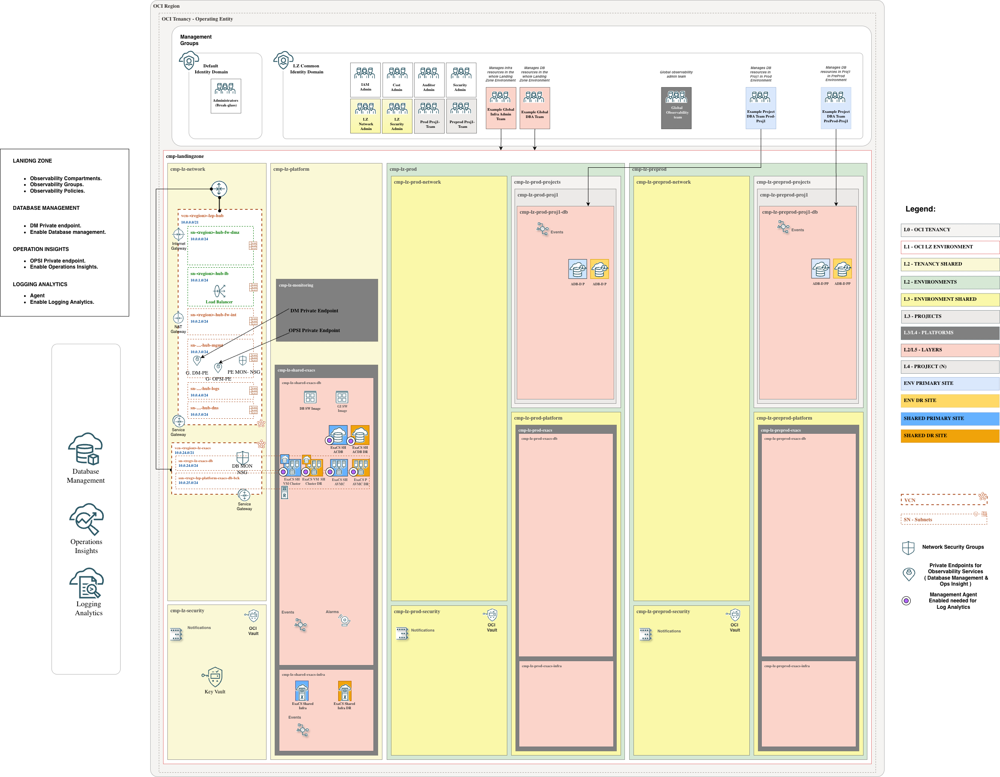

# **[ExaDB-D Databases](#)**
## **An OCI Open LZ add-on to help you enable native Observability services on ExaDB-D databases**

## OCI Native Services Configuration Prerequisites

This scenario documents the ExaDB-D implementation details for the OCI Database Observability add-on. Before continuing, review the design decisions listed in the general [OCI Database Observability README](../readme.md#3-design-decisions). This ExaDB-D scenario covers the Global Approach for DBM/OPSI private endpoints.

### Services covered

This add-on prepares the Landing Zone to enable:

* Database Management
* Ops Insights
* Logging Analytics

### Private endpoint connectivity

Database Management and Ops Insights require service Private Endpoints with network access to the ExaDB-D client subnet and SCAN listener. The add-on includes the Network Security Groups (NSGs) required to allow that connectivity.

Use these links to review the relevant OCI documentation:

* [DBM Private Endpoint](https://docs.oracle.com/en-us/iaas/Content/Network/Concepts/privateaccess.htm#private-endpoints)
* [OPSI Private Endpoint](https://docs.oracle.com/en-us/iaas/Content/Network/Concepts/privateaccess.htm#private-endpoints)

> [!WARNING]
> This scenario uses shared global Database Management and Ops Insights Private Endpoints deployed in the hub monitoring subnet. Make sure this subnet can reach the ExaDB-D client subnet and SCAN listener.
>
> Keep the service limit in mind: only one Private Endpoint can be created per VCN.

### Credentials and Vault

Enabling Database Management or Ops Insights for an ExaDB-D database requires a database user and password. These credentials must be stored as secrets in the dedicated Observability Vault provisioned by the Global implementation. The required policies to access the secret are included in the add-on.

### Management Agent for Logging Analytics

Logging Analytics requires a Management Agent on the monitored ExaDB-D VM Cluster database hosts and the required ingestion policies. This add-on provides the IAM and network prerequisites for that flow, but it does not deploy a separate VM.

&nbsp;

## Implementation

This scenario deploys the required components to enable Database Management, Ops Insights, and Logging Analytics, such as compartments, groups, a dedicated monitoring Vault, policies, and NSGs.
&nbsp;

Follow these steps to extend your One-OE Landing Zone:

**Step 0**. ( prerequisite )

Deploy the One-OE + ExaDB-D use case 1 in single stack. You can follow these [steps](https://github.com/oci-landing-zones/oci-landing-zone-operating-entities/tree/master/workload-extensions/exacs/single-stack). To work with multiple stacks, you need to use the orchestrator's outputs and dependencies features within [ORM](https://github.com/oci-landing-zones/oci-landing-zone-operating-entities/blob/master/commons/content/orm_bp.md).

**Step 1**.

Deploy the Landing zone Observability add-on:

| GLOBAL |
|---|
| Use this deployment when DBM/OPSI private endpoints are shared global endpoints deployed in the hub monitoring subnet. |
| Resources created:  Compartments: `cmp-lz-monitoring`.  Groups: `grp-lz-global-mon-admins`.  Policies: `pcy-mon-services`, `pcy-global-mon-admin`, `pcy-mon-dynamic-group`, `pcy-global-mon-security-admin`, `pcy-global-mon-network-admin`, `pcy-shared-exacs-mon-admin`.  COMMON Identity Domain dynamic group: `id_lz_common/dg-lz-mon-dynamic-group`.  NSGs: `nsg-fra-lz-hub-global-mon-pe`, `nsg-fra-lz-shared-exacs-mon-pe` in `vcn-fra-lz-shared-exacs` for `sn-fra-lz-shared-exacs-db`.  Vault and key: `vlt-lz-shared-mon-security`, `key-lz-mon-bkt`. |
|  |
| <a href='https://cloud.oracle.com/resourcemanager/stacks/create?zipUrl=https://github.com/oci-landing-zones/terraform-oci-modules-orchestrator/archive/refs/tags/v2.1.1.zip&zipUrlVariables={"input_config_files_urls":"https://raw.githubusercontent.com/oci-landing-zones/oci-landing-zone-operating-entities/obs/addons/oci-db-observability%2520/scenario-exacs-databases/addon_obs_iam_exacs_global.json,https://raw.githubusercontent.com/oci-landing-zones/oci-landing-zone-operating-entities/obs/addons/oci-db-observability%2520/scenario-exacs-databases/addon_obs_network_exacs_global.json,https://raw.githubusercontent.com/oci-landing-zones/oci-landing-zone-operating-entities/obs/addons/oci-db-observability%2520/scenario-exacs-databases/addon_obs_security_exacs.json"}'></a> |
| Files loaded: [addon_obs_iam_exacs_global.json](addon_obs_iam_exacs_global.json) [addon_obs_network_exacs_global.json](addon_obs_network_exacs_global.json) [addon_obs_security_exacs.json](addon_obs_security_exacs.json) |

For step-by-step instructions, see [Implementation add-on steps](./Implementation_addon_steps.md).

**Step 2**.

Follow the remaining service-specific [steps to enable Database Management, Ops Insights, and Logging Analytics](steps_to_enable_observability.md).

The resources created in Step 1 are listed in the table above. Step 2 covers only the remaining manual service-onboarding actions, including creating the database monitoring user, storing its password as a secret, creating the service private endpoints, enabling DBM/OPSI for the target databases, and completing Logging Analytics onboarding on the ExaDB-D VM Cluster database hosts.

&nbsp;

# License

Copyright (c) 2026 Oracle and/or its affiliates.

Licensed under the Universal Permissive License (UPL), Version 1.0.

See [LICENSE](/LICENSE.txt) for more details.
