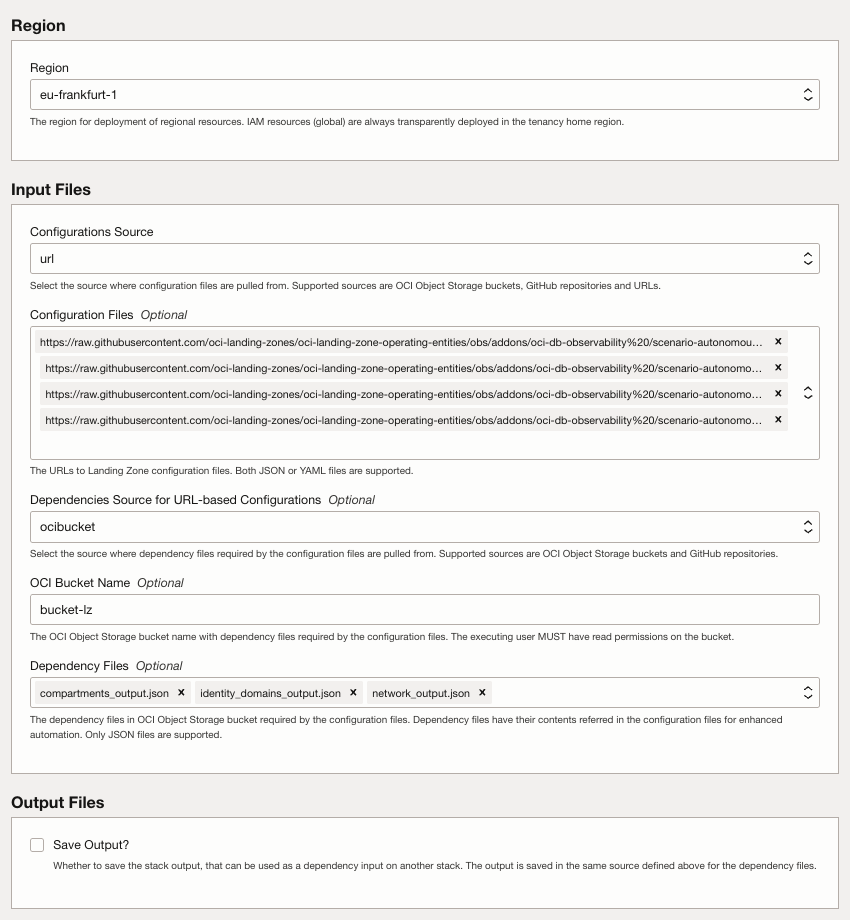

# STEP1. ORM OBS ADD-ON Deployment Steps <!-- omit from toc -->

Follow these steps:

1. From the DBCS scenario README, click the ORM deployment button that matches the selected deployment type: OPTION 1. CENTRALIZED APPROACH or OPTION 2. PROJECT APPROACH. The button opens a new ORM stack with the JSON files for that option preloaded.
2. Accept terms and wait for the configuration to load.
3. Set the working directory to `rms-facade`.
4. Set the stack name you prefer.
5. Set the Terraform version to `1.5.x`. Click Next.
6. ORM will load the required JSON files. This DBCS scenario does not deploy a separate VM for the Logging Analytics agent.
7. Enable Dependencies Source for URL-Based Configuration to ocibucket option.
8. Create a bucket, upload the output/dependency files generated by the base One-OE deployment, and select this bucket.
9. Add the dependency files.



10. Click Next.
11. Uncheck run apply. Click Create.
12. First, execute a plan job to review all the resources that Terraform will create. Once verified, proceed to run the apply job to initiate the deployment.


Note: The add-on creates dedicated Observability Vault and Key resources. To grant the selected monitoring admin group in the common One-OE identity domain access to specific centralized resources, you can optionally modify the vault and key statements in the `pcy-centralized-mon-security-admin` policy by adding a `where` condition. For the project option, the add-on uses the existing project administration groups through the key `group_grantees` in `addon_obs_security_dbcs_project.json`; no separate project security admin IAM policy is emitted.

```
allow group 'id_lz_common'/'<monitoring-admin-group>' to use vaults in compartment <security-compartment-path> where target.vault.id='ocid1.vault.oc1.region.xxxx'
allow group 'id_lz_common'/'<monitoring-admin-group>' to use keys in compartment <security-compartment-path> where target.key.id='ocid1.key.oc1.region.xxx'
```

>[!NOTE] If you add `where` conditions, replace the placeholder OCIDs with your own Vault and Key OCIDs.

13. After making the changes, execute a second plan to review these updates before running the job again.

# License

Copyright (c) 2026 Oracle and/or its affiliates.

Licensed under the Universal Permissive License (UPL), Version 1.0.

See [LICENSE](/LICENSE.txt) for more details.
