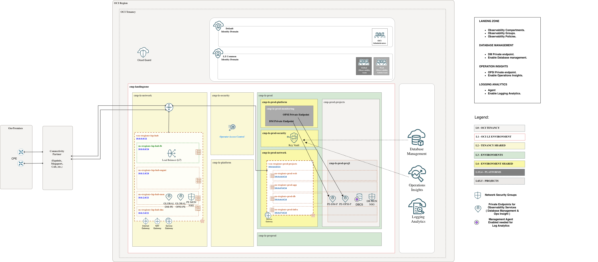

# **[DBCS Databases](#)**
## **An OCI Open LZ add-on to help you enable native Observability services on DBCS databases**

## OCI Native Services Configuration Prerequisites

This scenario documents the DBCS implementation details for the OCI Database Observability add-on. Before continuing, review and finalize the design decisions listed in the general [OCI Database Observability README](../readme.md#3-design-decisions), including the Global PE vs Local PE decision.

### Services covered

This add-on prepares the Landing Zone to enable:

* Database Management
* Ops Insights
* Logging Analytics

### Private endpoint connectivity

Database Management and Ops Insights require service Private Endpoints with network access to the DBCS database subnet and listener. The add-on includes the Network Security Groups (NSGs) required to allow that connectivity.

Use these links to review the relevant OCI documentation:

* [DBM Private Endpoint](https://docs.oracle.com/en-us/iaas/Content/Network/Concepts/privateaccess.htm#private-endpoints)
* [OPSI Private Endpoint](https://docs.oracle.com/en-us/iaas/Content/Network/Concepts/privateaccess.htm#private-endpoints)

> [!WARNING]
> This scenario supports placing the Database Management or Ops Insights Private Endpoint in the same VCN as the DBCS database subnet, or in a different VCN.
>
> Keep the service limit in mind: only one Private Endpoint can be created per VCN.

### Credentials and Vault

Enabling Database Management or Ops Insights for a DBCS database requires a database user and password. These credentials must be stored as secrets in the dedicated Observability Vault provisioned by the selected implementation option. The required policies to access the secret are included in the add-on.

### Management Agent for Logging Analytics

Logging Analytics requires a Management Agent on the monitored DBCS host and the required ingestion policies. This add-on provides the IAM and network prerequisites for that flow, but it does not deploy a separate VM.

&nbsp;

## Implementation

This scenario deploys the required components to enable Database Management, Ops Insights, and Logging Analytics, such as compartments, groups, a dedicated monitoring Vault, policies, and NSGs.
&nbsp;

Follow these steps to extend your One-OE Landing Zone:

**Step 0**. ( prerequisite )

Deploy the One-OE Landing Zone. You can follow these [steps](https://github.com/oci-landing-zones/oci-landing-zone-operating-entities/tree/master/blueprints/one-oe/runtime/one-stack). To work with multiple stacks, you need to use the orchestrator's outputs and dependencies features within [ORM](https://github.com/oci-landing-zones/oci-landing-zone-operating-entities/blob/master/commons/content/orm_bp.md).

**Step 1**.

Deploy the Observability Landing zone add-on:

| GLOBAL | LOCAL |
|---|---|
| Use this deployment when DBM/OPSI private endpoints are shared global endpoints deployed in the hub monitoring subnet. | Use this deployment when DBM/OPSI private endpoints are environment-dedicated and deployed in the same database subnet as the target DBCS database. |
| Creates shared monitoring prerequisites in the hub/global model. See the resource summary below. | Creates environment-dedicated monitoring prerequisites in the local model. See the resource summary below. |
|  |  |
| <a href='https://cloud.oracle.com/resourcemanager/stacks/create?zipUrl=https://github.com/oci-landing-zones/terraform-oci-modules-orchestrator/archive/refs/tags/v2.1.1.zip&zipUrlVariables={"input_config_files_urls":"https://raw.githubusercontent.com/oci-landing-zones/oci-landing-zone-operating-entities/obs/addons/oci-db-observability/scenario-dbcs-databases/addon_obs_iam_dbcs_global.json,https://raw.githubusercontent.com/oci-landing-zones/oci-landing-zone-operating-entities/obs/addons/oci-db-observability/scenario-dbcs-databases/addon_obs_network_dbcs_global.json,https://raw.githubusercontent.com/oci-landing-zones/oci-landing-zone-operating-entities/obs/addons/oci-db-observability/scenario-dbcs-databases/addon_obs_security_dbcs.json"}'></a> | <a href='https://cloud.oracle.com/resourcemanager/stacks/create?zipUrl=https://github.com/oci-landing-zones/terraform-oci-modules-orchestrator/archive/refs/tags/v2.1.1.zip&zipUrlVariables={"input_config_files_urls":"https://raw.githubusercontent.com/oci-landing-zones/oci-landing-zone-operating-entities/obs/addons/oci-db-observability/scenario-dbcs-databases/addon_obs_iam_dbcs_local.json,https://raw.githubusercontent.com/oci-landing-zones/oci-landing-zone-operating-entities/obs/addons/oci-db-observability/scenario-dbcs-databases/addon_obs_network_dbcs_local.json,https://raw.githubusercontent.com/oci-landing-zones/oci-landing-zone-operating-entities/obs/addons/oci-db-observability/scenario-dbcs-databases/addon_obs_security_dbcs.json"}'></a> |
| Files loaded: [addon_obs_iam_dbcs_global.json](addon_obs_iam_dbcs_global.json) [addon_obs_network_dbcs_global.json](addon_obs_network_dbcs_global.json) [addon_obs_security_dbcs.json](addon_obs_security_dbcs.json) | Files loaded: [addon_obs_iam_dbcs_local.json](addon_obs_iam_dbcs_local.json) [addon_obs_network_dbcs_local.json](addon_obs_network_dbcs_local.json) [addon_obs_security_dbcs.json](addon_obs_security_dbcs.json) |

Resources created by the Global option:

- Compartments: `cmp-lz-monitoring`.
- Groups: `grp-lz-global-mon-admins`.
- Policies: `pcy-mon-services`, `pcy-global-mon-admin`, `pcy-mon-dynamic-group`, `pcy-global-mon-security-admin`, `pcy-global-mon-network-admin`, `pcy-prod-proj1-mon-admin`, `pcy-preprod-proj1-mon-admin`.
- COMMON Identity Domain dynamic group: `id_lz_common/dg-lz-mon-dynamic-group`.
- NSGs: `nsg-fra-lz-hub-global-mon-pe`, `nsg-fra-lz-prod-proj1-mon-pe-db1`, `nsg-fra-lz-preprod-proj1-mon-pe-db1`.
- Vault and key: `vlt-lz-shared-mon-security`, `key-lz-mon-bkt`.

Resources created by the Local option:

- Compartments: `cmp-lz-prod-monitoring`, `cmp-lz-preprod-monitoring`.
- Groups: `grp-lz-global-mon-admins`, `grp-lz-prod-mon-admins`, `grp-lz-preprod-mon-admins`.
- Policies: `pcy-mon-services`, `pcy-global-mon-admin`, `pcy-mon-dynamic-group`, `pcy-global-mon-security-admin`, `pcy-global-mon-network-admin`, `pcy-prod-proj1-mon-admin`, `pcy-preprod-proj1-mon-admin`.
- COMMON Identity Domain dynamic group: `id_lz_common/dg-lz-mon-dynamic-group`.
- NSGs: `nsg-fra-lz-prod-proj1-mon-pe-db1`, `nsg-fra-lz-preprod-proj1-mon-pe-db1`.
- Vault and key: `vlt-lz-shared-mon-security`, `key-lz-mon-bkt`.

For step-by-step instructions, see [Implementation add-on steps](./Implementation_addon_steps.md).

**Step 2**.

Follow the remaining service-specific [steps to enable Database Management, Ops Insights, and Logging Analytics](steps_to_enable_observability_dbcs.md).

The resources created in Step 1 are listed in the table and resource summary above. Step 2 covers only the remaining manual service-onboarding actions, including creating the database monitoring user, storing its password as a secret, creating the service private endpoints, enabling DBM/OPSI for the target databases, and completing Logging Analytics onboarding on the DBCS hosts.

&nbsp;

# License

Copyright (c) 2026 Oracle and/or its affiliates.

Licensed under the Universal Permissive License (UPL), Version 1.0.

See [LICENSE](/LICENSE.txt) for more details.
