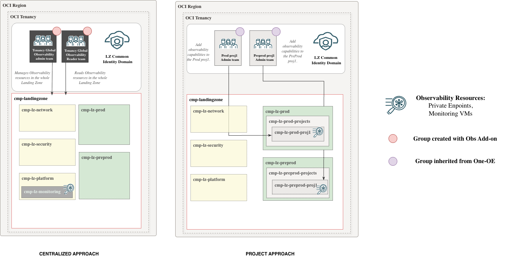

# **[DBCS Databases](#)**
## **An OCI Open LZ add-on to help you enable native Observability services on DBCS databases**

## OCI Native Services Configuration Prerequisites

This scenario documents the DBCS implementation details for the OCI Database Observability add-on. Before continuing, review and finalize the design decisions listed in the general [OCI Database Observability README](../readme.md#3-design-decisions), including the Centralized vs Project private endpoint placement decision.

### Services covered

This add-on prepares the One-OE Landing Zone to enable the following OCI Observability services for DBCS databases:

* Database Management
* Ops Insights
* Logging Analytics

## Implementation

This scenario deploys the required components to enable Database Management, Ops Insights, and Logging Analytics, such as compartments, groups, dedicated Observability Vault resources, policies, and NSGs.
&nbsp;

Follow these steps to extend your One-OE Landing Zone:

**Step 0**. ( prerequisite )

Deploy the One-OE Landing Zone. You can follow these [steps](https://github.com/oci-landing-zones/oci-landing-zone-operating-entities/tree/master/blueprints/one-oe/runtime/one-stack). To work with multiple stacks, you need to use the orchestrator's outputs and dependencies features within [ORM](https://github.com/oci-landing-zones/oci-landing-zone-operating-entities/blob/master/commons/content/orm_bp.md).

**Step 1**.

Deploy the Observability Landing Zone add-on. Choose the option that best fits your needs. The recommended option is Option 1.

<table>
  <thead>
    <tr>
      <th>OPTION 1. CENTRALIZED APPROACH (RECOMMENDED)</th>
      <th>OPTION 2. PROJECT APPROACH</th>
    </tr>
  </thead>
  <tbody>
    <tr>
      <td align="center"></td>
      <td align="center"></td>
    </tr>
    <tr>
      <td>
        <ul>
          <li>Use this deployment when DBM/OPSI private endpoints are shared centralized endpoints to be created in the hub monitoring subnet.</li>
          <li>One centralized observability team manages DBM, OPSI, Logging Analytics, and shared monitoring resources for all DBCS databases.</li>
          <li>Logging Analytics requires a Management Agent on each monitored DBCS host and the required ingestion policies. This add-on provides the IAM and network prerequisites for that flow, but it does not deploy a separate VM.</li>
          <li>Enabling Database Management or Ops Insights for a DBCS database requires a database user and password. These credentials must be stored as secrets in the centralized Observability Vault <code>vlt-lz-shared-mon-security</code>, created in <code>cmp-landingzone:cmp-lz-security</code> by the CENTRALIZED implementation option. The required policies to access the secret are included in the add-on.</li>
        </ul>
      </td>
      <td>
        <ul>
          <li>Use this deployment when DBM/OPSI private endpoints are project-dedicated endpoints to be created in the same database subnet as the target DBCS database.</li>
          <li>Project-specific observability teams manage DBM, OPSI, Logging Analytics, and project monitoring resources for their own DBCS databases.</li>
          <li>Logging Analytics requires a Management Agent on each monitored DBCS host and the required ingestion policies. This add-on provides the IAM and network prerequisites for that flow, but it does not deploy a separate VM.</li>
          <li>Enabling Database Management or Ops Insights for a DBCS database requires a database user and password. These credentials must be stored as secrets in the project Observability Vault for the target environment: <code>vlt-lz-prod-mon-security</code> in <code>cmp-lz-prod-security</code> or <code>vlt-lz-preprod-mon-security</code> in <code>cmp-lz-preprod-security</code>. The required policies to access the secrets are included in the add-on.</li>
        </ul>
      </td>
    </tr>
    <tr>
      <td><strong>Resources created</strong></td>
      <td><strong>Resources created</strong></td>
    </tr>
    <tr>
      <td><strong>Compartments:</strong> <code>cmp-lz-monitoring</code>.</td>
      <td><strong>Compartments:</strong> none; uses the existing project compartments <code>cmp-lz-prod-proj1</code> and <code>cmp-lz-preprod-proj1</code> for project-dedicated DBM/OPSI private endpoints.</td>
    </tr>
    <tr>
      <td><strong>Groups:</strong> <code>grp-lz-global-mon-admin</code>, <code>grp-lz-global-mon-reader</code>.</td>
      <td><strong>Groups:</strong> none; uses the existing project administration groups <code>grp-lz-prod-proj1-admin</code> and <code>grp-lz-preprod-proj1-admin</code>.</td>
    </tr>
    <tr>
      <td colspan="2" align="center"></td>
    </tr>
    <tr>
      <td><strong>Policies:</strong> <code>pcy-mon-services</code>, <code>pcy-centralized-mon-admin</code>, <code>pcy-centralized-mon-readers</code>, <code>pcy-mon-dynamic-group</code>, <code>pcy-centralized-mon-security-admin</code>, <code>pcy-centralized-mon-security-readers</code>, <code>pcy-centralized-mon-network-admin</code>, <code>pcy-centralized-mon-network-readers</code>, <code>pcy-prod-proj1-mon-admin</code>, <code>pcy-prod-proj1-mon-readers</code>, <code>pcy-preprod-proj1-mon-admin</code>, <code>pcy-preprod-proj1-mon-readers</code>.</td>
      <td><strong>Policies:</strong> <code>pcy-mon-services</code>, <code>pcy-mon-dynamic-group</code>, <code>pcy-prod-proj1-mon-admin</code>, <code>pcy-preprod-proj1-mon-admin</code>.</td>
    </tr>
    <tr>
      <td><strong>COMMON Identity Domain dynamic group:</strong> <code>id_lz_common/dg-lz-mon-dynamic-group</code>.</td>
      <td><strong>COMMON Identity Domain dynamic group:</strong> <code>id_lz_common/dg-lz-mon-dynamic-group</code>.</td>
    </tr>
    <tr>
      <td><strong>NSGs:</strong> <code>nsg-fra-lz-hub-cen-mon-pe</code>, <code>nsg-fra-lz-prod-proj1-mon-pe-db1</code>, <code>nsg-fra-lz-preprod-proj1-mon-pe-db1</code>.</td>
      <td><strong>NSGs:</strong> <code>nsg-fra-lz-prod-proj1-mon-pe-db1</code>, <code>nsg-fra-lz-preprod-proj1-mon-pe-db1</code>.</td>
    </tr>
    <tr>
      <td><strong>NSG egress behavior:</strong> egress is intentionally left open to <code>0.0.0.0/0</code> for DBM/OPSI private endpoint connectivity. The centralized hub PE NSG uses all protocols, and the project DB-side NSGs use TCP.</td>
      <td><strong>NSG egress behavior:</strong> egress is intentionally left open to <code>0.0.0.0/0</code> over TCP for project-dedicated DBM/OPSI private endpoint connectivity.</td>
    </tr>
    <tr>
      <td><strong>Vault and key:</strong> <code>vlt-lz-shared-mon-security</code>, <code>key-lz-mon-bkt</code>.</td>
      <td><strong>Vaults and keys:</strong> <code>vlt-lz-prod-mon-security</code> / <code>key-lz-prod-mon-bkt</code> in <code>cmp-lz-prod-security</code>, and <code>vlt-lz-preprod-mon-security</code> / <code>key-lz-preprod-mon-bkt</code> in <code>cmp-lz-preprod-security</code>.</td>
    </tr>
    <tr>
      <td><strong>Monitoring instance:</strong> none; Logging Analytics uses a Management Agent installed on the monitored DBCS hosts.</td>
      <td><strong>Monitoring instances:</strong> none; Logging Analytics uses a Management Agent installed on the monitored DBCS hosts.</td>
    </tr>
    <tr>
      <td>Files loaded: <a href="addon_obs_iam_dbcs_centralized.json">addon_obs_iam_dbcs_centralized.json</a> <a href="addon_obs_network_dbcs_centralized.json">addon_obs_network_dbcs_centralized.json</a> <a href="addon_obs_security_dbcs_centralized.json">addon_obs_security_dbcs_centralized.json</a></td>
      <td>Files loaded: <a href="addon_obs_iam_dbcs_project.json">addon_obs_iam_dbcs_project.json</a> <a href="addon_obs_network_dbcs_project.json">addon_obs_network_dbcs_project.json</a> <a href="addon_obs_security_dbcs_project.json">addon_obs_security_dbcs_project.json</a></td>
    </tr>
    <tr>
      <td>ORM deployment: <a href='https://cloud.oracle.com/resourcemanager/stacks/create?zipUrl=https://github.com/oci-landing-zones/terraform-oci-modules-orchestrator/archive/refs/tags/v2.1.1.zip&zipUrlVariables={"input_config_files_urls":"https://raw.githubusercontent.com/oci-landing-zones/oci-landing-zone-operating-entities/obs/addons/oci-db-observability/scenario-dbcs-databases/addon_obs_iam_dbcs_centralized.json,https://raw.githubusercontent.com/oci-landing-zones/oci-landing-zone-operating-entities/obs/addons/oci-db-observability/scenario-dbcs-databases/addon_obs_network_dbcs_centralized.json,https://raw.githubusercontent.com/oci-landing-zones/oci-landing-zone-operating-entities/obs/addons/oci-db-observability/scenario-dbcs-databases/addon_obs_security_dbcs_centralized.json"}'></a></td>
      <td>ORM deployment: <a href='https://cloud.oracle.com/resourcemanager/stacks/create?zipUrl=https://github.com/oci-landing-zones/terraform-oci-modules-orchestrator/archive/refs/tags/v2.1.1.zip&zipUrlVariables={"input_config_files_urls":"https://raw.githubusercontent.com/oci-landing-zones/oci-landing-zone-operating-entities/obs/addons/oci-db-observability/scenario-dbcs-databases/addon_obs_iam_dbcs_project.json,https://raw.githubusercontent.com/oci-landing-zones/oci-landing-zone-operating-entities/obs/addons/oci-db-observability/scenario-dbcs-databases/addon_obs_network_dbcs_project.json,https://raw.githubusercontent.com/oci-landing-zones/oci-landing-zone-operating-entities/obs/addons/oci-db-observability/scenario-dbcs-databases/addon_obs_security_dbcs_project.json"}'></a></td>
    </tr>
  </tbody>
</table>

Click the Deploy to OCI button and follow step-by-step instructions in [Implementation add-on steps](https://github.com/oci-landing-zones/oci-landing-zone-operating-entities/blob/obs/addons/oci-db-observability/scenario-dbcs-databases/Implementation_addon_steps.md).

**Step 2**.

Now that we have all required resources, we can continue with the remaining manual service-onboarding actions, including creating the database monitoring user, storing its password as a secret, creating the service private endpoints, enabling DBM/OPSI for the target databases, and completing Logging Analytics onboarding on the DBCS hosts. Follow these [steps to enable Database Management, Ops Insights, and Logging Analytics](https://github.com/oci-landing-zones/oci-landing-zone-operating-entities/blob/obs/addons/oci-db-observability/scenario-dbcs-databases/steps_to_enable_observability_dbcs.md).

&nbsp;

# Reference Links

Use these links to review the relevant OCI documentation:

* [DBM Private Endpoint](https://docs.oracle.com/en-us/iaas/Content/Network/Concepts/privateaccess.htm#private-endpoints)
* [OPSI Private Endpoint](https://docs.oracle.com/en-us/iaas/Content/Network/Concepts/privateaccess.htm#private-endpoints)

> [!WARNING]
> This scenario supports placing the Database Management or Ops Insights Private Endpoint in the same VCN as the DBCS database subnet, or in a different VCN.
>
> Keep the service limit in mind: only one Private Endpoint can be created per VCN.

# License

Copyright (c) 2026 Oracle and/or its affiliates.

Licensed under the Universal Permissive License (UPL), Version 1.0.

See [LICENSE](/LICENSE.txt) for more details.
