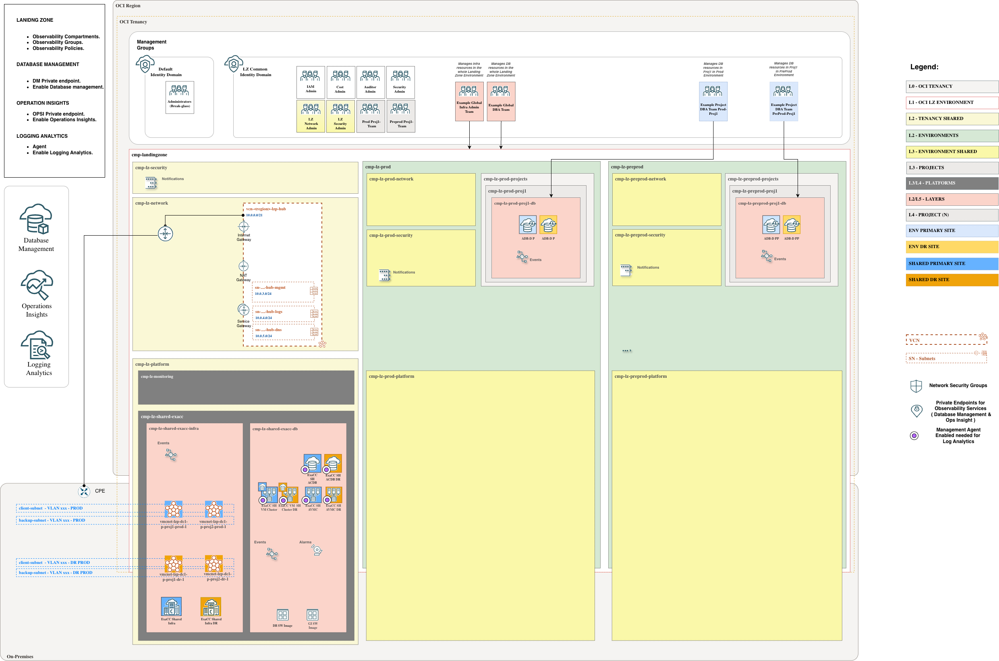

# **[ExaDB-C@C Databases](#)**
## **An OCI Open LZ add-on to help you enable native Observability services on ExaDB-C@C databases**

## OCI Native Services Configuration Prerequisites

This scenario documents the ExaDB-C@C implementation details for the OCI Database Observability add-on. Before continuing, review the design decisions listed in the general [OCI Database Observability README](../readme.md#3-design-decisions). This ExaDB-C@C scenario follows the Management Gateway and Management Agent approach described in the ExaDB-C@C observability steps.

### Services covered

This add-on prepares the Landing Zone to enable:

* Database Management
* Ops Insights
* Logging Analytics

### Management Gateway and Agent connectivity

Database Management, Ops Insights, and Logging Analytics for ExaDB-C@C use the Management Agent running on the VM Cluster nodes. If direct connectivity from the ExaDB-C@C servers to OCI service endpoints is not preferred, use an OCI Management Gateway.

The add-on does not create VCNs, subnets, NSGs, or DBM/OPSI service Private Endpoints for this scenario.

Use these links to review the relevant OCI documentation:

* [Management Gateway](https://docs.oracle.com/en-us/iaas/management-agents/doc/management-gateway.html)
* [Management Agent](https://docs.oracle.com/en-us/iaas/management-agents/doc/you-begin.html)

### Credentials and Vault

Enabling Database Management or Ops Insights for an ExaDB-C@C database requires a database user and password. These credentials must be stored as secrets in the dedicated Observability Vault provisioned by the CENTRALIZED implementation. The required policies to access the secret are included in the add-on.

### Management Agent for Logging Analytics

Logging Analytics requires a Management Agent on the monitored ExaDB-C@C VM Cluster database hosts and the required ingestion policies. This add-on provides the IAM prerequisites for that flow, but it does not deploy a separate VM.

&nbsp;

## Implementation

This scenario deploys the required components to enable Database Management, Ops Insights, and Logging Analytics, such as compartments, groups, a dedicated monitoring Vault, and policies.
&nbsp;

Follow these steps to extend your One-OE Landing Zone:

**Step 0**. ( prerequisite )

Deploy the One-OE + ExaDB-C@C use case 1 in single stack. You can follow these [steps](https://github.com/oci-landing-zones/oci-landing-zone-operating-entities/tree/master/workload-extensions/exacc/single-stack). To work with multiple stacks, you need to use the orchestrator's outputs and dependencies features within [ORM](https://github.com/oci-landing-zones/oci-landing-zone-operating-entities/blob/master/commons/content/orm_bp.md).

**Step 1**.

Deploy the Observability Landing zone add-on:

| CENTRALIZED |
|---|
| Use this deployment when ExaDB-C@C observability is enabled through Management Agent, with optional Management Gateway connectivity to OCI endpoints. |
| Resources created:  Compartments: `cmp-lz-monitoring`.  Groups: `grp-lz-centralized-mon-admin`.  Policies: `pcy-mon-services`, `pcy-centralized-mon-admin`, `pcy-mon-dynamic-group`, `pcy-mon-agent-cert-dynamic-group`, `pcy-centralized-mon-security-admin`, `pcy-shared-exacc-mon-admin`.  COMMON Identity Domain dynamic groups: `id_lz_common/dg-lz-mon-dynamic-group`, `id_lz_common/dg-lz-mon-credential-dynamic-group`.  Vault and key: `vlt-lz-shared-mon-security`, `key-lz-mon-bkt`. |
|  |
| <a href='https://cloud.oracle.com/resourcemanager/stacks/create?zipUrl=https://github.com/oci-landing-zones/terraform-oci-modules-orchestrator/archive/refs/tags/v2.1.1.zip&zipUrlVariables={"input_config_files_urls":"https://raw.githubusercontent.com/oci-landing-zones/oci-landing-zone-operating-entities/obs/addons/oci-db-observability/scenario-exacc-databases/addon_obs_iam_exacc_centralized.json,https://raw.githubusercontent.com/oci-landing-zones/oci-landing-zone-operating-entities/obs/addons/oci-db-observability/scenario-exacc-databases/addon_obs_security_exacc.json"}'></a> |
| Files loaded: [addon_obs_iam_exacc_centralized.json](addon_obs_iam_exacc_centralized.json) [addon_obs_security_exacc.json](addon_obs_security_exacc.json) |

For step-by-step instructions, see [Implementation add-on steps](./Implementation_addon_steps.md).

**Step 2**.

Follow the remaining service-specific [steps to enable Database Management, Ops Insights, and Logging Analytics](steps_to_enable_observability.md).

The resources created in Step 1 are listed in the table above. Step 2 covers only the remaining manual service-onboarding actions, including Management Gateway or direct endpoint connectivity decisions, Management Agent installation, creating the database monitoring user, storing its password as a secret, enabling DBM/OPSI for the target databases, and completing Logging Analytics onboarding on the ExaDB-C@C VM Cluster database hosts.

&nbsp;

# License

Copyright (c) 2026 Oracle and/or its affiliates.

Licensed under the Universal Permissive License (UPL), Version 1.0.

See [LICENSE](/LICENSE.txt) for more details.
