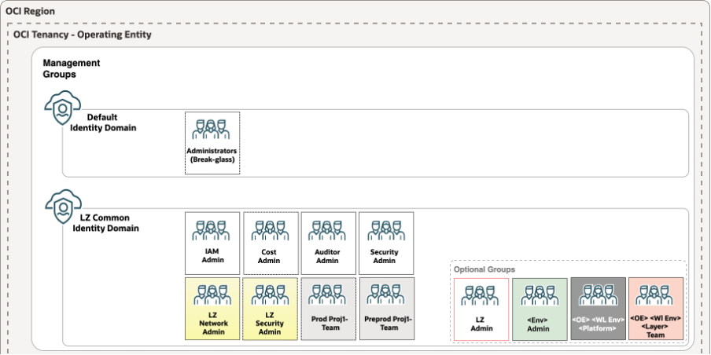

# **[OCI Identity Domains](#)**
## **An OCI Open LZ [Addon](#) for Identity Domain Design**

&nbsp;

**Table of Contents**

[1. Overview](#1-overview)<br>
[2. Blueprint Mapping](#2-blueprint-mapping)<br>
[3. Domain Design](#3-domain-design)<br>
[3.1. Common Domain](#31-common-domain)<br>
[3.2. Environment Domains](#32-environment-domains)<br>
[3.3. Region Domains](#33-region-domains)<br>
[3.4. Operating Entities Domains](#34-operating-entities-domains)<br>

&nbsp;

## 1. Overview

Welcome to the **OCI Identity Domains** guide.

When designing an OCI tenancy landing zone, it is essential to establish a well-defined IAM (Identity and Access Management) security model from the outset. The IAM design forms the foundation of governance, security, and resource management within the environment. Key considerations include the tenancy structure, identity domains, compartment hierarchy, IAM policies, and access control strategy.
OCI provides built-in resource isolation and governance capabilities through several foundational constructs:

- **Tenancy**: The highest-level security and administrative boundary that contains all OCI resources.
- **Identity Domains**: Logical containers for users, groups, applications, and identity-related configurations, providing authentication and authorization boundaries.
- **Compartments**: Logical partitions used to organize resources, delegate administration, and enforce access controls.
- **IAM Policies**: Policy statements that define who can access which resources and what actions they can perform.

A well-designed tenancy landing zone should include the design of these constructs.
In this add-on, we will focus specifically on the design of the **Identity Domains**

&nbsp;
## 2. Blueprint Mapping

|Identity Domain Pattern|One-OE|Multi-OE|
|---|---|---|
|[Common Domain](#31-common-domain)|✅|✅|
|[Environment Domains](#32-environment-domains)|✅|✅|
|[Region Domains](#33-region-domains)|✅|✅|
|[Operating Entity Domains](#34-operating-entities-domains)|❌|✅|

&nbsp;
## 3. Domain Design

Following best practice, the default Identity Domain should be reserved exclusively for break-glass accounts used for emergency access. All other users, groups, and access management functions should be managed within separate Identity Domains.

&nbsp;

### 3.1. Common Domain

In this design a single dedicated Common Identity Domain is created to host shared groups and related identity management resources.
Both the One-OE and Multi-OE landing zone blueprints have this as the default Identity Domain design.

<p align="center">
  
</p>

#### IAM Domain Syntax for Common Domain
```text
"identity_domains_configuration": {
    "default_compartment_id"                               : null,
    "default_defined_tags"                                 : null,
    "default_freeform_tags"                                : null,

    "identity_domains": {
        "COMMON-DOMAIN": {
            "display_name"                                 : "id_lz_common",
            "description"                                  : "One-OE LZ common Identity Domain",
            "compartment_id"                               : null,
            "admin_email"                                  : null,
            "admin_first_name"                             : null,
            "admin_last_name"                              : null,
            "admin_user_name"                              : null,
            "allow_signing_cert_public_access"             : false,
            "home_region"                                  : null,
            "is_hidden_on_login"                           : false,
            "is_notification_bypassed"                     : false,
            "is_primary_email_required"                    : false,
            "license_type"                                 : "free",
            "replica_region"                               : null
        }
    }
}
```

&nbsp;

### 3.2. Environment Domains

In this design pattern there is a separate Identity Domain for each environment, for example:
- Production
- Pre-Production
- Test
- Development

The purpose of this is to provide separation of the users and groups who can access the resources in each environment. For example, a user existing only in the Pre-Production domain would not be able to access any resources in the Production domain.

#### IAM Domain Syntax for Environment Domain
```text
"identity_domains_configuration": {
    "default_compartment_id"                               : null,
    "default_defined_tags"                                 : null,
    "default_freeform_tags"                                : null,

    "identity_domains": {
        "PROD-DOMAIN": {
            "display_name"                                 : "id_lz_prod",
            "description"                                  : "One-OE LZ Production Identity Domain",
            "compartment_id"                               : null,
            "admin_email"                                  : null,
            "admin_first_name"                             : null,
            "admin_last_name"                              : null,
            "admin_user_name"                              : null,
            "allow_signing_cert_public_access"             : false,
            "home_region"                                  : null,
            "is_hidden_on_login"                           : false,
            "is_notification_bypassed"                     : false,
            "is_primary_email_required"                    : false,
            "license_type"                                 : "free",
            "replica_region"                               : null
        }
    }
}
```
&nbsp;

### 3.3. Region Domains

In this design pattern there is a separate Identity Domain for each region, for example:
- EU (Frankfurt)
- UK (London)
- US (Ashburn)

The purpose of this is to provide separation of the users and groups who can access the resources in each region. For example, a user existing only in the EU domain would not be able to access any resources in the UK or US domains.
Note that only the Default Identity Domain is automatically replicated from the Home region to all the subscribed regions. When creating additional domains which are required outside the Home region they have to be explicitly synchronized/replicated to that region.

#### IAM Domain Syntax for Environment Domain
```text
"identity_domains_configuration": {
    "default_compartment_id"                               : null,
    "default_defined_tags"                                 : null,
    "default_freeform_tags"                                : null,

    "identity_domains": {
        "UK-DOMAIN": {
            "display_name"                                 : "id_lz_uk",
            "description"                                  : "One-OE LZ UK Region Identity Domain",
            "compartment_id"                               : null,
            "admin_email"                                  : null,
            "admin_first_name"                             : null,
            "admin_last_name"                              : null,
            "admin_user_name"                              : null,
            "allow_signing_cert_public_access"             : false,
            "home_region"                                  : null,
            "is_hidden_on_login"                           : false,
            "is_notification_bypassed"                     : false,
            "is_primary_email_required"                    : false,
            "license_type"                                 : "free",
            "replica_region"                               : "uk-london-1"
        }
    }
}
```
> [!NOTE]
> The Domain synchronization from the home region to the subscribed region is specified in above configuration with the "replica_region"

&nbsp;

### 3.4. Operating Entities Domains

An Operating Entity is how a company can segregate it’s resources into organization units. For example:
- LoBs
- OpCos
- Departments
- Products
- Brands
- Partners

The Multi-OE blueprint allows this segregation within a single tenancy using the compartment design.
However, it could also be a requirement for further separation of the resources through use of an Identity Domain for each Operating Entity.

```text
"identity_domains_configuration": {
    "default_compartment_id"                               : null,
    "default_defined_tags"                                 : null,
    "default_freeform_tags"                                : null,

    "identity_domains": {
        "OE01-DOMAIN": {
            "display_name"                                 : "id_lz_oe01",
            "description"                                  : "Multi-OE LZ OE01 Identity Domain",
            "compartment_id"                               : null,
            "admin_email"                                  : null,
            "admin_first_name"                             : null,
            "admin_last_name"                              : null,
            "admin_user_name"                              : null,
            "allow_signing_cert_public_access"             : false,
            "home_region"                                  : null,
            "is_hidden_on_login"                           : false,
            "is_notification_bypassed"                     : false,
            "is_primary_email_required"                    : false,
            "license_type"                                 : "free",
            "replica_region"                               : null
        }
    }
}
```
&nbsp;

#### License

Copyright (c) 2026 Oracle and/or its affiliates.

Licensed under the Universal Permissive License (UPL), Version 1.0.

See [LICENSE](../../LICENSE.txt) for more details.
