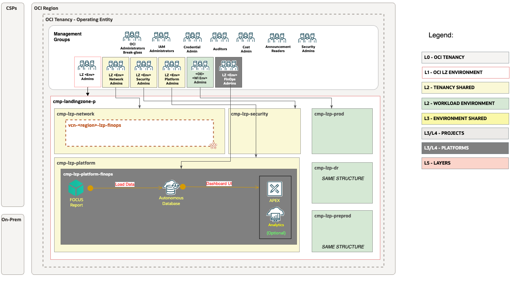

# **[OCI FinOps Solution](#)**
## **An OCI Open LZ [Addon](#) that enables cost governance, visibility, and optimization through the FinOps solution**
&nbsp;

**Table of Contents**  
[1. Overview](#1-overview) 
[2. OCI FinOps Addon Architecture](#2-oci-finops-addon-architecture) 
[3. Resources](#3-resources) 
[4. Deployment Guide](#4-deployment-guide) 
[5. Summary](#5-summary) 

&nbsp;

### 1. Overview

The **OCI FinOps Solution** is an addon to the OCI Landing Zones Framework. It enhances cost governance and financial visibility for Operating Entities by integrating **OCI FOCUS reports** directly with an **Autonomous Database and an optional dashboard** for insightful cost analysis.

The solution describes the end-to-end workflow by securely fetching FOCUS reports into an Autonomous Database, enabling visualization through a user-defined interface using the tooling of your choice.

> **What is FinOps?**  
> FinOps is an operational framework and cultural practice which maximizes the business value of cloud and technology, enables timely data-driven decision making, and creates financial accountability through collaboration between engineering, finance, and business teams.

> **Why another solution?**  
> While OCI provides native Cost Analysis, this addon supports scenarios such as **multi‑cloud cost aggregation**, **external stakeholder access**, **custom reporting**, and **long‑term cost data retention** for compliance and historical analysis.

&nbsp;

### 2. OCI FinOps Addon Architecture

### 3. Resources

| **Resource**              | **Description** |
|---------------------------|------------------|
| **IAM Group**             | The FinOps admin group that holds the permissions to operate and manage the FinOps platform. |
| **IAM Policies**          | Includes user policies to manage the FinOps platform and **resource principal** permissions that allow ADB to fetch FOCUS reports, all in a controlled and auditable way. |
| **Autonomous Database (ADB)** | Central data store for the FinOps platform. Provisioned with a **private endpoint** inside the VCN, it directly ingests FOCUS reports and powers the visualization layer. |
| **UI Dashboard**          | Presents FinOps insights on top of ADB. You can build the UI with **Oracle APEX**, **Oracle Analytics Cloud**, or another BI tool of your choice. |
| **VCN & Subnets**         | A dedicated **Virtual Cloud Network** with private subnets to host ADB and related components in an isolated, secure manner, keeping traffic off the public internet. |

&nbsp;

### 4. Deployment Guide

To get started with the OCI FinOps addon, it is recommended to start with an Oracle-supported Foundational Landing Zone such as a [CIS landing zone](https://github.com/oci-landing-zones/oci-cis-landingzone-quickstart), [OCI Core Landing Zone](https://github.com/oci-landing-zones/terraform-oci-core-landingzone) or [OCI Operating Entities Landing Zone](https://github.com/oci-landing-zones/oci-landing-zone-operating-entities/tree/master/blueprints/).  

**Follow the step-by-step instructions** in the [`finops-setup`](finops-setup) guide to deploy the FinOps Solution on top of **One-OE Landing Zone**. 

&nbsp;

### 5. Summary

This addon enhances the [OCI One-OE Landing Zone](https://github.com/oci-landing-zones/oci-landing-zone-operating-entities/tree/master/blueprints/one-oe/runtime/one-stack) with a streamlined FinOps platform that delivers cost governance, financial visibility, and analysis capabilities. It automates the secure ingestion of FOCUS reports directly into an Autonomous Database using resource principal. Users can then build dashboards using tools of their choice, such as Oracle APEX, Analytics Cloud, or other BI solutions, to visualize and analyze the data. The solution provides centralized cost insights without requiring OCI Console access, enabling broader reporting flexibility and operational transparency across cloud environments.

&nbsp;

#### License
Copyright (c) 2025 Oracle and/or its affiliates.

Licensed under the Universal Permissive License (UPL), Version 1.0.

See [LICENSE](/LICENSE.txt) for more details.
