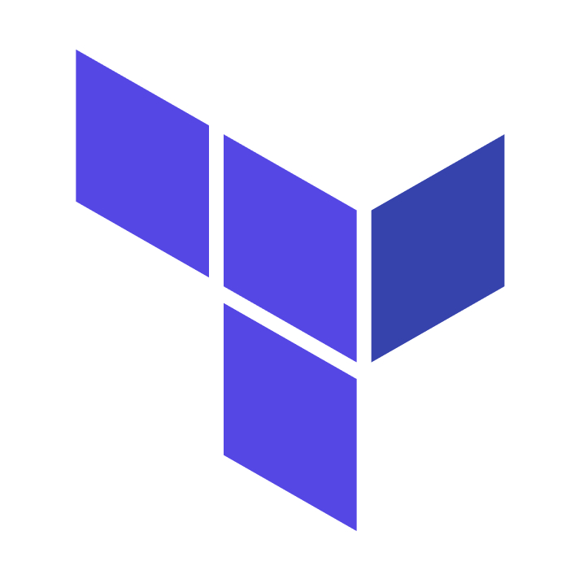
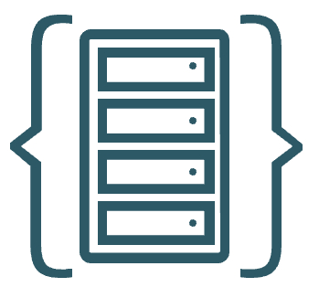

# OCI FinOps Setup Guide

## Prerequisite

To deploy the OCI FinOps addon, it is recommended to start with an Oracle recommended Foundational Landing Zone such as a [CIS landing zone](https://github.com/oci-landing-zones/oci-cis-landingzone-quickstart), [OCI Core Landing Zone](https://github.com/oci-landing-zones/terraform-oci-core-landingzone) or [OCI Operating Entities Landing Zone](https://github.com/oci-landing-zones/oci-landing-zone-operating-entities/tree/master/blueprints/).  

&nbsp;

## Step 1: Setup One-OE Landing Zone with FinOps Platform

Follow the deployment sheet below to setup the FinOps platform in your tenancy on top of the [**One-OE Landing Zone**](https://github.com/oci-landing-zones/oci-landing-zone-operating-entities/tree/master/blueprints/one-oe/runtime/one-stack) blueprint with IaC declarations.  This will not provision the ADB, but this is a reusable operation you can use to setup the FinOps platform in **any** Operating Entities Landing Zone blueprint.

| |  |
|---|---| 
| **OPERATION** | **FinOps Platform Deployment** | 
| **TARGET RESOURCES**    |  This operation provisions the foundational FinOps platform resources including IAM group, policies, compartment, and networking **without** Autonomous Database. | 
| **INPUT CONFIGURATIONS**   &nbsp; +&nbsp; | [**IAM Configuration**](finops_iam.auto.tfvars.json) as input to the [OCI Landing Zone IAM](https://github.com/oracle-quickstart/terraform-oci-cis-landing-zone-iam) module.  [**Network Configuration**](finops_network.auto.tfvars.json) as input to the [OCI Landing Zone Network](https://github.com/oci-landing-zones/terraform-oci-modules-networking) module.   | 
| **DEPLOY WITH ORM**  *- STEP #1*   |  [](https://cloud.oracle.com/resourcemanager/stacks/create?zipUrl=https://github.com/oci-landing-zones/terraform-oci-modules-orchestrator/archive/refs/tags/v2.0.5.zip&zipUrlVariables={"input_config_files_urls":"https://raw.githubusercontent.com/oci-landing-zones/oci-landing-zone-operating-entities/master/addons/oci-finops/finops-setup/finops_iam.auto.tfvars.json,https://raw.githubusercontent.com/oci-landing-zones/oci-landing-zone-operating-entities/master/addons/oci-finops/finops-setup/finops_network.auto.tfvars.json"})     And follow these steps:  **a**. Accept terms,  wait for the configuration to load.   **b**. Set the working directory to “rms-facade”.   **c**. Set the stack name you prefer.  **d**. Set the terraform version to 1.5.x. Click Next.   **e**. Accept the default files. Click Next. Optionally, replace with your json/yaml config files.   **f**. Un-check run apply. Click Create.     |

> [!NOTE]  
> If you already have an existing **Operating Entities Landing Zone** in place, refer to the following input configuration templates and update your own configurations accordingly to align with your OCI IAM and network topology:  
> - [`finops_iam.auto.tfvars.json`](./finops_iam.auto.tfvars.json)  
> - [`finops_network.auto.tfvars.json`](./finops_network.auto.tfvars.json)   
> These files define the required IAM and networking components for the FinOps addon. If you wish to create a seperate stack for FinOps platform deployment, Consider the deployed Landing Zone compartment output and Dependencies Source. 
> Dynamic groups matching rules have associated OCIDs that cannot be referenced using the KEY identifier. After the first apply job, you need to update the **CMP-LZP-PLATFORM-FINOPS-KEY** attributes with the correct **OCID**, and then run a second apply job.

> [!IMPORTANT]  
> The [`finops_network.auto.tfvars.json`](./finops_network.auto.tfvars.json) file is designed for the **Hub-and-Spoke (HUB-E)** network model.  
> For alternative network architectures, refer to the [HUB firewall models documentation](https://github.com/oci-landing-zones/oci-landing-zone-operating-entities/tree/master/addons/oci-hub-models).

&nbsp;

## Step 2: Create Autonomous Database
Please choose a strong ADMIN password for the Autonomous Data Warehouse (ADW) and store it securely in an OCI Secret.

Refer to the [official documentation](https://docs.oracle.com/en-us/iaas/finops-setup/KeyManagement/Tasks/managingsecrets_topic-To_create_a_new_secret.htm) for steps to create a secret in OCI.

Storing the password as a secret is **recommended** when using the provided Terraform script, as it helps avoid exposing credentials in the Terraform state file.

You can run the Terraform script directly using **OCI Cloud Shell** for convenience and security.

- **Using Terraform**  
Use the example [Terraform script](/addons/oci-finops/finops-setup/terraform/) provided in this repository to deploy the Autonomous Data Warehouse (ADW).  
Refer the [ADB documentation](https://docs.oracle.com/en/cloud/paas/autonomous-database/index.html) for more details.

- **Using the OCI Console**  
Alternatively, you can manually create the Autonomous Database through the OCI Console.  
Refer the [OCI documentation](https://docs.oracle.com/en-us/iaas/autonomous-database-serverless/doc/autonomous-provision.html) for step-by-step instructions.

> [!NOTE]
> When deploying the Autonomous Database, use the **compartment**, **VCN**, **subnet**, and **NSG** resources that were created as part of your Landing Zone setup for FinOps.  
> The required **Dynamic Group** and **Resource Principal policies** for ADB access are already in place and included in the Landing Zone IAM configuration.  
> Ensure you reuse those instead of creating new ones.

## Step 3: Connect to ADW and Run SQL Scripts
### Step 3.1: Connect to ADW
Connect to the ADW using [SQL worksheet](https://docs.oracle.com/en-us/iaas/database-tools/doc/run-sql-statement-sql-worksheet.html) available in OCI  or other SQL client tools.

### Step 3.2: Run SQL Scripts as ADMIN User
[Resource Principal](https://docs.oracle.com/en/cloud/paas/autonomous-database/serverless/adbsb/resource-principal.html) is used to give access for the autonomous database. 

Run the following SQL scripts [admin.sql](/addons/oci-finops/finops-setup/sql/admin.sql) using the ADMIN user.

### Step 3.3: Run SQL Scripts as FINOPS User

Run the SQL scripts provided in [finopsuser.sql](/addons/oci-finops/finops-setup/sql/finopsuser.sql) using the newly created FINOPS user:

[DBMS_CLOUD_PIPELINE](https://docs.oracle.com/en/cloud/paas/autonomous-database/serverless/adbsb/autonomous-pipeline.html) is used to load data from objectstorage into the autonomous database. 

> [!NOTE]
> Replace the objectstorage url with your region objectstorage URL ,tenancy ocid and year in the placeholder in line number 71 for the set_attribute. 

This is used to ingest all the previous and upcoming FOCUS reports of your tenancy into ADW for that year. If you have more old files to load scale the ADW so the pipeline will run faster for the initial load and you can scale it down later.

Example: "https://objectstorage.eu-frankfurt-1.oraclecloud.com/n/bling/b/ocid1.tenancy.../o/FOCUS Reports/2025". 

This will download all the previous reports for the year 2025 and also the new reports getting generated for that year later.

The interval for the dbms_cloud_pipeline is set to 60 minutes in finopsuser.sql. 

By following these steps, you should be able to successfully deploy the FINOPS solution which will ingest FOCUS reports into Autonomous database automatically.

> [!NOTE]
> This solution has been tested with Autonomous Database 23ai version for the FOCUS 1.0 specification .

## Step 4. UI Dashboard (Optional)

The FinOps addon ingests OCI FOCUS reports into an Autonomous Database, and users can optionally build a UI dashboard using tools like [Oracle APEX](https://docs.oracle.com/en/database/oracle/apex/24.2/index.html), [Oracle Analytics Cloud (OAC)](https://www.oracle.com/business-analytics/analytics-cloud.html), or any BI tool compatible with Oracle DB.

> **Tip:** Oracle APEX supports Generative AI to help you build apps and queries faster. [Learn more](https://docs.oracle.com/en/database/oracle/apex/24.2/htmdb/managing-generative-ai-in-apex.html)

> [!NOTE]
> This addon does not provision a dashboard. Visualization is left to the user's preference.
