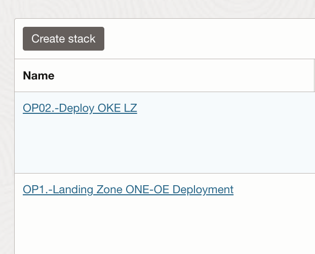

# **[OCI Landing Zone GitOps Operating Model Guide](#)**
## **An OCI Open LZ Addon to Tailor and Optimize your OCI Operations**

&nbsp; 

### Overview

Welcome to the **OCI Landing Zone GitOps Operating Model Guide**. 

This guide provides guidelines on designing OCI gitops model, which can be used or inspired to set up your LZ operation model. In this asset we will highlight the approach we offer in our Landing Zone blueprints: [One-OE](../../blueprints/one-oe/readme.md), [Multi-OE](../../blueprints/multi-oe/readme.md), and [Multi-Tenancy](../../blueprints/multi-tenancy/readme.md) and in our Landing Zone Extensions assets.

We strongly recommend that all our customers implement a Landing Zone. To simplify and reduce the cost of design and implementation, we offer pre-existing models that address Day 1. The key questions are how do you want to deploy and manage your Landing Zone (Day 2)?. How many teams will be responsible for deployment and management operations?. To what extent do you need to segregate different operational tasks?

In other to automate the deployment of OCI Landing Zone resources we are using Terraform. Depending on your level of IaC expertise and automation requirements, you can opt for either a straightforward approach or a fully automated, more complex solution. Our assets are designed to support both scenarios: they can be run as one-off deployments, creating a collection of OCI resources that beginner customers can manage via the console after Day 2. Or alternatively can be seamlessly integrated into existing GitOps operation models, leveraging third-party CI/CD tools for more experienced users.

Customer transitioning in between previous scenarios may encounter several challenges. The Terraform code could become more complex and disorganized, resulting in longer deployment times and increased errors. Additionally, the team may hesitate to implement changes due to uncertainty about potential issues. For these reasons, we recommend decoupling operations to improve efficiency and reduce risk.

### Why decoupled operations

 We can deploy all the Landing Zone Layers : IAM , Network, Observability and Security in:

**1. ONE operation**

**Note**: As in our [ONE-STACK asset](https://github.com/oci-landing-zones/oci-landing-zone-operating-entities/tree/master/blueprints/one-oe/runtime/one-stack).

**2. Decouple Landing Zone operations**

**Advantages**
* Make your code more readable and maintainable.
* Reducing the risk of side-effects and conflicts. Each environment can have his own statefile.
* Increasing the speed and efficiency of your deployments.
* Enabling team autonomy and collaboration.
* Increase security.
  

**Disadvantages** 
* Increase complexity.

The number of operations will depend on the teams involved in deploying and managing the resources, as well as the specific security and operational requirements of each customer.

### Landing Zone extensions Operating Model.

All of our Landing Zone Extensions are designed to plug in seamlessly with our Landing Zone blueprints: One-OE, Multi-OE, and Multi-Tenancy.

In our LZ EXT assets, we use a multi-stack approach, where OP01 is linked to the foundational Landing Zone deployment, typically ONE-OE, and OP02 represents the Landing Zone extension itself. (Note: 'OP' refers to 'Operation')

&nbsp; 

Of course, a customer can choose to decouple these two operations into multiple operations, but we have included only two for simplicity and enhancement purposes.

### Open Landing Zone GitOps Operating Model.

TBD. Include diagrams and explain operations.

&nbsp; 

# License

Copyright (c) 2025 Oracle and/or its affiliates.

Licensed under the Universal Permissive License (UPL), Version 1.0.

See [LICENSE](/LICENSE.txt) for more details.