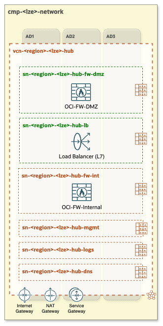

# OCI Open LZ - [Hub A](#)
## A Hub with Two OCI Network Firewalls

&nbsp; 

**Table of Contents**

[1. Overview](#1-overview) 
[2. Components](#2-components) 
[3. Specifications and Considerations](#3-specifications-and-considerations) 
[4. Routing](#4-routing) 
[5. Automation](#5-automation) 

&nbsp;

### 1. Overview
**Hub A** is equipped with two OCI Network Firewalls - a next-generation managed network firewall and an intrusion detection and prevention service. 
The first firewall is dedicated to inbound traffic, while the second is responsible for outbound and East-West traffic control and inspection.

### 2. Components
- VCN (Virtual Cloud Network)
- Two regional public subnets (depicted in green)
    1. public-subnet for DMZ/external OCI Network Firewall (note: even though **DMZ-FW** is in a public subnet, it hasn't public interface, it has only single private interface with private IP address)
    2. public-subnet for Public Load Balancers
- Four regional private subnets (depicted in dark-orange)
    1. private-subnet for Internal OCI Network Firewall
    2. private-subnet for managment workloads
    3. private-subnet for logs
    4. private-subnet for DNS (for OCI DNS resolver endpoints)
- Internet Gateway
- NAT Gateway
- Service Gateway
- **DMZ-FW** - first OCI Network Firewall: responsible for Inbound network traffic control and inspection.
- **Internal-FW** - second OCI Network Firewall: responsible for Outbound and East-West network traffic control and inspection.
- Public Load Balancer (LBaaS)

&nbsp;

### 3. Specifications and Considerations
- Segmentation of network traffic and increased throughput: ensures efficient traffic management and higher data transfer rates.
- Visibility into Inbound traffic source on **DMZ-FW**: enables detailed control over traffic entering the Hub VCN.
- SSL Decryption Policy configuration on **DMZ-FW** to allow inspect SSL traffic before sending it to the Public Load Balancer.
- Higher cost compared to the **[Hub B](/addons/oci-hub-models/hub_b/readme.md)** model: 2 x price of the OCI Network Firewall.
 

&nbsp;

### 4. Routing

The following diagram presents a Hub & Spoke architecture diagram with corresponding routing tables and routing rules.

&nbsp;

#### Legend:

&nbsp;

For a comprehensive understanding of how network packets flow within **Hub A** and Spoke VCNs refer to the [Network packet flow animation - Hub A](/addons/oci-hub-models/hub_a/hub-a-packet_flow.md).

&nbsp;

> [!NOTE]
> The CIDR ranges shown in the architecture diagram are for illustrative purposes only and should be adjusted to align with each specific use case.

&nbsp;

### 5. Automation

For automating this Hub model use the [CIS Network](https://github.com/oracle-quickstart/terraform-oci-cis-landing-zone-networking) Terraform modules. As an example configuration please refer to [oci_open_lz_one-oe_network.auto.tfvars.json](/blueprints/one-oe/runtime/one-stack/oci_open_lz_one-oe_network.auto.tfvars.json).

&nbsp; 

# License

Copyright (c) 2024 Oracle and/or its affiliates.

Licensed under the Universal Permissive License (UPL), Version 1.0.

See [LICENSE](/LICENSE) for more details.
