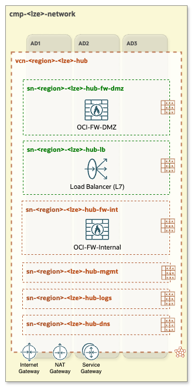
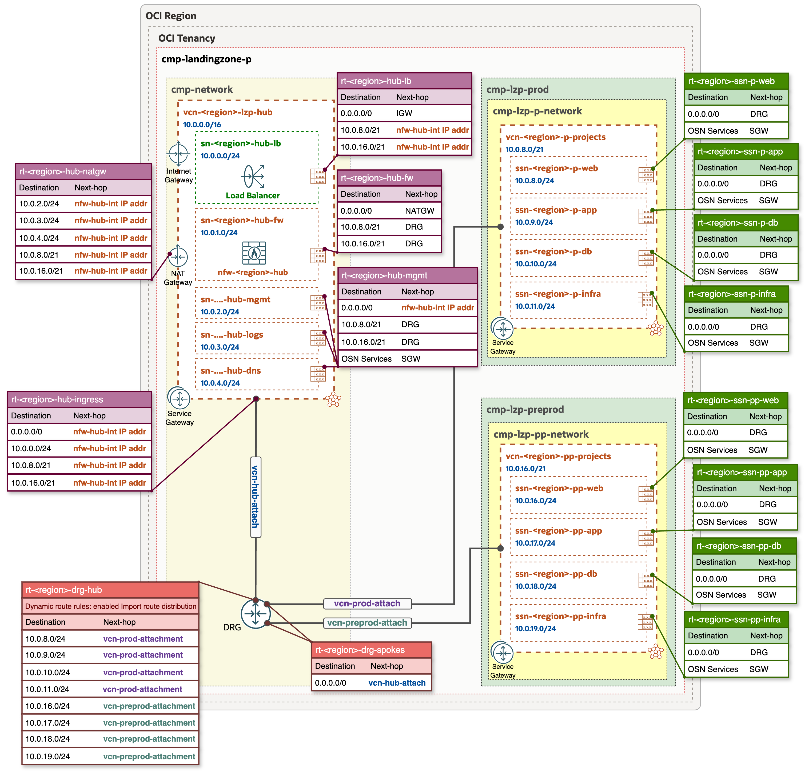
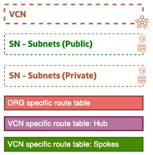

# OCI Open LZ - [Hub B](#)
## A Hub with One OCI Network Firewall

&nbsp; 

**Table of Contents**

[1. Overview](#1-overview) 
[2. Components](#2-components) 
[3. Specifications and Considerations](#3-specifications-and-considerations) 
[4. Routing](#4-routing) 
[5. Deploy](#5-deploy) 

&nbsp;

### 1. Overview
**Hub B** features a single OCI Network Firewall, a next-generation managed network firewall and an intrusion detection and prevention service. This firewall handles Inbound, Outbound, and East-West traffic control and inspection, ensuring comprehensive network security and monitoring across all traffic flows.

&nbsp; 

&nbsp;

###  2. Components
- VCN (Virtual Cloud Network)
- One regional public subnet (depicted in green)
    1. public-subnet for Public Load Balancers
- Four regional private subnets (depicted in dark-orange)
    1. private-subnet for OCI Network Firewall
    2. private-subnet for management workloads
    3. private-subnet for monitoring and logs
    4. private-subnet for DNS (for OCI DNS resolver endpoints)
- Internet Gateway
- NAT Gateway
- Service Gateway
- Public Load Balancer (LBaaS)
- **OCI-FW** - OCI Network Firewall: responsible for Inbound/Outbound (North-South) and East-West network traffic control and inspection.

&nbsp;

### 3. Specifications and Considerations
- Single Firewall: handles North-South (Inbound/Outbound) and East-West traffic inspection.
- Throughput rate: specifies the capacity of a single OCI Network Firewall.
- Visibility limitations: no visibility into the source of Inbound traffic, as the OCI Network Firewall only sees traffic coming from the Public Load Balancer.
- Cost Efficiency: lower cost compared to the **[Hub A](/addons/oci-hub-models/hub_a/readme.md)** model.

&nbsp;

### 4. Routing

The following diagram presents a Hub & Spoke architecture diagram with corresponding routing tables and routing rules.

&nbsp;

#### Legend:

&nbsp;

For a comprehensive understanding of how network packets flow within **Hub B** and Spoke VCNs refer to the [Network packet flow animation - Hub B](/addons/oci-hub-models/hub_b/hub-b-packet_flow.md).

&nbsp;

> [!NOTE]
> *The CIDR ranges shown in the architecture diagram are for illustrative purposes only and should be adjusted to align with each specific use case.*

&nbsp;

### 5. Deploy

Follow the deployment sheet below to have Hub B deployed in your tenancy with IaC declarations.

&nbsp;

| |  | |
|---|---|--| 
| **OPERATION** | **Hub B Deployment (Light Version - No Cost)** | **Hub B Deployment (Complete Version - With Cost)** | 
| **TARGET RESOURCES**    |  This operation creates the resources described in [Section 2](#2-components) **without** Firewall and with 1 always free Load Balancer.  |   This operation creates all the resources described in [Section 2](#2-components). **Note** that some resources, such as Network Firewall and Load Balancer incur **costs**.   
| **INPUT CONFIGURATIONS**   &nbsp; +&nbsp; | [**IAM Configuration**](oci_open_lz_hub_b_iam.auto.tfvars.json) as input to the [OCI Landing Zone IAM](https://github.com/oracle-quickstart/terraform-oci-cis-landing-zone-iam) module.  [**Network Configuration**](oci_open_lz_hub_b_network_light.auto.tfvars.json) as input to the [OCI Landing Zone Network](https://github.com/oci-landing-zones/terraform-oci-modules-networking) module.   | [**IAM Configuration**](oci_open_lz_hub_b_iam.auto.tfvars.json) as input to the [OCI Landing Zone IAM](https://github.com/oracle-quickstart/terraform-oci-cis-landing-zone-iam) module.  [**Network Configuration**](oci_open_lz_hub_b_network.auto.tfvars.json) as input to the [OCI Landing Zone Network](https://github.com/oci-landing-zones/terraform-oci-modules-networking) module.   | 
| **DEPLOY WITH ORM**  *- STEP #1*   |  [](https://cloud.oracle.com/resourcemanager/stacks/create?zipUrl=https://github.com/oci-landing-zones/terraform-oci-modules-orchestrator/archive/refs/tags/v2.0.5.zip&zipUrlVariables={"input_config_files_urls":"https://raw.githubusercontent.com/oci-landing-zones/oci-landing-zone-operating-entities/master/addons/oci-hub-models/hub_b/oci_open_lz_hub_b_iam.auto.tfvars.json,https://raw.githubusercontent.com/oci-landing-zones/oci-landing-zone-operating-entities/master/addons/oci-hub-models/hub_b/oci_open_lz_hub_b_network_light.auto.tfvars.json"})     And follow these steps:  **a**. Accept terms,  wait for the configuration to load.   **b**. Set the working directory to “rms-facade”.   **c**. Set the stack name you prefer.  **d**. Set the terraform version to 1.5.x. Click Next.   **e**. Accept the default files. Click Next. Optionally, replace with your json/yaml config files.   **f**. Un-check run apply. Click Create.     |  [](https://cloud.oracle.com/resourcemanager/stacks/create?zipUrl=https://github.com/oci-landing-zones/terraform-oci-modules-orchestrator/archive/refs/tags/v2.0.5.zip&zipUrlVariables={"input_config_files_urls":"https://raw.githubusercontent.com/oci-landing-zones/oci-landing-zone-operating-entities/master/addons/oci-hub-models/hub_b/oci_open_lz_hub_b_iam.auto.tfvars.json,https://raw.githubusercontent.com/oci-landing-zones/oci-landing-zone-operating-entities/master/addons/oci-hub-models/hub_b/oci_open_lz_hub_b_network.auto.tfvars.json"})     And follow these steps:  **a**. Accept terms,  wait for the configuration to load.   **b**. Set the working directory to “rms-facade”.   **c**. Set the stack name you prefer.  **d**. Set the terraform version to 1.5.x. Click Next.   **e**. Accept the default files. Click Next. Optionally, replace with your json/yaml config files.   **f**. Un-check run apply. Click Create.     |
| **POST DEPLOYMENT**  *- STEP #2*   |   Optionally, you can **deploy a "dummy VM" as a firewall** and complete the **routing** with the following steps:   **a**. Deploy a dummy FW VM following these steps [How to create a dummy FW VM](../../../commons/content/howto_create_dummy_fw_vm.md).   **b**. Identify the Private IP OCID of your firewall following these steps [How to identify the Private IP OCID of a VM VNIC](../../../commons/content/howto_identify_private_ip_ocid_vm_vnic.md).   **c**. Update the POST network JSON configuration [oci_open_lz_hub_b_network_light_post.auto.tfvars.json](oci_open_lz_hub_b_network_light_post.auto.tfvars.json) and replace the *"FW PRIVATE IP OCID"* with the OCID of Firewall Private IP OCID identified in the previous steps. You can use the find & replace of the IDE of your choice.   **d**. Edit the ORM stack and replace the original Network JSON configuration file with the new one [oci_open_lz_hub_b_network_light_post.auto.tfvars.json](oci_open_lz_hub_b_network_light_post.auto.tfvars.json).   **e**. Run Plan & Apply.     ***NOTE**: To upgrade your light version to the complete one, remove the dummy FW VM, deploy the firewall by using the [Network Configuration](oci_open_lz_hub_b_network.auto.tfvars.json) of the complete version, and update the routing as described in step 2.*  |  This step focuses on **updating the routing** after the Firewall have been provisioned:   **a**. Identify the Private IP OCID of your firewall following these steps [How to identify the Private IP OCID of a OCI Network Firewall](../../../commons/content/howto_identify_private_ip_ocid_network_firewall.md).   **b**. Update the POST network JSON configuration [oci_open_lz_hub_b_network_post.auto.tfvars.json](oci_open_lz_hub_b_network_post.auto.tfvars.json) and replace the *"FW PRIVATE IP OCID"* with the OCID of the Firewall Private IP OCID identified in the previous steps. You can use the find & replace of the IDE of your choice.   **c**. Edit the ORM stack and replace the original Network JSON configuration file with the new one [oci_open_lz_hub_b_network_post.auto.tfvars.json](oci_open_lz_hub_b_network_post.auto.tfvars.json).   **d**. Run Plan & Apply.     |

&nbsp; 

# License

Copyright (c) 2025 Oracle and/or its affiliates.

Licensed under the Universal Permissive License (UPL), Version 1.0.

See [LICENSE](/LICENSE.txt) for more details.
