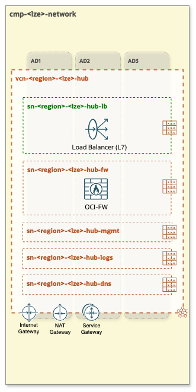

# OCI Open LZ - [Hub B](#)
## A Hub with One OCI Network Firewall

&nbsp; 

**Table of Contents**

[1. Overview](#1-overview) 
[2. Components](#2-components) 
[3. Specifications and Considerations](#3-specifications-and-considerations) 
[4. Routing](#4-routing) 
[5. Automation](#5-automation) 

&nbsp;

### 1. Overview
**Hub B** features a single OCI Network Firewall, a next-generation managed network firewall and an intrusion detection and prevention service. This firewall handles Inbound, Outbound, and East-West traffic control and inspection, ensuring comprehensive network security and monitoring across all traffic flows.

&nbsp; 

&nbsp;

###  2. Components
- VCN (Virtual Cloud Network)
- One regional public subnet (depicted in green)
    1. public-subnet for Public Load Balancers
- Four regional private subnets (depicted in dark-orange)
    1. private-subnet for OCI Network Firewall
    2. private-subnet for managment workloads
    3. private-subnet for logs
    4. private-subnet for DNS (for OCI DNS resolver endpoints)
- Internet Gateway
- NAT Gateway
- Service Gateway
- Public Load Balancer (LBaaS)
- **OCI-FW** - OCI Network Firewall: responsible for Inbound/Outbound (North-South) and East-West network traffic control and inspection.

&nbsp;

### 3. Specifications and Considerations
- Single Firewall: handles North-South (Inbound/Outbound) and East-West traffic inspection.
- Throughput rate: specifies the capacity of a single OCI Network Firewall.
- Visibility limitations: no visibility into the source of Inbound traffic, as the OCI Network Firewall only sees traffic coming from the Public Load Balancer.
- Cost Efficiency: lower cost compared to the **[Hub A](/addons/oci-hub-models/hub_a/readme.md)** model.

&nbsp;

### 4. Routing

The following diagram presents a Hub & Spoke architecture diagram with corresponding routing tables and routing rules.

&nbsp;

#### Legend:

&nbsp;

For a comprehensive understanding of how network packets flow within **Hub B** and Spoke VCNs refer to the [Network packet flow animation - Hub B](/addons/oci-hub-models/hub_b/hub-b-packet_flow.md).

&nbsp;

> [!NOTE]
> *The CIDR ranges shown in the architecture diagram are for illustrative purposes only and should be adjusted to align with each specific use case.*

&nbsp;

### 5. Automation

For automating this Hub model use the [CIS Network](https://github.com/oracle-quickstart/terraform-oci-cis-landing-zone-networking) Terraform modules. As an example configuration please refer to [oci_open_lz_one-oe_network.auto.tfvars.json](/blueprints/one-oe/runtime/one-stack/oci_open_lz_one-oe_network.auto.tfvars.json).

&nbsp; 

# License

Copyright (c) 2024 Oracle and/or its affiliates.

Licensed under the Universal Permissive License (UPL), Version 1.0.

See [LICENSE](/LICENSE.txt) for more details.
