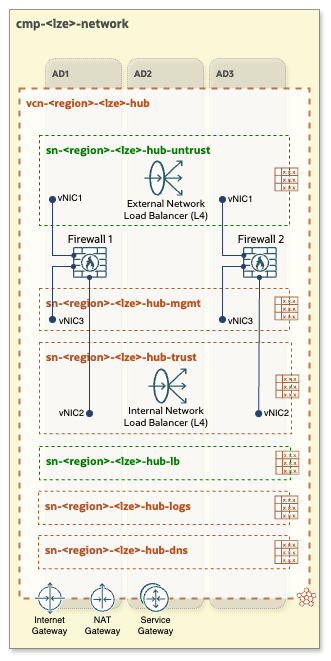
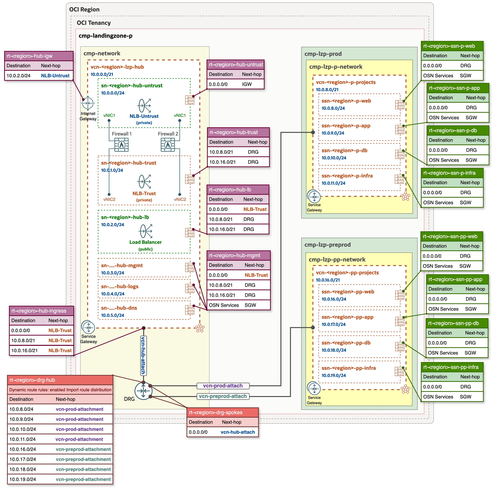
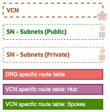

# OCI Open LZ - [Hub C](#)
## A Hub with 3rd Party FW - Active/Active

&nbsp; 

**Table of Contents**

- [OCI Open LZ - Hub C](#oci-open-lz---hub-c)
  - [A Hub with 3rd Party FW - Active/Active](#a-hub-with-3rd-party-fw---activeactive)
    - [1. Overview](#1-overview)
    - [2. Components](#2-components)
    - [3. Specifications and Considerations](#3-specifications-and-considerations)
    - [4. Routing](#4-routing)
      - [Legend:](#legend)
    - [5. Deploy](#5-deploy)
- [License](#license)

&nbsp;

### 1. Overview
**Hub C** features third-party network firewalls configured in an Active/Active design, paired with OCI private Network Load Balancers operating in transparent mode with symmetric hashing to ensure packet flow symmetry. These firewalls manage both Inbound/Outbound (North-South) and East-West traffic, providing thorough control and inspection.

&nbsp; 

> [!NOTE]
> *This Hub diagram presents a general view of the **Hub C** architecture and its key concepts. A more detailed example, including routing tables and an internet-facing Load Balancer, is presented below.*

&nbsp;

###  2. Components
- VCN (Virtual Cloud Network)
- Two regional public subnets (depicted in green)
    1. public-subnet for External Network Load Balancer (NLB-Untrust) and the external interfaces of the firewalls (vNIC1)
    2. public-subnet for Load Balancer (LBaaS)
- Four regional private subnets (depicted in dark-orange)
    1. private-subnet for Internal Network Load Balancer (NLB-Trust) and the internal interfaces of the firewalls (vNIC2)
    2. private-subnet for management workloads (depending on the 3rd-party firewall vendor, additional interfaces may be created here, such as a management network interfaces)
    3. private-subnet for monitoring and logs
    4. private-subnet for DNS (for OCI DNS resolver endpoints)
- Internet Gateway
- Service Gateway
- Two OCI Network Load Balancers
- Two 3rd party Network Firewalls
- Public Load Balancer (LBaaS)

&nbsp;

### 3. Specifications and Considerations
- Symmetric hashing: Both OCI Network Load Balancers are private and operate in source and destination IP header preservation mode with symmetric hashing enabled. This feature prevents asymmetric routing, ensuring that request and return packets pass through the same firewall appliance.
- Firewalls: Third-party network firewalls are configured in Active/Active mode, ensuring resilience and scalability. The number of firewalls can be scaled up or down depending on throughput requirements and demand.
- NAT: This Hub model does not include a OCI NAT Gateway, as NAT functionality is handled by third-party firewalls (depending on specific requirements, this function can be configured and handled by an OCI NAT Gateway).
- Traffic visibility: Provides detailed control over inbound/source traffic entering or outbound traffic leaving the Hub VCN.
- License flexibility: Possibility to use already existing license (BYOL) from a specific vendor.

&nbsp;

### 4. Routing

The following diagram presents a Hub & Spoke architecture diagram with corresponding routing tables and routing rules.

&nbsp;

#### Legend:

&nbsp;

For a comprehensive understanding of how network packets flow within **Hub C** and Spoke VCNs refer to the [Network packet flow animation - Hub C](/addons/oci-hub-models/hub_c/hub-c-packet_flow.md).

&nbsp;

> [!NOTE]
> *The CIDR ranges shown in the architecture diagram are for illustrative purposes only and should be adjusted to align with each specific use case.*

&nbsp;

### 5. Deploy

Follow the deployment sheet below to have Hub C deployed in your tenancy with IaC declarations.

| | |
|---|---|
| **OPERATION** | **Hub C Deployment** | 
| **TARGET RESOURCES**     |  This operation creates all the resources described in [Section 2](#2-components), but it does not deploy third-party firewalls.   
| **INPUT CONFIGURATIONS**   &nbsp; +&nbsp; | [**IAM Configuration**](addon_iam.json) as input to the [OCI Landing Zone IAM](https://github.com/oracle-quickstart/terraform-oci-cis-landing-zone-iam) module.  [**Network Configuration**](addon_network_hub_c_pre.json) as input to the [OCI Landing Zone Network](https://github.com/oci-landing-zones/terraform-oci-modules-networking) module.   |
| **DEPLOY WITH ORM**  *- STEP #1*   |       And follow these steps:  **a**. Accept terms,  wait for the configuration to load.   **b**. Set the working directory to “rms-facade”.   **c**. Set the stack name you prefer.  **d**. Set the terraform version to 1.5.x. Click Next.   **e**. Accept the default files. Click Next. Optionally, replace with your json/yaml config files.   **f**. Un-check run apply. Click Create.     |
| **POST DEPLOYMENT**  *- STEP #2*   |  This step focuses on **updating the routing** after the Network Load Balancers and third-party Network Firewalls (in case NFWs were created separately after Step 1) have been provisioned:   **a**. Identify the Private IP OCID of the Network Load Balancers, deployed after Step 1.    **b**. Two options are available:   &nbsp;&nbsp; **Option 1**: Update the network JSON configuration [addon_network_hub_c.json](addon_network_hub_c.json) and replace the *"UNTRUST NLB PRIVATE IP OCID"* with the OCID of the Untrust NLB Private IP, as well as the "TRUST NLB PRIVATE IP OCID" with the OCID of the Trust NLB Private IP identified in the previous steps. You can use the find & replace of the IDE of your choice.    &nbsp;&nbsp; **Option 2**: In the case that third-party Network Firewalls were created separately after Step 1, use the [addon_network_hub_c_backends.json](addon_network_hub_c_backends.json) configuration instead, and update NLBs and Network Firewalls’ Private IP OCIDs (*"NETWORK FIREWALL-1 PRIVATE IP OCID"* and *"NETWORK FIREWALL-2 PRIVATE IP OCID"* accordingly).    **c**. Edit the ORM stack and replace the [addon_network_hub_c_pre.json](addon_network_hub_c_pre.json) network configuration with the appropriate updated configuration: [addon_network_hub_c.json](addon_network_hub_c.json) or [addon_network_hub_c_backends.json](addon_network_hub_c_backends.json).    **d**. Run Plan & Apply.     |

&nbsp; 

# License

Copyright (c) 2026 Oracle and/or its affiliates.

Licensed under the Universal Permissive License (UPL), Version 1.0.

See [LICENSE](/LICENSE.txt) for more details.
