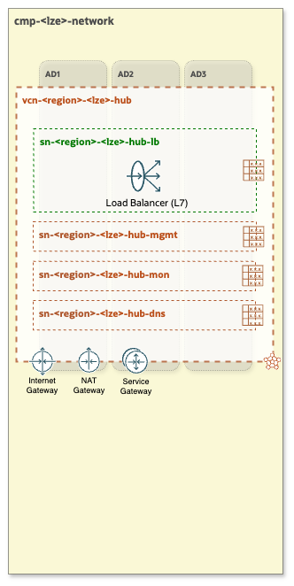
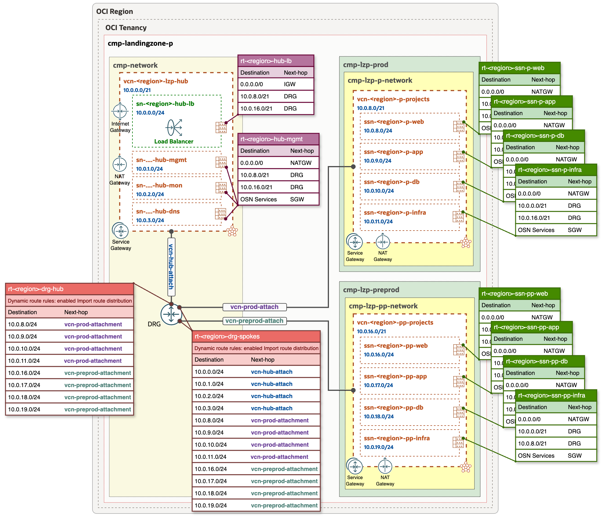

# OCI Open LZ - [Hub E](#)
## A Hub without Network Firewalls

&nbsp; 

**Table of Contents**

[1. Overview](#1-overview) 
[2. Components](#2-components) 
[3. Specifications and Considerations](#3-specifications-and-considerations) 
[4. Routing](#4-routing) 
[5. Deploy](#5-deploy) 

&nbsp;

### 1. Overview
**Hub E** model is designed without a Network Firewall while ensuring that all incoming traffic is routed through the DMZ/Public Load Balancer public subnet. This approach allows the central network team to maintain control over traffic flow and enforce security using Security Lists, NSGs, and WAF (for HTTP/S traffic), while also managing and controlling East-West traffic communication between Spoke VCNs through DRG route tables.
It is recommended for environments where deep packet inspection is not a security requirement, as well as for proof-of-concept (PoC) deployments and Hub & Spoke architecture exploration.

&nbsp; 

### 2. Components
- VCN (Virtual Cloud Network)
- One regional public subnet (depicted in green)
    1. public-subnet for Public Load Balancers
- Three regional private subnets (depicted in dark-orange)
    1. private-subnet for management workloads
    2. private-subnet for monitoring and logs
    3. private-subnet for DNS (for OCI DNS resolver endpoints)
- Internet Gateway
- NAT Gateway
- Service Gateway
- Public Load Balancer (LBaaS)

&nbsp;

### 3. Specifications and Considerations
- Inbound traffic first enters the Public Load Balancer's public subnet and is then routed through the DRG to the respective LB's backends in the Spoke VCNs.
- Each Spoke VCN has its own NAT Gateway for outbound traffic.
- East-West traffic between Spoke VCNs is routed through the DRG.

&nbsp;

### 4. Routing

The following diagram presents a Hub & Spoke architecture diagram with corresponding routing tables and routing rules.

&nbsp;

#### Legend:

&nbsp;

> [!NOTE]
> *The CIDR ranges shown in the architecture diagram are for illustrative purposes only and should be adjusted to align with each specific use case.*

&nbsp;

### 5. Deploy

Follow the deployment sheet below to have Hub E deployed in your tenancy with IaC declarations.  This will not provision any spokes, but this is a reusable operation you can use to setup the Hub E in **any** Operating Entities Landing Zone blueprint.

&nbsp;

| |  |
|---|---| 
| **OPERATION** | **Hub E Deployment** | 
| **TARGET RESOURCES**    |  This operation creates the resources described in [Section 2](#2-components) **without** any Firewall and with 1 always free Load Balancer. | 
| **INPUT CONFIGURATIONS**   &nbsp; +&nbsp; | [**IAM Configuration**](oci_open_lz_hub_e_iam.auto.tfvars.json) as input to the [OCI Landing Zone IAM](https://github.com/oracle-quickstart/terraform-oci-cis-landing-zone-iam) module.  [**Network Configuration**](oci_open_lz_hub_e_network.auto.tfvars.json) as input to the [OCI Landing Zone Network](https://github.com/oci-landing-zones/terraform-oci-modules-networking) module.   | 
| **DEPLOY WITH ORM**  *- STEP #1*   |  [](https://cloud.oracle.com/resourcemanager/stacks/create?zipUrl=https://github.com/oci-landing-zones/terraform-oci-modules-orchestrator/archive/refs/tags/v2.0.8.zip&zipUrlVariables={"input_config_files_urls":"https://raw.githubusercontent.com/oci-landing-zones/oci-landing-zone-operating-entities/master/addons/oci-hub-models/hub_e/oci_open_lz_hub_e_iam.auto.tfvars.json,https://raw.githubusercontent.com/oci-landing-zones/oci-landing-zone-operating-entities/master/addons/oci-hub-models/hub_e/oci_open_lz_hub_e_network.auto.tfvars.json"})     And follow these steps:  **a**. Accept terms,  wait for the configuration to load.   **b**. Set the working directory to “rms-facade”.   **c**. Set the stack name you prefer.  **d**. Set the terraform version to 1.5.x. Click Next.   **e**. Accept the default files. Click Next. Optionally, replace with your json/yaml config files.   **f**. Un-check run apply. Click Create.     |

&nbsp; 

# License

Copyright (c) 2026 Oracle and/or its affiliates.

Licensed under the Universal Permissive License (UPL), Version 1.0.

See [LICENSE](/LICENSE.txt) for more details.
