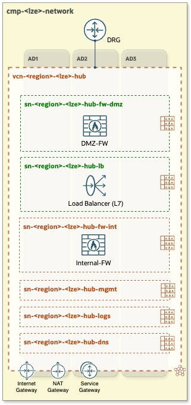
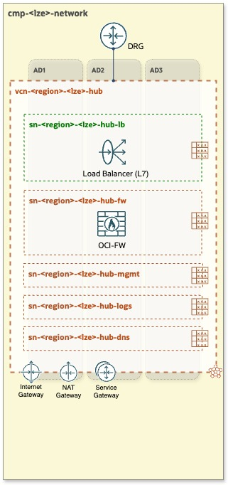
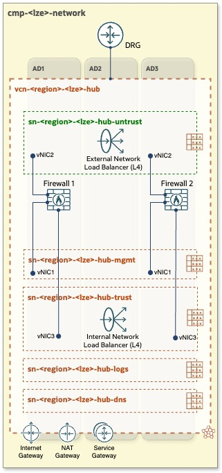
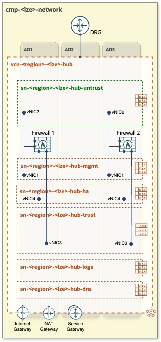
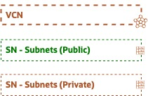

# **[OCI Network Hub Models](#)**
## **An OCI Open LZ [Addon](#) to Increase and Tailor Your Network Security**

&nbsp; 

### Overview
Welcome to the **OCI Network Hub Model [Addon](#)**, a set of **comprehensible OCI Network options** with a complete **design** and IaC **runtime**. Each of the models presented can be used in any OCI Open LZ Blueprint, or with your tailored landing zone.

This document provides an in-depth exploration of the various **OCI Network Hub models** within a **Hub & Spoke architecture**. It covers the components, specifications, and considerations of each model to facilitate the selection of the most suitable option for different scenarios and requirements. Additionally, it includes **packet flow animations** to illustrate the journey of network packets within these models, enhancing understanding through **visual representation**.

&nbsp; 

### The Hub Menu

| **HUB A** | **HUB B**| **HUB C**  | **HUB D**  | 
|:-:|:-:|:-:|:-:|
| **OCI Native FW Hub** - 2 Firewalls| **OCI Native FW Hub** - 1  Firewall |  OCI Hub with **3rd Party FW** - HA | OCI Hub with **3rd Party FW** - AP |
|  |  |  |   | 
| View [Details](/addons/oci-hub-models/hub_a/readme.md)  | | |
| View [Packet Flow Animation](/addons/oci-hub-models/hub_a/hub-a-packet_flow.md)  | | |

&nbsp; 

**FW** = Firewall  | **AA** = Active - Active | **AP** = Active - Passive  

 

&nbsp; 

&nbsp; 

# License

Copyright (c) 2024 Oracle and/or its affiliates.

Licensed under the Universal Permissive License (UPL), Version 1.0.

See [LICENSE](LICENSE) for more details.
