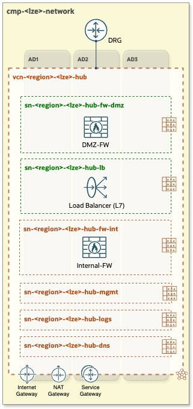
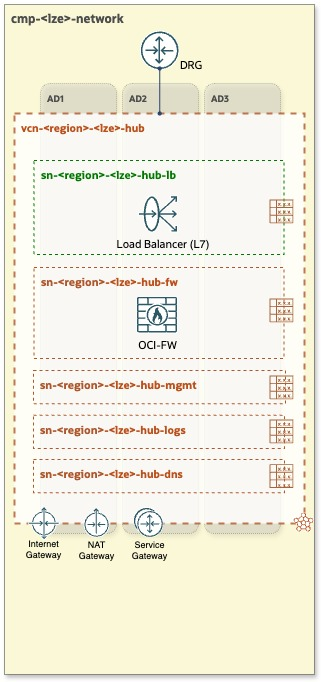
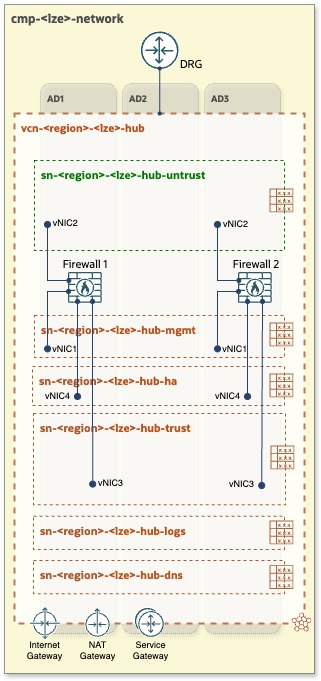
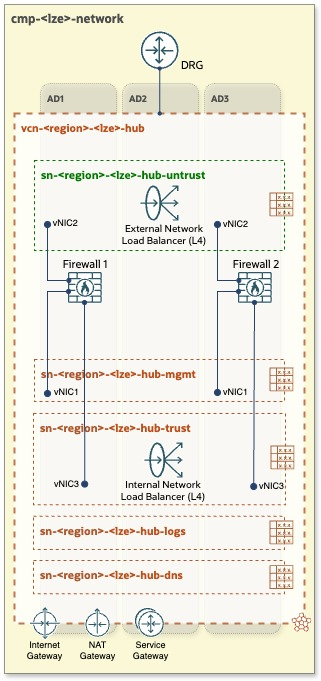

# **[OCI Network Hub Models](#)**
## **An OCI Open LZ [Addon](#) to Increase and Tailor Your Network Security**

&nbsp; 

Welcome to the **OCI Network Hub Model [Addon](#)**, a set of **comprehensible** and well-**documented** network options with a complete **design** and IaC **runtime**. Each of the models presented can be used in any OCI Open LZ Blueprint, or with your tailored landing zone.

&nbsp; 

|  |  |  |   | 
|:-:|:-:|:-:|:-:|
| **MODEL A** | **MODEL B**| **MODEL C**  | **MODEL D**  | 
|  |  |  |  | 

&nbsp; 

# License

Copyright (c) 2024 Oracle and/or its affiliates.

Licensed under the Universal Permissive License (UPL), Version 1.0.

See [LICENSE](LICENSE) for more details.
