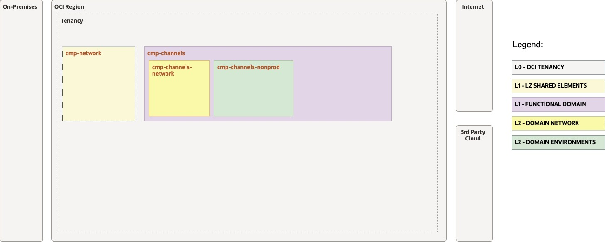
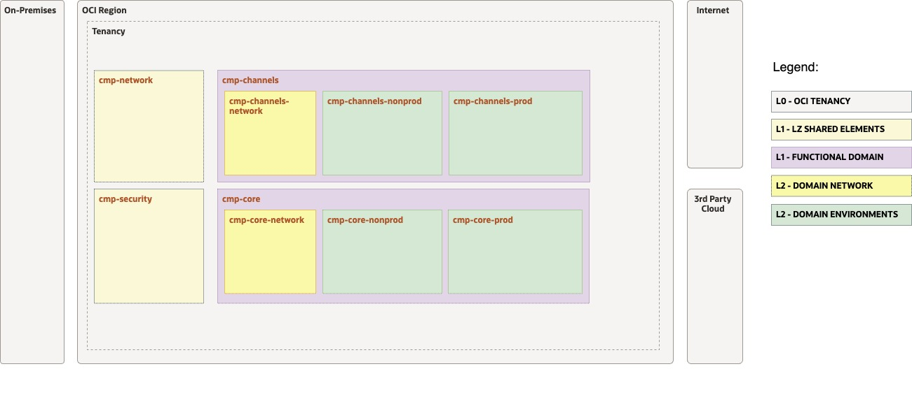
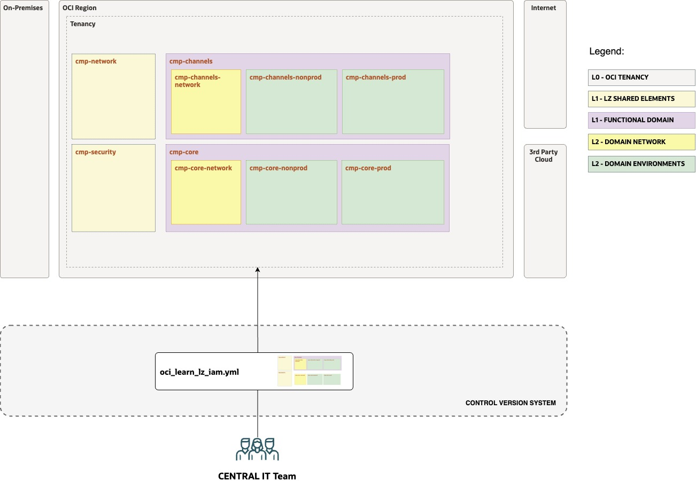
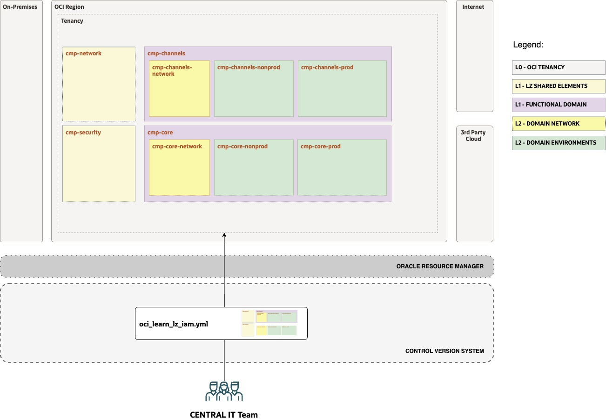

# OCI Learn LZ - Exercise #1 Tenancy Structure

## **Table of Contents**

[1. Objective](#1-objective) 
[2. View Initial Design and Configuration](#2-view-the-initial-configuration) 
[3. Complete the Configuration](#3-complete-the-configuration) 
[4. Version the Configuration](#4-version-your-configuration) 
[5. Run the Configuration](#5-run-your-configuration-with-orm) 

&nbsp; 

## 1. Objective 

Welcome to the **Open Learn LZ** Exercise #1. 

The main objective is to **create**, **version**, and **run** the IaC configurations for the OCI Learn LZ Tenancy Structure focusing on IaC configurations and not on code, The [OCI Landing Zones Orchestrator](https://github.com/oci-landing-zones/terraform-oci-modules-orchestrator) is a generic Terraform module that orchestrates the creation of Landing Zone architectures expressed in a single or multiple configuration files, that can be JSON documents and YAML documents.

In this example we use YAML configurations files, but JSON files examples are also provided.

In this exercise, you will create the tenancy structure IaC configuration to include the target domains. Your IT Central Team colleagues already started this, **your mission is to finish the configuration.** 

&nbsp; 

## 2. View the Initial Configuration

Your objective is to review the initial tenancy structure created by your team, containing part of the **channels** domain.

&nbsp; 

| ACTIVITY | DESCRIPTION   | 
|---|---|
| 1 | Open the [Drawio design](../OCI_Learn_LZ.drawio) file, and select tab "SEC - EXERCISE #1" |
| 2 | Enable the Layer "STEP 1 - TEMPLATE". Make sure the STEP 2 layer is disabled. |
| 3 | Review the tenancy structure design that is already created. The image below presents it. |
| 4 | Review configurations. First review what is [possible to configure](diagrams/oci_iam_config_all_variables.jpg) and then review the [exercise specific configurations](diagrams/oci_iam_config_exercise_variables.jpg) scope. These views are also available on the draw.io tabs. |
| 5 | Copy the configuration file [oci_learn_lz_iam.yml](config_yaml/oci_learn_lz_iam.yml) to your **local** OCI-LEARN-LZ-OPS-REPO/oci-open-lz/exercise1.
| 6 | Review the tenancy structure configuration in you **local**  **oci_learn_lz_iam.yml** file. |

&nbsp; 

&nbsp; 

## 3. Complete the Configuration

Your objective is to update the tenancy structure with a missing application **core systems domain**, and finalize the **channels** domain.

&nbsp; 

| ACTIVITY | DESCRIPTION   | 
|---|---|
| 1 | Open the [Drawio design](../OCI_Learn_LZ.drawio) file, and select tab "SEC - EXERCISE #1" |
| 2 | Enable the Layer "STEP 2 - EXERCISE". Make sure the STEP 1 layer is enabled. |
| 3 | Review the target tenancy structure design with the two domains. The image below presents it. |
| 4 | Update the tenancy structure IaC configuration with the new changes in your **local oci_learn_lz_iam.yml** file. |

&nbsp; 

&nbsp; 

## 4. Version your Configuration

Your objective is to update your configurations on the OCI-LEARN-LZ-OPS-REPO git repository.

&nbsp; 

| ACTIVITY | DESCRIPTION   | 
|---|---|
| 1 | Push your local changes on the **oci_learn_lz_iam.yml** to the remote OCI-LEARN-LZ-OPS-REPO/**exercise1** folder.  The image below is a high-level representations of this. |

&nbsp; 

&nbsp; 

## 5. Run your Configuration with ORM

Your objective is to run your new configuration with ORM. The image below contains the high-level automation mechanism, which is based on an ORM Stack that is linked to your versioned configuration file(s).

The OCI Landing Zones Orchestrator is a generic Terraform module that orchestrates the creation of Landing Zone architectures expressed in a single or multiple configuration files, that can be JSON documents and YAML documents.

In this example we use YAML configurations files, but JSON files examples are also provided.

&nbsp; 

| ACTIVITY | DESCRIPTION   | 
|---|---| 
| **1** | Create a new ORM Stack:  |
| **2** | Accept terms,  **wait** for the configuration to load. |
| **3** | Set the working directory to “**rms-facade**”. | 
| **4** | Set the stack **name** you prefer. | 
| **5** | Set the terraform **version** to 1.5.x. Click Next. | 
| **6** | **Delete** the default configuration link and **paste** the new **git raw link** of your **oci_learn_lz_iam.yml** remote file.  **NOTE:** Don't forget to press enter or click on the "Add" pop-up after pasting. |
| **7** | **Un-check** run apply. Click Create. |
| **8** | Run Terraform **Plan** and review the output messages. |
| **9** | Run Terraform **Apply** and review the created resources, they should match the design diagrams. |

&nbsp; 

&nbsp; 

&nbsp; 

After finalizing this exercise you have now a coherent set of artifacts: a design, a versioned configuration, OCI instantiated resources, and an ORM stack that contains the state file.

You can proceed to [Exercise 2](/addons/oci-learn-lz/exercise2/readme.md).

&nbsp; 

# License

Copyright (c) 2025 Oracle and/or its affiliates.

Licensed under the Universal Permissive License (UPL), Version 1.0.

See [LICENSE](/LICENSE.txt) for more details.
