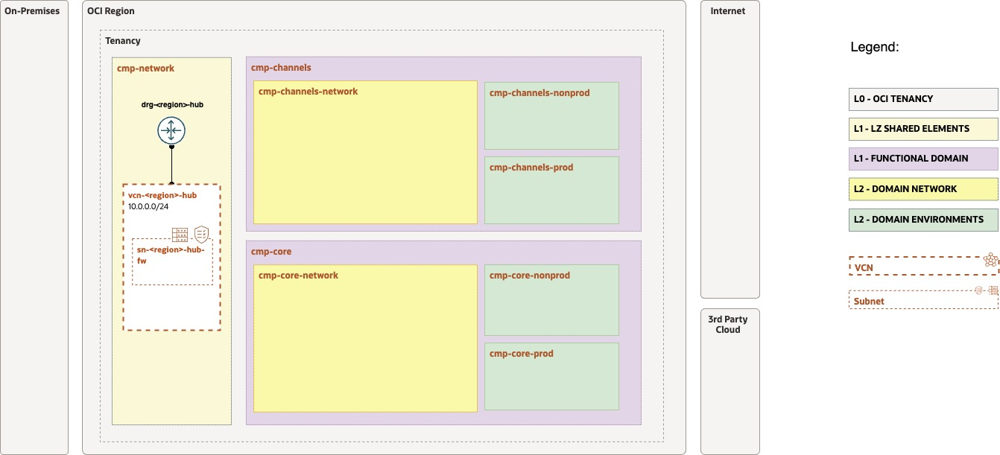
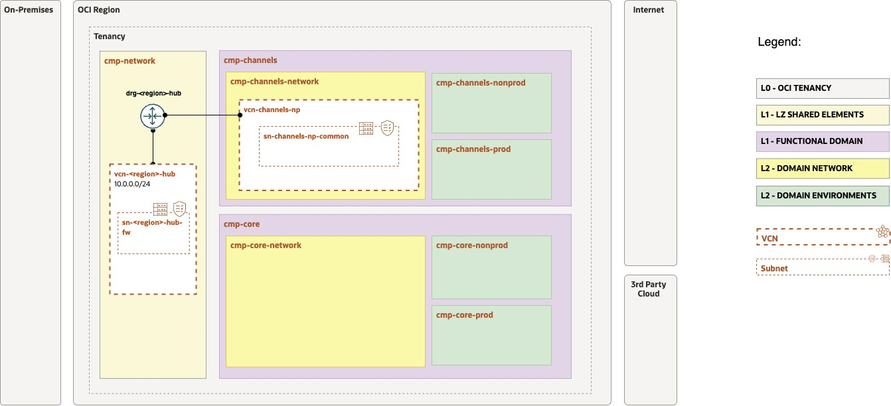
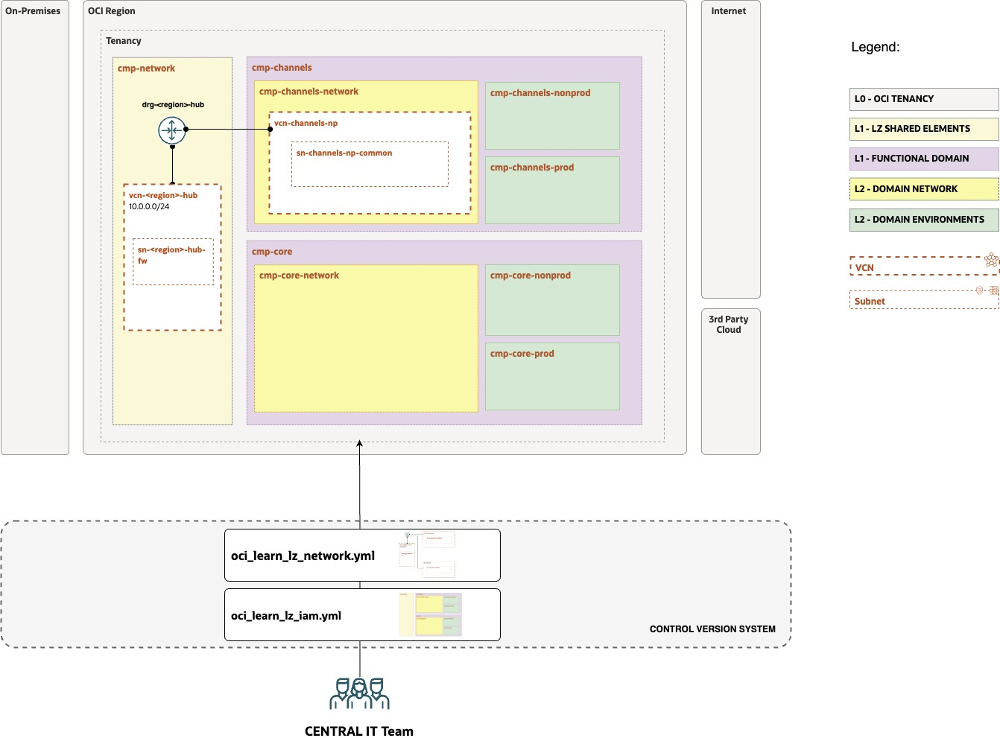
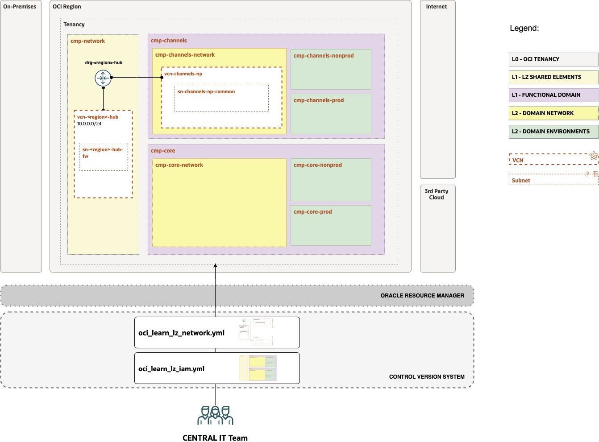

# OCI Learn LZ - Exercise #2 Network Structure

## **Table of Contents**

[1. Objective](#1-objective) 
[2. View Initial Design and Configuration](#2-view-the-initial-configuration) 
[3. Complete the Configuration](#3-complete-the-configuration) 
[4. Version the Configuration](#4-version-your-configuration) 
[5. Run the Configuration](#5-update-and-run-your-orm-stack) 

&nbsp; 

## 1. Objective 

Welcome to the **Open Learn LZ** Exercise #2. 

The main objective is to **create**, **version**, and **run** the IaC configurations for the OCI Learn LZ Network Structure.

In this exercise, you will create the network structure IaC configuration that will contain the Hub and one Domain (Channels). Your IT Central Team colleagues already started this, **your mission is to finish the configuration.** 

&nbsp; 

## 2. View the Initial Configuration

Your objective is to review the initial network structure created by your team, containing the **hub elements**.

&nbsp; 

| ACTIVITY | DESCRIPTION   | 
|---|---|
| 1 | Open the [Drawio design](/addons/oci-learn-lz/OCI_Learn_LZ.drawio) file, and select tab "NET - EXERCISE #2" |
| 2 | Enable the Layer "STEP 1 - TEMPLATE". Make sure the STEP 2 layer is disabled. |
| 3 | Review the network structure design that is already created. The image below presents it. |
| 4 | Review configurations. First review what is [possible to configure](/addons/oci-learn-lz/exercise2/diagrams/oci_network_config_all_variables.jpg) and then review the [exercise specific configurations](/addons/oci-learn-lz/exercise2/diagrams/oci_network_config_exercise_variables.jpg) scope. These views are also available on the draw.io tabs. |
| 5 | Copy the configuration file [oci_learn_lz_network.yml](/addons/oci-learn-lz/exercise2/config_yaml/oci_learn_lz_network.yml) to your **local** OCI-LEARN-LZ-OPS-REPO/oci-open-lz/exercise2.
| 6 | Review the network structure configuration in you **local**  **oci_learn_lz_network.yml** file. |

&nbsp; 

&nbsp; 

## 3. Complete the Configuration

Your objective is to update the network structure and add the network elements for the application **channel domain**.

&nbsp; 

| ACTIVITY | DESCRIPTION   | 
|---|---|
| 1 | Open the [Drawio design](/addons/oci-learn-lz/OCI_Learn_LZ.drawio) file, and select tab "NET - EXERCISE #2" |
| 2 | Enable the Layer "STEP 2 - EXERCISE". Make sure the STEP 1 layer is enabled. |
| 3 | Review the target network structure design for the domain. The image below presents it. |
| 4 | **Update** the network structure IaC configuration with the new changes in your **local oci_learn_lz_network.yml** file. Add the following elements:    **1. Create a new IaC Network Category** for the **Domain Channel**, and make sure this category is associated to right compartment.  **2. Create a new VNC** inside the Channel Domain Category, adding the CIDR block, VCN name, default security list, one subnet, and a subnet route table (without routing rules).  **3.** **Create the DRG Attachment** for the new VCN at the Hub level.    **Hint**: You can use the HUB configuration as a template.|

&nbsp; 

&nbsp; 

## 4. Version your Configuration

Your objective is to update your configurations on the OCI-LEARN-LZ-OPS-REPO git repository.

&nbsp; 

| ACTIVITY | DESCRIPTION   | 
|---|---|
| 1 | Push your local changes on the **oci_learn_lz_network.yml** to the remote OCI-LEARN-LZ-OPS-REPO/**exercise2** folder.  The image below is a high-level representations of this. |

&nbsp; 

&nbsp; 

## 5. Update and Run your ORM Stack  

Your objective is to update your ORM stack from exercise 1 with the network configuration. The image below contains the high-level automation mechanism, which is based on an ORM Stack that is linked to your versioned configuration file(s).

&nbsp; 

| ACTIVITY | DESCRIPTION   | 
|---|---| 
| **1** | Edit the ORM Stack created on Exercise #1. |
| **2** | Don't change any value on the first screen. Click Next.  |
| **3** | Add the new network configuration by copying and pasting the **public git raw url** of the **oci_learn_lz_network.yml**  **NOTE 1**: Do not delete the existing IAM configuration, this is an incremental operation on resources.  **NOTE 2**: Don't forget to press enter or click on the "Add" pop-up after pasting the network url.|
| **4** | Run terraform Plan, and Terraform Apply |
| **5** | Review the created resources, they should match the design diagrams. |

&nbsp; 

&nbsp; 

&nbsp; 

After finalizing this exercise you have now a coherent set of artifacts: a design, a versioned configuration, OCI instantiated resources, and an ORM stack that contains the state file.

Thank you for executing these exercises. More follow-up exercises will be added soon, for new domains and north-south and east-west communications. Don't hesitate to reach out for any related topic.

&nbsp; 

# License

Copyright (c) 2025 Oracle and/or its affiliates.

Licensed under the Universal Permissive License (UPL), Version 1.0.

See [LICENSE](/LICENSE.txt) for more details.
