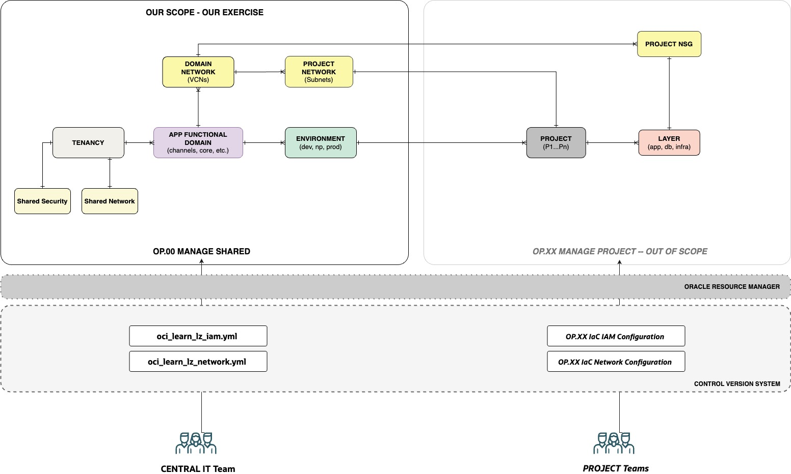
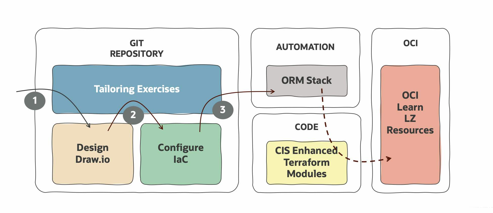

# **[OCI Learn LZ](#)**
## **An OCI Open LZ [Addon](#) to Reduce Your Design and Implementation Efforts**

&nbsp; 

**Table of Contents**

[1. Introduction](#1-introduction) 
[2. Before you Start](#2-before-you-start) 
[3. Functional Content](#3-functional-context) 
[4. Hands-on Exercises](#4-exercises) 

&nbsp; 

## 1. Introduction

Welcome to the **OCI Learn LZ**, a set of **exercises** to learn how to **design**, **configure**, and **run** OCI landing zones. Its main objectives are: 
1. Provide elementary landing zone **design** capabilities using draw.io.
2. Create skills in **IaC configurations**, by configuring the OCI Learn LZ resources. You do not code OCI landing zones anymore, you configure them. [OCI Landing Zones Orchestrator](https://github.com/oci-landing-zones/terraform-oci-modules-orchestrator) is a generic Terraform module that orchestrates the creation of Landing Zone architectures expressed in single or multiple configuration files, which can be JSON documents and YAML documents.
3. Demonstrate a **cloud-native operating model** with versioned configurations and an automation engine - based on ORM.

&nbsp; 

## 2. Before you Start
### 2.1 Have an OCI Account
Anyone can run the OCI-Learn-LZ exercises. If you don't have an OCI Paid Account, to execute the exercises you will need and [OCI Free Tier](https://docs.oracle.com/en-us/iaas/Content/FreeTier/freetier.htm) account.

**Note** that an OCI Free Tier account after a predefined time or initial credits consumed, is automatically limited to use Always Free resources - if not upgraded. If this is your case, you need to free all VCNs resources as exercise 2 will use two VCNs which is the limit of the always-free model.

&nbsp; 

### 2.2 Use an IDE integrated with GIT 
We highly recommend using an IDE for the exercises (e.g., Visual Studio Code), as it helps with the formatting of configuration files. The same IDE can be integrated with GIT, having the development tools all in the same place.

&nbsp; 

### 2.3 Create a Public Git Repository
Before you progress it's essential to **create a public git repository** to use with the exercises, as you will need to push configuration files into a public repository - for them to be visible by ORM. 

**Create three folders** on your new repository:
1. oci-learn-lz
2. oci-learn-lz/exercise1
3. oci-learn-lz/exercise2

 Make sure you have this **repository cloned** locally and use the IDE to execute your local changes throughout the exercises. 
 
 This repository will be referenced in the exercises as **OCI-LEARN-LZ-OPS-REPO**.

&nbsp; 

## 3. Functional Context 

The OCI Learn LZ has the following characteristics:

1. **Resource Organization:** OCI Landing Zone resources are organized by Application Functional Domains, Environments, Projects, and Project Layers. This model is suitable to **aggregate workloads by domain**, enterprise-wide. Examples of application domains can be Channels, Integrations, Core Systems, etc.
2. **Scalability**: This Landing Zone **scales by Domains and Projects**. The Environments and Project layers have always the same structural elements.
3. **Cloud Ops - Central Team:** There is a **Central IT Team** that controls the common elements of the landing zone. **You are part of this team**.
4. **Cloud Ops - Project Teams:** There are several **Project Teams**, that control their resources. Projects in this exercise are **out of scope**.
5. **Projects**: Projects will share domain-specific network elements (VCNs) and have dedicated elements, such as Subnets and NSGs. NSGs are handled by Project Teams. Project elements are currently **out of the scope** of this exercise.
6. **Collaboration Model**: Inside the IT Central team, you will collaborate with your colleagues using Git repositories, meaning your operations are versioned configurations, and the source of truth is in Git.
7. **Operating Model**: The operating model used to provision and change resources is through **versioned IaC configurations** in **git repositories**. **ORM** will be used to create stacks that aggregate those configurations and run Terraform plan/apply commands, maintaining the state on each stack.

&nbsp; 

The diagram below presents the key functional elements of the landing zone, in an Entity **Relationship Diagram (ERD)** format. It also presents the operating model with ORM and Git to version the IaC configurations, used by each of the responsible operations teams. For the exercise scope, Remember that **you are part of the Central IT Team**.

&nbsp; 

&nbsp; 

If we can compare Landing Zones to airports: The OCI Learn LZ is an airport with different types of terminals (domains) that can be - but don't have to be - operated independently at any time by different teams. Each terminal can have a different security posture (domestic, international, etc.), teams, and resources.

&nbsp; 

## 4. Exercises 

The OCI Learn LZ has a set of exercises that are presented in the form of **(1) design diagrams** (in draw.io format), and a set of **(2) IaC configurations** (in YAML format) that match these designs. The objective is that you **complete** these exercises and **(3) run the new configurations** with a dedicated ORM Stack. This ORM Stack will use your configurations as input to the [CIS  Landing Zone Modules](https://github.com/oracle-devrel/technology-engineering/blob/main/landing-zones/commons/oci_landingzones_iac.md) and create the OCI Resources. The diagram below presents this flow.

&nbsp; 

&nbsp; 

There are currently two exercises available: one for security elements, where you will create the tenancy structure, and one for the network elements, where you will create the shared and domain-related elements, that will be used by projects.

&nbsp; 

| EXERCISE | AREA | OBJECTIVE  | RUN IT |  
|---|---|---|---|
| #1 |  **Security** | Complete the OCI Learn LZ **tenancy structure**. | [Here](exercise1/readme.md)|
| #2 | **Network** | Complete the OCI Learn LZ **network structure** on top of the tenancy structure, for one Domain.| [Here](exercise2/readme.md)||