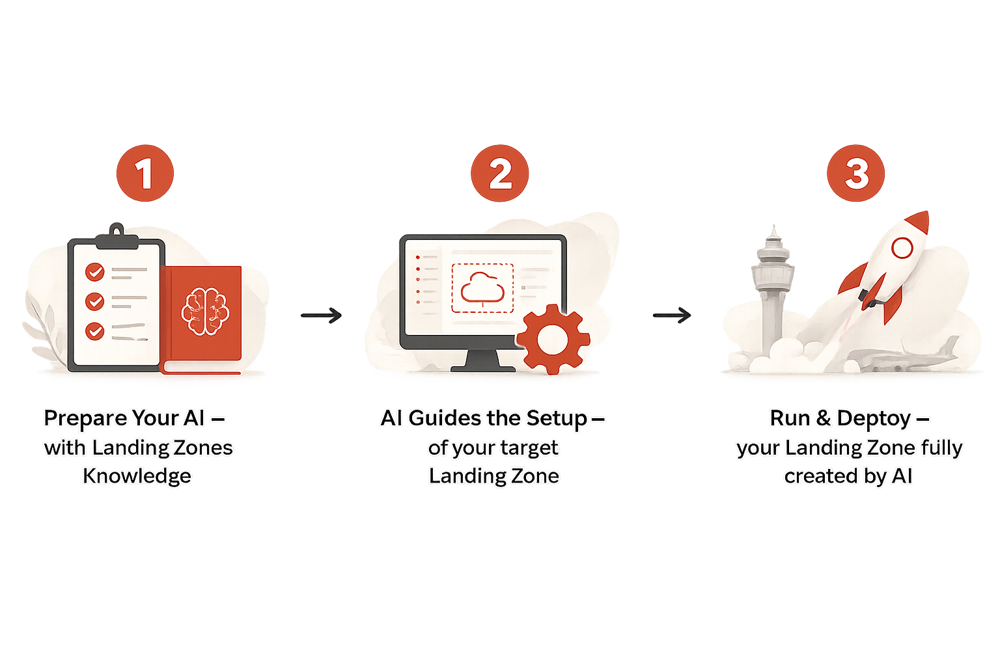

# **[OCI LZ AI Agent](#)**
## **An OCI Open LZ [Addon](#) for AI assisted Landing Zones**

&nbsp;

**Table of Contents**

[1. Overview](#1-overview)<br>
[2. Workflow](#2-workflow)<br>
[2.1. Prepare Your AI](#21-prepare-your-ai)<br>
[2.2. AI Guides the Setup](#22-ai-guides-the-setup)<br>
[2.3. Run & Deploy](#23-run--deploy)<br>
[3. AI Built-in Security](#3-ai-built-in-security)<br>
[4. Complementary Resources](#4-complementary-resources)<br>

&nbsp;

## 1. Overview

The **OCI LZ AI Agent** addon helps to use AI coding agents with the OCI Landing Zone Operating Entities repository. It aligns landing zone design with repository knowledge, json structure and review before manual deployment.

<p align="center">
  
</p>

> [!IMPORTANT]
> AI assisted landing zone generation, modification or deployment guidance is provided at your own risk. Review all outputs for correctness, security and regulatory or internal compliance before deploying them.

This addon supports faster landing zone discovery while keeping architecture ownership and deployment control with your organization.

- **Faster discovery**: AI helps structure requirements for environments, networking, IAM, security, observability and governance.
- **Reviewable documentation**: Initial drafts are prepared for architecture and security review before deployment decisions.
- **Security centered review**: AI Security checks are applied to all AI generated configurations. Assumptions and open questions are surfaced before deployment.
- **Guided deployment**: Deployment steps and review of landing zone is guided by AI.

&nbsp;
## 2. Workflow

&nbsp;

### 2.1. Prepare Your AI

Before using this addon:

1. Select an AI coding agent that fits organizational security and operational requirements.
1. Install and configure the selected AI coding agent with official documentation, such as the [Codex App documentation](https://developers.openai.com/codex/app) or [Claude Code setup](https://code.claude.com/docs/en/setup).
1. Install Jsonnet which is required for LZ generation. Make sure the `jsonnet` command is available on `$PATH`. For installation instruction use the [Google go-jsonnet repository](https://github.com/google/go-jsonnet).
1. Clone the OCI Landing Zone Operating Entities repository locally.
1. Always make sure to launch your agent in the Operating Entities folder you've cloned.

Keep source files and deployment artifacts in private, secure location controlled by your organization.

&nbsp;

### 2.2. AI Guides the Setup

Start by describing the landing zone outcome, business context, technical constraints, security and compliance requirements. The AI coding agent works from the relevant repository knowledge and walks you through identifying and validating your requirements. Generating landing zone and the next steps for reviewing and deploying to OCI.

Recommended inputs:

- Required environments, such as dev, test, prod.
- Hub (DMZ) model and connectivity requirements.
- CIDR allocation and known constraints.
- Workloads to be deployed on top of OCI Landing Zone.
- Security, observability, governance and compliance requirements.

### How Blueprint Factory Works with AI

The AI agent works within the Blueprint Factory model:

1. **Discovery**: AI asks questions to understand your landing zone requirements.
2. **Template Selection**: AI identifies the best-fit published blueprint or determines if customization is needed.
3. **Configuration Generation**: For standard designs, the AI prepares the blueprint JSON. For custom designs, the AI creates a Jsonnet configuration file.
4. **Output Generation**: The Blueprint Factory (Jsonnet generator) produces consistent, deployable JSON artifacts from your configuration.
5. **Review & Refinement**: All generated configurations remain reviewable as Jsonnet or JSON before deployment.

This approach keeps AI assistance anchored in the repository's battle-tested landing zone patterns while enabling customization.

### Example of complete OKE one-shot prompt to Generate Landing Zone

```text
Create a reviewed OCI Landing Zone Operating Entities draft with these inputs:
- Baseline: One-OE.
- Hub: Hub B with OCI Network Firewall.
- Region: eu-frankfurt-1.
- Environments: dev and prod.
- Workload: OKE is the only platform workload in both environments.
- Connectivity: no on premises or other cloud connectivity.
- CIDRs: hub VCN 10.0.0.0/20, dev OKE VCN 10.10.0.0/16, prod OKE VCN 10.20.0.0/16, dev services CIDR 172.16.0.0/16, prod services CIDR 172.17.0.0/16.
- OKE sizing: one cluster per environment, dev up to 6 worker nodes, prod up to 12 worker nodes, 30 pods per node planning assumption.
- Security: private worker nodes, baseline IAM, Cloud Guard, Security Zones, vulnerability scanning, logging and alarms.
- Deployment source: private source controlled by the organization Gitlab runner.
Prepare the draft and return blockers, warnings, assumptions and review items.
```

### Example of minimal prompt, triggering AI to walk through discovery process

```text
I want a landing zone with OKE.
```


### Currently supported add-ons and workloads:

||Released|Available Soon|
|---|---|---|
|Add-ons|[Hub A](/addons/oci-hub-models/hub_a/readme.md), [B](/addons/oci-hub-models/hub_b/readme.md), [C](/addons/oci-hub-models/hub_c/readme.md), [E](/addons/oci-hub-models/hub_e/readme.md)|[FinOps](/addons/oci-finops/README.md), [DNS](/addons/oci-private-dns/README.md)|
|Extensions|[OKE](/workload-extensions/oke/readme.md), [ExaCS](/workload-extensions/exacs/readme.md), [ExaCC](/workload-extensions/exacc/readme.md)|[EBS](/workload-extensions/ebs/readme.md), [OpenShift](/workload-extensions/openshift/README.md), [OCVS](/workload-extensions/ocvs/README.md)|

&nbsp;

### 2.3. Run & Deploy

AI will deliver deployable assets as JSON files with documentation. Review all assets before deployment.

Before deployment:

- Review all artifacts for correctness, security and compliance.
- Confirm the CIDR plan does not overlap with connected OCI, on premises or other cloud networks.
- Confirm unsupported resources are not hidden inside generated artifacts.
- Confirm deployment sources are private and controlled by your organization.
- If using OCI Resource Manager to deploy the landing zone, stage files in a private Object Storage bucket or private GitHub source controlled by your organization.

Follow additional documentation for both deployment paths of Landing Zones:

- [Terraform deployment guide](../../commons/content/terraform.md)
- [OCI Resource Manager deployment guide](../../commons/content/orm.md)

&nbsp;

## 3. AI Built-in Security

AI assistance remains anchored in the OCI Landing Zone Operating Entities repository model. The AI agent creates or updates structured inputs and review artifacts. It does not invent landing zone files from memory or produce deployment artifacts outside the repository model.

Jsonnet generation provides the foundational input layer that keeps the design traceable and repeatable. It helps prevent arbitrary landing zone output from AI memory and halucinations by keeping design intent aligned with repository owned landing zone patterns.

- **Structured design surface**: Landing zone intent is captured in a structured format before deployment artifacts are considered.
- **Repository based behavior**: Outputs are derived from OCI Landing Zone Operating Entities repository logic.
- **Repeatable Composition**: The same Jsonnet config always produces identical JSON outputs, supporting GitOps workflows.
- **Reviewable change**: Design updates are inspected as focused diffs before deployment.
- **Reduced hallucination risk**: AI cannot invent resources outside the generator's contract. Unsupported requirements are clearly marked as manual post-deployment steps.
- **Ownership boundary**: AI assists with drafting and review while architecture, security, compliance and deployment approval remain with your organization.

Review [Blueprint Factory Add-on](../oci-lz-blueprint-factory/README.md) for more details.

&nbsp;

## 4. Complementary Resources

- **[Blueprint Factory Documentation](../oci-lz-blueprint-factory/README.md)** - Deep dive into how the Blueprint Factory works, including architecture, composition patterns, and advanced customization techniques.
- **[One-OE Blueprint](../../blueprints/one-oe/design)** - Landing zone design principles and architecture

&nbsp;

#### License

Copyright (c) 2026 Oracle and/or its affiliates.

Licensed under the Universal Permissive License (UPL), Version 1.0.

See [LICENSE](../../LICENSE.txt) for more details.
