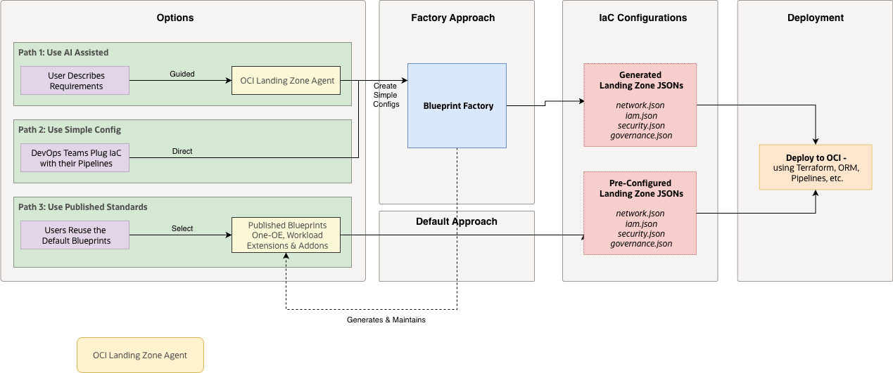

# **[OCI LZ Blueprint Factory](#)**
## **An OCI Open LZ [Addon](#) to Generate Runnable Blueprints**

&nbsp;

**Table of Contents**

[1. Overview](#1-overview)<br>
[2. Access Paths](#2-access-paths)<br>
[3. Configuration Syntax and Examples](#3-configuration-syntax-and-examples)<br>
[4. Generation Workflow](#4-generation-workflow)<br>
[5. Blueprint Inputs and Outputs](#5-blueprint-inputs-and-outputs)<br>
[6. Review and Security](#6-review-and-security)<br>
[7. Complementary Resources](#7-complementary-resources)<br>

&nbsp;

## 1. Overview

The **OCI LZ Blueprint Factory** creates runnable JSON configurations as variations of the OCI Open LZ, while also allowing customization of environments, CIDR ranges, additional projects, platforms, add-ons, or workload extensions.

For standard deployments that do not require updates, using the published blueprints remains the shortest path.

&nbsp;

## 2. Access Paths

The Blueprint Factory can be used in three ways:

<p align="center">
  
</p>

- **AI-assisted path**: use the [OCI LZ AI Agent](/addons/oci-lz-ai-agent/README.md) to help discover requirements and draft a config-driven input.
- **Direct config path**: write or update the configuration directly, then run config mode generation.
- **Published blueprint path**: select an existing repository blueprint, workload extension, or add-on when the target design already matches a published option.

Paths 1 and 2 produce customer-specific generated files. Path 3 does not require a custom factory run.

&nbsp;

## 3. Configuration Syntax and Examples

The source configuration for the Blueprint Factory is a JSON document. JSON keeps the input easy to review, store, and compare in normal code review workflows. The generator also accepts Jsonnet for advanced composition, but the examples in this add-on use JSON.

A typical configuration describes the target Landing Zone in a few top-level blocks:

- **Region metadata**: the OCI region and short region label used by the naming convention.
- **Hub**: the selected hub model and hub network range.
- **Environments**: environment-specific networks, projects, platforms, and workload extensions.
- **Extension parameters**: workload-specific settings, such as OKE or Exadata options, when an extension is part of the design.

Example shape:

```json
{
  "region": "eu-frankfurt-1",
  "region_short_name": "fra",
  "hub": {
    "kind": "hub_b",
    "network": {
      "vcn": "10.0.0.0/21"
    }
  },
  "environments": {
    "prod": {
      "shared_project_network": {
        "network": {
          "vcn": "10.0.64.0/21"
        }
      },
      "projects": {
        "proj1": {}
      },
      "platforms": {
        "oke": {
          "network": {
            "vcn": "10.0.96.0/22"
          },
          "extension": {
            "type": "oke_simple",
            "params": {
              "kubernetes_version": "v1.35.2",
              "services_cidr": "172.16.0.0/16",
              "api_endpoint_allowed_cidrs": [
                "10.0.1.0/24"
              ]
            }
          }
        }
      }
    }
  }
}
```

Not every configuration needs every block. A small Landing Zone may only define a hub and one or two environments, while a larger design may add platforms, projects, and workload extensions.

The [examples](./examples) folder contains small and medium-size config files that can be used as starting points for common Blueprint Factory scenarios.

| Example | Shows |
|---|---|
| [Single environment](./examples/01-single-environment.json) | One environment with a project network and one project. |
| [Prod and preprod projects](./examples/02-prod-preprod-projects.json) | Two environments, project networks, and multiple projects. |
| [Prod with OKE](./examples/03-prod-oke.json) | Environment-scoped OKE platform using the `oke_simple` extension. |
| [Shared ExaCS with Autonomous DB tiers](./examples/04-shared-exacs-autonomous.json) | Shared ExaCS platform and project DB tiers across environments. |

Generate any example from the repository root:

```bash
bash gen/generate.sh --config addons/oci-lz-blueprint-factory/examples/01-single-environment.json generated
```

Use the examples as readable patterns. Replace region, hub model, environment names, CIDRs, project names, extension parameters, and notification emails with values reviewed for the target deployment.

&nbsp;

## 4. Generation Workflow

The factory flow starts with a source configuration and produces a generated file set for review and deployment. Run config mode from the repository root:

```bash
bash gen/generate.sh --config <config_file> [output_dir]
```

At a high level, the factory:

1. Reads the source configuration.
1. Applies the repository Landing Zone patterns for the selected hub, environments, and workload extensions.
1. Produces a generated output package in the selected output directory.
1. Leaves the generated files ready for review before Terraform or OCI Resource Manager deployment.

The output package commonly includes files such as:

- `network.json`
- `iam.json`
- `governance.json`
- `security_cis1.json`
- `security_cis2.json`
- `observability_cis1.json`
- `observability_cis2.json`

Some configurations emit `*_pre.json` files, such as `network_pre.json` or `observability_*_pre.json`. These files support staged deployments where some resources need to exist before dependent resources are configured.

See the [Generator README](/gen/README.md) for local setup and command details.

&nbsp;

## 5. Blueprint Inputs and Outputs

The Blueprint Factory works with two kinds of artifacts: a reviewed source configuration and the generated Landing Zone output package.

| Item | Purpose | Example |
|---|---|---|
| Source configuration | A compact, versionable description of the intended Landing Zone shape: regions, environments, network ranges, hub model, platforms, projects, and workload extensions. | `config.json` |
| Generated output package | A reviewable set of JSON files grouped by Landing Zone domain, such as network, identity, security, governance, and observability. | `generated/` |

The source configuration is the design input. The generated output package is the deployment input produced from that design. Keeping both visible makes architecture review, security review, and later design updates easier to follow.

The generated package commonly represents:

- **Network**: hub, spoke, routing, gateway, and subnet structures.
- **Identity**: compartments, groups, and policy surfaces.
- **Security**: Landing Zone security controls and security-rule outputs.
- **Governance**: tag and naming-related configuration.
- **Observability**: logging, alarms, notifications, and related monitoring outputs when enabled.

For customer work, these artifacts normally live in private, organization-approved repositories, buckets, or working directories.

&nbsp;

## 6. Review and Security

Generated files are reviewable deployment inputs. Review usually focuses on:

- Landing Zone shape, environment names, and workload placement.
- CIDR planning and connectivity assumptions.
- IAM scope, compartment structure, and security controls.
- Generated file set and any staged `*_pre.json` outputs.
- Regulatory, internal compliance, and organization-specific deployment requirements.

Deployment follows the standard [Terraform deployment guide](/commons/content/terraform.md) or [OCI Resource Manager deployment guide](/commons/content/orm.md). Requirements outside the current Landing Zone framework are handled as separate post-deployment work.

&nbsp;

## 7. Complementary Resources

| Resource | Purpose |
|---|---|
| [OCI LZ AI Agent](/addons/oci-lz-ai-agent/README.md) | AI-assisted discovery and config drafting guidance. |
| [Generator README](/gen/README.md) | Local setup and generator commands. |
| [Generator Architecture](/gen/AGENTS.md) | Advanced generator reference for repository contributors. |
| [Jsonnet Composition Guide](/gen/JSONNET_COMPOSITION.md) | Advanced composition reference for repository contributors. |
| [One-OE Runtime Documentation](/blueprints/one-oe/runtime/one-stack/readme.md) | Published blueprint runtime reference. |
| [OCI Network Hubs](/addons/oci-hub-models/readme.md) | Published hub model add-ons. |
| [Workload Extensions](/workload-extensions/readme.md) | Published workload extension entry point. |

#### License

Copyright (c) 2026 Oracle and/or its affiliates.

Licensed under the Universal Permissive License (UPL), Version 1.0.

See [LICENSE](../../LICENSE.txt) for more details.
