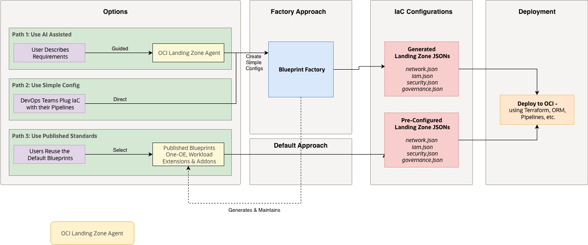

# **[OCI LZ Blueprint Factory](#)**
## **An OCI Open LZ [Addon](#) to Generate Runnable Blueprints**

&nbsp;

**Table of Contents**

[1. Overview](#1-overview)<br>
[2. Access Paths](#2-access-paths)<br>
[3. Configuration Syntax and Examples](#3-configuration-syntax-and-examples)<br>
[4. Generation Workflow](#4-generation-workflow)<br>
[5. Blueprint Inputs and Outputs](#5-blueprint-inputs-and-outputs)<br>
[6. Review and Security](#6-review-and-security)<br>
[7. Complementary Resources](#7-complementary-resources)<br>

&nbsp;

## 1. Overview

The **OCI LZ Blueprint Factory** creates runnable JSON configurations as variations of the OCI Open LZ, while also allowing customization of environments, CIDR ranges, additional projects, platforms, add-ons, or workload extensions.

For standard deployments that do not require updates, using the published blueprints remains the shortest path.

&nbsp;

## 2. Access Paths

The Blueprint Factory can be used in three ways:

<p align="center">
  
</p>

- **AI-assisted path**: use the [OCI LZ AI Agent](/addons/oci-lz-ai-agent/README.md) to help discover requirements and draft a config-driven input.
- **Direct config path**: write or update the configuration directly, then run config mode generation.
- **Published blueprint path**: select an existing repository blueprint, workload extension, or add-on when the target design already matches a published option.

Paths 1 and 2 produce customer-specific generated files. Path 3 does not require a custom factory run.

### One-OE Disaster Recovery preset

When the AI-assisted Factory path establishes the One-OE baseline, it asks: **Do you want to deploy a Disaster Recovery (DR) region?**

If the answer is yes, the currently supported preset uses `eu-frankfurt-1` as the home region and `eu-amsterdam-1` as the DR region. It deploys a DR hub VCN using `10.0.192.0/21` and a PROD VCN using `10.0.200.0/21`. This preset does not include preproduction and does not support Multi-OE DR. Use a reviewed custom Factory design for another regional topology or CIDR allocation.

&nbsp;

## 3. Configuration Syntax and Examples

The source configuration for the Blueprint Factory is a JSON document. JSON keeps the input easy to review, store, and compare in normal code review workflows. The generator also accepts Jsonnet for advanced composition; see the [Blueprint Factory Configuration Reference](./blueprint-factory-configuration-reference.md) for the supported configuration shape. The examples in this add-on use JSON.

A typical configuration describes the target Landing Zone in a few top-level blocks:

- **Region metadata**: the OCI region and short region label used by the naming convention.
- **Stack scope**: whether the source owns the complete Landing Zone domains or only supported regional resources.
- **Hub**: the selected hub model and hub network range.
- **Environments**: environment-specific networks, projects, platforms, and workload extensions.
- **Extension parameters**: workload-specific settings, such as OKE or Exadata options, when an extension is part of the design.
- **Remote peering connections**: peer role, region, remote routable CIDRs, and optional cross-tenancy identifiers for RPC designs.

Example shape:

```json
{
  "region": "eu-frankfurt-1",
  "region_short_name": "fra",
  "stack_scope": "complete",
  "hub": {
    "kind": "hub_b",
    "network": {
      "vcn": "10.0.0.0/21"
    }
  },
  "environments": {
    "prod": {
      "project_network": {
        "network": {
          "vcn": "10.0.64.0/21"
        }
      },
      "projects": {
        "proj1": {}
      },
      "platforms": {
        "oke": {
          "network": {
            "vcn": "10.0.96.0/20"
          },
          "extension": {
            "type": "oke_simple",
            "params": {
              "kubernetes_version": "v1.35.2",
              "services_cidr": "172.16.0.0/16",
              "api_endpoint_allowed_cidrs": [
                "10.0.1.0/24"
              ]
            }
          }
        }
      }
    }
  }
}
```

Not every configuration needs every block. A hub-only Landing Zone may omit environments, while a larger design may add environments, platforms, projects, and workload extensions. `project_network` is optional and supports both shared and project-dedicated subnet allocations. Prefer shared subnets for address efficiency; dedicated allocation does not provide IAM isolation. See the [Blueprint Factory Configuration Reference](./blueprint-factory-configuration-reference.md#4-project-network) for the complete contract and routing implications.

The [examples](./examples) folder contains small and medium-size config files that can be used as starting points for common Blueprint Factory scenarios.

| Example | Shows |
|---|---|
| [No environments](./examples/00-no-environments.json) | Shared Landing Zone services and a hub, without environment compartments or spoke networks. |
| [Single environment](./examples/01-single-environment.json) | One environment with a project network and one project. |
| [Prod and preprod projects](./examples/02-prod-preprod-projects.json) | Two environments, project networks, and multiple projects. |
| [Prod with OKE](./examples/03-prod-oke.json) | Environment-scoped OKE platform using the `oke_simple` extension. |
| [Shared ExaCS with Autonomous DB tiers](./examples/04-shared-exacs-autonomous.json) | Shared ExaCS platform and project DB tiers across environments. |
| [Cross-tenancy RPC acceptor](./examples/05-xrpc-cross-tenancy-acceptor.json) | Tenancy 1 acceptor with dynamic environment routing and cross-tenancy Admit policy. |
| [Cross-tenancy RPC requester](./examples/06-xrpc-cross-tenancy-requester.json) | Tenancy 2 requester with peer RPC reference and cross-tenancy Allow/Endorse policy. |
| [One-OE regional DR pair](./examples/oneoe-dr/) | Independently generated home acceptor and regional DR requester configurations. |

Generate any example from the repository root:

```bash
bash gen/generate.sh --config addons/oci-lz-blueprint-factory/examples/01-single-environment.json generated
```

Use the examples as readable patterns. Replace region, hub model, environment names, CIDRs, project names, extension parameters, and notification emails with values reviewed for the target deployment.

The RPC examples form a Hub A acceptor and Hub B requester pair. Generate and review both sides separately. Deploy the acceptor side first, collect its RPC OCID, replace the requester's `peer_id` placeholder, and then generate or deploy the requester side. Environment names and counts are examples only; the factory derives routing from whatever network-producing environments and platforms each customer config defines. See the [X-RPC Blueprint Factory guide](../oci-x-rpc/runtime/x-rpc-blueprint-factory.md) for the complete role, IAM, routing, and generation contract.

Generate each explicit One-OE DR deployment unit independently:

```bash
bash gen/generate.sh --config \
  addons/oci-lz-blueprint-factory/examples/oneoe-dr/home.json \
  generated/oneoe-dr/home

bash gen/generate.sh --config \
  addons/oci-lz-blueprint-factory/examples/oneoe-dr/dr.json \
  generated/oneoe-dr/dr
```

Deploy `generated/oneoe-dr/home/` and `generated/oneoe-dr/dr/` with different OCI Resource Manager stacks or Terraform states. The home source config declares `stack_scope: "complete"` and explicitly defines the acceptor. The DR source config declares `stack_scope: "regional"` and explicitly defines the requester. The published production DR guidance uses the firewalled Hub A, Hub B, and Hub C models; Hub E remains a supported Blueprint Factory hub but is not advertised for production DR.

Both source configs use the shared `remote_peering_connections` contract and contain their reviewed peer CIDRs and regions. The requester refers to the acceptor by its dependency key or reviewed RPC OCID. No DR-specific RPC schema or RPC-specific replacement file is generated.

```text
generated/oneoe-dr/
├── home/
│   ├── network_pre.json   # staged hubs only
│   ├── network.json       # final network, including the acceptor
│   ├── iam.json
│   ├── governance.json
│   └── ...
└── dr/
    ├── network_pre.json   # staged hubs only
    ├── network.json       # final network, including the requester
    ├── security_cis2.json # regional VSS only for this CIS2 example
    ├── observability_cis2_pre.json
    ├── observability_cis2.json
    └── ...
```

Apply the home stack through its required network stages and save the network output containing the acceptor. Make that output available to the DR stack as `network_dependency`, then apply the DR stack through its required stages. Finally, verify the RPC lifecycle state, routes, and firewall policy in both directions. Hub A, Hub B, and Hub C still use the ordinary `network_pre.json` staging step before their final `network.json`; RPC does not introduce another staging filename.

The home directory contains the complete home-owned output set. The DR directory is deliberately projected to regional network, VSS, and observability outputs. It omits IAM, governance, Cloud Guard, Security Zones, primary Vault resources, platforms, and workload extensions so those home-owned resources and their prerequisites cannot be claimed by the DR state.

When adding DR to an existing config-generated home region, retain `stack_scope: "complete"` and add the acceptor entry. Define the requester in the new `stack_scope: "regional"` source. Generate both independently, update the existing home stack, and replicate its updated network dependency output before deploying the DR stack. Keep home and DR in separate stacks or Terraform states. For CIS2, treat the replicated Vault/key and required regional service permissions as separately reviewed prerequisites.

&nbsp;

## 4. Generation Workflow

The factory flow starts with a source configuration and produces a generated file set for review and deployment. Run config mode from the repository root:

```bash
bash gen/generate.sh --config <config_file> [output_dir]
```

For a regional DR pair, generate the complete home and regional DR sources independently:

```bash
bash gen/generate.sh --config <home_config> <home_output_dir>
bash gen/generate.sh --config <dr_config> <dr_output_dir>
```

The two config runs publish a complete home package and a regional-only DR package. Each package contains one canonical final network configuration; the acceptor and requester are part of those normal files.

At a high level, the factory:

1. Reads the source configuration.
1. Applies the repository Landing Zone patterns for the selected hub, environments, and workload extensions.
1. Produces a generated output package in the selected output directory.
1. Leaves the generated files ready for review before Terraform or OCI Resource Manager deployment.

The output package includes the common files below and only the security and
observability pair selected by `cis_level` (`2` by default):

- `network.json`
- `iam.json`
- `governance.json`
- `security_cis1.json` or `security_cis2.json`
- `observability_cis1.json` or `observability_cis2.json`

Some configurations emit `*_pre.json` files, such as `network_pre.json` or `observability_*_pre.json`. These files support staged deployments where some resources need to exist before dependent resources are configured.

See the [Generator README](/gen/README.md) for local setup and command details.

&nbsp;

## 5. Blueprint Inputs and Outputs

The Blueprint Factory works with two kinds of artifacts: a reviewed source configuration and the generated Landing Zone output package.

| Item | Purpose | Example |
|---|---|---|
| Source configuration | A compact, versionable description of the intended Landing Zone shape: regions, environments, network ranges, hub model, platforms, projects, and workload extensions. | `config.json` |
| Generated output package | A reviewable set of JSON files grouped by Landing Zone domain, such as network, identity, security, governance, and observability. | `generated/` |

The source configuration is the design input. The generated output package is the deployment input produced from that design. Keeping both visible makes architecture review, security review, and later design updates easier to follow.

The generated package commonly represents:

- **Network**: hub, spoke, routing, gateway, and subnet structures.
- **Identity**: compartments, groups, and policy surfaces.
- **Security**: Landing Zone security controls and security-rule outputs.
- **Governance**: tag and naming-related configuration.
- **Observability**: logging, alarms, notifications, and related monitoring outputs when enabled.

For customer work, these artifacts normally live in private, organization-approved repositories, buckets, or working directories.

&nbsp;

## 6. Review and Security

Generated files are reviewable deployment inputs. Review usually focuses on:

- Landing Zone shape, environment names, and workload placement.
- CIDR planning and connectivity assumptions.
- IAM scope, compartment structure, and security controls.
- Generated file set and any staged `*_pre.json` outputs.
- Regulatory, internal compliance, and organization-specific deployment requirements.

Deployment follows the standard [Terraform deployment guide](/commons/content/terraform.md) or [OCI Resource Manager deployment guide](/commons/content/orm.md). Requirements outside the current Landing Zone framework are handled as separate post-deployment work.

&nbsp;

## 7. Complementary Resources

| Resource | Purpose |
|---|---|
| [OCI LZ AI Agent](/addons/oci-lz-ai-agent/README.md) | AI-assisted discovery and config drafting guidance. |
| [Blueprint Factory Configuration Reference](./blueprint-factory-configuration-reference.md) | Blueprint Factory configuration elements and supported shapes. |
| [Generator README](/gen/README.md) | Local setup and generator commands. |
| [Generator Architecture](/gen/AGENTS.md) | Advanced generator reference for repository contributors. |
| [Jsonnet Composition Guide](/gen/JSONNET_COMPOSITION.md) | Advanced composition reference for repository contributors. |
| [One-OE Runtime Documentation](/blueprints/one-oe/runtime/one-stack/readme.md) | Published blueprint runtime reference. |
| [OCI Network Hubs](/addons/oci-hub-models/readme.md) | Published hub model add-ons. |
| [Workload Extensions](/workload-extensions/readme.md) | Published workload extension entry point. |

#### License

Copyright (c) 2026 Oracle and/or its affiliates.

Licensed under the Universal Permissive License (UPL), Version 1.0.

See [LICENSE](../../LICENSE.txt) for more details.
