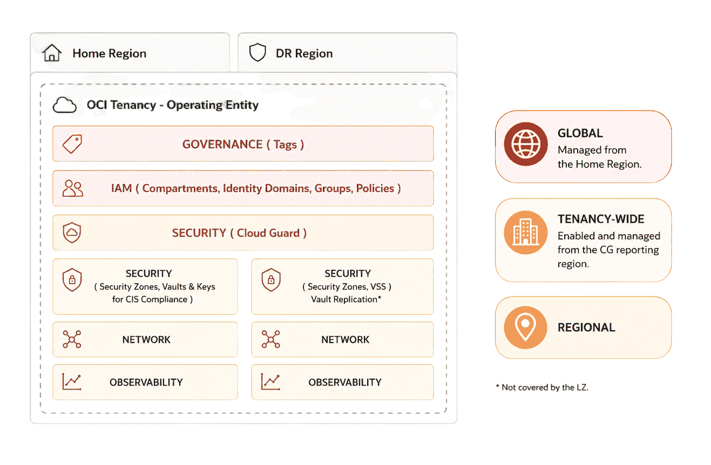
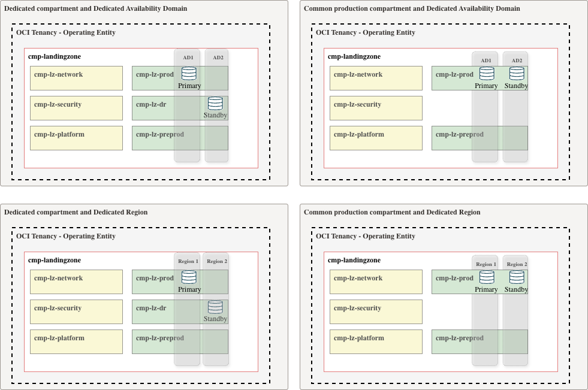

# **[OCI LZ BCDR](#)**
## **An OCI Open LZ [Addon](#) for Business Continuity and Disaster Recovery landing zone blueprints**

&nbsp;

**Table of Contents**

[1. Overview](#1-overview) 
[2. Deployment Guide](#2-deployment-guide) 
[3. License](#3-license) 

## 1. Overview

The **OCI LZ BCDR** addon provides the core landing zone resources required to support **Business Continuity** and **Disaster Recovery** scenarios for OCI Landing Zone blueprints. It complements a landing zone with the network, security and observability components required to support recovery scenarios across regions. 

### Landing Zone DR design considerations

- The Landing Zone design is built around key pillars, including **identity**, **security**, **networking**, **observability**, and **operations**. From a Business Continuity and Disaster Recovery (BC/DR) perspective, the architecture should minimize single points of failure across these pillars and ensure that critical capabilities remain available or can be recovered in the event of a failure or disaster.
- In **multi-region** landing zones, global IAM resources such as compartments, groups, and policies should be reused consistently, while regional resources such as VCNs, vaults, events, topics, and subscriptions must be explicitly provisioned in each target region.
- **Identity and security**: IAM resources, including compartments, users, groups, and policies, are managed from the home region and available across subscribed regions. Regional security resources, such as vaults, keys, secrets, and workload-specific security controls, must be deployed or replicated in the DR region as part of the workload recovery plan.
- **Networking** requirements vary depending on the DR scenario: inter-AD designs use regional subnets and resources, while cross-region designs require inter-region peering. Resources are provisioned in their respective regions.
- **Observability** resources, including events, alarms, and logs, are managed on a per-region basis.

  

*Figure 1. BCDR resource scope: IAM and governance are reused from the home region, Cloud Guard is tenancy-wide, and network and observability are deployed per region. Vault replication is outside the landing zone scope.*

- For **operations**, the platform must be resilient enough to support provisioning and day-to-day operation of the solution, including CI/CD, monitoring, and third-party integrations. Multi-region deployment state should be managed separately per region, for example with distinct OCI Resource Manager stacks or Terraform workspaces, so each regional deployment can be planned, applied, and operated independently.

*Figure 2. DR deployment options across Availability Domains or regions. The DR workload can reuse the production compartment or run in a dedicated DR compartment; each option can use a separate Availability Domain or a dedicated region. The selected model has different resource provisioning and maintenance requirements. A dedicated DR compartment is useful when a separate team manages DR resources.*

To review best practices about BCDR, go [here](BCDR-best-practices.md).

## 2. Deployment Guide

> [!NOTE]
> This add-on covers the DR Landing Zone scope. It does not deploy the workloads themselves; select and implement a dedicated [DR strategy](./BCDR-best-practices.md#5-dr-strategies) in a separate phase.

1. Confirm the DR scenario, workloads, regions, tenancy boundaries, connectivity model, and recovery objectives.
2. Deploy or confirm the [One-OE baseline](../../blueprints/one-oe/runtime/one-stack/readme.md) in the home region.
3. You may use the same hub model and CIS level as the home-region baseline; this is the published deployment scenario covered by this add-on. A DR design may instead use a simpler, lower-cost hub model where appropriate, but it requires reviewed, compatible JSON configuration files for that design. If your scenario is not listed, use the [OCI LZ Blueprint Factory](../oci-lz-blueprint-factory/README.md) to create your custom JSON configuration files.

   | Deployment | Use when | Deployment guide |
   |---|---|---|
   | One-OE | The DR environment requires the One-OE landing zone baseline without any workload extension. | [One-OE BCDR](one-oe/README.md) |

4. Run Terraform plan and apply for the DR LZ extension.
5. Configure inter-region connectivity with the [OCI Remote Peering Connections addon](../oci-x-rpc/README.md), using its same-tenancy or cross-tenancy procedure for the selected DR scenario.
6. Validate connectivity, failover behavior, workload replication health, access to keys and secrets in the DR region, monitoring, and operational runbooks.

&nbsp;

## 3. License

Copyright (c) 2026 Oracle and/or its affiliates.

Licensed under the Universal Permissive License (UPL), Version 1.0.

See [LICENSE](/LICENSE.txt) for more details.
