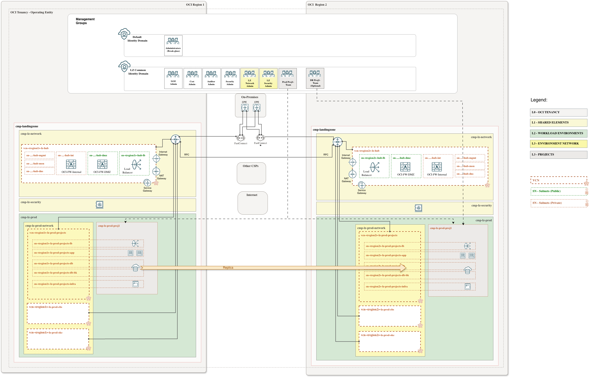

# **OCI LZ BCDR for One-OE**
## **Extending the One-OE baseline with regional BCDR resources**

&nbsp;

**Table of Contents**

[1. Overview](#1-overview) 
[2. Design](#2-design) 
[3. Scope](#3-scope) 
[4. Deployment model](#4-deployment-model) 
[5. Source baseline](#5-source-baseline) 
[6. License](#6-license) 

&nbsp;

### 1. Overview

This folder contains the One-OE specific BCDR extension files for the published One-OE one-stack baseline.

The extension is intended to add regional resources required for Business Continuity and Disaster Recovery while reusing the global baseline resources already managed from the tenancy home region.

&nbsp;

### 2. Design

The One-OE BCDR design extends an existing One-OE baseline into a DR region without duplicating the home-region global control plane.

Key design rules:

- The DR region must use the same hub model as the One-OE baseline deployed in the home region, unless a different design is explicitly reviewed and approved. The diagram above represents this pattern using Hub A as an example.
- IAM, compartments, security baseline, governance, and other home-region managed resources are reused from the baseline deployment because they are **global** or home-region managed resources.
- **Regional** network resources are deployed in the DR region using the matching hub-model network file.
- **Regional** observability resources are deployed in the DR region so events, alarms, logs, topics, and service connectors can operate locally during a regional incident.
- Each DR region should be managed as an independent deployment unit with its own ORM stack or Terraform state, while consuming the required outputs from the baseline One-OE stack.

&nbsp;

### 3. Scope

For a One-OE BCDR extension, the required deployable files are limited to:

- **Network**: regional VCN, DRG, routing, peering, gateways, subnets, and other connectivity resources required by the selected DR pattern.
- **Observability**: regional events, alarms, logs, topics, subscriptions, and monitoring resources required to operate and validate the DR environment.

### 4. Deployment model

**Step 0. Prerequisite: [Deploy the One-OE baseline](/blueprints/one-oe/runtime/one-stack/readme.md)**

To work with multiple stacks, you need to use the orchestrator's outputs and dependencies features within [ORM](https://github.com/oci-landing-zones/oci-landing-zone-operating-entities/blob/master/commons/content/orm_bp.md).

**Step 1. Deploy the One-OE BCDR addon**

Select the deployment option that matches the hub model and CIS level already deployed in the home region. The DR observability file must follow the same CIS level as the baseline One-OE deployment.

| [**One-OE + Hub A BCDR**](#step-1-deploy-the-one-oe-bcdr-addon) | [**One-OE + Hub B BCDR**](#step-1-deploy-the-one-oe-bcdr-addon) | [**One-OE + Hub C BCDR**](#step-1-deploy-the-one-oe-bcdr-addon) | [**One-OE + Hub E BCDR**](#step-1-deploy-the-one-oe-bcdr-addon) |
|:-|:-|:-|:-|
| **Step 0: Deploy baseline** [One-OE + Hub A](/blueprints/one-oe/runtime/one-stack/one_oe_hub_a.md)  **Step 1: Extend for DR**  **CIS Level 1**:  `oneoe_bcdr_network_hub_a.json` `oneoe_bcdr_observability_cis1.json`  **CIS Level 2**:  `oneoe_bcdr_network_hub_a.json` `oneoe_bcdr_observability_cis2.json` | **Step 0: Deploy baseline** [One-OE + Hub B](/blueprints/one-oe/runtime/one-stack/one_oe_hub_b.md)  **Step 1: Extend for DR**  **CIS Level 1**:  `oneoe_bcdr_network_hub_b.json` `oneoe_bcdr_observability_cis1.json`  **CIS Level 2**:  `oneoe_bcdr_network_hub_b.json` `oneoe_bcdr_observability_cis2.json` | **Step 0: Deploy baseline** [One-OE + Hub C](/blueprints/one-oe/runtime/one-stack/one_oe_hub_c.md)  **Step 1: Extend for DR**  **CIS Level 1**:  `oneoe_bcdr_network_hub_c.json` `oneoe_bcdr_observability_cis1.json`  **CIS Level 2**:  `oneoe_bcdr_network_hub_c.json` `oneoe_bcdr_observability_cis2.json` | **Step 0: Deploy baseline** [One-OE + Hub E](/blueprints/one-oe/runtime/one-stack/one_oe_hub_e.md)  **Step 1: Extend for DR**  **CIS Level 1**:  `oneoe_bcdr_network_hub_e.json` `oneoe_bcdr_observability_cis1.json`  **CIS Level 2**:  `oneoe_bcdr_network_hub_e.json` `oneoe_bcdr_observability_cis2.json` |

Then follow these steps:

1. Accept terms and wait for the configuration to load.
2. Set the working directory to `rms-facade`.
3. Set the stack name you prefer.
4. Set the terraform version to 1.5.x. Click Next.
5. Accept the default files. Click Next. Optionally, replace with your reviewed JSON configuration files.
6. Configure the stack dependencies so the BCDR addon consumes the required outputs from the baseline One-OE stack.
7. Un-check run apply. Click Create.
8. Run Plan and review the proposed regional network and observability changes before applying.

**Step 2. Deploy inter-region RPC within the same tenancy**

After the One-OE BCDR addon is deployed, create the Remote Peering Connection (RPC) between the home-region DRG and the DR-region DRG inside the same tenancy.

Use the [OCI Remote Peering Connections addon](/addons/oci-x-rpc/README.md) to follow the required steps and automate this connectivity layer.

At a high level:

1. Create an RPC on the home-region DRG.
2. Create an RPC on the DR-region DRG.
3. Peer the two RPCs.
4. Update the required DRG route tables and VCN route tables in both regions.
5. Validate connectivity between the home-region and DR-region networks.

For deployable RPC examples and routing guidance, see the [OCI X-RPC runtime guide](/addons/oci-x-rpc/runtime/README.md).

> [!NOTE]
> The deployment button uses the published `master` branch raw URLs. If you are testing this addon from a feature branch, fork, or private repository, replace the default files in ORM with the reviewed JSON files from your own controlled source.

For cross-region DR, manage each target region as an independent deployment unit. Use a distinct OCI Resource Manager stack or Terraform state/workspace per region so that regional network and observability resources can be planned, applied, and operated independently.

Do not redeploy or duplicate IAM and security baseline files in the secondary region. Reuse the home-region IAM and security model and deploy only the regional network and observability extension files from this addon.

&nbsp;

### 5. Source baseline

The extension targets the published One-OE one-stack runtime baseline:

- [`blueprints/one-oe/runtime/one-stack/readme.md`](/blueprints/one-oe/runtime/one-stack/readme.md)
- [`blueprints/one-oe/runtime/one-stack`](/blueprints/one-oe/runtime/one-stack)

Use the selected One-OE hub model as the source reference for network shape, naming, DRG usage, route-table behavior, and any required staged `*_pre.json` deployment.

&nbsp;

### 6. License

Copyright (c) 2026 Oracle and/or its affiliates.

Licensed under the Universal Permissive License (UPL), Version 1.0.

See [LICENSE](/LICENSE.txt) for more details.
