# **OCI LZ BCDR for One-OE**
## **Extending the One-OE blueprint with regional BCDR resources**

&nbsp;

**Table of Contents**

- [**OCI LZ BCDR for One-OE**](#oci-lz-bcdr-for-one-oe)
  - [**Extending the One-OE blueprint with regional BCDR resources**](#extending-the-one-oe-blueprint-with-regional-bcdr-resources)
  - [1. Overview](#1-overview)
  - [2. Design](#2-design)
  - [3. Scope](#3-scope)
  - [4. Deployment model](#4-deployment-model)
    - [4.0. Prerequisite: Deploy the One-OE blueprint](#40-prerequisite-deploy-the-one-oe-blueprint)
    - [4.1. Deploy the One-OE DR Extension](#41-deploy-the-one-oe-dr-extension)
      - [4.1.1. Complete staged hub networking](#411-complete-staged-hub-networking)
      - [4.1.2. Complete staged observability](#412-complete-staged-observability)
      - [4.1.3. Configure Service Connector bucket replication](#413-configure-service-connector-bucket-replication)
    - [4.2. Deploy inter-region RPC within the same tenancy](#42-deploy-inter-region-rpc-within-the-same-tenancy)
      - [4.2.1. Replace the Amsterdam requester and Frankfurt acceptor network files](#421-replace-the-amsterdam-requester-and-frankfurt-acceptor-network-files)
- [License](#license)

&nbsp;

## 1. Overview

This folder contains the Disaster Recovery (DR) extension for the published One-OE One-Stack blueprint.

The extension deploys the regional resources required in the DR Region to support cross-region Business Continuity and Disaster Recovery (BC/DR). It complements the existing One-OE blueprint by reusing resources that are centrally managed from the tenancy’s Home Region and available across regions.

&nbsp;

## 2. Design

The One-OE BC/DR design extends an existing One-OE blueprint into a DR region while reusing tenancy-level resources managed from the home region.

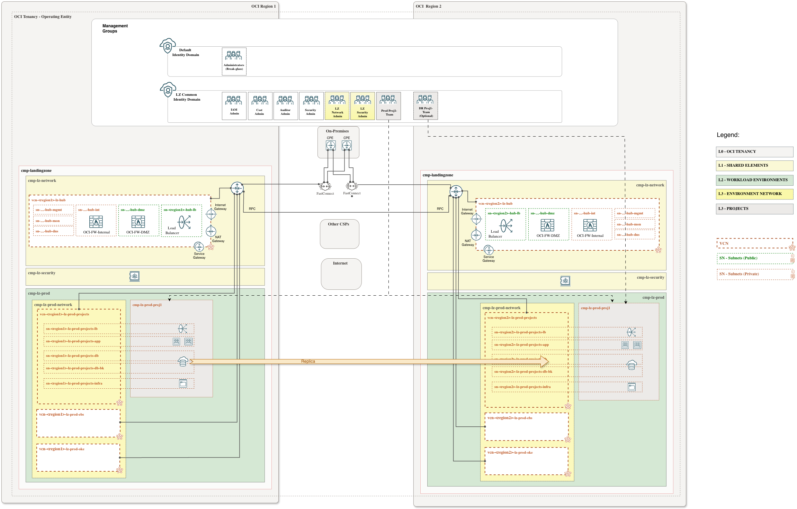

<p align="center"><em>Figure 1</em></p>

<p align="left"><strong>Figure 1: Generic two-region One-OE disaster recovery architecture</strong></p>

The architecture shows shared management groups, regional hub and production networks, and data replication to the DR region.

&nbsp;

## 3. Scope

For a One-OE DR cross-region extension, the required deployable files are limited to:

- **Network**: regional VCN, DRG, routing, peering, gateways, subnets, and other connectivity resources required by the selected DR pattern.
- **Inter-region connectivity**: Remote Peering Connection (RPC) resources and the associated DRG attachments and routes. RPC resources are not part of the initial BCDR stack; they are added in the staged connectivity step after the regional network is deployed. Use the [OCI Remote Peering Connections addon](../../oci-x-rpc/README.md) for cross-tenancy scenarios.
- **Observability**: regional events, alarms, logs, topics, subscriptions, and monitoring resources required to operate and validate the DR environment.
- **Security and governance**: the regional Vulnerability Scanning Service (VSS) configuration is deployed by this addon. Tenancy-wide resources, such as Cloud Guard and Security Zones, remain managed by the One-OE blueprint from the home region and are not redeployed in the DR region.

## 4. Deployment model

### 4.0. Prerequisite: Deploy the One-OE blueprint

| [**One-OE + Hub A**](../../../blueprints/one-oe/runtime/one-stack/one_oe_hub_a.md) | [**One-OE + Hub B**](../../../blueprints/one-oe/runtime/one-stack/one_oe_hub_b.md) | [**One-OE + Hub C**](../../../blueprints/one-oe/runtime/one-stack/one_oe_hub_c.md) | [**One-OE + Hub E**](../../../blueprints/one-oe/runtime/one-stack/one_oe_hub_e.md) |
|:-|:-|:-|:-|
| 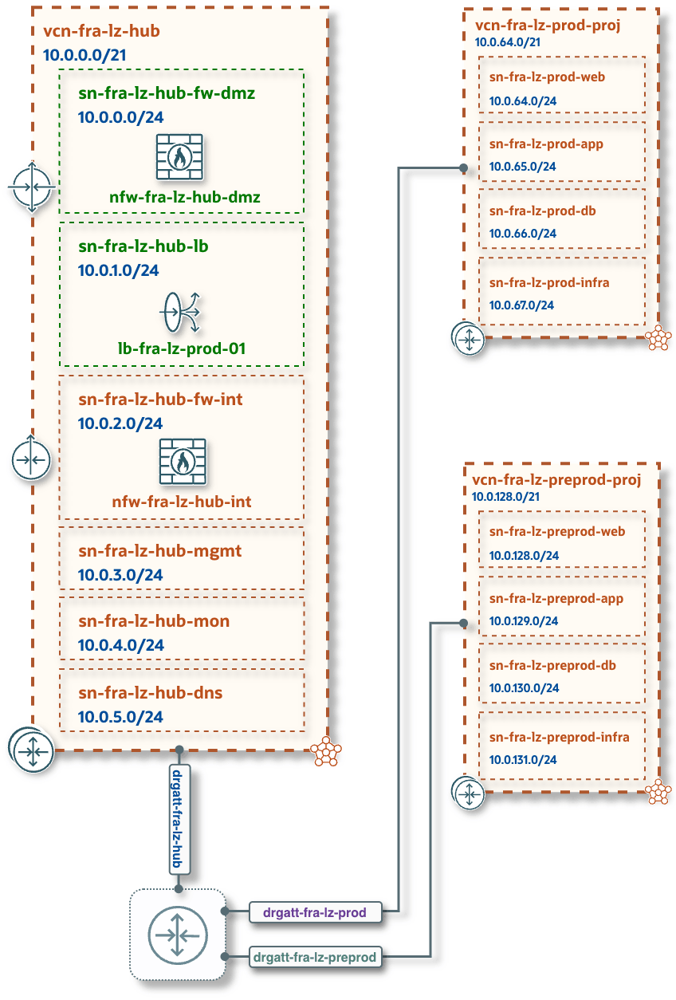 | 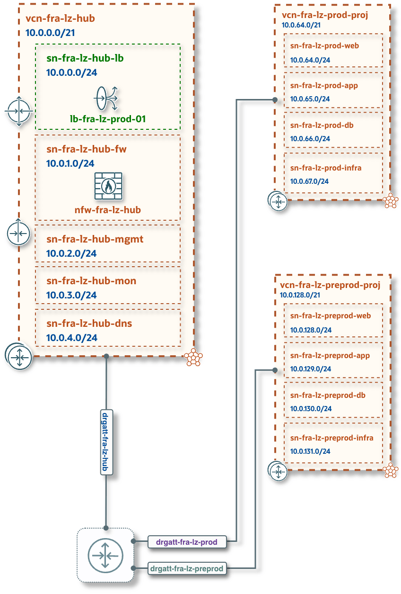 | 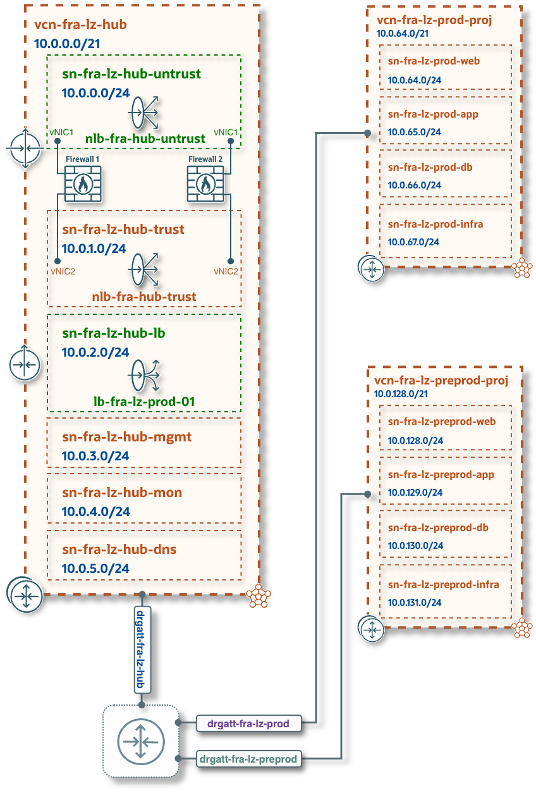 | 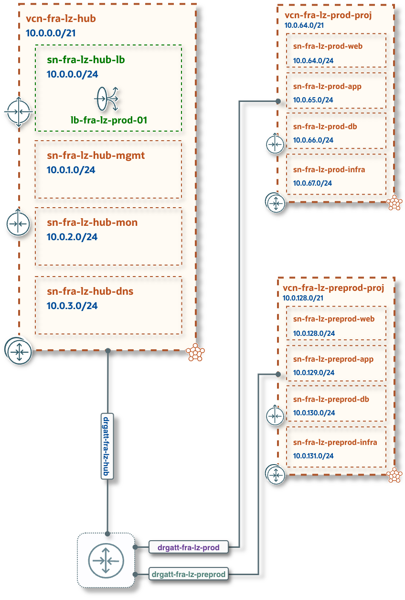 |

This is a multi-stack deployment. Section 4.0 deploys the One-OE blueprint stack in the home region, and Section 4.1 deploys the regional BCDR add-on stack in the DR region. Before creating the Section 4.1 stack, replicate the One-OE output dependency files from an Object Storage bucket in the home region to a bucket in the DR region. Configure the add-on stack to consume the required blueprint outputs by using the orchestrator's outputs and dependencies features described in the [OCI Resource Manager multi-stack deployment guide](https://github.com/oci-landing-zones/oci-landing-zone-operating-entities/blob/master/commons/content/orm_bp.md). This replication is separate from the Service Connector bucket replication in Section 4.1.3.

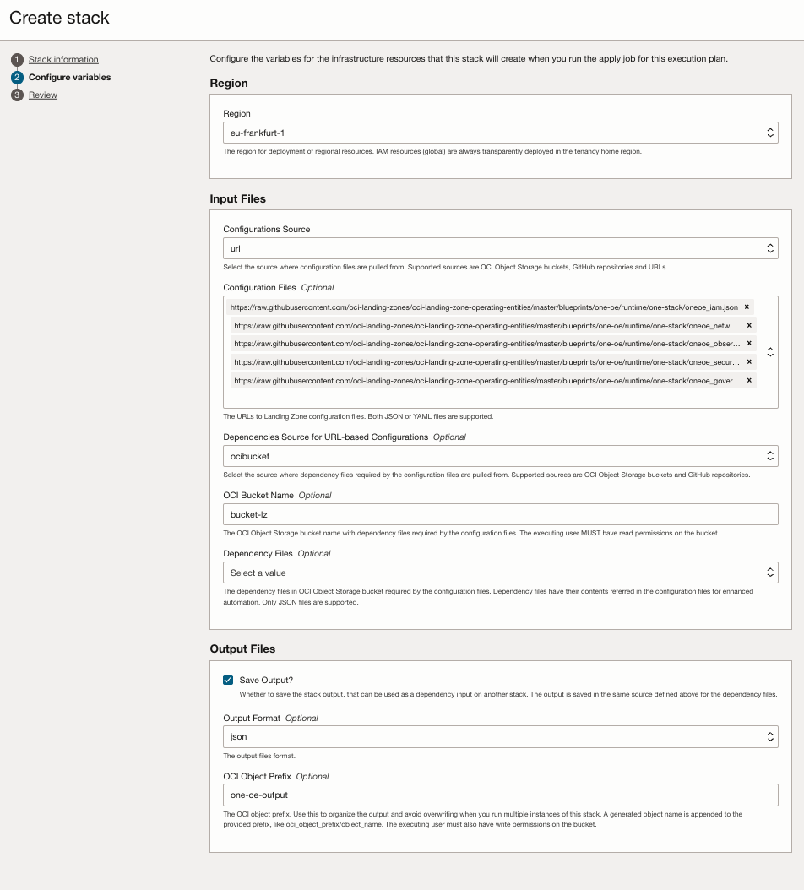

<p align="center"><em>Figure 2</em></p>

<p align="left"><strong>Figure 2: Home-region One-OE stack in Frankfurt</strong></p>

It saves output dependency files in Object Storage so they can be replicated for the BCDR stack.

### 4.1. Deploy the One-OE DR Extension

> [!NOTE]
> Our One-OE blueprint uses `eu-frankfurt-1` as the home region. For the DR extension, we use `eu-amsterdam-1` as the DR region.

The DR environment may follow the same hub model and CIS security level as the primary environment, aligned with the One-OE blueprint configuration already deployed.

For a different region pair or DR topology, use the [OCI LZ Blueprint Factory](../../oci-lz-blueprint-factory/README.md) to create and review custom JSON configuration files.

All deployable BCDR JSON configuration files are in the [`runtime`](./runtime/) directory.

For cross-region DR, manage each target region as an independent deployment unit. Use a distinct OCI Resource Manager stack or Terraform state/workspace per region so that regional network and observability resources can be planned, applied, and operated independently.

The initial BCDR stack deploys only the regional network and observability files, plus the regional VSS file from this addon. RPC resources are deployed later in Section 4.2 through the requester and acceptor network replacements. Reuse the home-region IAM and tenancy-wide security and governance model; do not redeploy or duplicate those resources in the secondary region.

| CIS Level 1 | CIS Level 2 |
|---|---|
| **Hub A:** [][orm-cis1-hub-a]<br>`oneoe_bcdr_network_hub_a_pre.json`<br>`oneoe_bcdr_observability_cis1_pre.json`<br>`oneoe_bcdr_security.json`<br><br>**Hub B:** [][orm-cis1-hub-b]<br>`oneoe_bcdr_network_hub_b_pre.json`<br>`oneoe_bcdr_observability_cis1_pre.json`<br>`oneoe_bcdr_security.json`<br><br>**Hub C:** [][orm-cis1-hub-c]<br>`oneoe_bcdr_network_hub_c_pre.json`<br>`oneoe_bcdr_observability_cis1_pre.json`<br>`oneoe_bcdr_security.json`<br><br>**Hub E:** [][orm-cis1-hub-e]<br>`oneoe_bcdr_network_hub_e.json`<br>`oneoe_bcdr_observability_cis1_pre.json`<br>`oneoe_bcdr_security.json` | **Hub A:** [][orm-cis2-hub-a]<br>`oneoe_bcdr_network_hub_a_pre.json`<br>`oneoe_bcdr_observability_cis2_pre.json`<br>`oneoe_bcdr_security.json`<br><br>**Hub B:** [][orm-cis2-hub-b]<br>`oneoe_bcdr_network_hub_b_pre.json`<br>`oneoe_bcdr_observability_cis2_pre.json`<br>`oneoe_bcdr_security.json`<br><br>**Hub C:** [][orm-cis2-hub-c]<br>`oneoe_bcdr_network_hub_c_pre.json`<br>`oneoe_bcdr_observability_cis2_pre.json`<br>`oneoe_bcdr_security.json`<br><br>**Hub E:** [][orm-cis2-hub-e]<br>`oneoe_bcdr_network_hub_e.json`<br>`oneoe_bcdr_observability_cis2_pre.json`<br>`oneoe_bcdr_security.json`
| | **Note — CIS Level 2:** Before deploying the AMS BCDR stack, replicate the Vault and the `KEY-LZ-SHARED-OSS-AUDIT-BKT-KEY` key to Amsterdam. Provide the OCID of the AMS key replica through `kms_dependency.keys.KEY-LZ-SHARED-OSS-AUDIT-BKT-KEY` so `bkt-ams-lz-service-connector` uses customer-managed encryption. See [Replicating Vaults and Keys](https://docs.oracle.com/en-us/iaas/Content/KeyManagement/Tasks/replicatingvaults.htm). |

[orm-cis1-hub-a]: <https://cloud.oracle.com/resourcemanager/stacks/create?zipUrl=https://github.com/oci-landing-zones/terraform-oci-modules-orchestrator/archive/refs/tags/v2.1.1.zip&zipUrlVariables={"input_config_files_urls":"https://raw.githubusercontent.com/oci-landing-zones/oci-landing-zone-operating-entities/master/addons/oci-lz-dr/one-oe/runtime/oneoe_bcdr_network_hub_a_pre.json,https://raw.githubusercontent.com/oci-landing-zones/oci-landing-zone-operating-entities/master/addons/oci-lz-dr/one-oe/runtime/oneoe_bcdr_observability_cis1_pre.json,https://raw.githubusercontent.com/oci-landing-zones/oci-landing-zone-operating-entities/master/addons/oci-lz-dr/one-oe/runtime/oneoe_bcdr_security.json"}>
[orm-cis1-hub-b]: <https://cloud.oracle.com/resourcemanager/stacks/create?zipUrl=https://github.com/oci-landing-zones/terraform-oci-modules-orchestrator/archive/refs/tags/v2.1.1.zip&zipUrlVariables={"input_config_files_urls":"https://raw.githubusercontent.com/oci-landing-zones/oci-landing-zone-operating-entities/master/addons/oci-lz-dr/one-oe/runtime/oneoe_bcdr_network_hub_b_pre.json,https://raw.githubusercontent.com/oci-landing-zones/oci-landing-zone-operating-entities/master/addons/oci-lz-dr/one-oe/runtime/oneoe_bcdr_observability_cis1_pre.json,https://raw.githubusercontent.com/oci-landing-zones/oci-landing-zone-operating-entities/master/addons/oci-lz-dr/one-oe/runtime/oneoe_bcdr_security.json"}>
[orm-cis1-hub-c]: <https://cloud.oracle.com/resourcemanager/stacks/create?zipUrl=https://github.com/oci-landing-zones/terraform-oci-modules-orchestrator/archive/refs/tags/v2.1.1.zip&zipUrlVariables={"input_config_files_urls":"https://raw.githubusercontent.com/oci-landing-zones/oci-landing-zone-operating-entities/master/addons/oci-lz-dr/one-oe/runtime/oneoe_bcdr_network_hub_c_pre.json,https://raw.githubusercontent.com/oci-landing-zones/oci-landing-zone-operating-entities/master/addons/oci-lz-dr/one-oe/runtime/oneoe_bcdr_observability_cis1_pre.json,https://raw.githubusercontent.com/oci-landing-zones/oci-landing-zone-operating-entities/master/addons/oci-lz-dr/one-oe/runtime/oneoe_bcdr_security.json"}>
[orm-cis1-hub-e]: <https://cloud.oracle.com/resourcemanager/stacks/create?zipUrl=https://github.com/oci-landing-zones/terraform-oci-modules-orchestrator/archive/refs/tags/v2.1.1.zip&zipUrlVariables={"input_config_files_urls":"https://raw.githubusercontent.com/oci-landing-zones/oci-landing-zone-operating-entities/master/addons/oci-lz-dr/one-oe/runtime/oneoe_bcdr_network_hub_e.json,https://raw.githubusercontent.com/oci-landing-zones/oci-landing-zone-operating-entities/master/addons/oci-lz-dr/one-oe/runtime/oneoe_bcdr_observability_cis1_pre.json,https://raw.githubusercontent.com/oci-landing-zones/oci-landing-zone-operating-entities/master/addons/oci-lz-dr/one-oe/runtime/oneoe_bcdr_security.json"}>
[orm-cis2-hub-a]: <https://cloud.oracle.com/resourcemanager/stacks/create?zipUrl=https://github.com/oci-landing-zones/terraform-oci-modules-orchestrator/archive/refs/tags/v2.1.1.zip&zipUrlVariables={"input_config_files_urls":"https://raw.githubusercontent.com/oci-landing-zones/oci-landing-zone-operating-entities/master/addons/oci-lz-dr/one-oe/runtime/oneoe_bcdr_network_hub_a_pre.json,https://raw.githubusercontent.com/oci-landing-zones/oci-landing-zone-operating-entities/master/addons/oci-lz-dr/one-oe/runtime/oneoe_bcdr_observability_cis2_pre.json,https://raw.githubusercontent.com/oci-landing-zones/oci-landing-zone-operating-entities/master/addons/oci-lz-dr/one-oe/runtime/oneoe_bcdr_security.json"}>
[orm-cis2-hub-b]: <https://cloud.oracle.com/resourcemanager/stacks/create?zipUrl=https://github.com/oci-landing-zones/terraform-oci-modules-orchestrator/archive/refs/tags/v2.1.1.zip&zipUrlVariables={"input_config_files_urls":"https://raw.githubusercontent.com/oci-landing-zones/oci-landing-zone-operating-entities/master/addons/oci-lz-dr/one-oe/runtime/oneoe_bcdr_network_hub_b_pre.json,https://raw.githubusercontent.com/oci-landing-zones/oci-landing-zone-operating-entities/master/addons/oci-lz-dr/one-oe/runtime/oneoe_bcdr_observability_cis2_pre.json,https://raw.githubusercontent.com/oci-landing-zones/oci-landing-zone-operating-entities/master/addons/oci-lz-dr/one-oe/runtime/oneoe_bcdr_security.json"}>
[orm-cis2-hub-c]: <https://cloud.oracle.com/resourcemanager/stacks/create?zipUrl=https://github.com/oci-landing-zones/terraform-oci-modules-orchestrator/archive/refs/tags/v2.1.1.zip&zipUrlVariables={"input_config_files_urls":"https://raw.githubusercontent.com/oci-landing-zones/oci-landing-zone-operating-entities/master/addons/oci-lz-dr/one-oe/runtime/oneoe_bcdr_network_hub_c_pre.json,https://raw.githubusercontent.com/oci-landing-zones/oci-landing-zone-operating-entities/master/addons/oci-lz-dr/one-oe/runtime/oneoe_bcdr_observability_cis2_pre.json,https://raw.githubusercontent.com/oci-landing-zones/oci-landing-zone-operating-entities/master/addons/oci-lz-dr/oneoe_bcdr_security.json"}>
[orm-cis2-hub-e]: <https://cloud.oracle.com/resourcemanager/stacks/create?zipUrl=https://github.com/oci-landing-zones/terraform-oci-modules-orchestrator/archive/refs/tags/v2.1.1.zip&zipUrlVariables={"input_config_files_urls":"https://raw.githubusercontent.com/oci-landing-zones/oci-landing-zone-operating-entities/master/addons/oci-lz-dr/one-oe/runtime/oneoe_bcdr_network_hub_e.json,https://raw.githubusercontent.com/oci-landing-zones/oci-landing-zone-operating-entities/master/addons/oci-lz-dr/one-oe/runtime/oneoe_bcdr_observability_cis2_pre.json,https://raw.githubusercontent.com/oci-landing-zones/oci-landing-zone-operating-entities/master/addons/oci-lz-dr/one-oe/runtime/oneoe_bcdr_security.json"}>
[orm-cis1-hub-c]: <https://cloud.oracle.com/resourcemanager/stacks/create?zipUrl=https://github.com/oci-landing-zones/terraform-oci-modules-orchestrator/archive/refs/tags/v2.1.1.zip&zipUrlVariables={"input_config_files_urls":"https://raw.githubusercontent.com/oci-landing-zones/oci-landing-zone-operating-entities/master/addons/oci-lz-dr/one-oe/runtime/oneoe_bcdr_network_hub_c_pre.json,https://raw.githubusercontent.com/oci-landing-zones/oci-landing-zone-operating-entities/master/addons/oci-lz-dr/one-oe/runtime/oneoe_bcdr_observability_cis1_pre.json,https://raw.githubusercontent.com/oci-landing-zones/oci-landing-zone-operating-entities/master/addons/oci-lz-dr/one-oe/runtime/oneoe_bcdr_security.json"}>
[orm-cis1-hub-e]: <https://cloud.oracle.com/resourcemanager/stacks/create?zipUrl=https://github.com/oci-landing-zones/terraform-oci-modules-orchestrator/archive/refs/tags/v2.1.1.zip&zipUrlVariables={"input_config_files_urls":"https://raw.githubusercontent.com/oci-landing-zones/oci-landing-zone-operating-entities/master/addons/oci-lz-dr/one-oe/runtime/oneoe_bcdr_network_hub_e.json,https://raw.githubusercontent.com/oci-landing-zones/oci-landing-zone-operating-entities/master/addons/oci-lz-dr/one-oe/runtime/oneoe_bcdr_observability_cis1_pre.json,https://raw.githubusercontent.com/oci-landing-zones/oci-landing-zone-operating-entities/master/addons/oci-lz-dr/oneoe_bcdr_security.json"}>
[orm-cis2-hub-a]: <https://cloud.oracle.com/resourcemanager/stacks/create?zipUrl=https://github.com/oci-landing-zones/terraform-oci-modules-orchestrator/archive/refs/tags/v2.1.1.zip&zipUrlVariables={"input_config_files_urls":"https://raw.githubusercontent.com/oci-landing-zones/oci-landing-zone-operating-entities/master/addons/oci-lz-dr/one-oe/runtime/oneoe_bcdr_network_hub_a_pre.json,https://raw.githubusercontent.com/oci-landing-zones/oci-landing-zone-operating-entities/master/addons/oci-lz-dr/one-oe/runtime/oneoe_bcdr_observability_cis2_pre.json,https://raw.githubusercontent.com/oci-landing-zones/oci-landing-zone-operating-entities/master/addons/oci-lz-dr/one-oe/runtime/oneoe_bcdr_security.json"}>
[orm-cis2-hub-b]: <https://cloud.oracle.com/resourcemanager/stacks/create?zipUrl=https://github.com/oci-landing-zones/terraform-oci-modules-orchestrator/archive/refs/tags/v2.1.1.zip&zipUrlVariables={"input_config_files_urls":"https://raw.githubusercontent.com/oci-landing-zones/oci-landing-zone-operating-entities/master/addons/oci-lz-dr/one-oe/runtime/oneoe_bcdr_network_hub_b_pre.json,https://raw.githubusercontent.com/oci-landing-zones/oci-landing-zone-operating-entities/master/addons/oci-lz-dr/one-oe/runtime/oneoe_bcdr_observability_cis2_pre.json,https://raw.githubusercontent.com/oci-landing-zones/oci-landing-zone-operating-entities/master/addons/oci-lz-dr/one-oe/runtime/oneoe_bcdr_security.json"}>
[orm-cis2-hub-c]: <https://cloud.oracle.com/resourcemanager/stacks/create?zipUrl=https://github.com/oci-landing-zones/terraform-oci-modules-orchestrator/archive/refs/tags/v2.1.1.zip&zipUrlVariables={"input_config_files_urls":"https://raw.githubusercontent.com/oci-landing-zones/oci-landing-zone-operating-entities/master/addons/oci-lz-dr/one-oe/runtime/oneoe_bcdr_network_hub_c_pre.json,https://raw.githubusercontent.com/oci-landing-zones/oci-landing-zone-operating-entities/master/addons/oci-lz-dr/one-oe/runtime/oneoe_bcdr_observability_cis2_pre.json,https://raw.githubusercontent.com/oci-landing-zones/oci-landing-zone-operating-entities/master/addons/oci-lz-dr/oneoe_bcdr_security.json"}>
[orm-cis2-hub-e]: <https://cloud.oracle.com/resourcemanager/stacks/create?zipUrl=https://github.com/oci-landing-zones/terraform-oci-modules-orchestrator/archive/refs/tags/v2.1.1.zip&zipUrlVariables={"input_config_files_urls":"https://raw.githubusercontent.com/oci-landing-zones/oci-landing-zone-operating-entities/master/addons/oci-lz-dr/one-oe/runtime/oneoe_bcdr_network_hub_e.json,https://raw.githubusercontent.com/oci-landing-zones/oci-landing-zone-operating-entities/master/addons/oci-lz-dr/one-oe/runtime/oneoe_bcdr_observability_cis2_pre.json,https://raw.githubusercontent.com/oci-landing-zones/oci-landing-zone-operating-entities/master/addons/oci-lz-dr/one-oe/runtime/oneoe_bcdr_security.json"}>

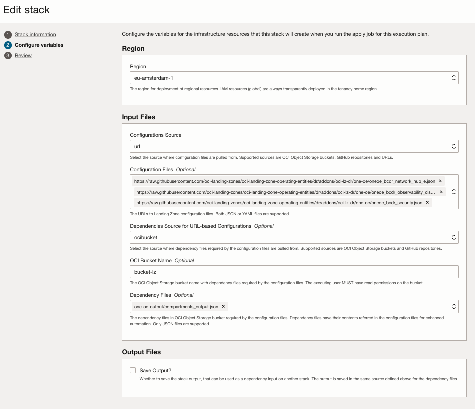

<p align="center"><em>Figure 3</em></p>

<p align="left"><strong>Figure 3: DR-region BCDR stack in Amsterdam</strong></p>

It reads the replicated One-OE output dependency files from Object Storage and does not save a new output file.

When deploying with ORM, follow these steps:

1. Before creating the ORM DR stack, replicate the One-OE output dependency files from a home-region Object Storage bucket to a DR-region bucket. This is separate from the Service Connector bucket replication described in Section 4.1.3.
2. Open the BCDR deployment link in the OCI Console, select `eu-amsterdam-1` (Netherlands Northwest, Amsterdam), then accept the terms and wait for the configuration to load.
3. Set the working directory to `rms-facade`.
4. Set the stack name you prefer.
5. Set the Terraform version to 1.5.x. Click Next.
6. Accept the default files. Click Next. Optionally, replace with your reviewed JSON configuration files.
7. Before creating the stack, replace `email.address@example.com` in the selected initial observability file with the operational notification email addresses and confirm each email subscription. Repeat this change in the matching final observability file before using it in Section 4.1.2; otherwise the final replacement restores the placeholder addresses.
8. Configure the stack dependencies so the BCDR add-on consumes the required outputs from the blueprint One-OE stack.
9. Clear the Run apply check box. Click Create.
10. Run Plan and review the proposed regional network and observability changes before applying.

#### 4.1.1. Complete staged hub networking

Hub A and Hub B initially deploy their `*_pre.json` network file. After the referenced hub resources are created and their private IP OCIDs have been reviewed, update the same ORM stack or Terraform state by replacing it with the matching final network file (`oneoe_bcdr_network_hub_a.json` or `oneoe_bcdr_network_hub_b.json`).

Hub C follows the same staged process. Use `oneoe_bcdr_network_hub_c.json` after updating the standard hub resource references, or `oneoe_bcdr_network_hub_c_backends.json` when the design uses third-party firewall backend resources.

Hub E deploys its complete network configuration in Section 4.1 and does not require a follow-up network replacement.

`oneoe_bcdr_security.json` deploys [Vulnerability Scanning Service (VSS)](https://docs.oracle.com/en-us/iaas/Content/scanning/using/overview.htm) recipes and targets in AMS. It is included in the initial BCDR stack and does not need a staged replacement.

Security Zones are not redeployed in Amsterdam. The One-OE blueprint already associates the shared tenancy-wide compartment hierarchy with its Security Zones; OCI does not allow a compartment to belong to multiple Security Zones. Cloud Guard remains managed by the Frankfurt blueprint. Vaults are regional: for CIS Level 2, manually replicate the Vault and its encryption key to Amsterdam before deployment, as noted in the deployment table. This addon does not create that replica.

#### 4.1.2. Complete staged observability

The initial deployment uses `oneoe_bcdr_observability_cis1_pre.json` or `oneoe_bcdr_observability_cis2_pre.json`. After the final hub network configuration is applied (or, for Hub E, after its initial network configuration is applied), update the same stack or Terraform state to use the matching final observability file (`oneoe_bcdr_observability_cis1.json` or `oneoe_bcdr_observability_cis2.json`). The final file creates the flow logs for the AMS hub and prod network resources.

The BCDR observability files contain only regional AMS resources. The home-region events remain managed by the Frankfurt One-OE blueprint and are intentionally excluded from the DR stack.

#### 4.1.3. Configure Service Connector bucket replication

> [!IMPORTANT]
> **Manual post-deployment configuration required:** the BCDR observability files create `bkt-ams-lz-service-connector` as the destination bucket. After both stacks are deployed, configure an Object Storage replication policy from the Frankfurt source bucket `bkt-fra-lz-service-connector` to that AMS destination. See [Object Storage replication](https://docs.oracle.com/en-us/iaas/Content/Object/Tasks/usingreplication.htm).

This post-deployment replication is separate from the output dependency file replication completed before creating the BCDR stack. The AMS configuration intentionally creates no Service Connector. The replication destination becomes read-only while replication is active, so it cannot also be the local target of a Service Connector.

### 4.2. Deploy inter-region RPC within the same tenancy

After the One-OE BCDR addon is deployed, establish the Remote Peering Connection (RPC) between the home-region DRG and the DR-region DRG inside the same tenancy.

#### 4.2.1. Replace the Amsterdam requester and Frankfurt acceptor network files

First, in the home region: replace the matching final Frankfurt One-OE network file in the home-region stack with its complete `*_acceptor.json` variant. Each acceptor file contains the final One-OE network configuration plus the FRA-side RPC, DRG routing, and VCN routes; do not deploy it together with its corresponding final network file. Apply the replacement and confirm that the Frankfurt network output contains the `RPC-FRA-LZ-HUB-DR-KEY` entry and its OCID. Then replicate the updated output dependency files to the DR-region bucket. This second replication is required because the acceptor RPC does not exist in the dependency files replicated before the AMS BCDR stack was created.


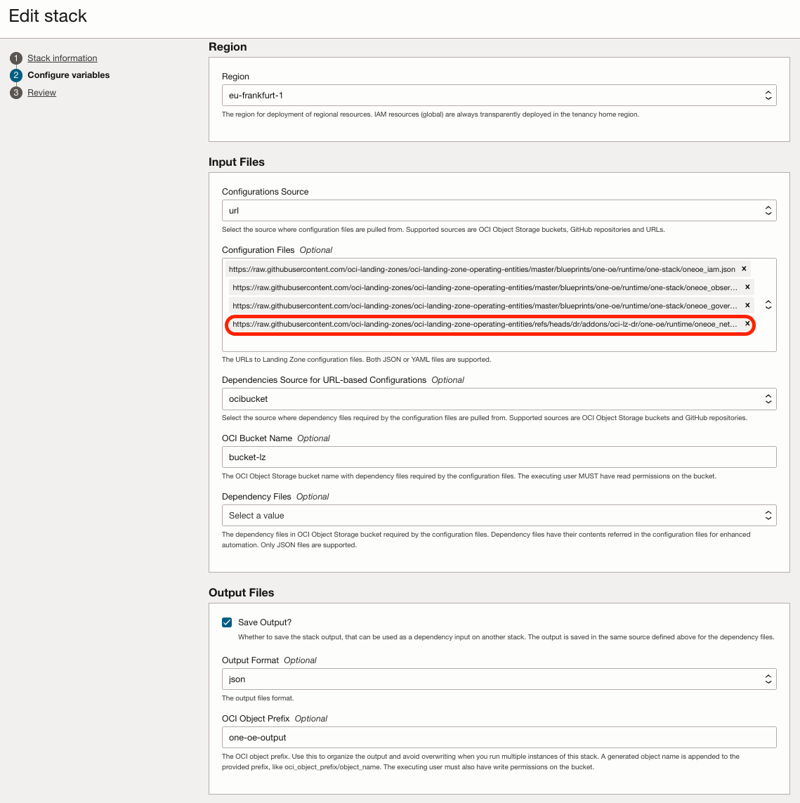


**oneoe_network_hub_N_acceptor.json**

```
"remote_peering_connections": 
{
"RPC-FRA-LZ-HUB-DR-KEY": {
"display_name"     : "rpc-fra-lz-hub-dr",
"peer_region_name" : "eu-amsterdam-1"
}
}
```

**network_output.json**

```
RPC-FRA-LZ-HUB-DR-KEY	
id	"ocid1.remotepeeringconnection.oc1.eu-frankfurt-1.xxxxxxxxxxxxnnbmuunntekppwfezefy4rms3oq"
region_name	"eu-frankfurt-1"
```


Then, in the DR region: after the updated Frankfurt dependency files are available, refresh the BCDR stack dependency and replace the matching final network file in the same stack with its complete `*_requester.json` variant after staged hub networking is complete. Each requester file contains the final network configuration plus the AMS-side RPC, DRG routing, and VCN routes; do not deploy it together with its corresponding final network file.

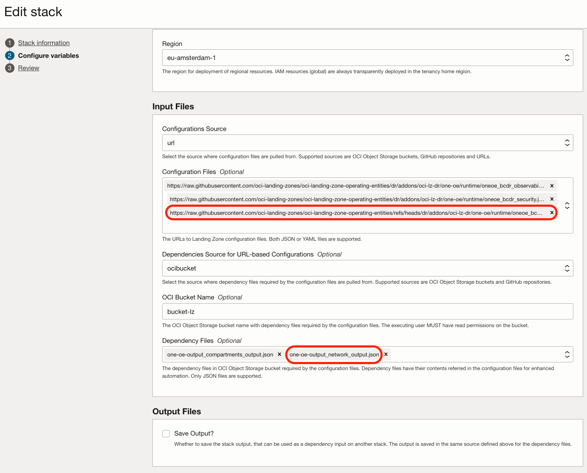


**oneoe_bcdr_network_hub_<hub>_requester.json**


```
"remote_peering_connections": {
"RPC-AMS-LZ-HUB-HOME-KEY": {
"display_name"      : "rpc-ams-lz-hub-home",
"peer_key"          : "RPC-FRA-LZ-HUB-DR-KEY",
"peer_region_name"  : "eu-frankfurt-1"
}
}
```

All requester and acceptor files are in the [`runtime`](./runtime/) directory.


<p align="center"><em>Figure 4</em></p>

<p align="left"><strong>Figure 4: cross-region RPC. Example: Frankfurt - Amsterdam</strong></p>


| Network visualizer — FRA | Network visualizer — AMS |
|---|---|
| 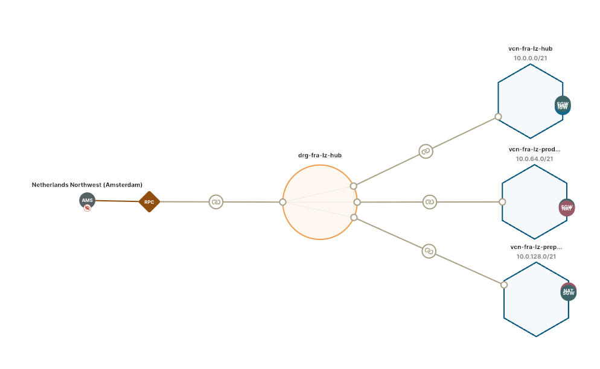<br><p align="center"><em>Figure 5</em></p><p align="left"><strong>Figure 5: Network visualizer view from FRA</strong></p> | 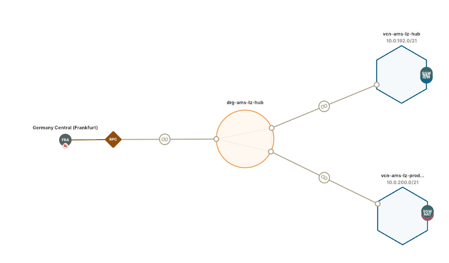<br><p align="center"><em>Figure 6</em></p><p align="left"><strong>Figure 6: Network visualizer view from AMS</strong></p> |


Use the [OCI Remote Peering Connections addon](../../oci-x-rpc/README.md) to follow the required steps and automate this connectivity layer.

After applying both replacements, validate connectivity between the home-region and DR-region networks.

For deployable RPC examples and routing guidance, see the [OCI X-RPC runtime guide](../../oci-x-rpc/runtime/README.md).


&nbsp;

# License

Copyright (c) 2026 Oracle and/or its affiliates.

Licensed under the Universal Permissive License (UPL), Version 1.0.

See [LICENSE](../../../LICENSE.txt) for more details.
