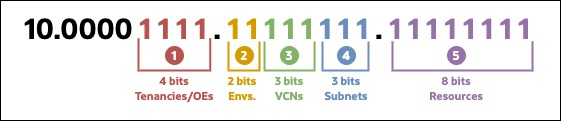
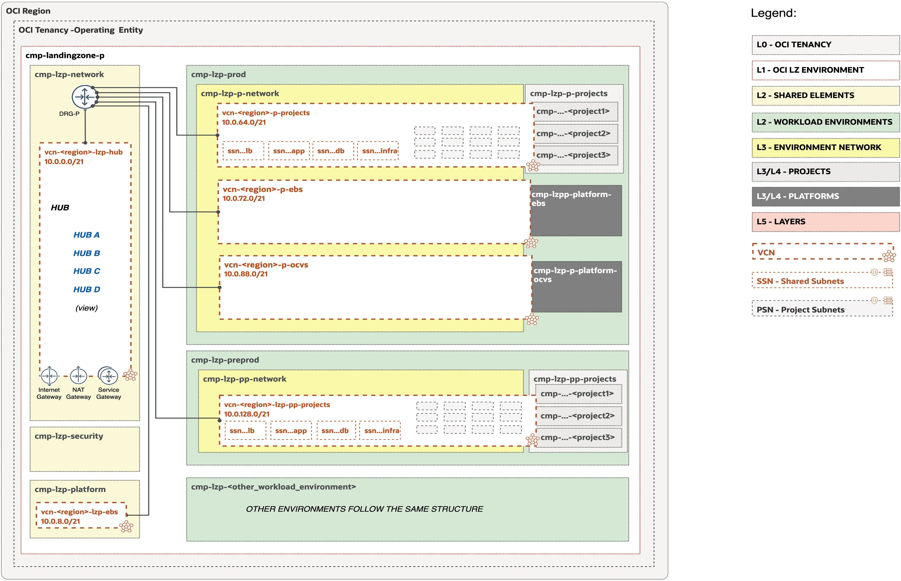
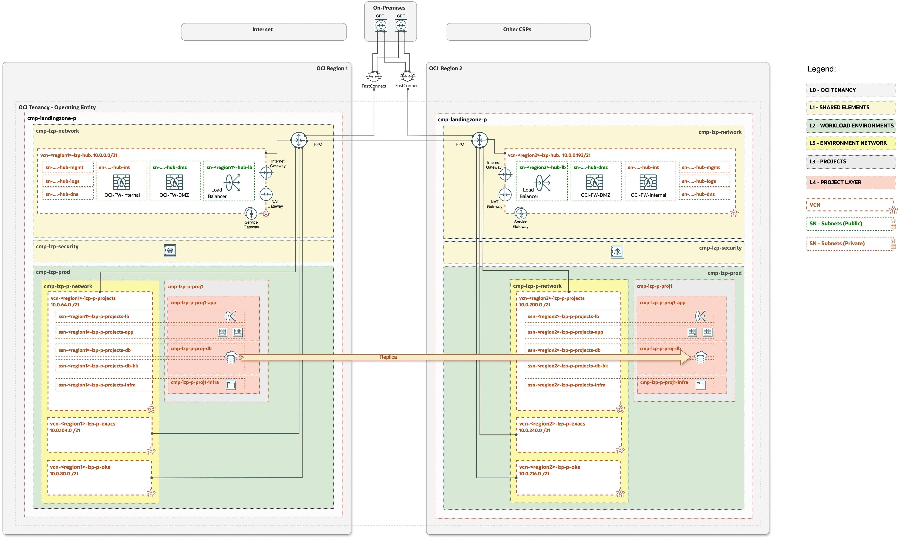

# **[OCI Landing Zone Subnetting Guide](#)**
## **An OCI Open LZ Addon to Tailor and Optimize Your Network Subnetting**

&nbsp; 

### Overview

Welcome to the **OCI Landing Zone Subnetting Guide**. 

This guide provides guidelines on designing network subnetting, which can be used or inspired to set up your OCI networking. We use this model in our Landing Zone blueprints: [One-OE](../../blueprints/one-oe/readme.md), [Multi-OE](../../blueprints/multi-oe/readme.md), and [Multi-Tenancy](../../blueprints/multi-tenancy/readme.md). 

It has been developed to ensure network consistency across all our assets, enabling the deployment of any of our Landing Zone models, including potential landing zone workload extensions. To facilitate sharing with customers and partners, the example is provided in an Excel file, accessible [**here**](./content/OpenLZ_Network_Subnetting.xlsx).

&nbsp; 

### Benefits of this asset

Following the guidelines explained here reduces the overall management complexity and will help you with:

* Reducing routing complexity.
* Simplifying network firewall policies management.
* Avoiding non-scalable network designs (e.g.: creating a VCN per application).
* Facilitating organic growth of your Landing Zone, with the addition of new platforms, and addition of new workloads in existing subnets.
* Reducing the time for setting up Proof of Concepts (PoCs).
* Designing your network subnetting following the reasoning and guidelines.

&nbsp; 

 
### Subnetting Process

A landing zone provides a structured and secure framework, for deploying and managing cloud resources, and typically includes network segmentation, access controls, and policies, that help to enforce isolation and security. In our OCI Landing Zone blueprints, network isolation is required between environments and entities. 

Subnetting is a crucial aspect of networking in cloud environments. It involves dividing a larger address space into smaller, manageable subnetworks.

Each customer has unique requirements, so the first step is to review the landing zone design and agree on the appropriate subnetting approach.

In a typical landing zone, workload environments like development, testing, and production, have their own Virtual Cloud Networks (VCNs). Within each VCN, subnets are created to organize and allocate addresses to individual resources (such as virtual machines, databases, or other services). Subnets serve as a core mechanism within VCNs to control network traffic through Security Lists (SLs), Network Security Groups (NSGs), or Zero-Trust Packet Routing (ZPR).

When designing cloud subnets, carefully consider the specific purpose each subnet should serve. Well-planned subnets support efficient resource management, security, and operational clarity across your cloud architecture.

We'll use our example to show you the design decisions made to satisfy our network requirements among the different blueprints we use. Some of these requirements are:

* Connectivity from on-premises or 3rd party Cloud Service Providers (CSPs) to OCI regions must be possible.
* Non-IP address ranges overlapping must exist between on-premises, 3rd party CSPs, and OCI regions.
* Support for multiple, connected tenancies must be possible.
* Support for multiple Landing Zone environments must be possible within a Tenancy.
* Hub & Spoke network topologies are used to centralize and simplify the control & inspection of incoming and outgoing network traffic.
* The connectivity between Operating Entities, Workload Environments, and Platforms must be controlled for isolation.
* Creation of future VCNs must be possible for future-proof new platforms & services adoption.
* Creation of future subnets within a VCN must be possible for future-proof new services adoption. 
* Subnets must be sized to be able to support new workload deployment.
* Assume a symmetric subnet size approach within each VCN to simplify the assignment/management.
  
Let's start with the example to understand the reasoning behind it.

OCI is assigned with a big CIDR block. We need to split the given CIDR block to satisfy the different given requirements. Let's consider that we have a big CIDR block like the 10.0.0.0/12, so we can split in the following way:

    

| | | | | |
|---|---|---|---|---|
| **Section** | **Bits** | **Available** | **Use** | **Example** |
| **1.** Tenancies/OEs | 4 | Up to 8 tenants/OEs with 2 Landing Zone Environments | Available dedicated tenancies for Operating Entities or Operating Entities within the same tenancy | OE1 - 10.0.0.0/15 |
| **2.** Environments | 2 | Up to 4 environments | We reserve for the Shared Services and the workload environments: Production, Non-Production and DR | OE1 LZ Production Shared Services - 10.0.0.0/18
| **3.** VCNs | 3 | Up to 8 VCNs | Shared services or workload environments can have up to 8 VCNs, as the Hub, shared VCN for projects or platforms | OE1 LZ Production, Shared Services Hub - 10.0.0.0/21 |
| **4.** Subnets | 3 | Up to 8 Subnets | Subnets within a VCN. Depending on the use you might have more or less subnets or reserved for future use. | OE1 LZ Production, Shared Services Hub, FW DMZ Subnet - 10.0.0.0/24 |
| **5.** Resources | 8 | Up to 256 IPs | We have 252 usable IPs after not considering the network, broadcast and default gateways IPs | 10.0.0.2 to 10.0.0.254 |

For more examples or see the complete IP subnetting check the available Open LZ subnetting excel file [**here**](./content/OpenLZ_Network_Subnetting.xlsx).

&nbsp; 

### Examples

Example Diagram of One-OE Deployment with EBS and OCVS Workload Extensions:

    

Example Diagram of One-OE deployment with DR, ExaCS and OKE Workload Extensions:

    

&nbsp; 

### Alternative approaches

The above process and examples explains the reasoning behind splitting the CIDR block assigned to OCI and how to split it so you can address a real case scenario.

You could have different requirements, as:

* Not having different tenancies or Operating Entities
* Not using different Landing Zone Environments
* Different number of workload environments
* Reserving less VCNs for platforms
* Needing more than just 2 regions
* Use an asymetric subnet approach to be able to create smaller or bigger subnets depending on expected resources 

You could alter the bits used with your own requirements to gather your desired approach.

&nbsp; 

# License

Copyright (c) 2024 Oracle and/or its affiliates.

Licensed under the Universal Permissive License (UPL), Version 1.0.

See [LICENSE](/LICENSE.txt) for more details.