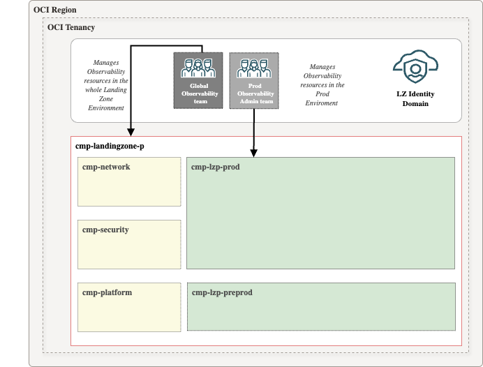

# **[OCI Landing Zone Native Observability Services](#)**
## **An OCI Open LZ Addon to enable observability in your LZ**

&nbsp; 

### 1. Overview

Welcome to the **OCI Landing Zone Native Observability Services**. 

This guide provides the necessary configuration steps to enable OCI Observability native services, including **Database Management**, **Operations Insights**, and **Logging Analytics**.

* **Database Management service** (DM) offers a comprehensive set of database performance monitoring and management features. Diagnostics & Management enables you to monitor and manage Oracle databases, HeatWave and External MySQL DB systems, and infrastructure components such as DB system components and Exadata storage servers in multi-cloud and hybrid deployments.

* **Ops Insights** (OPSI) provides comprehensive information about the resource use and capacity of databases and hosts. Use this service to analyze CPU and storage resources, forecast capacity issues, and proactively identify SQL performance issues across a database fleet.

* **Logging Analytics** is a machine learning-based cloud service that monitors, aggregates, indexes, and analyzes all log data from on-premises and multicloud environments. Enabling users to search, explore, and correlate this data to troubleshoot and resolve problems faster and derive insights to make better operational decisions.
&nbsp; 

### 2. Benefits of this asset

Following the guidelines explained here reduces the overall management complexity and will help you with:

* Reduce time and effort needed to enable native monitoring services.
* Extend your LZ with dedicated Observability compartments.
* Add the proper Observability groups.
* Add the required policies per each service.
&nbsp; 
 
## 3. Design Decisions

To configure this add-on, you will need to make some key design decisions:

* **Private Endpoints Configuration** . Do you prefer to use shared and global private endpoints, or would you required dedicated private endpoints for each environment?

* **Monitoring groups Structure**. 
Would you like a single, generic monitoring team with visibility and management access across all OBS services and environments, or would you prefer a dedicated monitoring team for each environment?

## 3.1 Private Endpoints  

For enhanced security, Observability Services should be configured with private access. Some of the key benefits of OCI Private Endpoints include:
* **Security**: By avoiding the public internet, Private Endpoints significantly reduce the risk of data breaches and unauthorized access.
* **Compliance**: Helps meet regulatory requirements by ensuring data remains within designated boundaries.
* **Performance**: Provides low-latency connections ideal for performance-sensitive applications.
* **Cost Savings**: Reduces the need for additional networking resources like VPNs or dedicated connections.

For Database Management and Operations Insights, we will use Private Endpoints.

There are limits on the number of Private Endpoints [PE](https://docs.oracle.com/en-us/iaas/Content/Network/Concepts/privateaccess.htm#private-endpoints) that can be created per region. It depends on the database type configured.
Because of this, we can take two different approaches:

* ### **Global Approach** ( Recommended)

As a general approach, the Landing Zone uses a hub VCN, which is designed to centralize services such as load balancers, firewalls, DNS, and more.

The global approach involves deploying a "Global" Private Endpoint (PE) that can be used across all databases in different projects, environments, or entities.

We recommend deploying the PEs in the Monitoring Subnet (mon sn), configure the routing and enabling communication using Network Security Groups (NSGs), which are included in this add-on.

* ### **Local Approach**

In specific cases where the customer has a single environment and minimal use of Private Endpoints (PEs), or where there is no Hub, a local approach can be adopted.

In this case, a dedicated PEs can be deployed in the same subnet as the database to be configured. To enable communication between the DM/OPSI PE and ATP PE, we will also use another NSG, which is included in this add-on.
&nbsp; 

## 3.2 Groups

In this asset, we provide two example Observability groups (roles):

* **Global Observability Team**: A general team responsible for managing all Operations and Maintenance (O&M) services, as well as DM/OPSI private endpoints across the organization.

* **Production Observability Team**: A specialized team focused on managing all O&M services and DM/OPSI private endpoints within the production environment.

## 4. Scenarios.

| # |  Scenario  | Description | Status |
|:--:|:--:|---|---|
| 1 | | Autonomous database| [Available](./scenario-autonomous-database/) |
| 2 |  | EXACS | On process| | 
| 4 | | EXACC | On process|
| 5 |  | External Databases | On process | 

# License

Copyright (c) 2025 Oracle and/or its affiliates.

Licensed under the Universal Permissive License (UPL), Version 1.0.

See [LICENSE](/LICENSE.txt) for more details.
