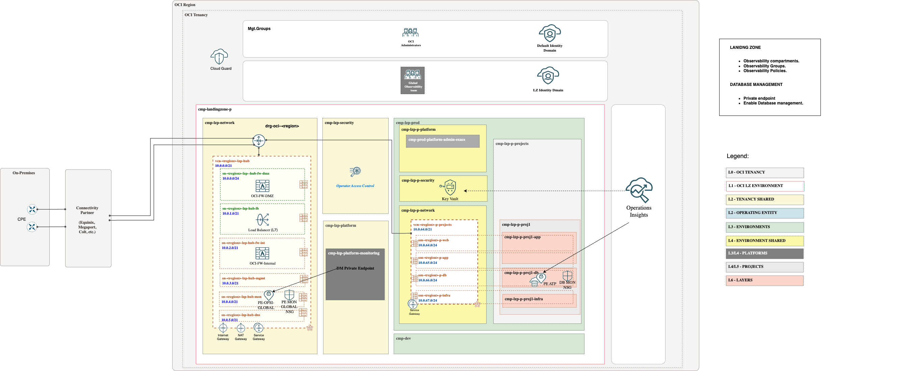
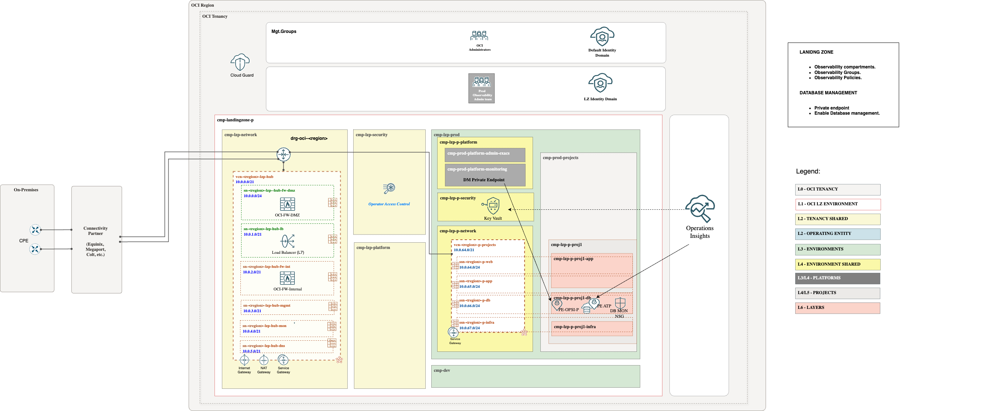

# **[OCI Landing Zone Native Observability Services](#)**
## **An OCI Open LZ Addon to enable observability in your LZ**

&nbsp; 

### Overview

Welcome to the **OCI Landing Zone Native Observability Services**. 

This guide provides the necessary configuration steps to enable OCI Observability native services, including **Database Management**, **Operations Insights**, and **Logging Analytics**.

**Database Management service** (DM) offers a comprehensive set of database performance monitoring and management features. Diagnostics & Management enables you to monitor and manage Oracle databases, HeatWave and External MySQL DB systems, and infrastructure components such as DB system components and Exadata storage servers in multi-cloud and hybrid deployments.

**Ops Insights** (OPSI) provides comprehensive information about the resource use and capacity of databases and hosts. Use this service to analyze CPU and storage resources, forecast capacity issues, and proactively identify SQL performance issues across a database fleet.

&nbsp; 

### Benefits of this asset

Following the guidelines explained here reduces the overall management complexity and will help you with:

* Reduce time and effort needed to enable native monitoring services.
* Extend your LZ with dedicated Observability compartments.
* Add the proper Observability groups.
* Add the required policies per each service.

&nbsp; 
 
## Approaches

* ### **Global Approach** ( Recommended)

There are some limits in the number of [PE](https://docs.oracle.com/en-us/iaas/Content/Network/Concepts/privateaccess.htm#private-endpoints) that can be created per region. It depends on the database type configured. Check documentation [here](https://docs.oracle.com/en-us/iaas/database-management/doc/create-database-management-private-endpoint-adb.html#GUID-EBA1A30F-96E9-412D-836F-5ED57FC74D99).

As a general approach, the Landing Zone uses a hub VCN, which is designed to centralize services such as load balancers, firewalls, DNS, and more.

The global approach involves deploying a "Global" Private Endpoint (PE) that can be used across all databases in different projects, environments, or entities.

We recommend deploying the PE in the Logs Subnets, configure the routing and enabling communication using Network Security Groups (NSGs), which are included in this add-on.

* ### **Local Approach**

In specific cases where the customer has a single environment and minimal use of Private Endpoints (PEs), or where there is no Hub, a local approach can be adopted.

In this case, a dedicated DM PE can be deployed in the same subnet as the database to be configured. To enable communication between the DB PE and ATP PE, we will also use another NSG, which is included in this add-on.

&nbsp; 

## Database Management Database scenarios

To enable Database Management, you need to deploy a [DM PE](https://docs.oracle.com/en-us/iaas/Content/Network/Concepts/privateaccess.htm#private-endpoints) (Database Management Private Endpoint), which must have access to the database that needs to be configured.
The private endpoint is a representation of Database Management in the VCN. 

> [!WARNING]  
> You can create the Private Endpoint in the same VCN or a different VCN. Please disregard the information stated in the [Database Management documentation](https://docs.oracle.com/en-us/iaas/database-management/doc/create-database-management-private-endpoint-adb.html#GUID-EBA1A30F-96E9-412D-836F-5ED57FC74D99) and [Operations Insights documentation](https://docs.oracle.com/en-us/iaas/operations-insights/doc/create-private-endpoint.html).
> 

### **Autonomous** 

The DM PE needs visibility with the ATP PE.

* In a **global approach**, the DM PE will be placed in the logs subnet in the hub and should be assigned to the nsg-fra-lzp-hub-global-mon-pe NSGs. The database will be placed in the database subnet (ssn-fra-lzp-p-db) assigned to the nsg-lzp-p-projects-mon-pe-db1 NSGs.
In this case, a Shared Observability platform compartment, a global observability group, and the necessary policies to manage native observability will be included among with the previous mentioned NSGs.

&nbsp; 

* In a **local approach**, both PEs will reside in the same database subnet (ssn-fra-lzp-p-db), and the nsg-lzp-p-projects-mon-pe-db1 NSGs will allow communication between them.
In this case, a dedicated Prod Observability platform compartment, a dedicated Prod observability group, and the necessary policies to manage native observability will be included among with the previous mentioned NSG.

  
Private endpoints will be placed in the observability compartments, accessing the required subnets.

During the process of enabling Database Management in the Autonomous Database, the user and password will be required. These credentials must be stored as secrets in a Vault within the specific security compartment (the shared security compartment in the global approach, or the dedicated environment security compartment in the local approach). All necessary policies to access the secret are already included in the add-on.

> [!NOTE]  
> To review the Oracle documentation for enabling Database Management, click [here](https://docs.oracle.com/en-us/iaas/database-management/doc/enable-database-management-autonomous-databases.html)

### **EXACS** 
The DM PE needs visibility with the EXACS SCAN listeners.
* In a Local approach both PE will reside in the same db subnet and the xxx nsgs will allow the comunication between them.
* In a Global approach, the DM PE will be place in the logs subnet in the hub and should be asiggned to the xxx nsgs. The database will be placed in the db subnet assigned to the xxx nsgs.

### **EXACC** 
TBC

### **MySQL DB** 
TBC

### **External Databases** 
TBC

&nbsp; 

## Operation Insight Database scenarios

To enable Operation Insight, you need to deploy a [OPSI PE](https://docs.oracle.com/en-us/iaas/Content/Network/Concepts/privateaccess.htm#private-endpoints) (Operation Insights Private Endpoint), which must have access to the database that needs to be configured.

The private endpoint is a representation of Operation Insight in the VCN. 
 
Private endpoints must be created in each service, private endpoints created in other services will not appear in the Ops Insights private endpoint list page. However Database Management endpoints can be converted to Ops Insights endpoints.

### **Autonomous**
 
The OPSI  PE needs visibility with the ATP PE.

* In a **global approach**, the OPSI PE will be placed in the logs subnet in the hub and should be assigned to the nsg-fra-lzp-hub-global-dm-pe NSGs. The database will be placed in the database subnet (ssn-fra-lzp-p-db) assigned to the nsg-lzp-p-projects-dm-pe-db1 NSGs.
In this case, a Shared Observability platform compartment, a global observability group, and the necessary policies to manage native observability will be included among with the previous mentioned NSGs.

&nbsp; 

* In a **local approach**, both PEs will reside in the same database subnet (ssn-fra-lzp-p-db), and the nsg-lzp-p-projects-mon-pe-db1 NSGs will allow communication between them.
In this case, a dedicated Prod Observability platform compartment, a dedicated Prod observability group, and the necessary policies to manage native observability will be included among with the previous mentioned NSG.

  
Private endpoints will be placed in the observability compartments, accessing the required subnets.

During the process of enabling OPSI  in the Autonomous Database, the user and password will be required. These credentials must be stored as secrets in a Vault within the specific security compartment (the shared security compartment in the global approach, or the dedicated environment security compartment in the local approach). All necessary policies to access the secret are already included in the add-on.

> [!NOTE]  
> To review the Oracle documentation for enabling Operation Insights, click [here](https://docs.oracle.com/en-us/iaas/operations-insights/doc/autonomous-database-full-feature-support.html#GUID-27B9ABB0-BBC4-4F7D-9EC7-40EF09F8726B)

> [!WARNING]  
>Dedicated Autonomous databases still require a special DNS proxy enabled private endpoint.

# License

Copyright (c) 2025 Oracle and/or its affiliates.

Licensed under the Universal Permissive License (UPL), Version 1.0.

See [LICENSE](/LICENSE.txt) for more details.
