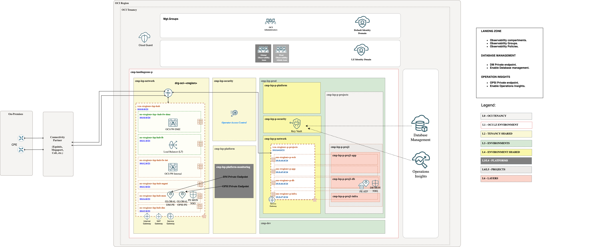

# **[OCI Landing Zone Native Observability Services](#)**
## **An OCI Open LZ Addon to enable observability in your LZ**

&nbsp; 

### 1. Overview

Welcome to the **OCI Landing Zone Native Observability Services**. 

This guide provides the necessary configuration steps to enable OCI Observability native services, including **Database Management**, **Operations Insights**, and **Logging Analytics**.

* **Database Management service** (DM) offers a comprehensive set of database performance monitoring and management features. Diagnostics & Management enables you to monitor and manage Oracle databases, HeatWave and External MySQL DB systems, and infrastructure components such as DB system components and Exadata storage servers in multi-cloud and hybrid deployments.

* **Ops Insights** (OPSI) provides comprehensive information about the resource use and capacity of databases and hosts. Use this service to analyze CPU and storage resources, forecast capacity issues, and proactively identify SQL performance issues across a database fleet.

* **Logging Analytics** is a machine learning-based cloud service that monitors, aggregates, indexes, and analyzes all log data from on-premises and multicloud environments. Enabling users to search, explore, and correlate this data to troubleshoot and resolve problems faster and derive insights to make better operational decisions.
&nbsp; 

### 2. Benefits of this asset

Following the guidelines explained here reduces the overall management complexity and will help you with:

* Reduce time and effort needed to enable native monitoring services.
* Extend your LZ with dedicated Observability compartments.
* Add the proper Observability groups.
* Add the required policies per each service.
&nbsp; 
 
## 3. Approaches

## 3.1 Private Endpoints  

For enhanced security, Observability Services should be configured with private access. Some of the key benefits of OCI Private Endpoints include:
* **Security**: By avoiding the public internet, Private Endpoints significantly reduce the risk of data breaches and unauthorized access.
* **Compliance**: Helps meet regulatory requirements by ensuring data remains within designated boundaries.
* **Performance**: Provides low-latency connections ideal for performance-sensitive applications.
* **Cost Savings**: Reduces the need for additional networking resources like VPNs or dedicated connections.

For Database Management and Operations Insights, we will use Private Endpoints.

There are limits on the number of Private Endpoints [PE](https://docs.oracle.com/en-us/iaas/Content/Network/Concepts/privateaccess.htm#private-endpoints) that can be created per region. It depends on the database type configured.
Because of this, we can take two different approaches:

* ### **Global Approach** ( Recommended)

As a general approach, the Landing Zone uses a hub VCN, which is designed to centralize services such as load balancers, firewalls, DNS, and more.

The global approach involves deploying a "Global" Private Endpoint (PE) that can be used across all databases in different projects, environments, or entities.

We recommend deploying the PEs in the Monitoring Subnet (mon sn), configure the routing and enabling communication using Network Security Groups (NSGs), which are included in this add-on.

* ### **Local Approach**

In specific cases where the customer has a single environment and minimal use of Private Endpoints (PEs), or where there is no Hub, a local approach can be adopted.

In this case, a dedicated DM PE can be deployed in the same subnet as the database to be configured. To enable communication between the DB PE and ATP PE, we will also use another NSG, which is included in this add-on.
&nbsp; 

## 3.4 Roles

In this asset, we provide two example Observability roles:

* **Global Observability Team**: A general team responsible for managing all Operations and Maintenance (O&M) services, as well as DM/OPSI private endpoints across the organization.

* **Production Observability Team**: A specialized team focused on managing all O&M services and DM/OPSI private endpoints within the production environment.

## 4. Database Options

### **4.1 Autonomous** 

To enable **Database Management** or **Operation Insight** for Autonomous you need to deploy Private Endpoints which must have access to the database that needs to be configured.
To check the documentation you can use these links: [DM PE](https://docs.oracle.com/en-us/iaas/Content/Network/Concepts/privateaccess.htm#private-endpoints) (Database Management Private Endpoint). or [OPSI PE](https://docs.oracle.com/en-us/iaas/Content/Network/Concepts/privateaccess.htm#private-endpoints) (Operation Insights Private Endpoint).

The private endpoint is a representation of OCI O&M Services in the VCN. 

> [!WARNING]  
> You can create the Private Endpoint in the same VCN or a different VCN. Please disregard the information stated in the [Database Management documentation](https://docs.oracle.com/en-us/iaas/database-management/doc/create-database-management-private-endpoint-adb.html#GUID-EBA1A30F-96E9-412D-836F-5ED57FC74D99) or [Operations Insights documentation](https://docs.oracle.com/en-us/iaas/operations-insights/doc/create-private-endpoint.html).

DM PE and OPSI PE needs visibility with the ATP PE.

* In a **global approach**, the PEs will be placed in the mon subnet in the hub and should be assigned to the nsg-fra-lzp-hub-global-mon-pe NSGs. The database will be placed in the database subnet (ssn-fra-lzp-p-db) assigned to the nsg-lzp-p-projects-mon-pe-db1 NSGs.
  
In this case, a Shared Observability platform compartment, groups and the necessary policies to manage native observability will be included among with the previous mentioned NSGs.

&nbsp; 

* In a **local approach**, DM/OPS PEs and ATP PE will reside in the same database subnet (ssn-fra-lzp-p-db), and the nsg-lzp-p-projects-mon-pe-db1 NSGs will allow communication between them.
  
In this case, a Prod Observability platform compartment, groups and the necessary policies to manage native observability will be included among with the previous mentioned NSGs.
  
Private endpoints will be placed in the observability compartments, accessing the required subnets.

During the process of enabling Database Management or Operation Insights in an Autonomous Database, the user and password will be required. These credentials must be stored as secrets in a Vault within the specific security compartment (the shared security compartment in the global approach, or the dedicated environment security compartment in the local approach). All necessary policies to access the secret are already included in the add-on.

> [!NOTE]  
> To review the Oracle documentation for enabling Database Management, click [here](https://docs.oracle.com/en-us/iaas/database-management/doc/enable-database-management-autonomous-databases.html).
> 
> To review the Oracle documentation for enabling Operation Insights, click [here](https://docs.oracle.com/en-us/iaas/operations-insights/doc/autonomous-database-full-feature-support.html#GUID-27B9ABB0-BBC4-4F7D-9EC7-40EF09F8726B).
> 
> For OPSI Dedicated Autonomous databases require a special DNS proxy enabled private endpoint.

&nbsp; 

### **4.2 EXACS** 

The DM PE needs visibility with the EXACS SCAN listeners.
* In a Local approach both PE will reside in the same db subnet and the xxx nsgs will allow the comunication between them.
* 
* In a Global approach, the DM PE will be place in the mon subnet in the hub and should be asiggned to the xxx nsgs. The database will be placed in the db subnet assigned to the xxx nsgs.

### **4.3 EXACC** 

For EXACC, we only have the option of a global approach. We deployed the PE in the HUB VCN, reusing the monitoring subnet (MON) that is included in all our LZ HUB models

For EXACC, we only have the option of a global approach. We deployed the PE in the HUB VCN, reusing the monitoring subnet (MON) that is included in all our LZ HUB models

&nbsp; 

> [!NOTE]  
> This asset primarily focuses on enabling Native Observability services within the Landing Zone. However, when addressing EXACC workloads, it is also essential to consider events and alarms. These aspects are covered in our EXACC Landing Zone extension, which can be found [here](https://github.com/oci-landing-zones/oci-landing-zone-operating-entities/tree/master/workload-extensions/exacc).
>
>The extension also provides an OCI Event Rule to capture the events generated by the Operator Access Control activities and are integrated with the OCI Notification Topic used by the Global Security Team.
>
>Enabled Observability Resources:
>* Shared ExaDB-C@C Platform Events,Alarms and Announcements
>* Production Workload Environment ExaDB-C@C Platform Events,Events, Alarms and Announcements
>* Pre-Production Workload Environment ExaDB-C@C Platform Events,Events, Alarms and Announcements
>* Example Production Project Alarms.
>* Example Pre-Production Project Alarms.

### **4.4 External Databases** 

&nbsp; 

### **VM Databases** 

&nbsp; 

## 5. Add-on Implementation

## 5.1 Autonomous Implementation

Example how to extend Observability in a Landing Zone for ATP.
This template includes all cmp, groups, policies and NSGs needed for enabling Database Management, Operations Insights and Logging Analytics.

**Step 1**. (Prerequisite) Deploy ONE-OE landing Zone. You can follow nexts [steps](https://github.com/oci-landing-zones/oci-landing-zone-operating-entities/tree/master/blueprints/one-oe/runtime/one-stack).

&nbsp; 

**Step 2**. Enable Observability adding this Add-on, use the ATP JSONs files provided in this asset. To check step by step how to do it check [here](./AddOnImplementation.md).

After running step2, Databases can be created and you can deploy the DM & OPSI PEs:

Using Global PE Approach:

Using Local PE Approach:

> [!NOTE]  
> ATP PEs are created during databases creation and are not included in the Landing Zone add-on.

# License

Copyright (c) 2025 Oracle and/or its affiliates.

Licensed under the Universal Permissive License (UPL), Version 1.0.

See [LICENSE](/LICENSE.txt) for more details.
