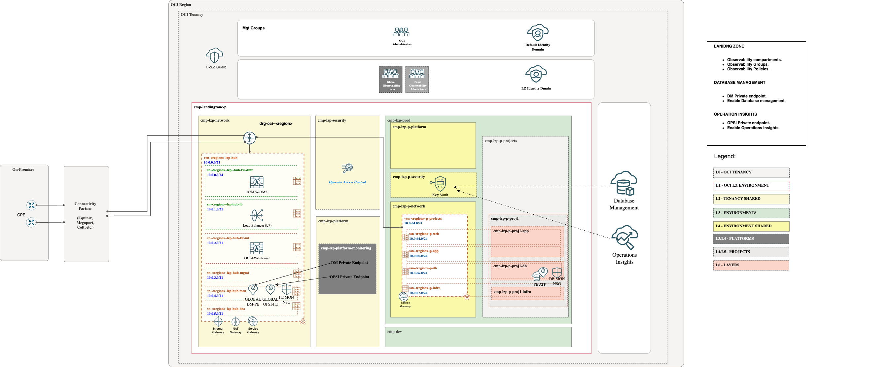

# **[Autonomous Databases ](#)**
## **An OCI Open LZ Addon to enable Database Management & Operation Insights in your Autonomous Databases**

## Design

To enable **Database Management** or **Operation Insight** for Autonomous you need to deploy Private Endpoints which must have access to the database that needs to be configured.
To check the documentation you can use these links: [DMA PE](https://docs.oracle.com/en-us/iaas/Content/Network/Concepts/privateaccess.htm#private-endpoints) (Database Management Private Endpoint). or [OPSI PE](https://docs.oracle.com/en-us/iaas/Content/Network/Concepts/privateaccess.htm#private-endpoints) (Operation Insights Private Endpoint).

The private endpoint is a representation of OCI O&M Services in the VCN. 

> [!WARNING]  
> You can create the Private Endpoint in the same VCN or a different VCN. Please disregard the information stated in the [Database Management documentation](https://docs.oracle.com/en-us/iaas/database-management/doc/create-database-management-private-endpoint-adb.html#GUID-EBA1A30F-96E9-412D-836F-5ED57FC74D99) or [Operations Insights documentation](https://docs.oracle.com/en-us/iaas/operations-insights/doc/create-private-endpoint.html).

DMA PE and OPSI PE needs visibility with the ATP PE.

* In a **global approach**, PEs will be placed in the mon subnet in the hub and should be assigned to the nsg-fra-lzp-hub-global-mon-pe NSGs. The database will be placed in the database subnet (ssn-fra-lzp-p-db) assigned to the nsg-lzp-p-projects-mon-pe-db1 NSGs.
  
In this case, a Shared Observability platform compartment, groups and the necessary policies to manage native observability will be included among with the previous mentioned NSGs.

&nbsp; 

* In a **local approach**, DMA/OPS PEs and ATP PE will reside in the same database subnet (ssn-fra-lzp-p-db), and the nsg-lzp-p-projects-mon-pe-db1 NSGs will allow communication between them.
  
In this case, a Prod Observability platform compartment, groups and the necessary policies to manage native observability will be included among with the previous mentioned NSGs.
  
Private endpoints will be placed in the observability compartments, accessing the required subnets.

During the process of enabling Database Management or Operation Insights in an Autonomous Database, the user and password will be required. These credentials must be stored as secrets in a Vault within the specific security compartment (the shared security compartment in the global approach, or the dedicated environment security compartment in the local approach). All necessary policies to access the secret are already included in the add-on.

> [!NOTE]  
> To review the Oracle documentation for enabling Database Management, click [here](https://docs.oracle.com/en-us/iaas/database-management/doc/enable-database-management-autonomous-databases.html).
> 
> To review the Oracle documentation for enabling Operation Insights, click [here](https://docs.oracle.com/en-us/iaas/operations-insights/doc/autonomous-database-full-feature-support.html#GUID-27B9ABB0-BBC4-4F7D-9EC7-40EF09F8726B).
> 
> For OPSI Dedicated Autonomous databases require a special DNS proxy enabled private endpoint.

&nbsp; 

## Implementation

Example how to extend Observability in a Landing Zone for ATP.
Our add-on template includes all cmp, groups, policies and NSGs needed for enabling Database Management, Operations Insights and Logging Analytics.

**Step 1**. (Prerequisite) Deploy ONE-OE landing Zone. You can follow nexts [steps](https://github.com/oci-landing-zones/oci-landing-zone-operating-entities/tree/master/blueprints/one-oe/runtime/one-stack).

&nbsp; 

**Step 2**. Enable Observability adding this Add-on, use the ATP JSONs files provided in this asset. To check step by step how to do it check [here](./AddOnImplementation.md).

**Step 3**.
After running step2, Databases can be created and you can deploy the DMA & OPSI PEs:

TBC. Included a detailed guide showing all the steps, O&M repository.

> [!NOTE]  
> ATP PEs are created during databases creation and are not included in the Landing Zone add-on.

These diagrams illustrate the final result:

|  Approach  | Description | 
|:--:|---|
| Using Global PEs | | 
| Using Local PEs | | 

# License

Copyright (c) 2025 Oracle and/or its affiliates.

Licensed under the Universal Permissive License (UPL), Version 1.0.

See [LICENSE](/LICENSE.txt) for more details.
