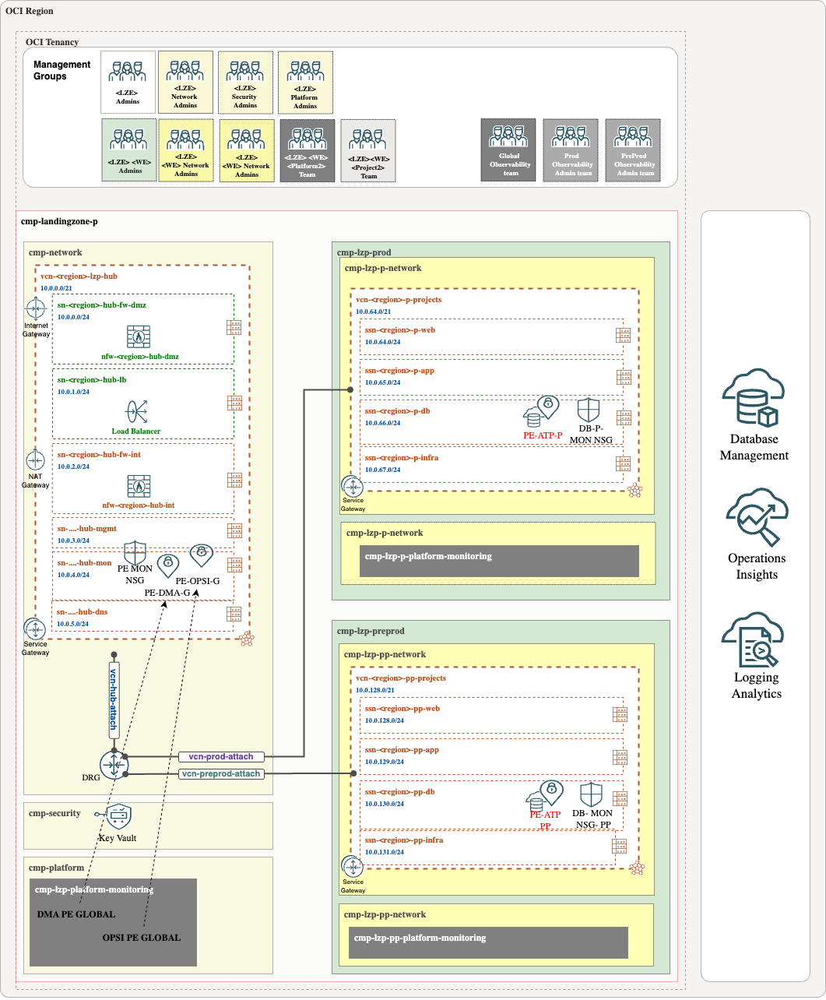
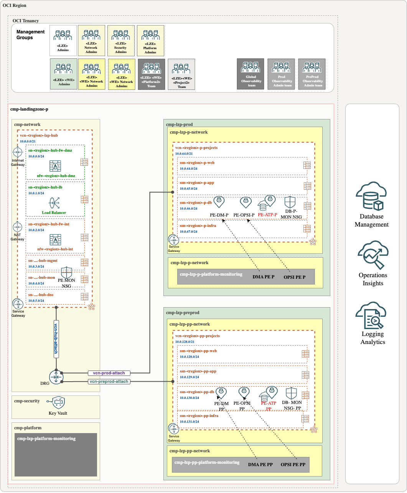

## **Database Management Enabling Steps**

**Step 1**

Database should be created in the proper project cmp in db layer using the db subnet.
They extra requisit is asign the nsgs to the database.

Example for Prod database: 

* **Compartment**-> cmp-landingzone-p:cmp-lzp-prod:cmp-lzp-p-projects:cmp-lzp-p-proj1:cmp-lzp-p-proj1-db
* **Network**-> vnc:vcn-fra-lzp-p-projects; subnet:ssn-fra-lzp-p-db
* **nsg**-> nsg-lzp-p-projects-mon-pe-db1

**Step 2**

Create the DMA private endpoint. 

In a **global approach**, DMA PEs will be placed in the monitoring subnet (sn-fra-lzp-hub-mon) in the hub and should be assigned to the PE NSGs (nsg-fra-lzp-hub-global-mon-pe).

In a **local approach**, DMA PEs and the ATP PE will reside in the same database subnet (ssn-fra-lzp-p-db), and the nsg-lzp-p-projects-mon-pe-db1 NSGs will allow communication between them.

**Step 3**

Unlock and change the password for adbsnmp.

> [!WARNING]  
> To connect to a database placed in a private subnet you can follow this [blog](https://blogs.oracle.com/datawarehousing/post/4-ways-to-connect-to-autonomous-database-on-a-private-network).

**Step 4**

Create a Secret. The LZ add-on will include a dedicated Vault for observability along with the required policies.

Create a secret in xxxx vault that is place in cmp-landingzone-p:cmp-lzp-security compartment.

**Step 5**

Enable Database Management.

## **Operations Insights Steps**

**Step 1**

The database should be created in the appropriate project CMP within the DB layer, using the designated DB subnet. Additionally, the necessary requirement is to assign the appropriate NSGs to the database.

Example for Prod database: 

* **Compartment**-> cmp-landingzone-p:cmp-lzp-prod:cmp-lzp-p-projects:cmp-lzp-p-proj1:cmp-lzp-p-proj1-db
* **Network**->vnc:vcn-fra-lzp-p-projects;subnet:ssn-fra-lzp-p-db
* **Nsg**-> nsg-lzp-p-projects-mon-pe-db1

**Step 2**

Create the OPSI private endpoint.

In a **global approach**, OPSI PEs will be placed in the monitoring subnet (sn-fra-lzp-hub-mon) in the hub and should be assigned to the PE NSGs (nsg-fra-lzp-hub-global-mon-pe).

In a **local approach**, OPSI PEs and the ATP PE will reside in the same database subnet (ssn-fra-lzp-p-db), and the nsg-lzp-p-projects-mon-pe-db1 NSGs will allow communication between them.

**Step 3**

Unlock and change the password for adbsnmp.

> [!WARNING]  
> To connect to a database placed in a private subnet you can follow this [blog](https://blogs.oracle.com/datawarehousing/post/4-ways-to-connect-to-autonomous-database-on-a-private-network).

**Step 4**

Create a Secret. The LZ add-on will include a dedicated Vault for observability along with the required policies.

Create a secret in xxxx vault that is place in cmp-landingzone-p:cmp-lzp-security compartment.

**Step 5**

Enable Operation Insights.

These diagrams illustrate the final result:

|  Approach  | Description | 
|:--:|---|
| Using Global PEs | | 
| Using Local PEs | | 

# License <!-- omit from toc -->

Copyright (c) 2025 Oracle and/or its affiliates.

Licensed under the Universal Permissive License (UPL), Version 1.0.

See [LICENSE](/LICENSE) for more details.

