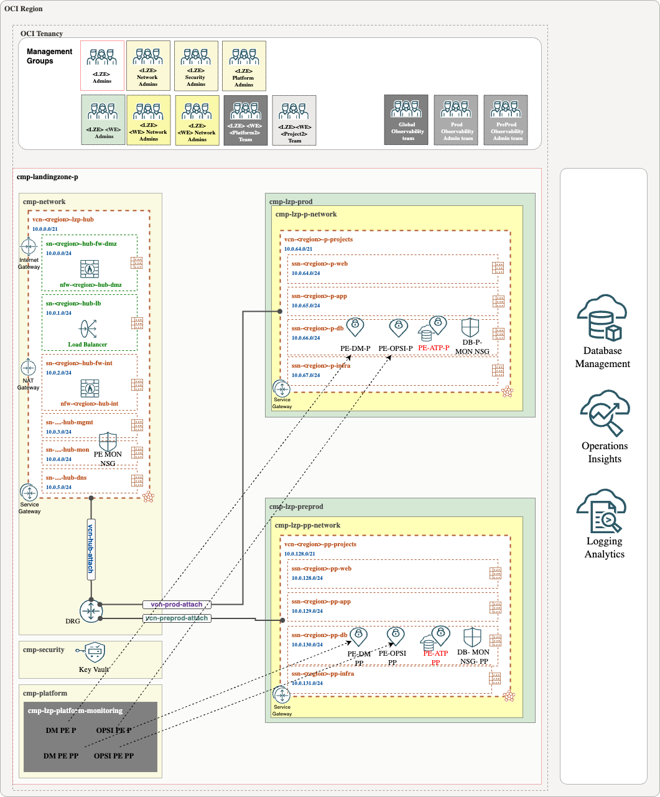

## **Database Management Enabling Steps**

<table>
  <tbody>
    <tr>
      <th align="left">Steps</th>
      <th align="left">Descriptón</th>
      <th align="left">Notes</th>
    </tr>
    <tr>
      <td>Step1</td>
      <td align="left">

The database should be created in the appropriate project compartment at the DB layer, using the DB subnet. 

An additional requirement is to assign the NSGs to the database. 

Example for Prod database: 

<li> Compartment-> cmp-landingzone-p:cmp-lzp-prod:cmp-lzp-p-projects:cmp-lzp-p-proj1:cmp-lzp-p-proj1-db</li>
<li>Network-> vnc:vcn-fra-lzp-p-projects; subnet:ssn-fra-lzp-p-db</li>
<li>nsg-> nsg-lzp-p-projects-mon-pe-db1</li>
      </td>
      <td align="left"> <li>If the database was created previously, ensure it is placed in the correct CMP, assigned to the proper subnet, and configured with the appropriate NSG.</li><li>
      All resources needed like compartments, subnets and Network Security Groups (NSGs) were previously provisioned by the LZ
      </li></td>
    </tr>
    <tr>
      <td>Step2</td>
      <td align="left">

Create the DMA private endpoint. 

In a **global approach**, DMA PEs will be placed in the monitoring subnet (sn-fra-lzp-hub-mon) in the hub and should be assigned to the PE NSGs (nsg-fra-lzp-hub-global-mon-pe).

In a **local approach**, DMA PEs and the ATP PE will reside in the same database subnet (ssn-fra-lzp-p-db), and the nsg-lzp-p-projects-mon-pe-db1 NSGs will allow communication between them.</td>
      <td align="left">
      
All resources needed like Subnets, route tables (RT), Gateways (RT),security lists (SL), and Network Security Groups (NSGs) were previously provisioned by the LZ.

This operation can be easily automated with [Terraform](https://registry.terraform.io/providers/oracle/oci/latest/docs/resources/database_management_db_management_private_endpoint).</td>
    </tr>
          <td>Step3</td>
      <td align="left">
      Unlock and change the password for adbsnmp.
</td>
      <td align="left">
To connect to a database placed in a private subnet you can follow this [blog](https://blogs.oracle.com/datawarehousing/post/4-ways-to-connect-to-autonomous-database-on-a-private-network).
.</td>
    </tr>
 
 
  </tbody>
</table>

**Step 1**

The database should be created in the appropriate project compartment at the DB layer, using the DB subnet. An additional requirement is to assign the NSGs to the database.

Example for Prod database: 

* **Compartment**-> cmp-landingzone-p:cmp-lzp-prod:cmp-lzp-p-projects:cmp-lzp-p-proj1:cmp-lzp-p-proj1-db
* **Network**-> vnc:vcn-fra-lzp-p-projects; subnet:ssn-fra-lzp-p-db
* **nsg**-> nsg-lzp-p-projects-mon-pe-db1

> [!Note] 
> If the database was created previously, ensure it is placed in the correct CMP, assigned to the proper subnet, and configured with the appropriate NSG.
> 
>  All resources needed like compartments, subnets and Network Security Groups (NSGs) were previously provisioned by the LZ.

**Step 2**

Create the DMA private endpoint. 

In a **global approach**, DMA PEs will be placed in the monitoring subnet (sn-fra-lzp-hub-mon) in the hub and should be assigned to the PE NSGs (nsg-fra-lzp-hub-global-mon-pe).

In a **local approach**, DMA PEs and the ATP PE will reside in the same database subnet (ssn-fra-lzp-p-db), and the nsg-lzp-p-projects-mon-pe-db1 NSGs will allow communication between them.

> [!Note] 
> All resources needed like Subnets, route tables (RT), Gateways (RT),security lists (SL), and Network Security Groups (NSGs) were previously provisioned by the LZ.
> 
> This operation can be easily automated with [Terraform](https://registry.terraform.io/providers/oracle/oci/latest/docs/resources/database_management_db_management_private_endpoint).

**Step 3**

Unlock and change the password for adbsnmp.

> [!WARNING]  
> To connect to a database placed in a private subnet you can follow this [blog](https://blogs.oracle.com/datawarehousing/post/4-ways-to-connect-to-autonomous-database-on-a-private-network).

**Step 4**

Create a secret in xxxx vault that is place in cmp-landingzone-p:cmp-lzp-security compartment.

Note: All resources needed like the dedicated Vault and required policies was previously provisioned by the LZ.

**Step 5**

Enable [Database Management](https://docs.oracle.com/en-us/iaas/database-management/doc/enable-database-management-autonomous-databases.html).

Remember to select the private DMA endpoint created in step2.

## **Operations Insights Steps**

**Step 1**

The database should be created in the appropriate project CMP within the DB layer, using the designated DB subnet. Additionally, the necessary requirement is to assign the appropriate NSGs to the database.

Example for Prod database: 

* **Compartment**-> cmp-landingzone-p:cmp-lzp-prod:cmp-lzp-p-projects:cmp-lzp-p-proj1:cmp-lzp-p-proj1-db
* **Network**->vnc:vcn-fra-lzp-p-projects;subnet:ssn-fra-lzp-p-db
* **Nsg**-> nsg-lzp-p-projects-mon-pe-db1

> [!Note] 
> If the database was created previously, ensure it is placed in the correct CMP, assigned to the proper subnet, and configured with the appropriate NSG.
> 
> All resources needed like compartments, subnets and Network Security Groups (NSGs) were previously provisioned by the LZ.

**Step 2**

Create the OPSI private endpoint.

In a **global approach**, OPSI PEs will be placed in the monitoring subnet (sn-fra-lzp-hub-mon) in the hub and should be assigned to the PE NSGs (nsg-fra-lzp-hub-global-mon-pe).

In a **local approach**, OPSI PEs and the ATP PE will reside in the same database subnet (ssn-fra-lzp-p-db), and the nsg-lzp-p-projects-mon-pe-db1 NSGs will allow communication between them.

> [!Note] 
>  All resources needed like Subnets, route tables (RT), Gateways (RT),security lists (SL), and Network Security Groups (NSGs) were previously provisioned by the LZ.
>
> This operation can be easily automated with [Terraform](https://registry.terraform.io/providers/oracle/oci/latest/docs/data-sources/opsi_operations_insights_private_endpoints).

**Step 3**

Unlock and change the password for adbsnmp.

> [!WARNING]  
> To connect to a database placed in a private subnet you can follow this [blog](https://blogs.oracle.com/datawarehousing/post/4-ways-to-connect-to-autonomous-database-on-a-private-network).

**Step 4**

Create a secret in xxxx vault that is place in cmp-landingzone-p:cmp-lzp-security compartment.

> [!Note] 
>  All resources needed like the dedicated Vault and required policies was previously provisioned by the LZ.

**Step 5**

Enable [Operation Insights](https://docs.oracle.com/en-us/iaas/autonomous-database/doc/enable-operations-insights-dedicated-autonomous-database.html).Remember to select the private OPSI endpoint created in step2.

These diagrams illustrate the final result:

|  Approach  | Description | 
|:--:|---|
| Using Global PEs | | 
| Using Local PEs | | 

# License <!-- omit from toc -->

Copyright (c) 2025 Oracle and/or its affiliates.

Licensed under the Universal Permissive License (UPL), Version 1.0.

See [LICENSE](/LICENSE) for more details.

