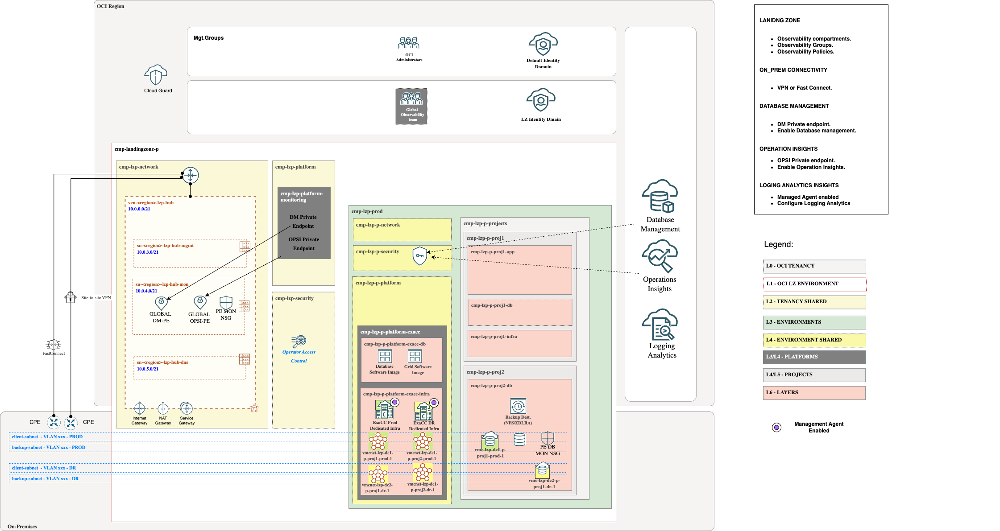
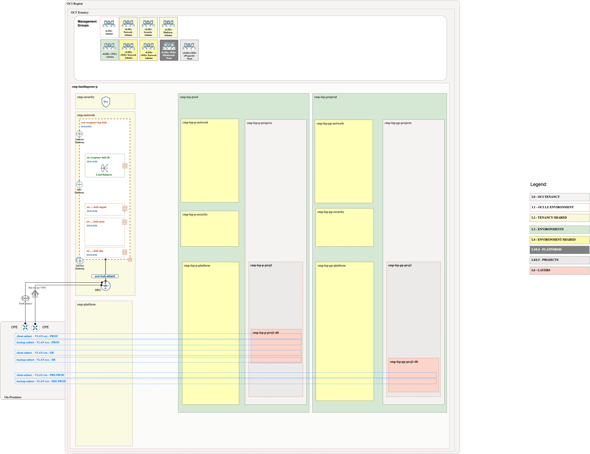
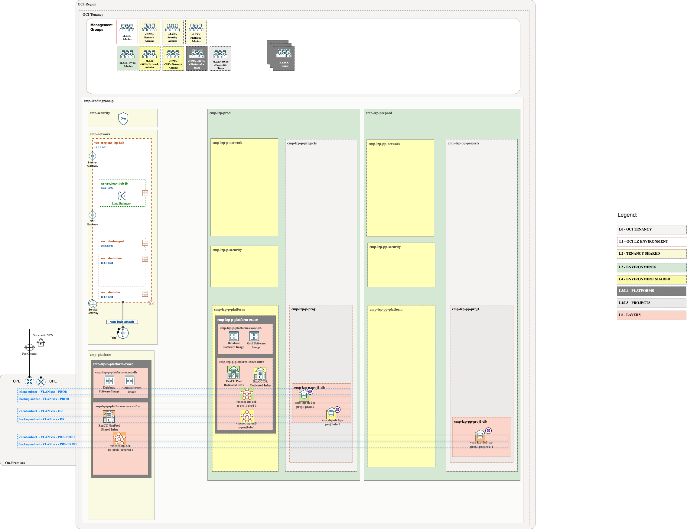

# **[EXACC](#)**
## **An OCI Open LZ Addon to enable Database management & Operation Insights and Logging Analytics **

## Design

For EXACC, we only have the option of a global approach. We deployed the DM/OPSI PEs in the HUB VCN, reusing the monitoring subnet (MON) that is included in all our LZ HUB models.

> [!NOTE]  
> This asset primarily focuses on enabling Native Observability services within the Landing Zone. However, when addressing EXACC workloads, it is also essential to consider events and alarms. These aspects are covered in our EXACC Landing Zone extension, which can be found [here](https://github.com/oci-landing-zones/oci-landing-zone-operating-entities/tree/master/workload-extensions/exacc).
>
>The extension also provides an OCI Event Rule to capture the events generated by the Operator Access Control activities and are integrated with the OCI Notification Topic used by the Global Security Team.
>
>Enabled Observability Resources:
>* Shared ExaDB-C@C Platform Events,Alarms and Announcements
>* Production Workload Environment ExaDB-C@C Platform Events,Events, Alarms and Announcements
>* Pre-Production Workload Environment ExaDB-C@C Platform Events,Events, Alarms and Announcements
>* Example Production Project Alarms.
>* Example Pre-Production Project Alarms.

## Implementation

Our add-on template includes all the necessary components, such as CMP, groups, a dedicated monitoring Vault, policies, and NSGs, to enable Database Management and Ops Insights.

Follow these steps to extend your Landing zone:

**Step 1**. 

(Prerequisite) Deploy ONE-OE landing Zone. You can follow next [steps](https://github.com/oci-landing-zones/oci-landing-zone-operating-entities/tree/master/blueprints/one-oe/runtime/one-stack).

&nbsp; 

**Step 2**. 
(Prerequisite) Deploy EXACC add-on landing Zone. You can follow next [steps](https://github.com/oci-landing-zones/oci-landing-zone-operating-entities/tree/master/workload-extensions/exacc). 

**Step 3**. 
Enable Observability adding this Add-on, use the EXACC JSONs files provided in this asset. To check step by step how to do it check
[here](./Implementation_addon_steps.md)

&nbsp; 

Now, the landing zone is ready to proceed with the necessary steps to enable the observability services. Follow these steps .

# License

Copyright (c) 2025 Oracle and/or its affiliates.

Licensed under the Universal Permissive License (UPL), Version 1.0.

See [LICENSE](/LICENSE.txt) for more details.
