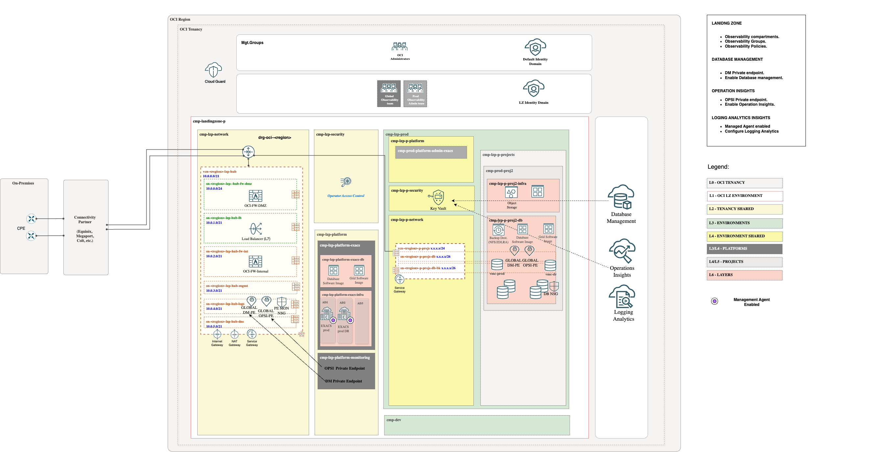

# **[EXACS ](#)**
## **An OCI Open LZ Addon to enable Database management & Operation Insights and Logging Analytics**

## Design

Database Management provides comprehensive performance diagnostics and management for EXACS Oracle Databases. Additionally, with the added capabilities of Ops Insights, you can:

* Analyze resource usage across cloud databases
* Forecast future resource demands, including CPU, memory, and storage, based on historical trends
* Compare SQL performance across databases and identify common patterns
* Monitor ASM disk group usage
* Analyze storage server (cell) I/O and throughput

The DM/OPSI PEs will need visibility with the EXACS SCAN listeners.

* In a **Global approach**, the DM/OPSI PEs will be placed in the mon subnet in the hub and should be assigned to the nsg-fra-lzp-hub-global-mon-pe NSGs. EXACS resides in database client subnet (sn-<region>-p-projs-db) and has to be assigned to the nsg-lzp-p-projects-mon-pe-db NSGs.

  
* In a **Local approach** DM/OPSI PEs and the VM cluster will reside in the same database client subnet(sn-<region>-p-projs-db), and the nsg-lzp-p-projects-mon-pe-db NSGs will allow communication between them.

  

## Implementation

Our add-on template includes all the necessary components, such as CMP, groups, a dedicated monitoring Vault, policies, and NSGs, to enable Database Management and Ops Insights.

Follow these steps to extend your Landing zone:

**Step 1**. 

(Prerequisite) Deploy ONE-OE landing Zone. You can follow next [steps](https://github.com/oci-landing-zones/oci-landing-zone-operating-entities/tree/master/blueprints/one-oe/runtime/one-stack).

&nbsp; 

**Step 2**. 
(Prerequisite) Deploy EXACS add-on landing Zone. You can follow next steps. TBC

**Step 3**. 
Enable Observability adding this Add-on, use the EXACS JSONs files provided in this asset. To check step by step how to do it check
[here](./Implementation_addon_steps.md)

&nbsp; 

Now, the landing zone is ready to proceed with the necessary steps to enable the observability services. Follow these steps .

> [!NOTE]  
> To review the Oracle documentation for enabling Database Management and Operation Insights click [here](https://docs.public.content.oci.oraclecloud.com/en-us/iaas/exadatacloud/doc/observability-and-management-for-exacs.html).

# License

Copyright (c) 2025 Oracle and/or its affiliates.

Licensed under the Universal Permissive License (UPL), Version 1.0.

See [LICENSE](/LICENSE.txt) for more details.
