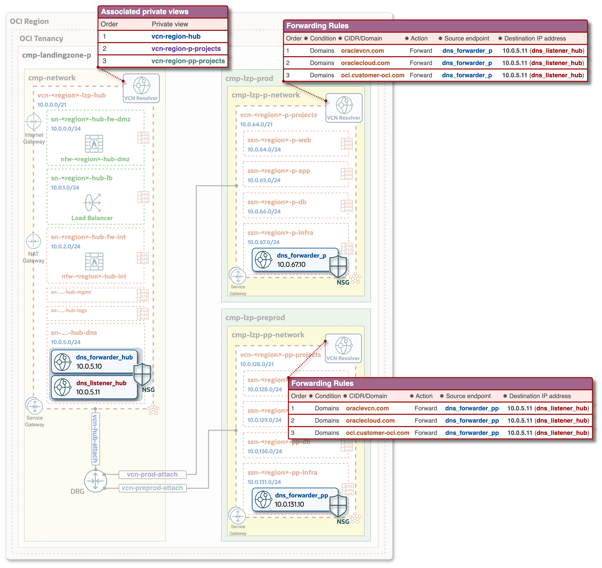

# **[OCI Private DNS configuration and deployment guide](#)**

## **Overview**
This guide provides step-by-step instruction on how to configure and deploy OCI Private DNS on top of existing [OCI Open LZ](https://github.com/oci-landing-zones/oci-landing-zone-operating-entities/blob/master/blueprints/one-oe/runtime/one-stack/readme.md) - Hub & Spoke architecture. While it uses the [Hub A model](https://github.com/oci-landing-zones/oci-landing-zone-operating-entities/blob/master/addons/oci-hub-models/hub_a/readme.md) as a reference, the process is applicable to all [Hub models](https://github.com/oci-landing-zones/oci-landing-zone-operating-entities/blob/master/addons/oci-hub-models/readme.md). 
The components highlighted in the architecture diagram below will be implemented as part of this process.

&nbsp;

## **Configuration and deployment**

**Step 1**. Ensure that the [OCI Open Landing Zone](https://github.com/oci-landing-zones/oci-landing-zone-operating-entities/blob/master/blueprints/one-oe/runtime/one-stack/readme.md) is deployed, as it serves as the foundation for Private DNS configuration.

**Step 2**. Update the Network Configuration JSON to include the blocks shown below. You can also refer to and use the [Private DNS Network JSON template](../../blueprints/one-oe/runtime/one-stack/oci_open_lz_hub_a_network_light_post_DNS.auto.tfvars.json) for the Hub A model (light version, without OCI Network Firewalls), which includes all the necessary JSON blocks for Private DNS configuration.

[Private DNS Network JSON template](../../blueprints/one-oe/runtime/one-stack/oci_open_lz_hub_a_network_light_post_DNS.auto.tfvars.json) consist of the following six additional blocks, which are added into Network Configuration:

- **1st block**: Network Security Group (NSG) configuration in the **Hub VCN**, attached to the Hub DNS Listener and Forwarder. This configuration allows the Hub Listener to establish the necessary Ingress and Egress DNS traffic flow with the Spoke DNS Forwarders. Although the NSG is also associated with the Hub DNS Forwarder (defined in the **2nd block**), it does not include any specific rules for it. Any additional network access (e.g., access to on-premises DNS servers) should be configured either within this NSG or in a dedicated one.

                            "NSG-FRA-LZP-HUB-DNS-KEY": {
                                "display_name": "nsg-fra-lzp-hub-dns",
                                "egress_rules": {
                                    "egress_dns_prod_udp": {
                                        "description": "Egress to Prod DNS endpoint: UDP, Stateless",
                                        "src_port_max": 53,
                                        "src_port_min": 53,
                                        "dst": "10.0.67.10/32",
                                        "dst_type": "CIDR_BLOCK",
                                        "protocol": "UDP",
                                        "stateless": true
                                        ...
                            }

Note: Full configuration of the NSGs are available in the [Private DNS Network JSON template](../../blueprints/one-oe/runtime/one-stack/oci_open_lz_hub_a_network_light_post_DNS.auto.tfvars.json)

- **2nd block**: Configuration of the DNS Forwarder and Listener, as well as the Private views in the **Hub VCN**. 
  The OCIDs for the Hub, Prod, and PreProd private views should be obtained from the OCI Console or CLI and specified as values for `"existing_view_id"`. 

                        "dns_resolver": {
                            "display_name": "vcn-fra-lzp-hub",
                            "attached_views": {
                            "DNS-HUB": {
                                "existing_view_id": "HUB PRIVATE VIEW OCID, e.g. ocid1.dnsview.oc1.eu-frankfurt-1.aaaaaaaaa4xr3d..." 
                                },
                            "DNS-P-PROJECTS": {
                                "existing_view_id": "PROD PRIVATE VIEW OCID, e.g. ocid1.dnsview.oc1.eu-frankfurt-1.aaaaaaaap4jtzm..." 
                                },
                            "DNS-PP-PROJECTS": {
                                "existing_view_id": "PREPROD PRIVATE VIEW OCID, e.g. ocid1.dnsview.oc1.eu-frankfurt-1.aaaaaaaakaxf5m..." 
                                }
                            },
                            "resolver_endpoints": {
                                "RESOLVER_HUB_ENDPOINT_FORWARDER_1": {
                                    "enpoint_type"      : "VNIC",
                                    "is_forwarding"     : "true",
                                    "is_listening"      : "false",
                                    "forwarding_address": "10.0.5.10",
                                    "name"              : "dns_forwarder_fra_hub",
                                    "subnet"            : "SN-FRA-LZP-HUB-DNS",
                                    "nsg"               : ["NSG-FRA-LZP-HUB-DNS-KEY"]
                                    },
                                "RESOLVER_HUB_ENDPOINT_LISTENER_1" : {
                                    "enpoint_type"     : "VNIC",
                                    "is_forwarding"    : "false",
                                    "is_listening"     : "true",
                                    "listening_address": "10.0.5.11",
                                    "name"             : "dns_listener_fra_hub",
                                    "subnet"           : "SN-FRA-LZP-HUB-DNS",
                                    "nsg"              : ["NSG-FRA-LZP-HUB-DNS-KEY"]
                                }
                            }
                        }

  The OCIDs for the Private views in the OCI console can be found under **Networking -> DNS management -> Private views -> Private view information**.

- **3rd block**: NSG configuration in the **Prod Spoke VCN**, attached to the Prod DNS Forwarder. This enables the required Ingress and Egress DNS traffic flow to the Hub DNS Listener.

                            "NSG-LZP-P-PROJECTS-DNS-KEY": {
                                "display_name": "nsg-lzp-p-projects-dns",
                                "egress_rules": {
                                    "egress_dns_udp": {
                                        "description": "Egress to Hub DNS endpoint: UDP, Stateless",
                                        "dst_port_max": 53,
                                        "dst_port_min": 53,
                                        "dst": "10.0.5.11/32",
                                        "dst_type": "CIDR_BLOCK",
                                        "protocol": "UDP",
                                        "stateless": true
                                        ...
                            }

- **4th block**: DNS resolver configuration for the Forwarder and Forwarding Rules in **Prod Spoke VCN**. 

                        "dns_resolver": {
                            "display_name": "vcn-fra-lzp-p-projects",
                            "attached_views": {},
                            "rules" : [
                                {
                                "action"                : "FORWARD",
                                "destination_address"   : ["10.0.5.11"],
                                "source_endpoint_name"  : "RESOLVER_P_ENDPOINT_FORWARDER_1",
                                "qname_cover_conditions": ["oraclevcn.com"]
                                },
                                {
                                "action"                : "FORWARD",
                                "destination_address"   : ["10.0.5.11"],
                                "source_endpoint_name"  : "RESOLVER_P_ENDPOINT_FORWARDER_1",
                                "qname_cover_conditions": ["oraclecloud.com"]
                                },
                                {
                                "action"                : "FORWARD",
                                "destination_address"   : ["10.0.5.11"],
                                "source_endpoint_name"  : "RESOLVER_P_ENDPOINT_FORWARDER_1",
                                "qname_cover_conditions": ["oci.customer-oci.com"]
                                }
                              ],
                            "resolver_endpoints": {
                                "RESOLVER_P_ENDPOINT_FORWARDER_1": {
                                    "enpoint_type"      : "VNIC",
                                    "is_forwarding"     : "true",
                                    "is_listening"      : "false",
                                    "forwarding_address": "10.0.67.10",
                                    "name"              : "dns_forwarder_fra_p",
                                    "subnet"            : "SSN-FRA-LZP-P-INFRA",
                                    "nsg"               : ["NSG-LZP-P-PROJECTS-DNS-KEY"]
                                }
                            }
                        }
                    
- **5th block**: NSG configuration in the **PreProd Spoke VCN**, attached to the PreProd DNS Forwarder.

                            "NSG-LZP-PP-PROJECTS-DNS-KEY": {
                                "display_name": "nsg-lzp-pp-projects-dns",
                                "egress_rules": {
                                    "egress_dns_udp": {
                                        "description": "Egress to Hub DNS endpoint: UDP, Stateless",
                                        "dst_port_max": 53,
                                        "dst_port_min": 53,
                                        "dst": "10.0.5.11/32",
                                        "dst_type": "CIDR_BLOCK",
                                        "protocol": "UDP",
                                        "stateless": true
                                        ...
                            }

- **6th block**: DNS resolver configuration for the Forwarder and Forwarding Rules in **PreProd Spoke VCN**. 

                        "dns_resolver": {
                            "display_name": "vcn-fra-lzp-pp-projects",
                            "attached_views": {},
                            "rules" : [
                            ...
                            ],
                            "resolver_endpoints": {
                                "RESOLVER_PP_ENDPOINT_FORWARDER_1": {
                                    "enpoint_type"      : "VNIC",
                                    "is_forwarding"     : "true",
                                    "is_listening"      : "false",
                                    "forwarding_address": "10.0.131.10",
                                    "name"              : "dns_forwarder_fra_pp",
                                    "subnet"            : "SSN-FRA-LZP-PP-INFRA",
                                    "nsg"               : ["NSG-LZP-PP-PROJECTS-DNS-KEY"]
                                }
                            }
                        }

&nbsp;

To summarize: Blocks 1, 3, and 5 are the NSG configurations for the Hub, Prod, and PreProd respectively, while blocks 2, 4, and 6 are the corresponding DNS resolver configurations.

Note: Ensure that all required values, including IP addresses, OCIDs, naming conventions, are adjusted to match your specific deployment.

&nbsp;

**Step 3**. Run the stack with the updated Network Configuration JSON, which now includes the Private DNS blocks. 
For post-deployment steps, you can follow a similar sequence as outlined in [OCI Open LZ: POST DEPLOYMENT – STEP #2](https://github.com/oci-landing-zones/oci-landing-zone-operating-entities/blob/master/blueprints/one-oe/runtime/one-stack/readme.md).

&nbsp; 

#### License
Copyright (c) 2025 Oracle and/or its affiliates.

Licensed under the Universal Permissive License (UPL), Version 1.0.

See [LICENSE](/LICENSE.txt) for more details.
