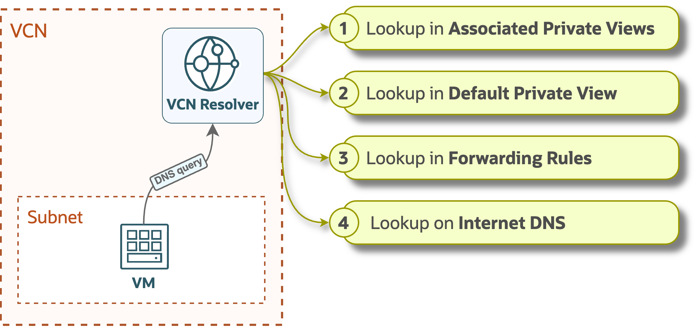
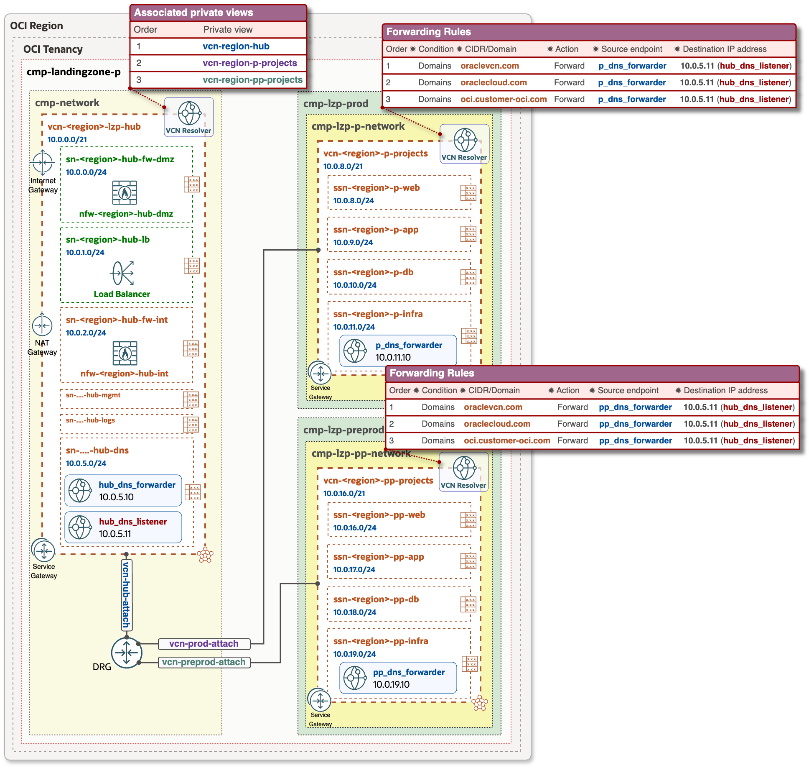
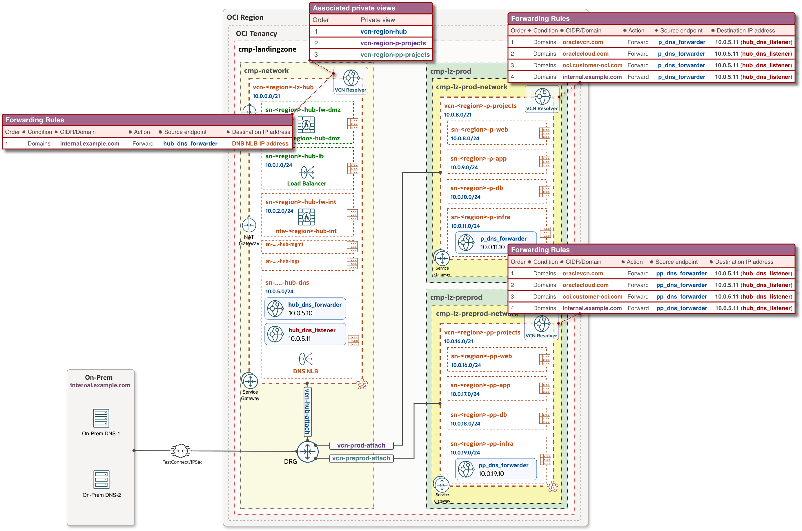
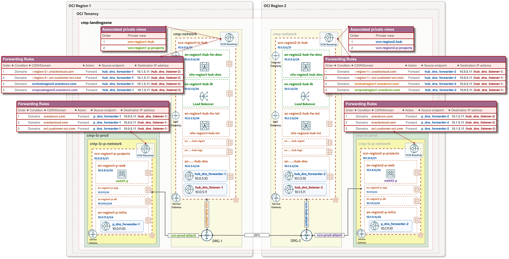

# **[OCI Private DNS configuration](#)**
## **An OCI Open LZ [Addon](#) to Tailor and Optimize Your DNS configuration**

&nbsp; 

**Table of Contents**

- [Overview](#Overview) 
- [OCI Private DNS resources](#OCI-Private-DNS-resources) 
- [VCN DNS Resolver processing order](#VCN-DNS-Resolver-processing-order) 
- [Single-Region: Private DNS configuration view](#1-Single-Region-Private-DNS-configuration-view) 
  - [Single-Region: DNS query animation](#11-Single-Region-DNS-query-animation) 
- [Multi-Region: Private DNS configuration view](#2-Multi-Region-Private-DNS-configuration-view) 
  - [Multi-Region: DNS query animation](#21-Multi-Region-DNS-query-animation)
- [Configuration and deployment](#Configuration-and-deployment)

&nbsp;

## **Overview**
This configuration enables centralized management of private DNS zones within a Hub VCN, controlled by a central network team. All DNS configurations, including zone creation and record updates, are streamlined through a single management plane. This ensures consistency, simplifies administration and eliminates the complexity of managing DNS across multiple environments and OCI regions.

This document provides configuration views for the following use cases:
- Single-Region: Private DNS configuration view and animation for a Hub and Spoke architecture within one OCI region.
- Multi-Region: Private DNS configuration view and animation for a setup where Hub & Spoke VCNs are connected via Remote Peering Connection (RPC).

&nbsp;

### OCI Private DNS resources

| Resource | Description |
| - | - |
| [VCN Resolver](https://docs.oracle.com/en-us/iaas/Content/DNS/Tasks/privatedns.htm#private-dns__resources) | Each VCN has a dedicated DNS resolver that processes and responds to DNS queries within the VCN. By default, it listens on 169.254.169.254 and operates based on its configured settings. |
| [Private Zones](https://docs.oracle.com/en-us/iaas/Content/DNS/Tasks/privatedns.htm#private-dns__resources) | Private zones contain DNS data only accessible from within a VCN, such as private IP addresses. |
| [Private Views](https://docs.oracle.com/en-us/iaas/Content/DNS/Tasks/privatedns.htm#private-dns__resources) | A private DNS view is a collection of Private Zones, and these are: • **Default Private View** - a dedicated/default view for VCN Resolver. • **Associated Private Views** - the private views from other VCNs, added into VCN Resolver. |
| [Resolver Endpoints](https://docs.oracle.com/en-us/iaas/Content/Network/Concepts/dns-topic-resolver_endpoints.htm) | There are two types of endpoints: • **Listening endpoint** - allows the DNS Resolver to answer DNS queries coming from outside the VCN, such as on-prem systems and other resolvers. • **Forwarding endpoint** - allows the DNS resolver to query a remote DNS as defined in the Forwarding rules. |
| [Forwarding Rules](https://docs.oracle.com/en-us/iaas/Content/Network/Concepts/dns-topic-resolver_rules.htm) | Rules are used to answer queries that aren't answered by a resolver's views and the queries that match the rule condition will be handled by the rule. If no rules match, the query will be resolved from Internet DNS. |

&nbsp;

### VCN DNS Resolver processing order
The VCN DNS resolver processes queries in the priority order presented below. It attempts to resolve each query by sequentially checking the configured options. 

After an answer is provided, no further items are evaluated, even if the answer is negative.

&nbsp;

## 1. Single-Region: Private DNS configuration view
&nbsp;
Configuration details:
  - Hub VCN consists of the following resources and components: 
    - Forwarding (**hub_dns_forwarder**) and Listening (**hub_dns_listener**) endpoints.
    - Hub VCN Resolver has Associated private views for Hub and Spokes VCNs. As a result, it contains all DNS data/records for the three VCNs and can resolve any FQDN within the Hub and Spoke architecture.
  - Spoke VCN Resolvers include
    - Forwarding endpoints (**p_dns_forwarder** and **pp_dns_forwarder** respectively).
    - Conditional forwarding rules, that directs queries for **oraclevcn.com**, **oraclecloud.com** and **oci.customer-oci.com** domains to the **hub_dns_listener** for resolution.

&nbsp;

#### DNS configuration with On-Premise connectivity:
In addition to the above configuration, the following setup includes forwarding rules for On-Premises DNS zones in both - the Spoke VCNs and the Hub VCN. These rules direct queries to a Network Load Balancer (NLB), which serves as the target for forwarding. The On-Premises DNS servers are configured as backends for the DNS NLB.

&nbsp;

&nbsp;

### 1.1 Single-Region: DNS query animation

These animations illustrate the DNS query and response within Hub & Spoke, and covers the following scenarios:

#### Scenario 1: DNS resolution within the same Spoke VCN
- The **web01-p.ssnpweb.vcnprod.oraclevcn.com** instance in Prod Spoke VCN performs *nslookup* to retrieve an IP address of the **db01-p.ssnpdb.vcnprod.oraclevcn.com** database instance, which is located in the same Spoke VCN but in a different subnet.
- Prod VCN resolver evaluates the query based on the [VCN DNS Resolver processing order](#VCN-DNS-Resolver-processing-order) as follows: 
   ⓵ **Associated Private Views** - Since no Private view is associated with the Prod VCN resolver, it proceeds to the next step. 
   ⓶ **Default Private View** - The default private view contains a DNS record for the database, so the resolver retrieves the record.
- The Prod VCN resolver returns the DNS response to **web01-p**.

&nbsp;

#### Scenario 2: Spoke to Spoke DNS resolution
- The **web01-p.ssnpweb.vcnprod.oraclevcn.com** in prod Spoke VCN performs *nslookup* to retrieve the IP address of **web02-pp.ssnppweb.vcnpreprod.oraclevcn.com**, located in the preprod Spoke VCN.
- Prod VCN resolver evaluates the query based on the [VCN DNS Resolver processing order](#VCN-DNS-Resolver-processing-order) as follows: 
   ⓵ **Associated Private Views** - Since no Private view is associated with the Prod VCN resolver, it moves to the next option. 
   ⓶ **Default Private View** – This view contains only DNS records specific to the Prod VCN. Since the resolver does not have a record for **web02-pp**, it proceeds to the next step. 
   ⓷ **Forwarding Rules** – The resolver identifies a forwarding rule for **oraclevcn.com**, directing the query to the **hub_dns_listener** through the **p_dns_forwarder** in the Prod Spoke VCN.
- The Hub VCN Resolver has all DNS data/records from the **Associated Private views**, processes the query and returns the DNS response to **web01-p** in the Prod Spoke VCN.

&nbsp;

## 2. Multi-Region: Private DNS configuration view
Configuration details:
  - Each Hub VCN in a given region consists of the following resources and components:
    - Forwarding (**hub_dns_forwarder-1 and 2**) and Listening (**hub_dns_listener-1 and 2**) endpoints.
    - The Hub VCN Resolver is associated with Private views for both - the Hub and Spoke VCNs, allowing it to store and resolve all DNS records across the three VCNs within the Hub and Spoke architecture.
    - Conditional Forwarding Rules in the Hub VCN resolvers ensure that region-specific DNS zones are forwarded to the appropriate region.
  - In each region, Spoke VCN Resolvers include:
    - Forwarding Endpoints: p_dns_forwarder-1 and p_dns_forwarder-2.
    - Conditional forwarding rules that direct queries for **oraclevcn.com**, **oraclecloud.com** and **oci.customer-oci.com** domains to the respective  **hub_dns_listener-1 or 2** for resolution.
  
&nbsp;

&nbsp;

&nbsp;

### 2.1 Multi-Region: DNS query animation
**Spoke to Spoke DNS Resolution across different regions:**

- The **web01-p.ssnpweb.vcnprodregion1.oraclevcn.com** in Spoke VCN (Region-1) performs *nslookup* to get an IP address of the **web02-p.ssnpweb.vcnprodregion2.oraclevcn.com** located in Region-2 inside Prod VCN.
- Prod VCN resolver evaluates the query based on the [VCN DNS Resolver processing order](#VCN-DNS-Resolver-processing-order) as follows: 
    ⓵ **Associated Private Views** - Since no private view is associated with the Prod VCN Resolver, it proceeds to the next step. 
    ⓶ **Default Private View** - This view contains only DNS records specific to the local VCN. Since the resolver does not have a record for **web02-p** in Region-2, it moves to the next step. 
    ⓷ **Forwarding Rules** – A forwarding rule for **oraclevcn.com** is found, directing the DNS query to **hub_dns_listener-1** through **p_dns_forwarder-1** endpoint, and subsequently to the Hub VCN Resolver in Region-1. 
- A Hub VCN Resolver in Region-1 evaluates the query based on the [VCN DNS Resolver processing order](#VCN-DNS-Resolver-processing-order) as follows: 
    ⓵ **Associated Private Views** - These views do not contain records for the **vcnprodregion2.oraclevcn.com** subdomain, so it moves to the next step. 
    ⓶ **Default Private View** - This view contains only region-specific VCN records, so it proceeds to the next step. 
    ⓷ **Forwarding Rules** - A rule for **vcnprodregion2.oraclevcn.com** is found, forwarding the DNS query to **hub_dns_listener-2** via **hub_dns_forwarder-1**. Which then sends it to the Hub VCN Resolver in Region-2. 
- Hub VCN Resolver in Region-2 has the required DNS records from all the **Associated Private views**, and returns the IP address of **web02-p** as the DNS response.

&nbsp;

> [!NOTE]
>OCI services such as Autonomous Databases, Oracle Analytics, Streaming, Object Storage, and others support Private Endpoints. These services have automatically generated DNS records within Oracle-owned public domains, such as:
>- oraclecloud.com
>- oci.customer-oci.com
>
> When a Private Endpoint is created for one of these services, an additional DNS record is automatically added to the Default Private View of the specific VCN where the endpoint's subnet resides. This allows the private IP address of the endpoint to be resolved within the VCN. 
> For simplicity, these domains are not explicitly depicted in Forwarding Rules within the animations but are included in the configuration views.
>
> Note that the animations are visual representations designed to simplify the understanding of DNS behavior and do not necessarily reflect the internal implementation of OCI.

&nbsp;

#### Summary
This Private DNS configuration in a Hub and Spoke architecture ensures that all VCN-internal and Internet-specific DNS queries are handled by their respective VCN Resolvers. Meanwhile, Oracle-specific domains, On-Premises zones, and custom-created domains are handled and managed by the Hub VCN Resolver. This approach optimizes DNS management and supports a consistent, scalable architecture across OCI environments, in both single-region and multi-region deployments.

&nbsp;

### Configuration and deployment
[OCI Private DNS configuration and deployment guide](Deployment.md) for a Single-Region.

&nbsp; 

#### License
Copyright (c) 2026 Oracle and/or its affiliates.

Licensed under the Universal Permissive License (UPL), Version 1.0.

See [LICENSE](/LICENSE.txt) for more details.
