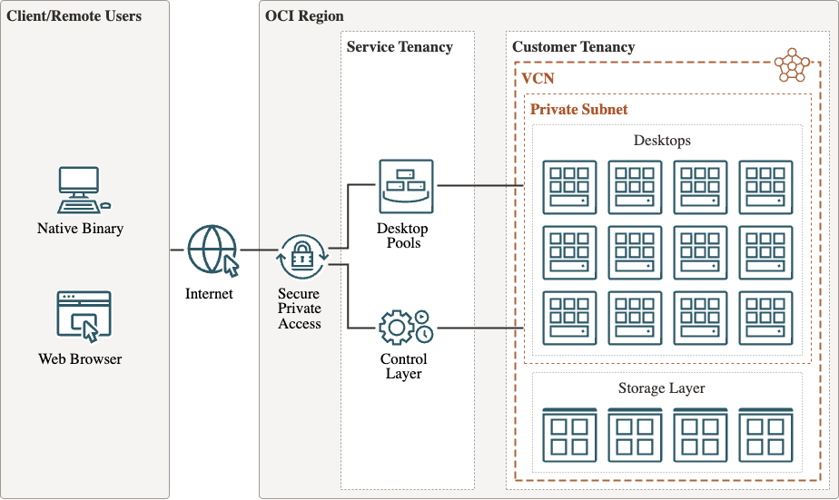
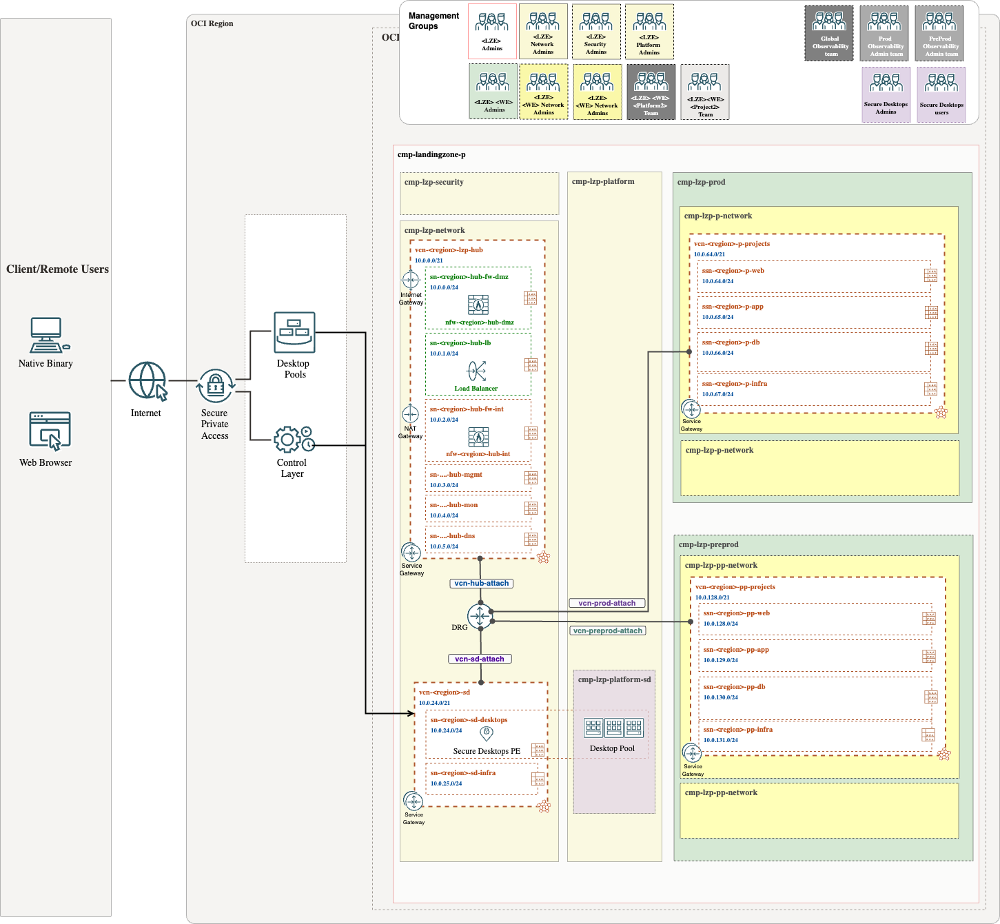

# **[OCI Secure Desktop Guide](#)**
## **An OCI Open LZ Addon to use Secure Desktops in your LZ**

&nbsp; 

### Overview

Welcome to the **OCI Secure Desktops Guide**. 

This guide provides guidelines on adding secure desktop to our Operating Entity Landing Zones.

Secure Desktops is ideal for organizations that need to provide employees with controlled access to a preconfigured desktop environment.

Oracle Cloud Infrastructure (OCI) Secure Desktops service enables an administrator to create an identical set of virtual desktops that individual users can securely access. Administrators can create pools of desktops in their tenancy using existing compute shapes and custom images.

The virtual desktops and OCI configuration are managed by the administrator, allowing non-technical users to easily and securely access the virtual desktop and use it for their daily work.

The Secure Desktops service provides:

* A way to create and maintain a large number of identical desktops.
* Controlled access to a virtual desktop for potentially non-technical users.
* Data security by storing data on Oracle Cloud Infrastructure resources and not on an individual client device.

A virtual desktop provides:

* Access to applications on a different operating system than your client device. For instance, you may have a Linux device, but need to access software that only runs on Windows.
* Access to more powerful resources, such as more CPUs and memory, storage, and so on.
* Increased data security in the event your client device is lost or crashes.
* Desktop mobility as the desktop is available wherever you can connect to the internet.

To know more about Secure Desktop Service you can check the Oracle Official documentation [here](https://docs.oracle.com/en-us/iaas/secure-desktops/overview-secure-desktops.htm).
&nbsp; 

### Benefits of this asset

Following the guidelines explained here reduces the overall management complexity and will help you with:

* Reducing configuration complexity.
* Facilitating organic growth of your Landing Zone, with the addition of the Secure Desktops service.
* Reducing the time for setting up Proof of Concepts (PoCs).

&nbsp; 

### Add-on Design

### Add-on Implementation

Import images into the compartment and add the following tags for each custom image. These tags allow the service to determine which images to display as an option when you create a desktop pool.

oci:desktops:is_desktop_image true
oci:desktops:image_version <version>, where <version> is a meaningful reference for your use.
oci:desktops:image_os_type [Oracle Linux | Windows]

### Secure Desktop configuration Steps

https://docs.oracle.com/en/learn/deploy-oci-secure-desktops/index.html#introduction

&nbsp; 

# License

Copyright (c) 2025 Oracle and/or its affiliates.

Licensed under the Universal Permissive License (UPL), Version 1.0.

See [LICENSE](/LICENSE.txt) for more details.
