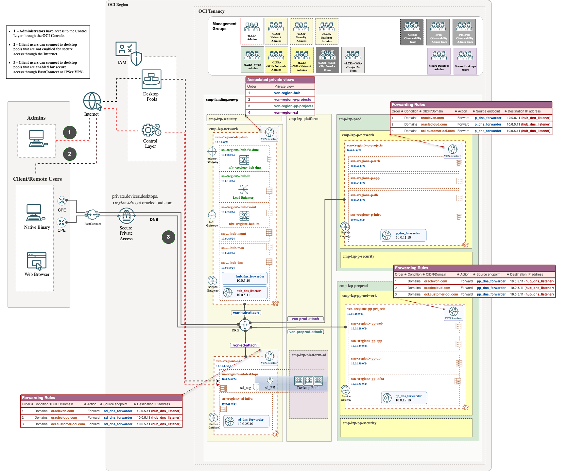

# **[OCI Secure Desktop Guide](#)**
## **An OCI Open LZ Addon to onboard Secure Desktops in your LZ**
&nbsp; 

## Overview

Welcome to the **OCI Secure Desktops Guide**. 

This guide provides step-by-step instructions for integrating the Secure Desktops service into the Operating Entity Landing Zones blueprints.

Oracle Cloud Infrastructure Secure Desktops is ideal for organizations seeking controlled access to pre-configured desktop environments for their employees. OCI Secure Desktops is a cloud-native, managed service designed to ensure the security, reliability, and scalability of desktop environments. It enables organizations to provide their global workforce with secure, centrally controlled, customizable, and consistent desktop experiences, regardless of the device used.

With OCI Secure Desktops, administrators can create pools of virtual desktops in their tenancy using existing compute shapes and custom images. These desktops are identical in configuration, and users can securely access them to work with enterprise data.

The service enables administrators to manage both virtual desktops and OCI configurations, ensuring non-technical users can easily and securely access their virtual desktops for daily tasks.

The OCI Secure Desktops service provides:

* A way to create and maintain a large number of identical desktops.
* Controlled access to a virtual desktop for potentially non-technical users.
* Data security by storing data on Oracle Cloud Infrastructure resources and not on an individual client device.

A virtual desktop provides:

* Access to applications on a different operating system than your client device. For instance, you may have a Linux device, but need to access software that only runs on Windows.
* Access to more powerful resources, such as more CPUs and memory, storage, and so on.
* Increased data security in the event your client device is lost or crashes.
* Desktop mobility as the desktop is available wherever you can connect to the internet.

To learn more about OCI Secure Desktop Service, you can refer to the official Oracle documentation [here](https://docs.oracle.com/en-us/iaas/secure-desktops/overview-secure-desktops.htm).
&nbsp; 

## Benefits of this asset

By following the guidelines outlined here, you can reduce overall management complexity and benefit from the following:

* Reducing configuration complexity.
* Facilitating organic growth of your Landing Zone, with the addition of the OCI Secure Desktops service.
* Reducing the time for setting up Proof of Concepts (PoCs).

&nbsp; 

## LZ Addon Design

If you want to learn more about configuring OCI Secure Desktops, we recommend checking out this [solution](https://docs.oracle.com/en/solutions/oci-tenancy-secure-desktop-pool/index.html#GUID-4FDC6E79-517F-49C4-80F6-AED75B85F293) published in the Architecture Center.
&nbsp; 

This LZ Ext. goes beyond by configuring OCI secure desktops in a dedicated VCN connected to the HUB-and-Spoke architecture provided by the ONE-OE Landing Zone blueprint. We cover two different scenarios:

### **Scenario 1**. Connection through the Internet.

**Prereqs**: ONE-OE

It includes the following resources:
* Dedicated OCI secure desktop groups.
* Required policies.
* Dedicated spoke VCN.
  
### **Scenario 2**. Connection through Private Access.

**Prereqs**: ONE-OE + DNS add-on

It includes the following resources:
* Dedicated OCI secure desktop groups.
* Required policies.
* Dedicated spoke VCN.
* DNS configuration. Forwarder endpoint.
* NSG 
  

## Landing Zone Add-on: Implementation 

### Scenario 1 

* Step 1: As a prerequisite you need to deploy a foundation landing zone, in that case, we have chosen the [One-OE](../../../../blueprints/one-oe/).

    [](https://cloud.oracle.com/resourcemanager/stacks/create?zipUrl=https://github.com/oci-landing-zones/terraform-oci-modules-orchestrator/archive/refs/tags/v2.0.5.zip&zipUrlVariables={"input_config_files_urls":"https://raw.githubusercontent.com/oci-landing-zones/oci-landing-zone-operating-entities/master/blueprints/one-oe/runtime/one-stack/oci_open_lz_one-oe_iam.auto.tfvars.json,https://raw.githubusercontent.com/oci-landing-zones/oci-landing-zone-operating-entities/refs/heads/master/addons/oci-hub-models/hub_b/oci_open_lz_hub_b_network_light.auto.tfvars.json,https://raw.githubusercontent.com/oci-landing-zones/oci-landing-zone-operating-entities/master/blueprints/one-oe/runtime/one-stack/oci_open_lz_one-oe_observability_cisl1.auto.tfvars.json,https://raw.githubusercontent.com/oci-landing-zones/oci-landing-zone-operating-entities/master/blueprints/one-oe/runtime/one-stack/oci_open_lz_one-oe_security_cisl1.auto.tfvars.json"}) 

   If you prefer to use a copy of the json files and store it in your own bucket or github repo , follow these [steps](../oke/multi-stack/1_oke_extension/ORM_ONE-OE_deployment_steps.md)

* Step 2: To run this landing zone addon, follow these [steps](./Implementation_s1_steps.md).

### Scenario 2 

* Step 1: As a prerequisite you need to deploy a foundation landing zone, in that case, we have chosen the [One-OE](../../../../blueprints/one-oe/).

    [](https://cloud.oracle.com/resourcemanager/stacks/create?zipUrl=https://github.com/oci-landing-zones/terraform-oci-modules-orchestrator/archive/refs/tags/v2.0.5.zip&zipUrlVariables={"input_config_files_urls":"https://raw.githubusercontent.com/oci-landing-zones/oci-landing-zone-operating-entities/master/blueprints/one-oe/runtime/one-stack/oci_open_lz_one-oe_iam.auto.tfvars.json,https://raw.githubusercontent.com/oci-landing-zones/oci-landing-zone-operating-entities/refs/heads/dns_deployment/blueprints/one-oe/runtime/one-stack/oci_open_lz_hub_a_network_light_post_DNS.auto.tfvars.json,https://raw.githubusercontent.com/oci-landing-zones/oci-landing-zone-operating-entities/master/blueprints/one-oe/runtime/one-stack/oci_open_lz_one-oe_observability_cisl1.auto.tfvars.json,https://raw.githubusercontent.com/oci-landing-zones/oci-landing-zone-operating-entities/master/blueprints/one-oe/runtime/one-stack/oci_open_lz_one-oe_security_cisl1.auto.tfvars.json"}) 

    In the private access scenario, we need to include the DNS configuration. To understand how to perform this operation on top of the previous ONE-OE, follow these [steps](https://github.com/oci-landing-zones/oci-landing-zone-operating-entities/tree/master/addons/oci-private-dns).

    To use your own json files stored in a bucket or in your own GitHub Bucket follow this [steps](ORM_ONE-OE_DNS_deployment_steps.md)

* Step 2: To run this landing zone addon, follow these [steps](./Implementation_s2_steps.md).

## OCI Secure Desktops Service configuration.

Your Landing Zone is now ready to enable and configure the **OCI Secure Desktops service**. To view the necessary steps, click [here](./secureDesktops_configuration.md).

Additional resources on Secure Desktops:

* [OCI Secure Desktops](https://docs.oracle.com/en-us/iaas/secure-desktops/home.htm)
* [OCI Secure Desktops YouTube series](https://www.youtube.com/playlist?list=PLKCk3OyNwIzv0axRP4vP7zpubJE555Wbb)
* [OCI Secure Desktops Latest Blog](https://blogs.oracle.com/cloud-infrastructure/post/next-gen-oci-secure-desktops-security-flexibility)
&nbsp; 

# License

Copyright (c) 2025 Oracle and/or its affiliates.

Licensed under the Universal Permissive License (UPL), Version 1.0.

See [LICENSE](/LICENSE.txt) for more details.
