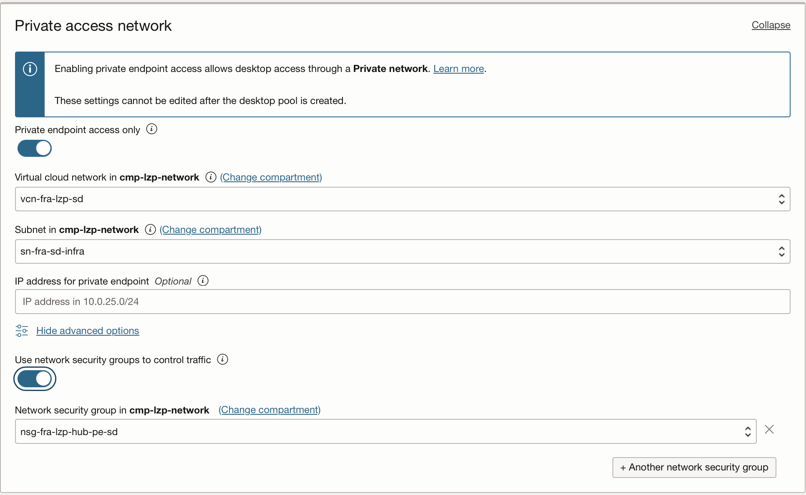

# Secure Desktops Configuration Steps <!-- omit from toc -->

---

### 1. Create a Secure Desktop Custom Image.

To use OCI Secure Desktops, you must create a custom image. To get the list of [supported images](https://docs.oracle.com/en-us/iaas/secure-desktops/supported-images.htm), see Supported Images.

To create a [custom image](https://docs.oracle.com/en-us/iaas/secure-desktops/create-custom-image.htm#build-base-image), we recommend starting with one of the base images provided by Oracle for use with Secure Desktops. Any desktop that uses this image will include the customizations, configurations, and software you applied when creating it.

Alternatively, you can import your own image. For details, see [Importing an Image](https://docs.oracle.com/en-us/iaas/Content/Compute/Tasks/imageimportexport.htm#Importing).

Store your desktop images in the following compartment:
cmp-landingzone-p:cmp-lzp-platform:cmp-lzp-platform-sd.

For each custom image, add the tags listed below. These tags enable the service to identify and display the appropriate images as options when creating a desktop pool.

```
oci:desktops:is_desktop_image true
oci:desktops:image_version <version>, where <version> is a meaningful reference for your use.
oci:desktops:image_os_type [Oracle Linux | Windows]
```


### 2. Create a Desktop Pool.

Create a user that belongs to the **grp-lzp-p-secure-desktop-admin** group to run this operation.

- Open the OCI Console and click Compute. Under Secure Desktops, click Desktop Pools.

- Under List scope, select the compartment in which you want to create the pool and click Create Desktop Pool (cmp-landingzone-p:cmp-lzp-platform:cmp-lzp-platform-sd).

Follow the steps defined [here](https://docs.oracle.com/en-us/iaas/secure-desktops/create-pool.htm) to create a Desktop pool.


- In the **Desktop pool network**, enter the following information:

  
  In **Scenario 1**, the connection will be established through the internet:

    * **Virtual cloud network**: Select the virtual cloud network (VCN) for the desktops in this pool.(vcn-fra-lzp-sd)

    * **Subnet**: Select the secure desktops subnet in the VCN. (sn-fra-lzp-sd).

    * Skip section **Private Access network**.

    

    In **Scenario 2**, the Desktop subnet will be accessible through the fast connect or IPSec VPN, to check the private access documentation go [here]( https://docs.oracle.com/en-us/iaas/secure-desktops/private-access.htm#:~:text=A%20private%20endpoint%20is%20represented,endpoint%20configured%20in%20the%20VCN.&text=This%20feature%20can%20only%20be%20enabled%20when%20creating%20new%20desktop%20pools.).

    * **Virtual cloud network**: Select the virtual cloud network (VCN) for the desktops in this pool.(vcn-fra-lzp-sd)

    * **Subnet**: Select the desktops subnet in the VCN (sn-fra-lzp-sd). Use Network Security Groups to control traffic and assign sg-fra-lzp-hub-pe-sd to the Desktop Pool that will be created.

    * Select also **Private Access Network**. Create a private endpoint in the same Desktop subnet and select the pre-created network security group nsg-fra-lzp-hub-pe-sd.

    


- Click Create.
  


### 3. Access the Desktop Pool.

Create a user that belongs to the grp-lzp-p-secure-desktop-users group to run this operation.

### For **Scenario 1**:

Edit the following URL with the appropriate region identifier. For more information about identifier values for your region, see [Regions and Availability Domains](https://docs.oracle.com/en-us/iaas/Content/General/Concepts/regions.htm#About).

    https://published.desktops.RegionIdentifier.oci.oraclecloud.com/client

    example: https://published.desktops.eu-frankfurt-1.oci.oraclecloud.com/client


&nbsp; 

### For **Scenario 2**:

You will need to configure your on-premises DNS to access **private.devices.desktops.region-id.oci.oraclecloud.com**.

The DNS name for each private pool endpoint will be unique and in the form: **pool-specific-id.private.devices.desktops.region-id.oci.oraclecloud.com**

For more information about private access review the [official documentation](https://docs.oracle.com/en-us/iaas/secure-desktops/private-access.htm).


# License

Copyright (c) 2025 Oracle and/or its affiliates.

Licensed under the Universal Permissive License (UPL), Version 1.0.

See [LICENSE](/LICENSE.txt) for more details.
