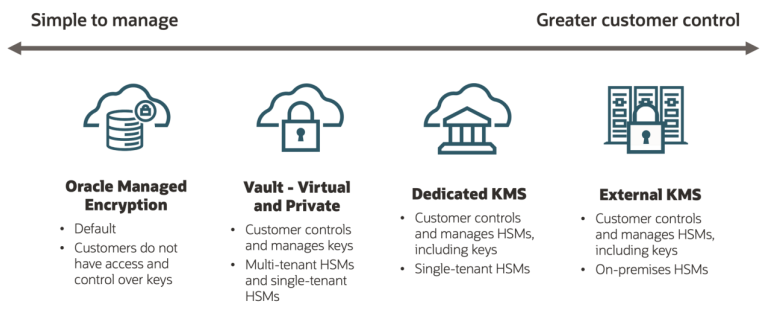

# Sovereign Controls <!-- omit from toc -->

## Table of contents <!-- omit from toc -->
  - [Summary](#summary)
  - [Principle 1. Location](#principle-1-location)
    - [Policies](#policies)
    - [Quota Policies](#quota-policies)
  - [Principle 2. Isolation](#principle-2-isolation)
  - [Principle 3. Access Management](#principle-3-access-management)
    - [IAM](#iam)
    - [Audit Service logs](#audit-service-logs)
    - [Cloud Guard and Security Zones](#cloud-guard-and-security-zones)
    - [Vulnerability scanning](#vulnerability-scanning)
  - [Principle 4. Encryption](#principle-4-encryption)
    - [Vaults and key management](#vaults-and-key-management)

## Summary
The Sovereign Controls addons consists of two documents:
- **This** document, expands on [Oracle Cloud Infrastructure
Sovereign Cloud Principles](https://docs.oracle.com/en-us/iaas/Content/Resources/Assets/whitepapers/oracle-sovereign-cloud-principles.pdf) document, covering the Sovereign principles that can be used to meet local regulatory requirements using Landing Zone.
- The Sovereign [implementation guide](./implementation.md) covering the steps to extend the existing LZ with the Sovereign Controls add-on.
In the following sections in order to simplify the example of Sovereign LZ we take an example of a German customer who wants to implement Sovereign controls, however these principles can be used by any customer to meet local regulations.

For the purpose of giving an example we will use a German customer that we will use across all the following principles.

## Principle 1. Location
[OCI *realms*](https://docs.oracle.com/en-us/iaas/Content/General/Concepts/regions.htm) are physical boundaries of a cloud offering acompanied by possible different operations team and possibly a part of a different Oracle legal entities depending on the offering. *Realms* consist of multiple *regions*, dedicated networking and control plane resulting in a complete isolation of different realms. Regions within a realm are be located in multiple physical locations. Each *region* has one or more *availability domains (AD)*. AD is bound to a specific data center. When customer subscribes to OCI Cloud a new [*tenancy*](https://docs.oracle.com/en/cloud/foundation/cloud_architecture/governance/tenancy.html) is created in a contractually agreed *realm*. A _tenant_ is logical boundary creating isolated evnironment for each customer. A _tenant_ is by default subscribed only to the [Home Region](https://docs.oracle.com/en-us/iaas/Content/Identity/Tasks/managingregions.htm), however with required policies *Tenancy* can subscribe to all available regions within the realm (subject to service limits). Location can be controlled using Sovereign Landing Zone with policies below. In our example of a German customer with mandate to keep data within EU Sovereign Cloud (eu-frankfurt-2) region and can limit their tenancy data locations to this region and prevent storing data in any other region.

Oracle Cloud has a set of different cloud deployment capabilities such as [Public Cloud](https://www.oracle.com/cloud/public-cloud-regions/), [Oracle Alloy](https://www.oracle.com/cloud/alloy/), [EU Sovereign Cloud](https://www.oracle.com/cloud/eu-sovereign-cloud/), [OCI Dedicated Region](https://www.oracle.com/cloud/cloud-at-customer/dedicated-region/). Each of these are located in their own realm.

Tenancy consists of one or more [Compartments](https://docs.oracle.com/en/cloud/foundation/cloud_architecture/governance/compartments.html). Compartments are used for logical separation of resources within a tenancy. Compartments can be nested and hold resources, and permission assignments. To control access rights [policies](https://docs.oracle.com/en-us/iaas/Content/Identity/Concepts/policygetstarted.htm) are used to bind permissions to a certain user group.

Within a realm, policies and quotas can be utilized to limit resource usage in other OCI regions. Oracle Cloud offers a diverse range of services to support various needs, including compute, storage, database, and artificial intelligence services. This principle ensures that these services are used responsibly and within established regions.

### Policies
Policies can be used to restrict permissions to a specific region by restricting access to resources in other regions. Here's an example of limit policy to eu-frankfurt-2 (for short STR) region which is the OCI EU Sovereign Cloud Germany Central region.
```
Allow group str-admins to manage all-resources in tenancy where request.region = 'str'
```
A policy limit like this can be applied to any required policy. Note IAM related permission need to be always assigned in the Home Region. If it's required to managed multiple segregated locations with different regulations it's recommended to consider using child Tenancy to set-up different boundaries.

### Quota Policies
Use Quota Policies in Oracle Cloud Infrastructure to control resource consumption/creation based on a region within Compartments/Tenancy. Quota Policies limit the number of resources that can be created in a Compartment/Tenancy based on the region. In this example the customer wants to make sure there's no quota available in the regions other than the eu-frankfurt-2 (STR for short) region.
```
zero compute-core quota /*/ in tenancy where request.region != 'eu-frankfurt-2'
zero database quota /*/ in tenancy where request.region != 'eu-frankfurt-2'
zero vcn quota /*/ in tenancy where request.region != 'eu-frankfurt-2'
zero filesystem quota /*/ in tenancy where request.region != 'eu-frankfurt-2'
zero object-storage quota /*/ in tenancy where request.region != 'eu-frankfurt-2'
```
The provided list of Quota Policies is not exhaustive and includes only the most common services used for storing data. See [Available Quota by Service](https://docs.oracle.com/en-us/iaas/Content/Quotas/Concepts/resourcequotas_topic-Available_Quotas_by_Service.htm) for a full list.

Additionally for multi tenancy set-up the [Governance Rules](https://docs.oracle.com/en-us/iaas/Content/General/Concepts/organization_management_overview.htm#governance_rules) in Organizations service can be used to impose restriction on child tenancy

<p align="center" width="100%">
    
</p>


## Principle 2. Isolation
Oracle Cloud offering is at a high level segregated into two components, the Control Plane and the Data Plane. The Control Plane is managed by Oracle and is used for managing and orchestrating underlying infrastructure using Console or APIs. The Control Planes ensures logical separation between different customers. The Data Plane is a result of the user configuration of the services in the Control Plane and defines virtual resources like Networking, Databases, Compute instances.

An organization should have the assurance that their data remains in the physical and logical environments that they have selected.

We can identify different levels of **isolation**: physical isolation, logical isolation, and network isolation.

* **Physical isolation** can be achieved using the various dedicated cloud deployment options such as Dedicated Regions (DRCC), Isolated Regions (for mission-critical or classified workloads), and Alloy (for partners building their own cloud solutions). Physical isolation applies to both Data and Control Planes. Additionally within a Region customers can further isolate physically their resources from one another:
  - One region is made of 1 to 3 Availability domains. Availability domains are isolated from each other, fault tolerant, and very unlikely to fail simultaneously. Because availability domains do not share infrastructure such as power or cooling, or the internal availability domain network, a failure at one availability domain within a region is unlikely to impact the availability of the others within the same region.
  - Each Availability domain consists of 3 Fault domains. A Fault domain is a grouping of hardware within an availability domain. Fault domains provide anti-affinity: they let you distribute your instances so that the instances are not on the same physical hardware within a single availability domain. A hardware failure or Compute hardware maintenance event that affects one fault domain does not affect instances in other fault domains.
* **Logical isolation** each customers gets their own dedicated Data Plane, which can be further separated using Compartments and Tenancies.
* **Network isolation** can be achieved by following best practices in network infrastructure, such as using a hub-and-spoke models. Customer networking is done in the Data Plane with the option to define required networking gateways like Internet Gateway and NAT Gateway. Once you have chosen your network layout and gateways you can deploy firewalls to segregate the network. See [Hub models](../addons/oci-hub-models) for reference. By default to respect the "Sovereignty by design" approach there are no networking gateways at all configured in your new tenant. Some customers with strong isolation requirements only connect their cloud tenant to their internal data center using Fast-connect.

In the example of a German customer they use OCI Console as a way to access the control plane. They deploy their resources in eu-frankfurt-2 (STR) Region, inside 1 Availability Domain, but spread applications across 3 Fault Domains. The Data Plane is further segregated using Compartments. The network is fully internal with only RFC 1918 IP addresses routable. There's no access to the Internet (no NAT or Internet Gateway is deployed). Fast-connect is used to connect from on-premises to OCI data plane.

Sovereign Landing Zone addresses all three types of isolation, meeting any customer requirements.

The following diagram illustrates different options for logical isolation, enabled through compartment structures or a multi-tenancy approach.


Customers access cloud resources and services through their cloud tenancy. A cloud tenancy is a secure and isolated partition of OCI, and it only exists in a single realm. Within the tenancy, customers can access services and deploy workloads across all regions within that realm by default. However, you can set-up policies to restrict access. Customers can only access regions within the realm of their tenancy.

OCI provides this technical assurance by grouping regions and then separating these groups of regions through strict geographic segmentation and physical and logical network isolation. OCI has multiple realms, including a commercial public cloud realm, an EU Sovereign Cloud realm, and multiple government cloud realms for the US, UK, and Australia. Dedicated Region, Isolated Region, and Alloy deployment are also contained within their own separate realm.

## Principle 3. Access Management
Organizations can use the following core OCI services to implement a comprehensive approach to access management:
- **Identity and Access Management (IAM)** - provides centralized access control and identity
- **Audit service logs** - provides visibility into all actions performed in the cloud.
- **Cloud Guard and Security Zones** - work together to define and enforce security policies, and take corrective action when issues are detected.
- **Vulnerability scanning**

The OCI Sovereign Landing Zone meets the security guidelines outlined in the CIS Oracle Cloud Infrastructure Foundations Benchmark v2.0.0. For more details on the certification, visit [CIS Security](https://www.cisecurity.org/benchmark/oracle_cloud)

### IAM
Identity and Access Management in OCI is controlled by:
- **Compartments** are logical separation of resources and can be nested.
- **Groups** are collections of users within Identity Domain.
- **Policies** bind permission to a group in a specific compartment.

<p align="center" width="100%">
    
</p>
These resources are key building blocks in the Sovereign Landing Zone. Sovereign Landing Zone has been designed with CIS Benchmarks as a guiding principle and is compliant with Level 1 CIS Benchmarks out of the box.

OCI IAM by default enforces MFA for the local accounts. If Identity Federation is used we instead rely on external Identity Provider to ensure user has been properly authenticated using MFA.

In Sovereign Landing Zone we include concepts as Segregation of duties and Isolation of resources. These [security controls](https://github.com/oracle-quickstart/terraform-oci-open-lz/tree/master/one-oe/design#12-vision) allow customer to start a cloud journey with a set of best practices that can be deployed within a few minutes.

### Audit Service logs
For different legal regulations it might be required to keep access logs for a certain period of time. Sovereign Landing Zone out of the box sets-up empty bucket for storing logs. This bucket can be additionally configured with [Data Retention Rules](https://docs.oracle.com/en-us/iaas/Content/Object/Tasks/usingretentionrules.htm) which can be modified to a specific period as required. Data Retention Rules provide attestation that files haven't been modified since creation and prevents their removal until retention period expires. This means even an attacker that would gain Administrator rights wouldn't be able to tamper with the logs for the duration of the retention period.

For pricing information about Object Storage see [Object Storage Pricing](https://www.oracle.com/cloud/storage/pricing/).

### Cloud Guard and Security Zones
Cloud Guard is a security posture management service. It allows to set-up preemptive and remedial actions if security policies are violated. Sovereign Landing Zone comes with pre-configured Cloud Guard for common rules and implements Security Zones to implement parts of CIS security controls.

The following [recipes](./recipes.md) are part of Sovereign Landing Zone and can be used in Security Zones.

### Vulnerability scanning
Oracle Cloud Infrastructure (OCI) Vulnerability Scanning Service gives teams the confidence that all the instances on OCI are with the latest security patches. Combined with Oracle Cloud Guard, operations teams gain a unified view of all instances to quickly remediate any open ports or patch unsafe packages discovered by the Vulnerability Scanning Service.

Vulnerability scanning fully supports Oracle Linux, CentOS, Ubuntu with partial support for Windows. In case of large number of Windows instances it's recommended to use additional endpoint security solution. Vulnerability scanning uses NVD, OVAL, CIS as sources for common vulnerabilities. It's not recommend to use Vulnerability Scanning in Virtual Machine DB Systems as they are closely monitored by other services which contain custom patches for high performance and availability instead follow [Updating DB Systems](https://docs.oracle.com/iaas/dbcs/doc/update-db-system.html) guide.

The vulnerability scanning service is deployed in the Sovereign Landing zone without requiring any further modifications.

## Principle 4. Encryption
In OCI, data encryption is applied at all stages of the data lifecycle - at rest, in transit, and in use.

**Data at rest**: Data encryption at rest in OCI is enabled by default across all storage services, including block, object, and file storage, as well as Oracle's platform services. This automatic process ensures data encryption without requiring user intervention. Then Oracle provides customer with complete freedom of choice for key management:
- for customers who don't want to deal with a key management process, Oracle completely manages the encryption keys simplifying security for users.
- for enhanced control and to meet stricter regulatory requirements, customers can entirely manage keys and their lifecycle, and choose where keys are stored, you can refer to the next paragraph for the details.

**Data in transit**: All control plane data in transit is encrypted using Transport Layer Security (TLS) 1.2 or later, ensuring that data transmitted across the network is securely encrypted and never sent in plaintext. Additionally, all data transmitted between availability domains and regions within OCI is protected using MACsec.
Customers utilizing FastConnect for private connections between their on-premises data centers and OCI can also enable MACsec encryption to secure this traffic.
While Oracle manages in-transit encryption for control plane components, customers are responsible for implementing encryption for any in-transit data associated with their custom components or applications.

**Data in use**: OCI's confidential computing ensures that data remains encrypted during processing. It encrypts and isolates in-use data and the applications processing that data at the hardware level.
A confidential instance is a compute virtual machine (VM) or bare metal instance where both the data and the application processing the data are encrypted and isolated upon processing. It prevents unauthorized access or modification of either the data or the application, during processing.

&nbsp;

### Vaults and key management
In this section, we will explore encryption keys, focusing on who manages the encryption keys you use in the cloud and where these keys are stored.

Oracle Cloud Infrastructure (OCI) offers key management options in the following categories:

* **Oracle-Managed Encryption**: In this model, Oracle manages the encryption keys on your behalf, allowing you to focus on managing your applications.
* **Customer-Managed Encryption**: This approach gives you full control over managing encryption keys and the Hardware Security Modules (HSMs) that securely store these keys.

OCI Key Management Service (KMS) offers the following levels of key storage options:

**1. Internal Key Storage Options**:

**1.1 Virtual Vault**: Virtual Vault is a multi-tenant encryption service where your keys are stored in HSM partitions shared with other customers. It is the default encryption service in Vault.

**1.2 Virtual Private Vault**: Private Vault is a single-tenant encryption service that stores keys in a private HSM partition with isolated cores specifically for your tenancy.

Both Vault options (Virtual Vault and Virtual Private Vault) allow you to create encryption keys stored in one of the following ways:
  * **Software-Protected**: Cryptographic operations and key storage occur on a bare metal server, with keys secured at rest using a root key from the HSM.
  * **HSM-Protected**: All cryptographic operations and key storage are performed within the HSM.
  For more information please refer to the [OCI Vault FAQ](https://www.oracle.com/security/cloud-security/key-management/faq/) and [Key Management Pricelist](https://www.oracle.com/security/cloud-    security/pricing/#key-management)

**1.3 Dedicated KMS**: Dedicated KMS provides a single-tenant HSM partition as a service, offering a fully isolated environment for key storage and management. The main distinction from Private Vault   is the level of control over the HSM partitions.

**2. External Key Storage Options**: OCI External KMS allows you to use your own third-party key management system to protect data in OCI services. You retain control over the keys and HSMs outside of OCI, managing their administration and security. Master Encryption Keys (MEKs) are always stored outside of OCI. EKMS provides a separation between key management and encrypted resources in OCI.For more information, visit: [Oracle Sovereign Cloud Solutions - OCI External KMS](https://blogs.oracle.com/cloud-infrastructure/post/oracle-sovereign-cloud-solutions-oci-external-kms)

From a sovereignty point of view it is recommended to have customer managed keys stored on an external key storage. In order not to incur any cost. The Sovereign Landing Zone uses the **Virtual Vault: customer-managed software encryption keys** option, but we do recommend you consider options with HSM storage or external key storage based on the regulation requirements.

&nbsp;

<p>
    <em>OCI's Key Management Offerings</em>
</p>
<p align="center" width="100%">
    
</p>

&nbsp;

**Data in use: Confidential Computing**: In a very strict environment requiring only confidential compute shapes, confidential computing can be enforced using quotas.

```
zero standard1-core-count quotas in tenancy where request.region != 'eu-frankfurt-2'
set compute-core quota standard-e4-core-count to 480 in tenancy where request.region != 'eu-frankfurt-2'
set compute-core quota standard-e3-core-ad-count to 480 in tenancy where request.region != 'eu-frankfurt-2'
```

&nbsp;

# License <!-- omit from toc -->

Copyright (c) 2024 Oracle and/or its affiliates.

Licensed under the Universal Permissive License (UPL), Version 1.0.

See [LICENSE](/LICENSE.txt) for more details.
