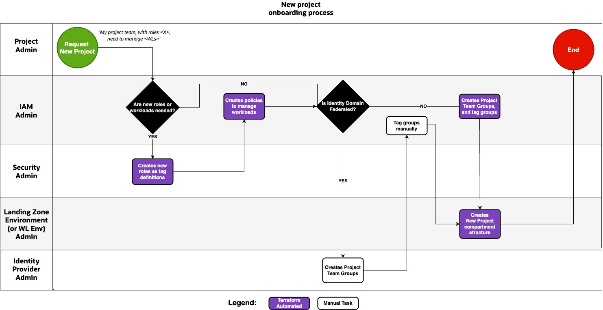
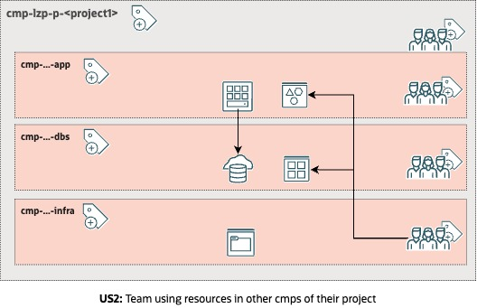

# **[Tag-Based Access Controls Add-on](#)** <!-- omit from toc -->
## **An OCI Open LZ Add-on to Scale your IAM Policies** <!-- omit from toc -->

&nbsp; 

## **Table of Contents** <!-- omit from toc -->
- [Overview](#overview)
- [Benefits of this asset](#benefits-of-this-asset)
- [Landing Zone tag enablement](#landing-zone-tag-enablement)
- [Project on-boarding process](#project-on-boarding-process)
- [Policies use-cases](#policies-use-cases)
- [Deploy instructions](#deploy-instructions)

&nbsp; 

### Overview

The [**Tag-Based Access Control**](https://docs.oracle.com/en-us/iaas/Content/Tagging/Tasks/managingaccesswithtags.htm) add-on offers an alternative way to manage IAM Policies for Projects onboarding in the Operating Entities Landing Zone Blueprints.

Instead of using the default IAM Policies and permissions approach used in the blueprints, and duplicating these for every Project onboarded, this add-on allows you to define the IAM Policies and permissions once, and assign them based on OCI Tags to each Project's Compartments and related IAM Groups.

This approach offers a higher level of scalability for project onboarding, reducing the chances of hitting IAM Policies tenancy limits, and aligning with a Role-Based Access Controls approach.

&nbsp;

### Benefits of this asset

Using this add-on provides the following benefits:
- Defining IAM Permissions based on *Job Roles*, also known as **Role-Based Access Controls (RBAC)**.
- **Extending project team's permissions is done only once** for new OCI capabilities.
- **Faster and easier projects onboarding**.
- **Simpler Projects Terraform configurations**, with less duplication.
- **Clearer permissions control** for Internal Security reporting.
- **Better scalability**, avoiding hitting Tenancy Limits for IAM Policies and statements.

&nbsp;

> [!NOTE]
>**Example.** 
>The default One-OE template uses 22 IAM policies, deploying 1 Project in 2 workload environments. Every project requires 3 policies. The default IAM policy object limit (extendable) is 100 policies. Assuming we create the same project in all the workload environments, we could be able to create 13 projects before hitting the default IAM policy objects limit.
>
>This approach reuse the policies for all projects per workload environment, so we would not hit any IAM policy object limit. Note that other limits can affect how many projects can be onboarded.
&nbsp; 

### Landing Zone tag enablement

The most important aspect of working with this add-on and effective use of Tag-Based Access Control for the Project IAM Permissions is identifying Job Roles. This add-on terraform configuration template creates, as an example, 4 job roles per project as:

- Generic Project Administrators.
- Application Administrators.
- Database Administrators.
- Infrastructure Administrators.

These job roles are reflected in the created OCI Tag Namespace and Definitions:

**Tag Namespace:** *lzp-proj-role*

**Tag Definitions:** *proj-admin*, *app-admin*, *db-admin*, *infra-admin*

    

These tags are used in several places to ensure the IAM Permissions can be assigned:

- Tags are referenced in the IAM Policy permissions statements.
- Tags are assigned to the IAM Groups that reflect the job roles per project, where the Tag value must be set to the IAM Group name.
- Tags are assigned to the IAM Compartments that reflect the project resource segregation, where the Tag value must be set to the IAM Group name.

This approach affects only to the Project structure in the Landing Zone.

It is represented in the following diagram:

    

The add-on template comes with the Terraform configuration to perform all of the above, with one exception:

When the IAM Groups are not created by the Landing Zone terraform configuration but, e.g., by an IdP Federation using the System for Cross-domain Identity Management (SCIM) process, the assignment of the Tags and their values to the IAM groups must be done manually. This is because, in this scenario, these groups are not managed by the Terraform stack.

The Landing Zone group that can assign the Tags to the IAM Groups is the **grp-lzp-iam-admins**.

The Landing Zone group that can manage tags, as the creation of new tags within the Tag namespace, identifying or modifying the job roles is the **grp-lzp-security-admins**. 

&nbsp; 

### Project on-boarding process

When a new project is needed, the below process is followed:

    

The given IAM IaC configuration, provides all the automation to manage this process except for the case where the Identity Domain is federated. In such case, the external Identity Provider have to manage the group creation and membership, which might have its own automated management interface. As the groups are created in OCI automatically, the IAM admins must tag the groups manually in order to apply the needed permissions of the generic IAM policies.

&nbsp; 

### Policies use-cases

The Project supplied policies covers different use cases depending on resources access scope. We explain them next for a better comprehension:

**US1: Team managing resources in their compartment.**
The specific role within the Project team (Application administrator, DB administrator or Infra administrator) can manage resources in their compartment but not in others next to them in the same Project compartment.

    

**US2: Team using resources in other compartments of their project.**
One role in the Project team need to access a neighbor's compartment resource. E.g.: Infra admins need to manage storage resources in all Project sub-compartments or application VMs need to access database resources in other comparments.

    

**US3: Team using shared services resources (security, network).**
One role need to access workload environment's shared resources, as security or networking elements. E.g.: application or database admins, need to use the subnets of the shared projects VCN.

    

**US4: Resources using shared services (dynamic groups).**
Resources, not roles in the Project team, need to access some shared resources in other compartments. E.g.: databases accessing a shared vault to manage their encryption keys.

    

&nbsp;

### Deploy instructions

This example template configuration, deploys the IAM resources based on the One-OE Blueprint and needed supported configuration for the creation of the Tag Namespace used for the Tab-Based Access Controls.

These files can replace the default One-OE Blueprint's IAM file to switch to the Tab-Based Access Control approach. 

|||
|---|---|
| **NAME**                | **Tab-Based Access Controls add-on** |
| **OBJECTIVE**           | Provision Identity and Tag resources |
| **TARGET RESOURCES**    | - **Security**: Compartments, Groups, Dynamic Groups, and Policies - **Governance**: Tags |
| **PREREQUISITES**       | N/A |
| **CONFIGURATION FILES** | - [oci_open_lz_one-oe_tbac_iam.auto.tfvars.json](./oci_open_lz_one-oe_tbac_iam.auto.tfvars.json)    - [oci_open_lz_one-oe_tbac_governance.auto.tfvars.json](./oci_open_lz_one-oe_tbac_governance.auto.tfvars.json)   Optionally you can complete your configuration with the **Networking**, **Monitoring** & **Security** configuration file of the One-OE Blueprint available [here](/blueprints/one-oe/runtime/one-stack/).|
| **DEPLOYMENT**          | Using [Oracle Resource Manager (ORM)](/commons/content/orm.md):    <a href='https://cloud.oracle.com/resourcemanager/stacks/create?zipUrl=https://github.com/oci-landing-zones/terraform-oci-modules-orchestrator/archive/refs/tags/v2.0.6.zip&zipUrlVariables={"input_config_files_urls":"https://raw.githubusercontent.com/oci-landing-zones/oci-landing-zone-operating-entities/master/addons/oci-tbac/oci_open_lz_one-oe_tbac_iam.auto.tfvars.json,https://raw.githubusercontent.com/oci-landing-zones/oci-landing-zone-operating-entities/master/addons/oci-tbac/oci_open_lz_one-oe_tbac_governance.auto.tfvars.json"}'></a>  Using: [Terraform CLI](/commons/content/terraform.md).            |
| **POST-DEPLOYMENT**      | Edit your Governance [oci_open_lz_one-oe_tbac_governance.auto.tfvars.json](./oci_open_lz_one-oe_tbac_governance.auto.tfvars.json) file and replace the *"TENANCY-ROOT"* in the *"default_compartment_id"* field with the OCID of the *"cmp-lzp-security" compartment. This is needed because a temporary limitation in the governance/tags module. | 

&nbsp; 

## License <!-- omit from toc -->

Copyright (c) 2025 Oracle and/or its affiliates.

Licensed under the Universal Permissive License (UPL), Version 1.0.

See [LICENSE](/LICENSE.txt) for more details.